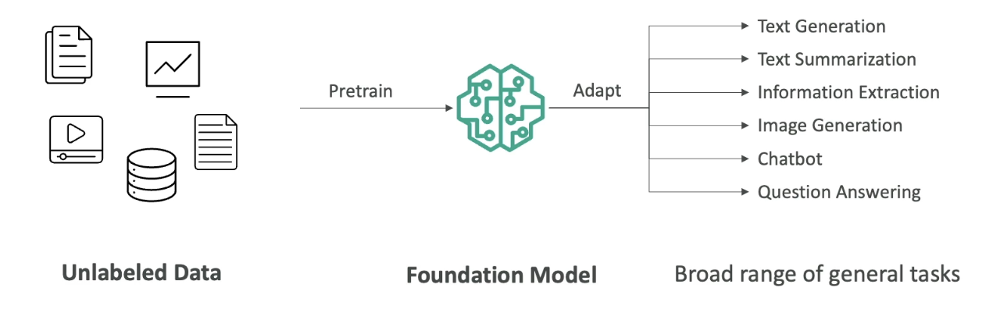
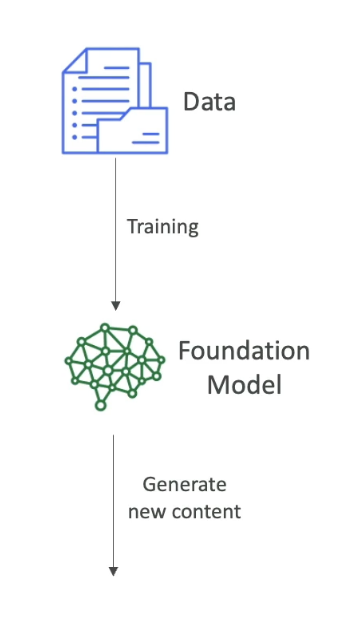
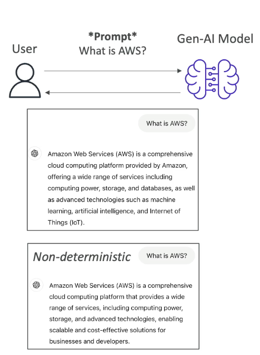
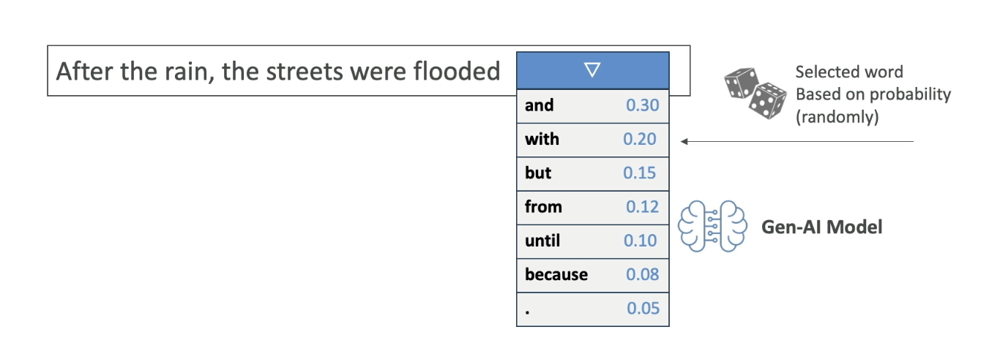
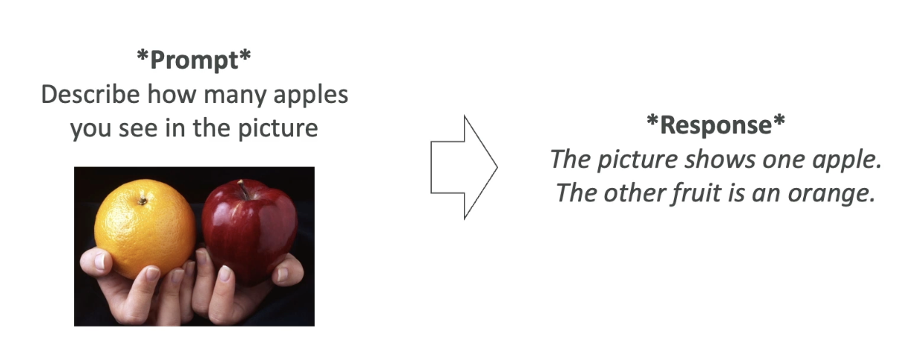
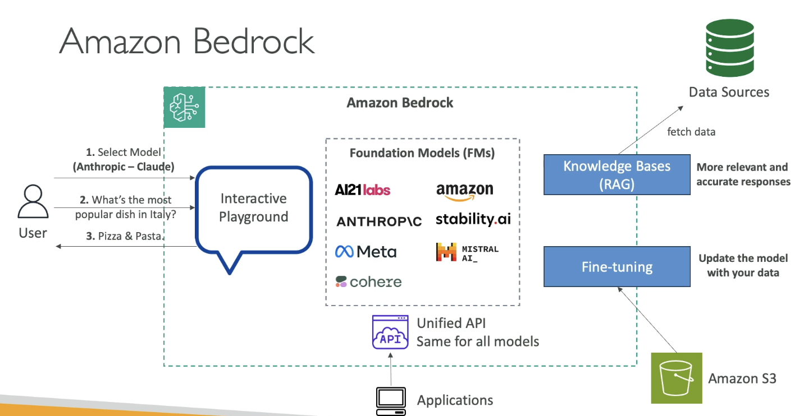

# Amazon Bedrock and Generative AI
In this section, we are going to talk about generative AI, and amazon bedrock (which is the main service on AWS that does generative AI). This is actually one of the main topic of the exam and one of the fastest growing AWS service.

## Section 1 : What is GenAI?
### Introduction to Generative AI

Now that we are about to dive into **Amazon Bedrock**, which is a service for Generative AI (Gen AI) on AWS, let’s take a step back and understand **what Gen AI actually is**.

Generative AI is a **subset of deep learning**, which is itself a **subset of machine learning**, and in turn, a subset of **artificial intelligence (AI)**.

### What is Generative AI?

* Gen AI is used to **generate new data** that resembles the data it was trained on.
* It can be trained on **various types of data**:

  * Text
  * Images
  * Audio
  * Code
  * Video
  * And more

**Example**:
If we train a Gen AI model on a lot of dog images and also on hand-drawn cartoons, then ask it to generate a “cartoon dog,” it will combine the two together and create a dog that looks like a cartoon. That is the power of Generative AI

* This is the **power of Gen AI**: it **combines its knowledge into new, and unique ways**.

* We are going to start with lots of unlabelled data (we will look later in the course, what it means by unlabelled data).
* We are going to train Foundational Model.
* Foundational Model (FM) are very broad, they are very big and very wide.
* FM can easily adapt to different kind of general tasks.
* A good foundational model can do:
  * Text Generation
  * Text Summarization
  * Information Extraction
  * Image Generation
  * Can become a **Chatbot**
  * Question Answering
* In general, we feed a lot of data into a foundational model, which has a option to do a lot of different tasks.

Now let's talk about Foundational Models

### Foundation Models
* In order to generate data, as we said, we need to have Foundational Model.
* FM are trained on a wide variety of inputs.
* Now to train foundational models:

**Training foundation models:**

* It requires **millions of dollars**, massive computing resources, and a lot of data.
* It is typically built by **large companies** like:

  * **OpenAI** – (e.g., GPT-4o)
  * **Meta**
  * **Amazon**
  * **Google**
  * **Anthropic**

### Open Source vs Commercial Models

* Some foundation models are **open source** (free to use):

  * Example: Meta’s open-source efforts, Google’s BERT
* Others are **commercially licensed**:

  * Example: OpenAI’s GPT models, Anthropic models

We will also see how to access these models on AWS as well.

### Large Language Models (LLMs)

* LLMs are a **type of AI** that rely on foundation models and are designed to **generate coherent human-like text**.
* Example: **ChatGPT** using **GPT-4**
* These LLMs are usually very Big Models:
  * They are trained on large corpus of text data
  * They are computionally heavy and use **Billions of parameters**
  * They are trained on Books, articles, websites, other textual data
* They can perform wide range of language related tasks, which involves:
  * Translation, Summarization
  * Question Answering
  * Content Creation
* How does it work when we interact with the LLM

**Interaction:**

* We interact with the LLM by giving a prompt, for example : *"What is AWS"*
> Note that, we will have dedicated section to understand about how to create prompt
* Then the model is going to leverage all the existing content that it has learned from to generate new content.
* The generated text is **Non Deterministic**,that means that for every user that is using the same prompt, will get different generated text. (it won't be the same answer every time, see the image below)

### Non-Determinism in LLMs
So let's understand why though it is non-deterministic. Let's take an example:
#### Example sentence:

*“After the rain, the streets were…”*

When an LLM sees this prompt, it calculates a **list of potential next words** along with **probabilities**:

| Word     | Probability |
| -------- | ----------- |
| wet      | 0.40        |
| flooded  | 0.25        |
| slippery | 0.15        |
| empty    | 0.05        |
| muddy    | 0.05        |
| clean    | 0.04        |
| blocked  | 0.03        |
| ...      | ...         |

- These are **statistically likely next words**, based on what the model has seen during training.

- Then, an **algorithm picks** one of the words — maybe “flooded”.

So the model outputs:

> *“After the rain, the streets were flooded.”*

This selection is based on **random sampling with probabilities**, not fixed logic.

The process **repeats for every next word**.

Given:

> *“After the rain, the streets were flooded...”*

The next word could be:

| Word     | Probability |
| -------- | ----------- |
| and      | 0.40        |
| with     | 0.25        |
| from     | 0.15        |
| because  | 0.05        |
| until    | 0.05        |
| `.`      | 0.04        |
| ...      | ...         |

* All of these again, have associated probabilites, then the next word is going to be selected based on these probabilities.
* This is why when you ask the AI twice the same prompt, you may not get the same answers
* Because the sentence is determined with the statistical methods and not with the deterministic methods.

### Generative AI for Images

Let’s now understand how **Generative AI works with images**.

Gen AI is not limited to text. It can also **generate images** based on prompts or existing images, and it can even **understand images** to generate text descriptions.

#### Types of Image-Based Gen AI Tasks

##### 1. **Text-to-Image Generation**

- You give a prompt like:
  
  > *“Generate a blue sky with white clouds and the word ‘Hello’ written in the sky.”*

- The Gen AI model uses that input to **create a new image** that visually matches the description.

- The image is generated **from scratch**, not copied from a dataset.

##### 2. **Image-to-Image Translation**

- You provide an **input image** and a **style transformation instruction**.

- Example:
  
  - Input: A photo of someone playing the piano
  
  - Prompt: *“Transform this into Japanese anime style.”*

- Output: A version of the same image that now looks like it was drawn in **manga/anime style**.

##### 3. **Image-to-Text (Visual Question Answering)**

- You give a picture and ask a question about it.

- Example:
  
  - Image: One apple and one orange
  
  - Prompt: *“How many apples do you see in the picture?”*

- Output:
  
  > *“The picture shows one apple and the other fruit is an orange.”*

- The model is capable of **understanding the contents of the image** and generating relevant, human-like answers.

### Diffusion Models (Behind the Scenes)

One popular technique behind image generation is called a **diffusion model**. A well-known example is **Stable Diffusion**, which is based on this method.

Let’s break this down into two key processes:

#### **1. Forward Diffusion (Training Phase)**

- We start with a **clear image**, like a picture of a cat.

- Then, we **gradually add noise** to the image, step by step:
  
  - Slight noise → more noise → until the image becomes **pure noise**.

- Eventually, the image becomes **completely unrecognizable**.

- This teaches the model **how images degrade into noise**.

This is called the **forward diffusion process**.

This process is done for a lot of pictures. Once the algorithm is trained to take images and create noise out of it,  then we do the opposite that is  **Reverse Diffusion**

#### **2. Reverse Diffusion (Image Generation Phase)**

- Now we want to **generate a new image** from scratch.

- The model starts with **random noise** and a **text prompt** like:
  
  > *“A cat with a computer”*

- The model then works **in reverse**:
  
  - It **removes the noise step-by-step**, each time refining the image.
  
  - Over multiple steps, the image **gradually becomes clear**.
  
  - Final output: A unique image of **a cat with a computer**.

> This image is **new** — not taken from training data — but created using the knowledge learned from how **real images look and how noise distorts them**.

### Summary of Key Concepts

* **Gen AI** creates new content (text, images, audio) from training data.
* **Foundation models** are trained on vast, diverse data to support multiple tasks.
* **LLMs** generate human-like text and are based on probability, not fixed rules.
* **Non-deterministic output** ensures variability in responses.
* **Diffusion models** generate images by reversing a noise process.

## Section 2 : Amazon Bedrock - Overview
### Introduction to Amazon Bedrock

Now that we've learned about Generative AI and foundation models, it's time to talk about **Amazon Bedrock**, the **main service on AWS used to build generative AI applications**.

Amazon Bedrock is a **fully managed service**, which means you don’t have to worry about managing the underlying infrastructure. It provides a simple way to access and interact with multiple foundation models through a unified interface.

### Key Features of Amazon Bedrock

* **Fully managed service**:
  
  * No need to manage infrastructure
  * AWS handles everything behind the scenes

* **Data privacy**:
  
  * Your data stays **within your AWS account**
  * It is **not used to retrain** the underlying foundation models

* **Pay-per-use pricing model**:
  
  * You only pay for what you use
  * Pricing details will be discussed later

* **Unified API**:
  
  * One standardized method to interact with all foundation models
  * Simplifies application development

* **Multiple foundation models available**:
  
  * Easily choose and configure models from different providers

* **Advanced features** included:
  
  * **RAG** (Retrieval Augmented Generation)
  * **LLM Agents**
  * **Security, privacy, governance, and responsible AI** built-in in Amazon Bedrock

### What type of Foundation Models are Available in Bedrock

Amazon Bedrock offers access to models from various top-tier AI providers:

* **AI21 Labs**
* **Cohere**
* **Stability.ai**
* **Amazon**
* **Anthropic**
* **Meta**
* **Mistral AI**

> 📌 More providers and models will continue to be added over time.

### How Bedrock Handles Models

* When you use a foundation model:
  
  * **Bedrock creates a copy** of the model instance for **your exclusive use**
  * This ensures data isolation and privacy

* In some cases, you can **fine-tune the model with your own data** to better align it with your specific needs

* Again, **none of your data is sent back** to the original model providers

---

### Bedrock Architecture Overview

Let’s visualize how Bedrock works, using a simplified diagram explained during the lecture:

#### Core Flow:

1. **Users interact with an interactive playground**
   
   * Users **select the model** to use
   
   * Input a question like:
     
     > *“What is the most popular dish in Italy?”*
   
   * Model responds with an answer, for example:
     
     > *“Pizza and pasta”*

2. We can have **Knowledge Bases / RAG** (Retrieval Augmented Generation)
   
   * This allows fetching **external data** to provide **more accurate and relevant answers** (will be covered in detail in later sections)

3. **Model Fine-Tuning**
   
   * You can upload and apply your **own data** to personalize the foundation model
   * All fine-tuning stays **within your AWS account**

4. **Unified API Access**
   
   * All apps communicate with Bedrock using a **single API format**
   * Bedrock manages model selection and orchestration behind the scenes

### Summary

* Amazon Bedrock makes it easy to **build, test, and deploy** Gen AI applications using various foundation models.
* It gives you **data privacy**, **scalability**, **fine-tuning**, and a **unified developer experience**.
* In the next lecture, we’ll explore **hands-on practice** with Bedrock’s **interactive playground**.

## [Amazon Bedrock - Hands On](https://github.com/Sparsha-mehta/aws-ai/blob/main/Bedrock%20Hands%20On.pdf)

## Section 3 : Foundational Model

## Foundational Model - Hands On

## Section 4 : Fine-Tuning a Model

## Section 5 : FM Evaluation

## FM Evaluation - Hands On

## Section 6 : RAG & Knowledge Base

## RAG & Knowledege Base - Hands On

## Section 7 : More GenAI Concepts

## Section 8 : GuardRails

## GuardRails - Hands On

## Section 9 : Agents

## Section 10 : CloudWatch Integration

## CloudWatch Integration - Hands On

## Section 11 : Pricing

## Section 12 : AI Stylist

## Quiz