# Amazon Bedrock - Hands On
Now that we have understood the foundational concepts, it is time to begin our hands-on practice using **Amazon Bedrock**. 

- Before starting, it is important to ensure that the selected region in the AWS console is set to **US East (N. Virginia) – `us-east-1`**, as this region currently provides the best support for Bedrock.

- After verifying the region, the next step is to open **Amazon Bedrock** in the AWS console. Upon opening the service, the **overview page** will be displayed, introducing various available features

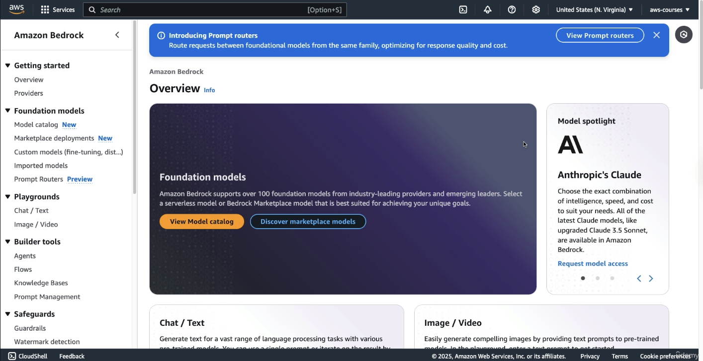

Amazon Bedrock hosts models from multiple AI providers. As of now, there are **eight providers** available, with more likely to be added in the future. The course focuses on the most important ones.

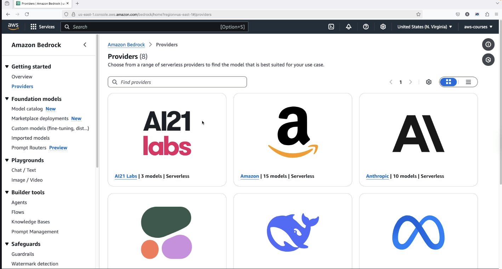

When a provider, such as **Amazon**, is selected, a dedicated page is displayed containing:

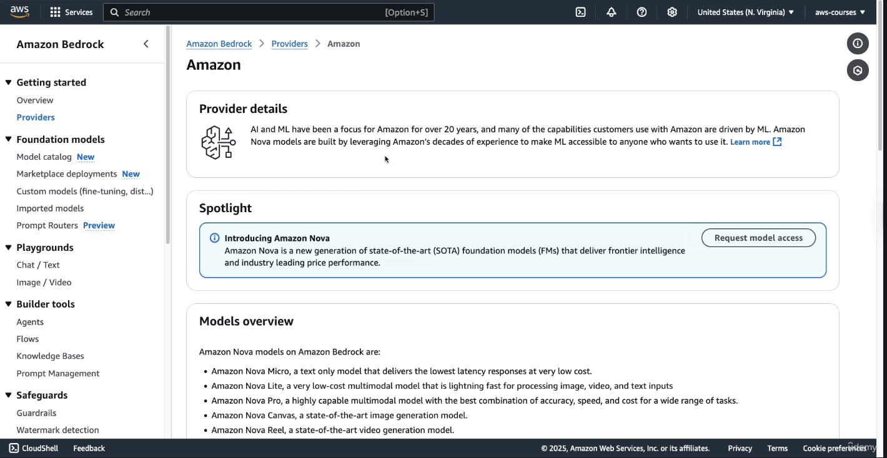

- A **spotlight section** and an overview of the provider

- A **description of available models**, such as:
  
  - *Nova Micro*: A **text-only model**
  
  - *Nova Pro*: A model with a broader category range

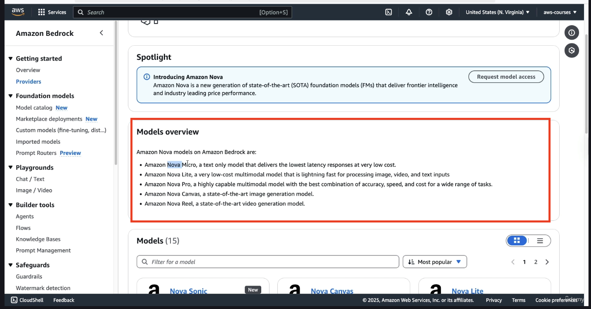

At the bottom, if you scroll down, you have access to all the models:

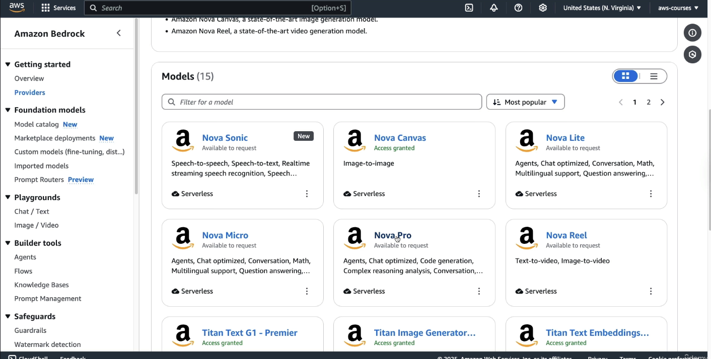

For each model, if you click on **Nova Pro**. You get description about the model itself:

1. Categories

2. Version

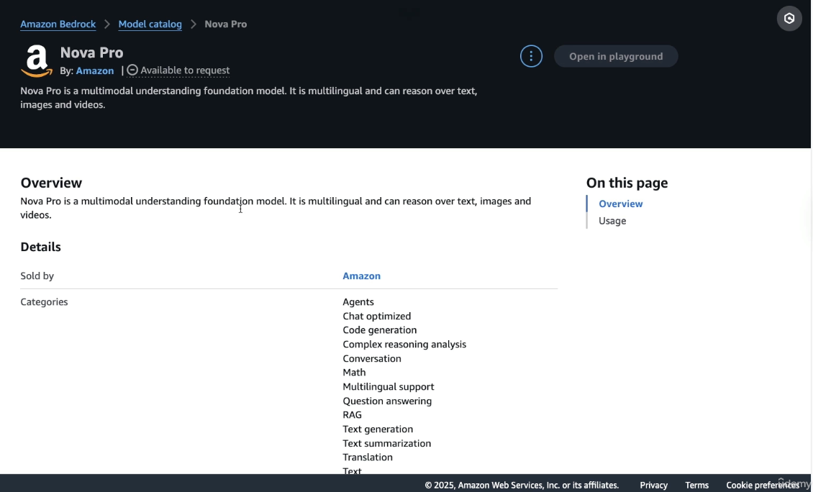

When you scroll down below, you will get details about **Usage**:

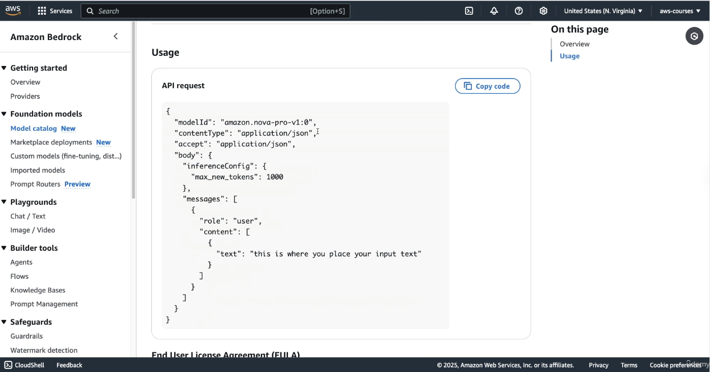

So this is some information around API. In this tutorial, we are going to be using Bedrock in the console.

> Note that if you want to integrate Bedrock into your Application, you would need to use API request. So the above image about **Usage**, something which AWS tells you how to use API requests for the specific type of model

All of this helpful but **first we need to get access to these models**

### Enabling Access to Foundation Models

To interact with any of the foundation models:

- The user must scroll to the bottom left of the Bedrock page and locate the **Model Access** section.

- A full list of models appears, varying slightly between accounts.

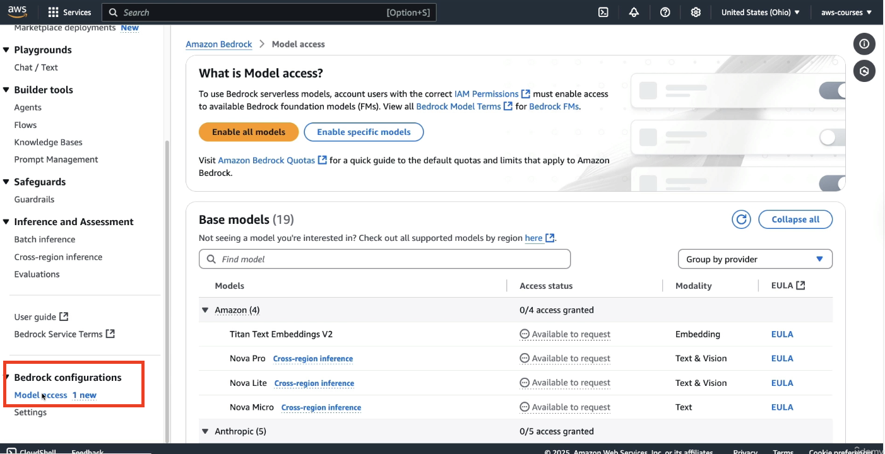

To proceed:

- The **“Enable all models”** option should be selected. This action does **not** incur charges.

- A few clicks are required: select **Next**, then **Submit** to confirm access.

> ⚠️Although enabling models is free, **actual usage of models may result in charges**. This course attempts to minimize costs, but users should be aware that **no AI model usage is entirely free**.

Some models grant access **instantaneously**, while others may show as **in progress** and require time for approval. Certain models may prompt for **license agreement** confirmation. Temporary errors or delays should not be a concern, as enough models will be enabled to complete the hands-on work.

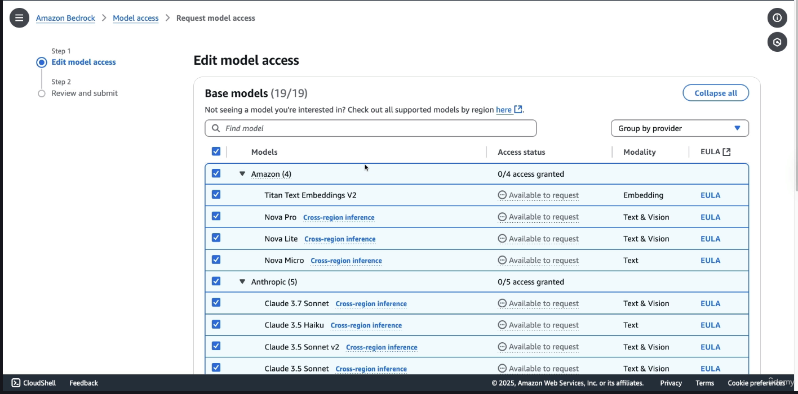

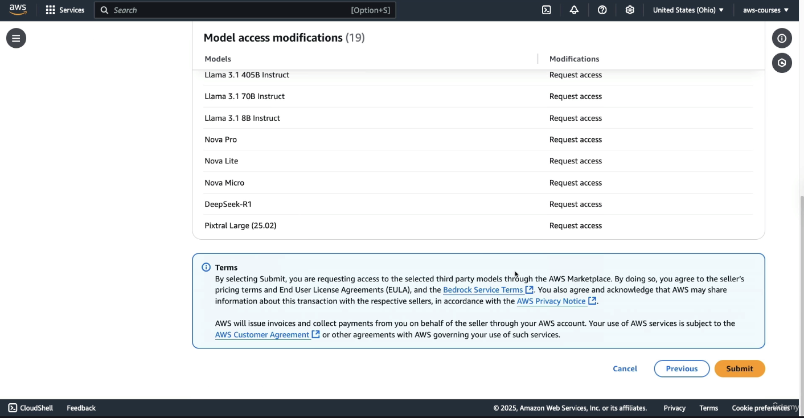

### Using the Chat Playground for Text Models

Once model access is enabled:

- The user should navigate to the left sidebar and open the **Playgrounds** section.

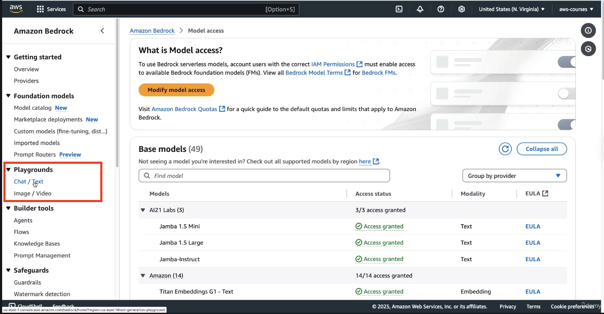

- Inside Playgrounds, selecting **Chat (text)** opens the interface for prompt-based model interaction.

For this exercise:

- The **Single Prompt** option should be selected (it means you can only send 1 query and there won't be any follow ups on that prompt)

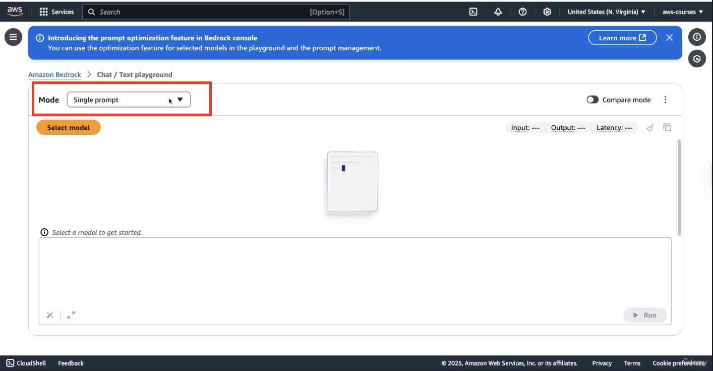

- You need to click on **Select model**, and click on **Amazon Nova Micro**. It is the **cheapest and most accessible on-demand model** from AWS.

- Once the model is applied, the user can proceed to input a prompt.

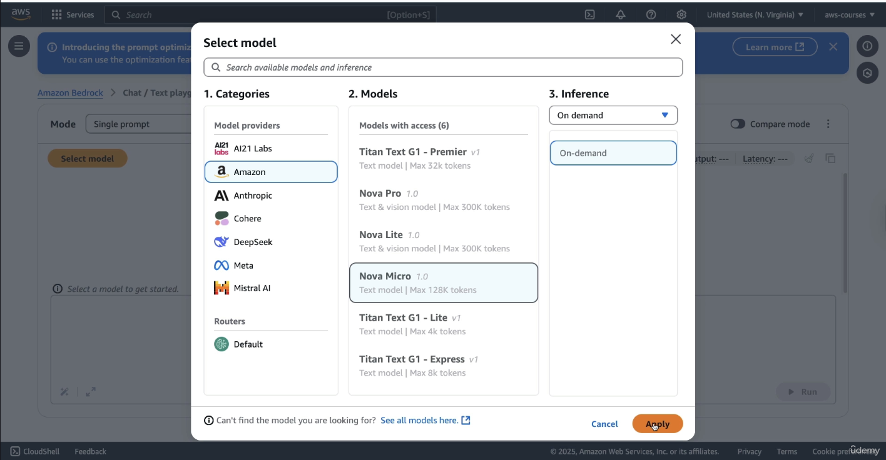

To test the model, a basic prompt is used:

> *"What is AWS?"*

This prompt is sent through Amazon Bedrock to the **Nova Micro model**, which processes it and returns a structured answer. The model generates a list of key features related to AWS in a numbered format.

Along with the answer, Bedrock displays several **important metadata values**:

- The **number of input tokens** used

- The **number of output tokens** generated

- The **latency**, which refers to the time it took for the model to generate the response

These statistics are important for understanding **pricing and performance**.

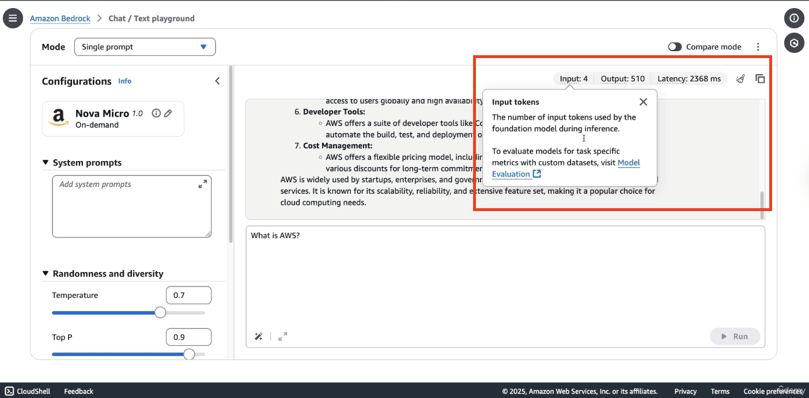

In addition to single-prompt interactions, Amazon Bedrock offers a **chat mode**, which allows users to conduct ongoing conversations with the model while preserving context.

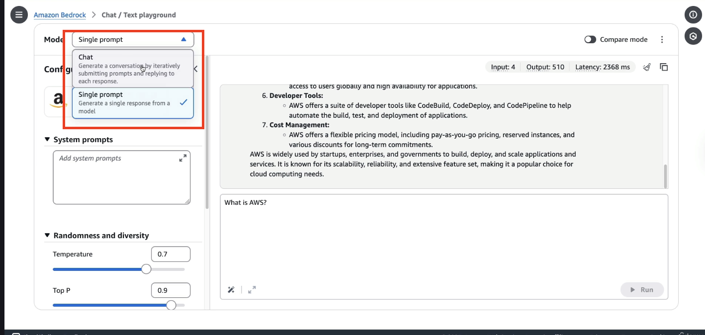

In this mode:

- The user can still select models such as **Amazon Nova Pro** or **Claude 3.5** from **Anthropic** model (**Yes!!! You need to again select the model**)

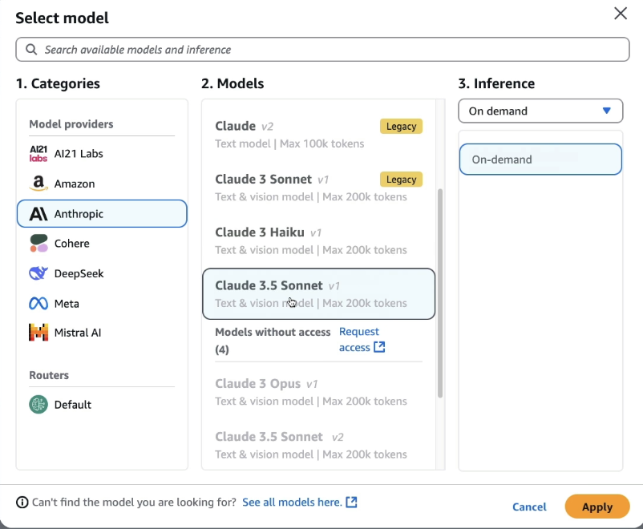

- Once a model is selected, a prompt such as *“What is AWS?”* can be entered again to observe how the response changes. Upon clicking **Run**, a response is generated by the selected model.

It is important to note that:

- Responses will vary across different models and even across runs on the same model. (As seen in Amazon Bedrock Overview Lecture that LLMs are **Non-deteministic**)

- Writing style and quality differ significantly between models.

- Less expensive, lower-performance models tend to produce answers with slightly reduced quality compared to high-performance, premium models.

- In the chat mode, we have more parameters as you can see on RHS

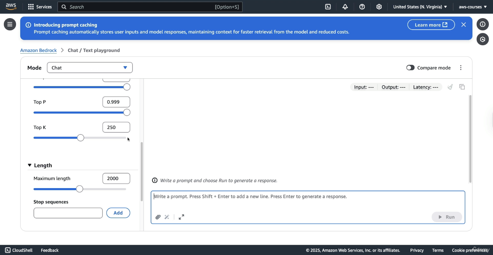

- Also in chat mode, you will find attachments, not every model will provide this option.

For each chat interaction, Bedrock provides:

- The number of **input tokens**

- The number of **output tokens**

- The **latency**, which indicates the time taken for the response to be generated

### Generating Images Using Amazon Bedrock

Amazon Bedrock also supports **image generation**, enabling the creation and modification of visual content directly through its interface.

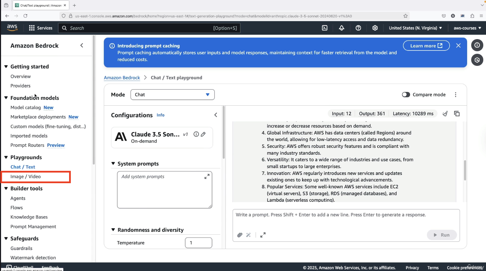

For this demonstration:

- The **Nova Canvas** model is selected and applied for image generation.

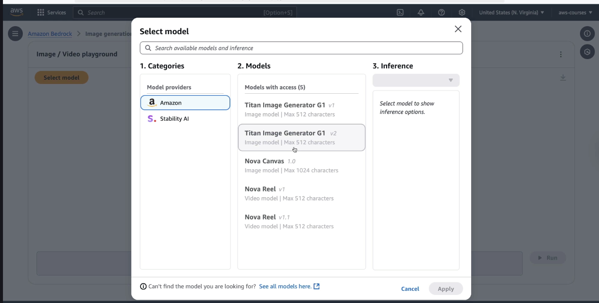

- Several features are available (under **Action** tab) beyond simple image creation, including:
  
  - Generating variations of an image
  
  - Removing or replacing objects
  
  - Changing or removing backgrounds

A sample prompt is provided to test the image generation capabilities:

> *“Generate an orange backpack with the AWS logo on it on someone that is teaching a live AWS workshop.”*

The model processes the prompt and returns an image:

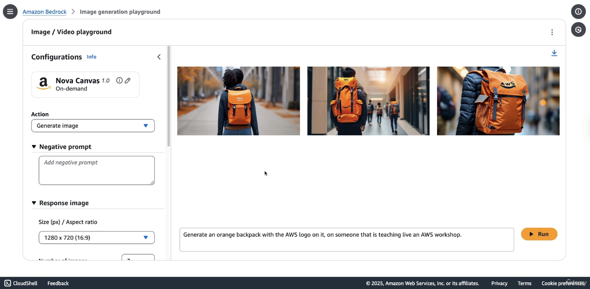

This example shows that while image generation is functional and advanced, not all prompts will be fulfilled perfectly, especially when they involve **multiple layers of semantic detail**.
