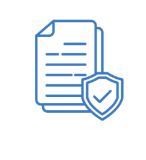

# Responsible AI, Security, Governance, and Compliance

Now we're getting into a section that is a little less fun than the other ones, but it's necessary that we go through it because it is an important section and a big part of the exam. This section is about responsible AI, security, governance, and compliance for AI solutions. This content is mostly text-based and focuses on responsibility and security aspects.

## Section Overview

The four main topics we'll cover in depth are:

<h3>
  Responsible AI
  
</h3>

- Ensures AI systems are transparent and therefore trustworthy, so that users trust the outcomes
- Focuses on mitigating potential risks and negative outcomes
- Must be maintained throughout the AI lifecycle:
  - Design
  - Development 
  - Deployment
  - Monitoring
  - Evaluation

<h3>
  Security
  
</h3>

- Ensures confidentiality, integrity, and availability of systems are maintained
- Applies to:
  - Data
  - Information assets
  - Infrastructure

> **Confidentiality** means ensuring that sensitive information is only accessible to authorized people. This involves protecting data from unauthorized access or disclosure. Examples include using encryption, access controls, passwords, and user permissions to make sure only the right people can view confidential data like financial records, personal information, or trade secrets.
> 
> **Integrity** refers to maintaining the accuracy and completeness of data throughout its lifecycle. This means ensuring information hasn't been tampered with, corrupted, or altered in unauthorized ways. Integrity controls include checksums, digital signatures, version control, and audit trails that help detect if data has been modified improperly.
> 
> **Availability** ensures that information and systems are accessible and usable when needed by authorized users. This means preventing and recovering from disruptions like system outages, cyberattacks, or hardware failures. Availability is maintained through redundancy, backups, disaster recovery plans, and robust infrastructure design.

<h3>
  Governance
  
</h3>

- Governance ensures we can add value and manage risk in business operations
- Governance provides clear policies, guidelines, and oversight mechanisms to ensure all systems align with legal and regulatory requirements
- Goal is to improve trust

<h3>
  Compliance
  
</h3>

- Ensures adherence to regulations and guidelines for sensitive domains such as:
  - Healthcare
  - Finance
  - Legal applications

## Important Note

Responsible AI, security, governance, and compliance are distinct domains, but they have a lot of overlap in the way they act, behave, and try to improve your system. 

> Because there's so much overlap between these areas, some repetition in content is normal when discussing these topics.

> Each of these topics will be covered in greater detail in the following lectures.