# Foundational Model - Hands On
Now that we’ve looked at some providers, let’s go a little deeper.

Different companies and providers offer different models, and each of these models comes with different capabilities. For example, if you choose **Anthropic**, **Amazon**, **DeepSeek**, or **Stability AI**, you’ll find that the capabilities vary.

You’re **not** expected to memorize which model does what, but the exam will ask you to understand **what a model can and cannot perform**.

**For Example**:

- If you're looking at a Claude 3.5 Haiku:

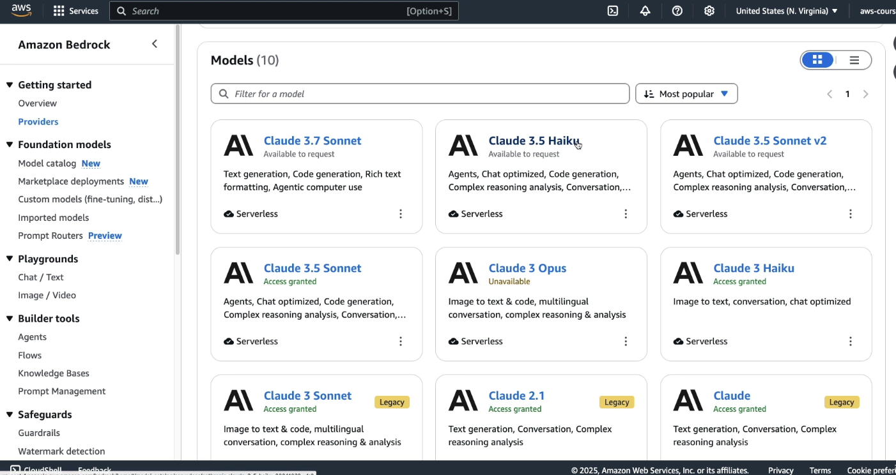

- This model is good model for text related tasks:

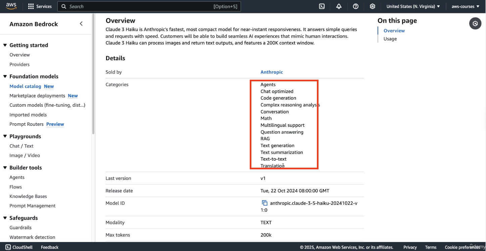

But if you look at a model from **Amazon** like **Nove Reel**:

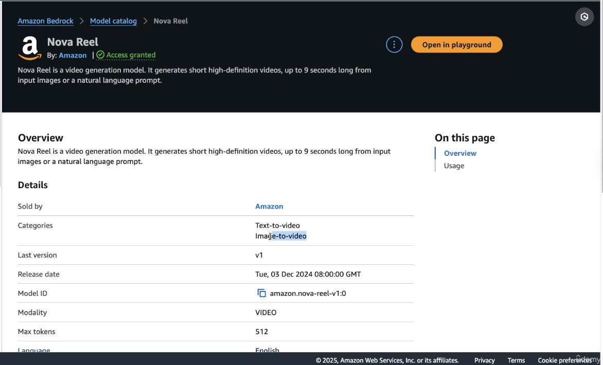

- this model is going to be used for **text to video** or **image to video**.

Each model serves a different purpose. You won’t be asked which is “better,” but you should be aware of their **capabilities**.

### Comparing Models Side by Side

Let’s look at how to compare two models:

1. **Open the Chats or Text Playground** (I have mentioned it in previous Handson how to go about this)

2. **Enable Compare Mode** (top right corner)
   
   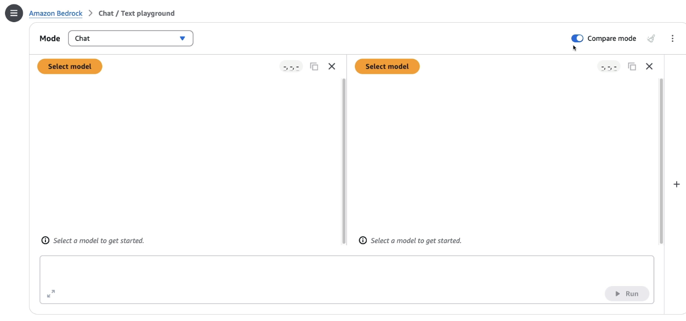

3. **Choose two models**, for example:
   
   - Amazon’s **Nova Micro**
   
   - Anthropic’s **Claude 3.5 Sonnet**

#### Model Differences Observed:

- **Nova Micro** does not support **image upload** – uploaded images will be ignored.

- **Claude 3.5 Sonnet** is **more expensive** than **Nova Micro**but may offer specific benefits for certain use cases.

- Now ask this as a prompt "What are the top AWS services?", the responses vary: (see the image below)
  
  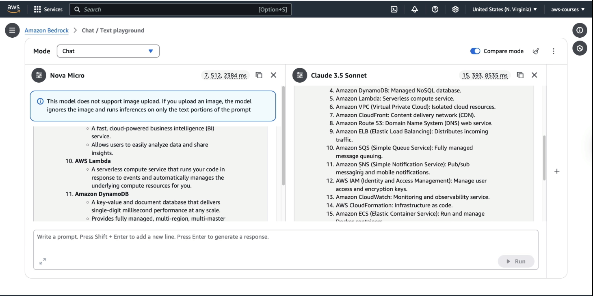

- **Response formatting** and **answer length** differ across models.

- **Performance metrics** (input/output tokens and response time) are visible for comparison.

Example:

- Nova Micro: 7 input tokens, 512 output tokens, faster.

- Claude 3.5 Sonnet: 15 input tokens, 393 output tokens, slower.

The **takeaway**: consider **output quality**, **response time**, and **cost** when selecting a model.

### Exploring Custom Models in Bedrock

To customize a model for your use case:

1. Click on **Custom Model** from the left-hand panel.
   
   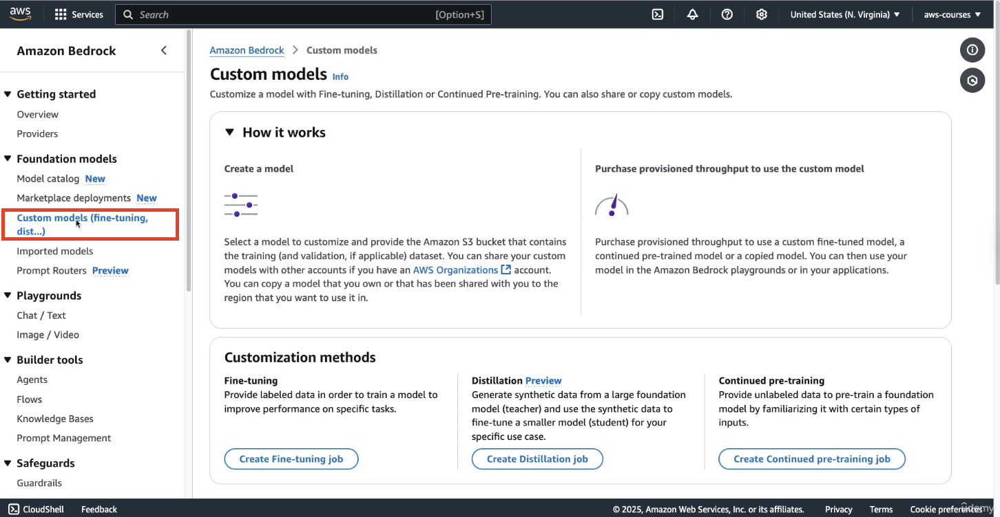
   
   here we can create a model that's going to be better fitted for our use case.

2. You’ll see **three customization methods**:
   
   - **Fine-tuning** – here we provide labeled data in order to train a model to improve the performance on a specific task. For example: you train it and you fine-tune it to say, "Hey, for this kind of question, I want this kind of answer."
   
   - **Distillation** – (Not covered in this session)
   
   - **Continued Pre-training** – Feed new data to the model to expand its knowledge.

### Creating a Fine-Tuning Job (Walkthrough)

Let’s simulate setting up a fine-tuning job:

1. Click on **Create a Fine-tuning job**
   
   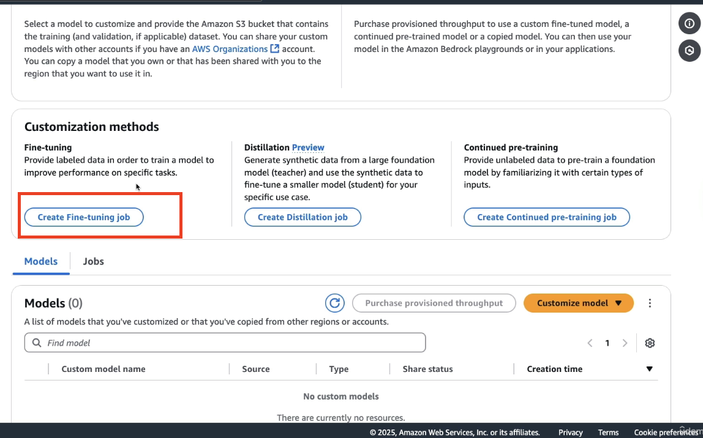

2. **Select a base model**, e.g., **Nova Micro**

3. Enter a name for the model like `DemoCustomModel` and enter the **job name** like `Jobname`

4. Configure VPC settings (we skip this here)

5. Set **Input Data** location in Amazon S3 (**V Important**)
   
   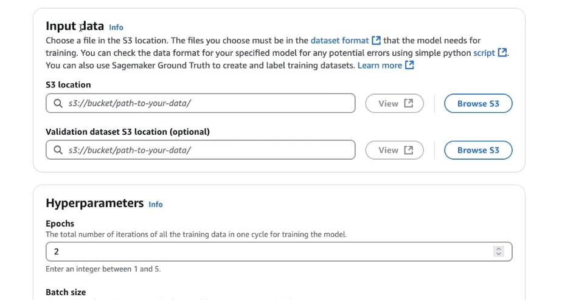

6. Set **Validation Dataset** (optional, but useful for checking model accuracy)

7. Configure **Hyperparameters** (advanced – skipped for now)
   
   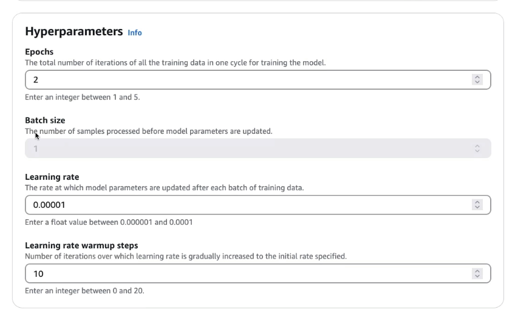
   
   the idea of hyperparameters is that you can tweak these parameters to ensure that the custom model is going to be trained the way you want with the performance you want. 

8. Set **Output Data** location
   
   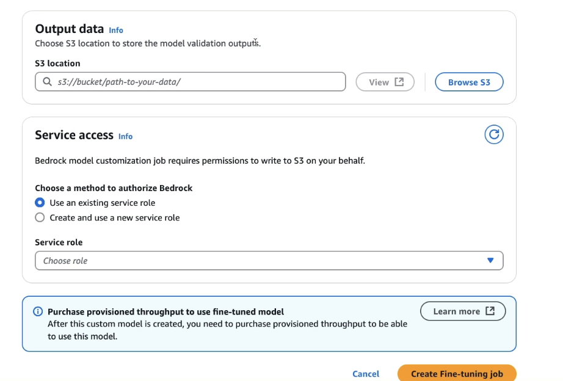
   
   Output data is where to store the model validation outputs, if you provided a validation input dataset.

9. Assign a **Service Role** to allow Bedrock to access S3 and to get this data for the training as well as for the validation

After setup:

- Click **Create Fine-Tuning Job**

### 📌 Important Notes About Custom Models

- Custom models require **provisioned throughput** for training and usage.

- This is not an **on-demand** process—resources are allocated specifically for you.

- Once created, you’ll use **provisioned throughput** again for running inference with the custom model.

---

(Note this section is just for understanding purpose only)

##### What is Provisioned Throughput (the concept):

Provisioned throughput means **you are reserving dedicated compute resources** in advance—**not shared or on-demand**. This is like booking a private room instead of using a shared coworking space.

Here’s how it applies:

- To **train or fine-tune** a foundation model (like Amazon’s Nova or Titan), you can’t just run it like other models.

- You must **pre-purchase provisioned throughput**—this means Amazon sets aside specific compute resources for **your** training job.

- This is required because training is a heavy task and can’t be done on shared on-demand servers.

##### After the Model is Trained (Inference Phase)

- Once your **custom model is ready**, you might think you can now use it like any other model (like Claude, Mistral, etc.).

- But **you still need provisioned throughput again** to **run predictions/inference** using that model.

- This is because it's **your private model**, and AWS keeps it on dedicated servers just for you.

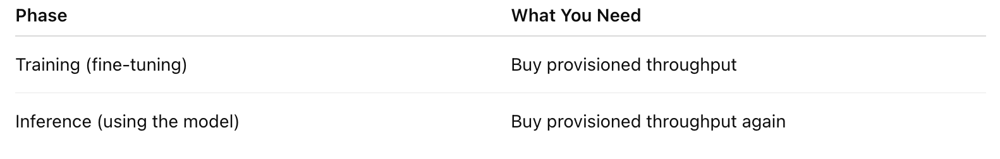

