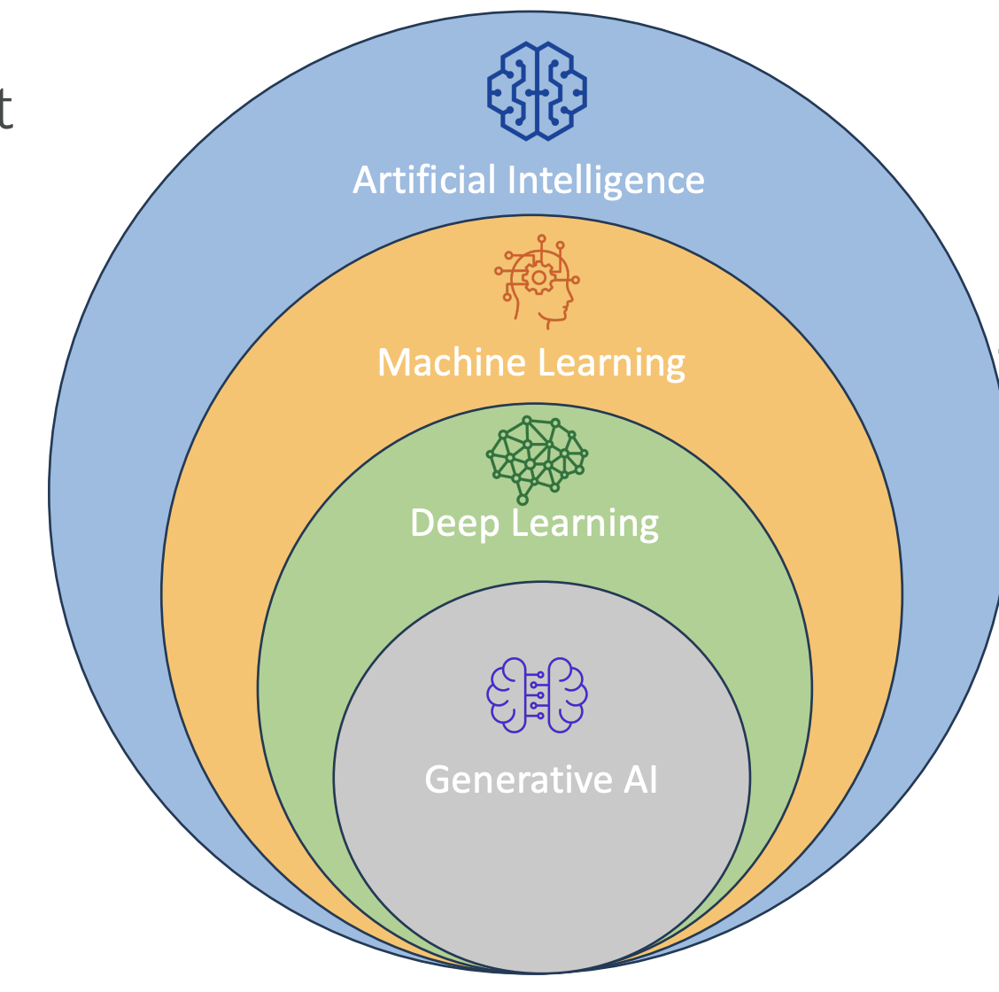
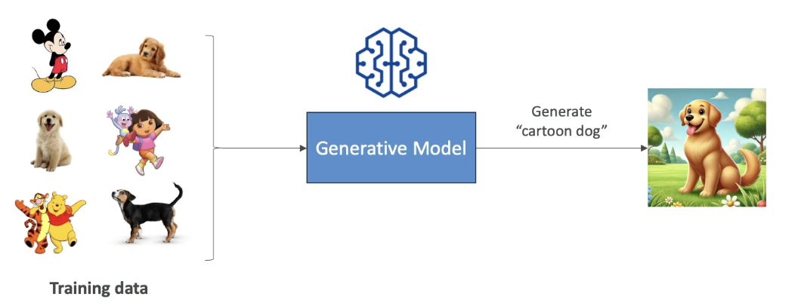
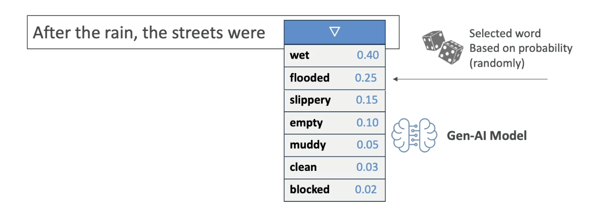
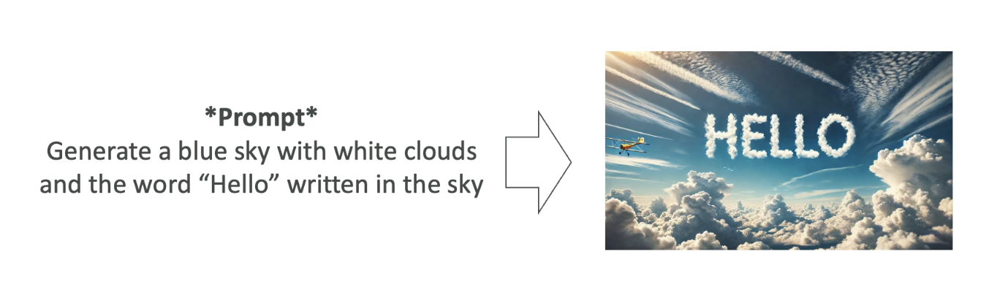
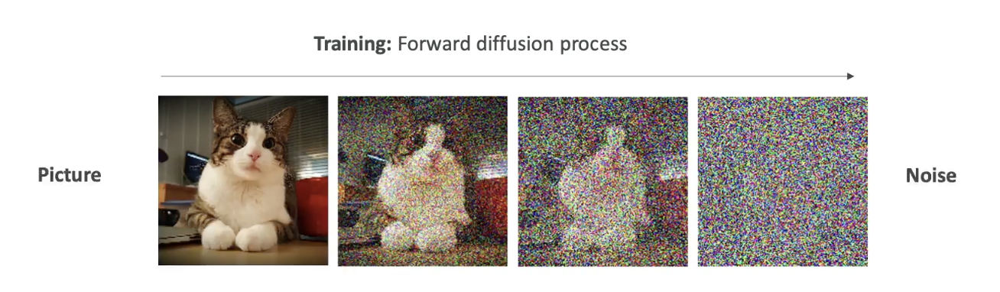
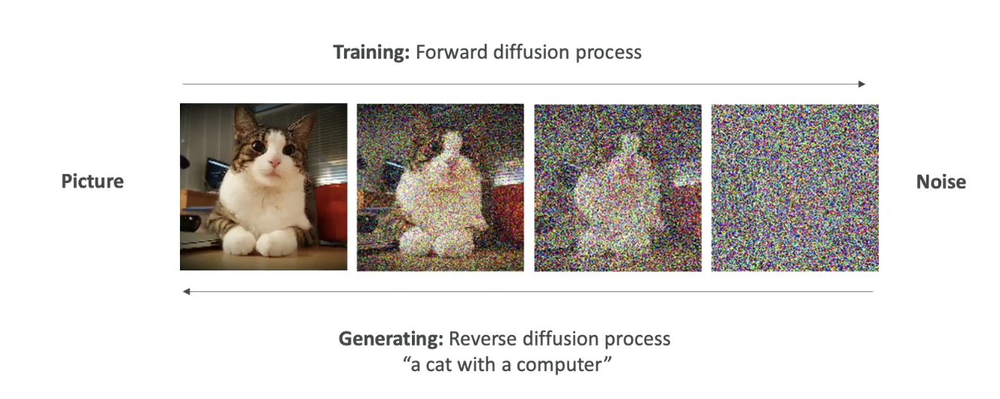

# What is GenAI?

## Introduction to Generative AI

Now that we are about to dive into **Amazon Bedrock**, which is a service for Generative AI (Gen AI) on AWS, let’s take a step back and understand **what Gen AI actually is**.

Generative AI is a **subset of deep learning**, which is itself a **subset of machine learning**, and in turn, a subset of **artificial intelligence (AI)**.

## What is Generative AI?

* Gen AI is used to **generate new data** that resembles the data it was trained on.
* It can be trained on **various types of data**:

  * Text
  * Images
  * Audio
  * Code
  * Video
  * And more

**Example**:
If we train a Gen AI model on a lot of dog images and also on hand-drawn cartoons, then ask it to generate a “cartoon dog,” it will combine the two together and create a dog that looks like a cartoon. That is the power of Generative AI

* This is the **power of Gen AI**: it **combines its knowledge into new, and unique ways**.

* We are going to start with lots of unlabelled data (we will look later in the course, what it means by unlabelled data).
* We are going to train Foundational Model.
* Foundational Model (FM) are very broad, they are very big and very wide.
* FM can easily adapt to different kind of general tasks.
* A good foundational model can do:
  * Text Generation
  * Text Summarization
  * Information Extraction
  * Image Generation
  * Can become a **Chatbot**
  * Question Answering
* In general, we feed a lot of data into a foundational model, which has a option to do a lot of different tasks.

Now let's talk about Foundational Models

## Foundation Models
* In order to generate data, as we said, we need to have Foundational Model.
* FM are trained on a wide variety of inputs.
* Now to train foundational models:

**Training foundation models:**

* It requires **millions of dollars**, massive computing resources, and a lot of data.
* It is typically built by **large companies** like:

  * **OpenAI** – (e.g., GPT-4o)
  * **Meta**
  * **Amazon**
  * **Google**
  * **Anthropic**

## Open Source vs Commercial Models

* Some foundation models are **open source** (free to use):

  * Example: Meta’s open-source efforts, Google’s BERT
* Others are **commercially licensed**:

  * Example: OpenAI’s GPT models, Anthropic models

We will also see how to access these models on AWS as well.

## Large Language Models (LLMs)

* LLMs are a **type of AI** that rely on foundation models and are designed to **generate coherent human-like text**.
* Example: **ChatGPT** using **GPT-4**
* These LLMs are usually very Big Models:
  * They are trained on large corpus of text data
  * They are computionally heavy and use **Billions of parameters**
  * They are trained on Books, articles, websites, other textual data
* They can perform wide range of language related tasks, which involves:
  * Translation, Summarization
  * Question Answering
  * Content Creation
* How does it work when we interact with the LLM

**Interaction:**

* We interact with the LLM by giving a prompt, for example : *"What is AWS"*
> Note that, we will have dedicated section to understand about how to create prompt
* Then the model is going to leverage all the existing content that it has learned from to generate new content.
* The generated text is **Non Deterministic**,that means that for every user that is using the same prompt, will get different generated text. (it won't be the same answer every time, see the image below)

## Non-Determinism in LLMs
So let's understand why though it is non-deterministic. Let's take an example:
### Example sentence:

*“After the rain, the streets were…”*

When an LLM sees this prompt, it calculates a **list of potential next words** along with **probabilities**:

| Word     | Probability |
| -------- | ----------- |
| wet      | 0.40        |
| flooded  | 0.25        |
| slippery | 0.15        |
| empty    | 0.05        |
| muddy    | 0.05        |
| clean    | 0.04        |
| blocked  | 0.03        |
| ...      | ...         |

- These are **statistically likely next words**, based on what the model has seen during training.

- Then, an **algorithm picks** one of the words — maybe “flooded”.

So the model outputs:

> *“After the rain, the streets were flooded.”*

This selection is based on **random sampling with probabilities**, not fixed logic.

The process **repeats for every next word**.

Given:

> *“After the rain, the streets were flooded...”*

The next word could be:

| Word     | Probability |
| -------- | ----------- |
| and      | 0.40        |
| with     | 0.25        |
| from     | 0.15        |
| because  | 0.05        |
| until    | 0.05        |
| `.`      | 0.04        |
| ...      | ...         |

* All of these again, have associated probabilites, then the next word is going to be selected based on these probabilities.
* This is why when you ask the AI twice the same prompt, you may not get the same answers
* Because the sentence is determined with the statistical methods and not with the deterministic methods.

## Generative AI for Images

Let’s now understand how **Generative AI works with images**.

Gen AI is not limited to text. It can also **generate images** based on prompts or existing images, and it can even **understand images** to generate text descriptions.

### Types of Image-Based Gen AI Tasks

#### 1. **Text-to-Image Generation**

- You give a prompt like:
  
  > *“Generate a blue sky with white clouds and the word ‘Hello’ written in the sky.”*

- The Gen AI model uses that input to **create a new image** that visually matches the description.

- The image is generated **from scratch**, not copied from a dataset.

#### 2. **Image-to-Image Translation**

- You provide an **input image** and a **style transformation instruction**.

- Example:
  
  - Input: A photo of someone playing the piano
  
  - Prompt: *“Transform this into Japanese anime style.”*

- Output: A version of the same image that now looks like it was drawn in **manga/anime style**.

#### 3. **Image-to-Text (Visual Question Answering)**

- You give a picture and ask a question about it.

- Example:
  
  - Image: One apple and one orange
  
  - Prompt: *“How many apples do you see in the picture?”*

- Output:
  
  > *“The picture shows one apple and the other fruit is an orange.”*

- The model is capable of **understanding the contents of the image** and generating relevant, human-like answers.

## Diffusion Models (Behind the Scenes)

One popular technique behind image generation is called a **diffusion model**. A well-known example is **Stable Diffusion**, which is based on this method.

Let’s break this down into two key processes:

### **1. Forward Diffusion (Training Phase)**

- We start with a **clear image**, like a picture of a cat.

- Then, we **gradually add noise** to the image, step by step:
  
  - Slight noise → more noise → until the image becomes **pure noise**.

- Eventually, the image becomes **completely unrecognizable**.

- This teaches the model **how images degrade into noise**.

This is called the **forward diffusion process**.

This process is done for a lot of pictures. Once the algorithm is trained to take images and create noise out of it,  then we do the opposite that is  **Reverse Diffusion**

### **2. Reverse Diffusion (Image Generation Phase)**

- Now we want to **generate a new image** from scratch.

- The model starts with **random noise** and a **text prompt** like:
  
  > *“A cat with a computer”*

- The model then works **in reverse**:
  
  - It **removes the noise step-by-step**, each time refining the image.
  
  - Over multiple steps, the image **gradually becomes clear**.
  
  - Final output: A unique image of **a cat with a computer**.

> This image is **new** — not taken from training data — but created using the knowledge learned from how **real images look and how noise distorts them**.

## Summary of Key Concepts

* **Gen AI** creates new content (text, images, audio) from training data.
* **Foundation models** are trained on vast, diverse data to support multiple tasks.
* **LLMs** generate human-like text and are based on probability, not fixed rules.
* **Non-deterministic output** ensures variability in responses.
* **Diffusion models** generate images by reversing a noise process.