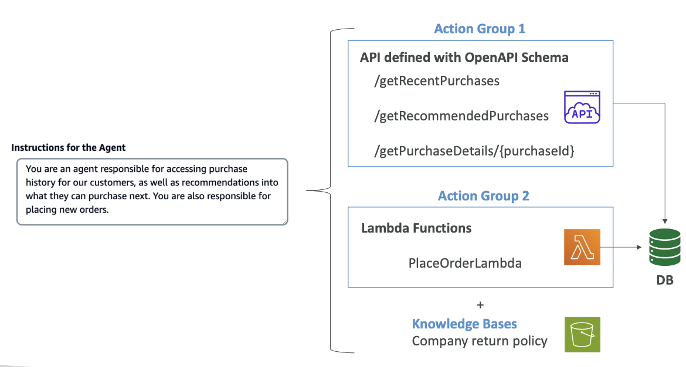
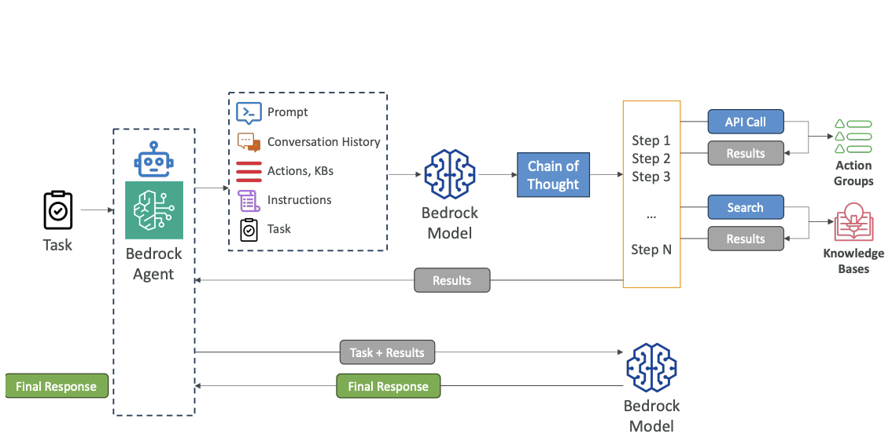

<h1>
  Amazon Bedrock Agents
  
</h1>

Now, let's talk about Amazon Bedrock Agents. 

- The agent is a very <u>smart thing</u> that is going to act a little bit like a <u>human</u>. 

- Instead of just asking questions to a model, <u>the model will now be able to start thinking and **performing various multi-step tasks**</u>. 

- These tasks may have an <u>impact on our own databases </u>or <u>infrastructure</u>, as the agent can:
  
  - create infrastructure, 
  
  - deploy applications, and 
  
  - perform operations on our systems. 

- The agent doesn't just <u>provide us with information</u> (It is not longer a chatbot); it also starts to **think** and **act**. 

- It will:
  
  - look at tasks, perform them in the correct order, and ensure the correct information is passed within the task, even if we haven't programmed the agent to do so.

### **Action Groups**

To execute the tasks, what we do is:

- We create what's called **action groups**, and <u>agents are configured to understand what these action groups do</u> and <u>what they mean</u>. 

- The agent will then be able to <u>automatically integrate with other systems, services, databases, and APIs to **exchange data**</u> or <u>**initiate an action**</u>.

When you create an **agent in Amazon Bedrock,** you define what it is responsible for. For example:

- You are an agent responsible for accessing <u>purchase history for our customers</u>.

- You are responsible for <u>providing recommendations</u> on what they can <u>purchase next</u>.

- You are responsible for <u>placing new orders</u>.

The agent knows it can do all these things. If a user asks the model to perform one of these actions, Bedrock is smart enough to recognize that this agent is likely responsible.

There are two ways to set up an action group: (also look at the diagram below)

1. **APIs**: We can define an API to interface with our system. For example, we can define functions like `get_recent_purchases`, `get_recommended_purchases`, or `get_purchase_details` with a <u>specific purchase ID</u>. All of this is made known to the agent—including the **expected input** for these APIs and **their documentation**—thanks to an <u>**OpenAPI schema**</u>. The agent can then invoke these APIs and interact with our **backend systems**, for instance, **to make changes to a database**.

2. **Lambda Functions**: Lambda functions are a way to run a <u>little bit of code in AWS without provisioning infrastructure</u>. A Lambda function can be created to place an order, interacting with the same database or a new one. This shows that an agent can interact with <u>either an external API or with Lambda functions on your AWS accounts</u>.

### **Knowledge Bases**

The agent also has access to knowledge bases that we define. If we have a knowledge base with our <u>company's shipping and return policies</u>, the agent is smart enough to **retrieve that information and provide it to the user**. 

For example, if a user asks about the <u>return policy for an order they are about to place</u>, the agent can look at this <u>unlabeled data using RAG </u>(Retrieval Augmented Generation) to retrieve the necessary information.

### **How it Works Behind the Scenes**

This process all happens behind the scenes, but Bedrock allows you to see the steps through a feature called **"tracing."** Here is how the agent processes a task: (see the diagram below)

1. The Bedrock agent receives a **task**. It looks at the **prompt**, the **conversation history**, **all available actions**, and the **knowledge bases**.

2. It takes all this information and sends it to a <u>Generative AI</u> model backed by **Amazon Bedrock**, asking how it would proceed to perform the actions.

3. The model uses **Chain of Thought**, meaning its output will be a list of steps (e.g., Step 1: do this, Step 2: do that, etc.).

4. The agent executes these **<u>steps in order</u>**. This could involve **calling an API**, **getting the results**, calling another API, **searching a knowledge base**, and so on.

5. The **final result** is returned to the **Bedrock agent**.

6. The agent then sends <u>the tasks and the results to another **Bedrock model**</u>, which **synthesizes everything** and generates a <u>final response for the user.</u>

> **Important to Note:**
> 
> With **tracing**, you can see this list of steps and debug the agent's performance if you don't like the way it performed a certain action.