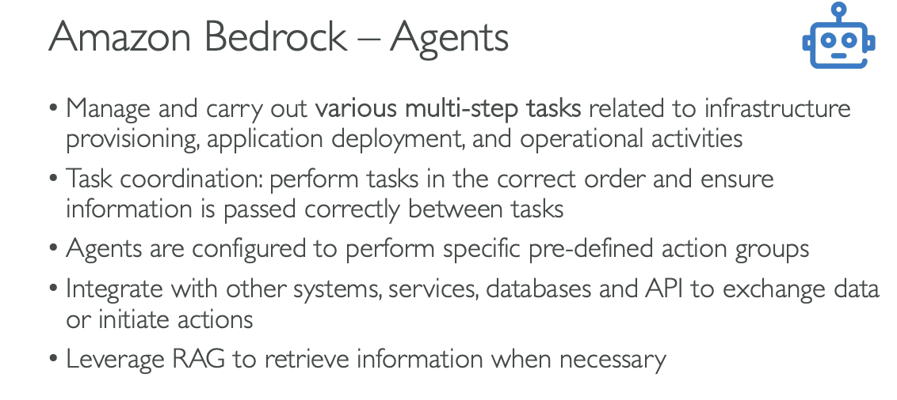

# Amazon Bedrock Agents

So now let's talk about Amazon Bedrock Agents. The agent is going to be a very smart thing that is going to act a little bit like a human. The idea is that instead of just asking questions to a model, now the model is going to be able to start thinking a little bit and to perform various multi-step tasks. These tasks may have an impact on our own databases or our own infrastructure. So the agent can actually create infrastructure, deploy applications, and perform operations on our systems.

Here now, the agent doesn't just provide us information. It also starts to think and act. So for example, it's going to look at tasks, and then it's going to perform the task in the correct order and ensure that the correct information is passed within the task even if we haven't programmed the agent to do so.

So what we do is that we are going to create what's called action groups, and the agents are going to be configured to understand what these action groups do and what they mean. And then automatically the agent will be able to integrate with other systems, services, databases, and APIs to exchange data or to initiate actions. And also if you need to get some information out of your systems in terms of unlabeled data, it can look at RAG to retrieve the information when necessary.

So that sounds a little bit magical, but I will show you exactly how that works.

*Shows the core capabilities and features of Amazon Bedrock Agents*

## **Core Agent Capabilities**

Amazon Bedrock Agents can:

- **Manage and carry out various multi-step tasks** related to infrastructure provisioning, application deployment, and operational activities
- **Task coordination:** perform tasks in the correct order and ensure information is passed correctly between tasks
- **Agents are configured to perform** specific pre-defined action groups
- **Integrate with other systems,** services, databases and APIs to exchange data or initiate actions
- **Leverage RAG** to retrieve information when necessary

## **Bedrock Agent Setup**

In Amazon Bedrock, you would go and create an agent and you are defining what the agent is responsible for. So for example, you are an agent responsible for accessing purchase history for our customers as well as recommendations into what they can purchase next. And you are responsible for placing new orders.

So the agent knows that it can do all these things. So if the user is asking something for the agent or the model to do one of these things, Bedrock is smart. It's going to say, well, this agent probably is going to be responsible for these actions.

### **Instructions for the Agent**
"You are an agent responsible for accessing purchase history for our customers, as well as recommendations into what they can purchase next. You are also responsible for placing new orders."

### **Action Groups Configuration**

Then the agent knows about a few action groups. There are two main ways to set up action groups:

#### **Action Group 1: API Integration**
We have defined an API - it's a way to interface with our system, and we have, for example, defined:
- **API defined with OpenAPI Schema:**
  - `/getRecentPurchases`
  - `/getRecommendedPurchases`
  - `/getPurchaseDetails/{purchaseId}`

So all these things are known to the agent in terms of what is the expected input for these APIs, and what do these APIs do, what is the documentation around it? And all this is provided thanks to an OpenAPI schema. And so when done well the agent can invoke these and behind the scenes, of course, interact with our backend systems, for example, make changes to our database.

#### **Action Group 2: Lambda Functions**
The other way to set up an action group is to use Lambda functions. So Lambda functions are a way to run a little bit of code in AWS without provisioning infrastructure. So the Lambda functions again can be used to be created and place an order through a Lambda function:
- **PlaceOrderLambda**

And so it could use the same database or a new database. But the idea is that I wanted to show here that the agent can interact either with an external API or with Lambda functions on your AWS accounts.

#### **Knowledge Bases**
And finally it has access to knowledge bases that we define, of course. And so for example, say we have a knowledge base around our company shipping policy and return policy, et cetera, et cetera:
- **Company return policy**

So if the user is asking something about the return policy for an order it's about to do, the agent is smart enough to also provide that to the user.

So the agents are very smart, and they know what to access and then automatically will know how to do it.

*Shows the complete agent configuration including Instructions, Action Groups (APIs and Lambda Functions), and Knowledge Bases*

## **How It Works Behind the Scenes**

So how does that work behind the scenes? Well, say we have a task, and we give this task to a Bedrock agent.

### **Step 1: Information Analysis**
Now the agent is going to look at:
- The **prompt**
- All the **conversation history**
- All the **actions available** (Actions, KBs)
- The **instructions**
- What is the **task**

### **Step 2: Chain of Thought Planning**
It's going to take all this information together and send it to a Generative AI model backed by Amazon Bedrock and say, "Please tell me how you would proceed to perform these actions given all this information."

So it's using the chain of thought. Chain of thought means that the output of the Bedrock model is going to be a list of steps:
- **Step 1:** you need to do this
- **Step 2:** do this
- **Step 3:** do this
- **Step N:** last step, do that

### **Step 3: Step Execution**
And so the steps are going to be executed by the agent, and say:
- **First one:** call an API. Call on this action group and get the results
- **Step 2:** do it again
- **Step 3:** call another API, et cetera, et cetera
- Maybe it could be a search into a knowledge base, and get the results and so on

But so the agent is going to work and do all these things for us thanks to the steps that were generated by the Bedrock model, which is amazing.

### **Step 4: Final Response Generation**
And then the final result is returned to the Bedrock agent. The Bedrock agent then sends the tasks and the results to another Bedrock model. And the Bedrock model is going to synthesize everything and give a final response to our user and we will get the final response.

## **Agent Workflow Summary**

So this is all happening behind the scenes. Of course us, we just use the agent, and the agent does stuff and automatically we see the final response. But Bedrock is really nice because you actually have something called **tracing** on your agent, and this allows you to see the list of steps that were done by the agent. So you can debug in case you don't like the way an agent performed something.

The complete workflow shows:
1. **Task** input to Bedrock Agent
2. Agent analyzes prompt, conversation history, actions, and instructions
3. **Bedrock Model** generates chain of thought steps
4. Agent executes steps (API calls to Action Groups, searches in Knowledge Bases)
5. Results are collected and sent to another **Bedrock Model**
6. **Final Response** is generated and returned to the user

*Shows the complete end-to-end workflow of how a Bedrock Agent processes tasks, from initial input through chain of thought planning, step execution, and final response generation*

---

That's it for Amazon Bedrock Agents.