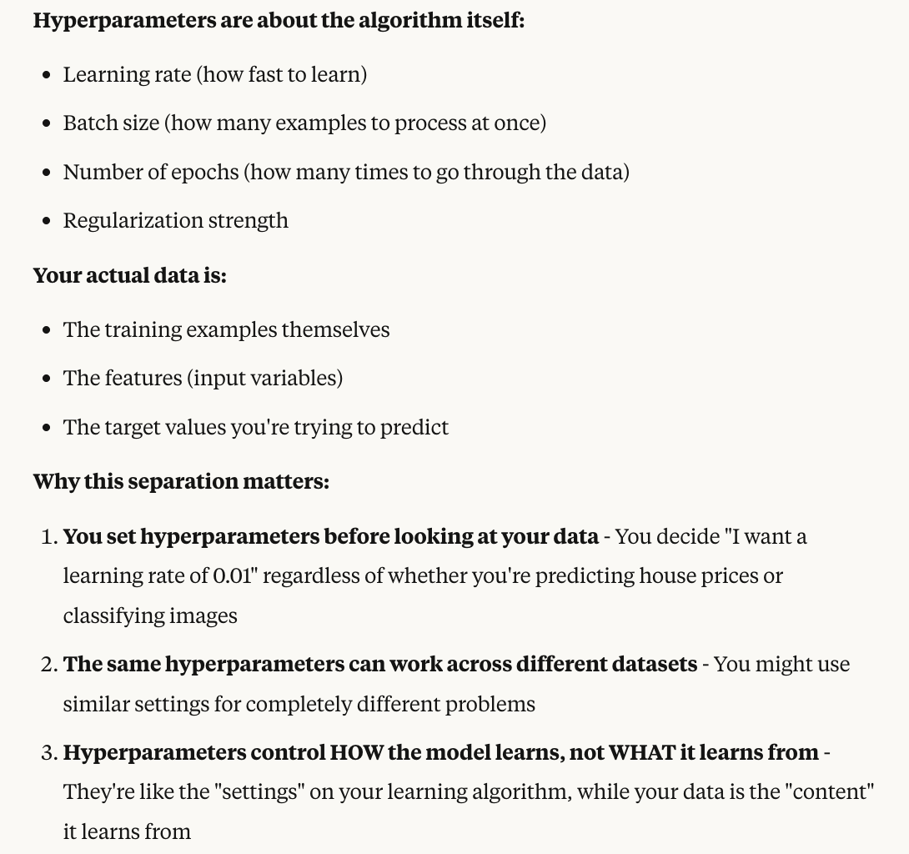
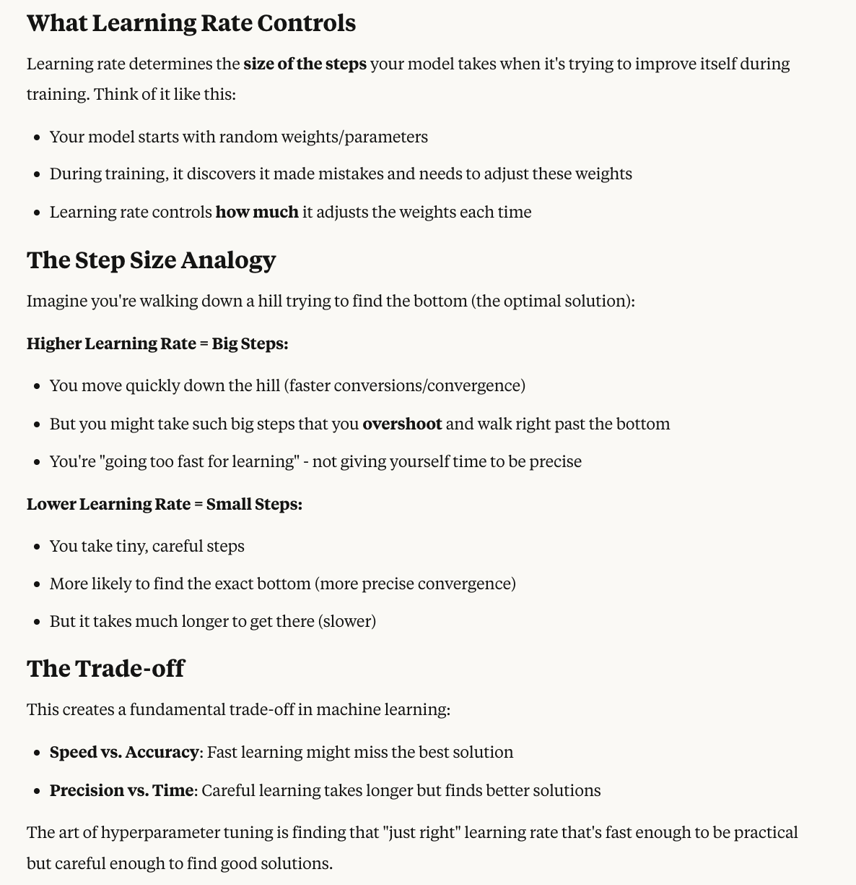
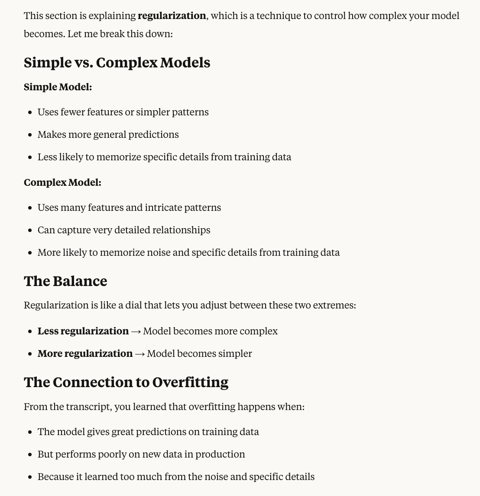

# Hyperparameter Tuning

Now let's discuss hyperparameter tuning in greater detail. 

**Definition:** 
- Hyperparameters are the settings that define the model structure and the learning algorithm and process. 
- They are set before the training begins  
- **Types of Hyperparameters**: Different types of hyperparameters include:
  - **Learning rate** - How fast you want the model to incorporate new data
  - **Batch size** - How many data points to consider at a time 
  - **Number of epochs** - How many times you want to iterate on your model until you say you've converged to a good result
  - **Regularization** - How flexible the model should be 
- And hyparameters are separate from your actual data - they're about the algorithm you're using to train your model.

> to better understand the above statement, here is the image below:
> 

Now you can do hyperparameter tuning
## **Why Hyperparameter Tuning Matters**

**Definition of Hyparameter Tuning**
- To have the **best model performance** and **optimize it**, it's a matter of finding the best hyperparameter values. 
**Reason of performing tuning**
- By doing tuning, we're going to improve the **model accuracy**, **reduce overfitting, and enhance generalization**.

## **How to Do Hyperparameter Tuning**

You have several algorithms available:
- Grid search
- Random search
- Services such as SageMaker Automatic Model Tuning (AMT)

This is a very important part of a machine learning project.

## **Important Hyperparameters for the Exam**

### **Learning Rate**
This represents how large or small the steps are going to be when you update the model's weights during training.

- **Higher learning rate** - Your model is going to have faster conversions, but there is a risk of you to overshoot the optimal solution because while you're going too fast for learning

> Convergence means when your model's training process reaches a stable point where it stops improving significantly.

- **Low learning rate** - May be more precise and have the conversions to the optimal solution, but it may be slower

> To better understand Learning Rate, see the image below:
> 

### **Batch Size**
This is how many training examples are used to update the model's weights during **one iteration**.

- **Smaller batch size** - Can lead to a more stable learning experience, but require more time to compute
- **Larger batch size** - May be faster to go through your model, but it may lead to less stable updates

### **Number of Epochs**
This is to how many times the model is going to iterate over the entire training dataset. In the machine learning process, you're going to go many, many times over your entire dataset.

- **Too few epochs** - You will have underfitting
- **Too many epochs** - You may cause overfitting because you're trying really, really hard to fit the data to the dataset you have by going many, many times over

### **Regularization**
To make it super simple, it's to adjust the balance between a simple and a complex model. What you should know for the exam is that if you want to reduce overfitting, then you need to increase the amount of regularization in your model.

> For better understanding, see the image below:
> 

## **Understanding Hyperparameters**

These hyperparameters have no right or wrong type of answers. It's more about understanding what they are impacting and what they can lead to. The role of a machine learning engineer or data scientist will be to tune and optimize these hyperparameters.

## **Overfitting**

### **What is Overfitting?**
Overfitting is when the model is going to give you great predictions for the training dataset, but not for new data in production.

### **Causes of Overfitting**
It can occur due to many things:

- **Training data size is too small** and doesn't represent all the possible values
- **Training for too long** - too many epochs on a single sample set of data
- **Model complexity is very high** - it's going to learn not just from the features that are most important, but also from the noise within the training data

### **How to Prevent Overfitting**

1. **Increase the training data size** - This means you're going to have a dataset that is much more representative of all the possible values for your production data (this is usually the best answer)

2. **Early stopping** of the training of the model - doing more epochs is not going to help with overfitting, it's the opposite direction instead

3. **Data augmentation** - if you don't have enough diversity in your datasets

4. **Adjust the hyperparameters** - we can try adjusting the learning rate, batch size, and epochs, but you cannot add new hyperparameters as these are fixed. However, this is usually not the primary answer.

The best answer is going to be to increase the training data size.