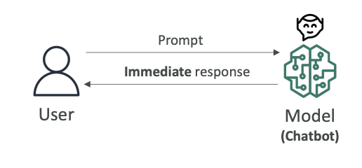
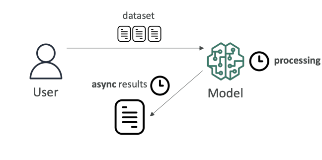
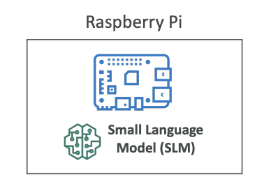
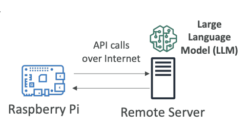

# Inferencing Types and Trade-offs

Now that we understand the basics, let's talk about inferencing. 

**Inferencing** (or **inference**) is the process of **using a trained machine learning model to make predictions or decisions** on new, unseen data.
- **Training** is when a model learns from historical/labeled data.
- **Inferencing** is when the trained model is used to make real-world predictions.

There are different kinds of inferencing, each with their own characteristics and use cases.

## **Real-Time Inferencing**

Real-time inferencing occurs when a user puts a prompt into a **chatbot** and we want an immediate response (look at the diagram below). 

**Key characteristics**:
- Here, computers have to make decisions **very quickly** as data arrives.
- **Speed over accuracy**: You prefer speed over perfect accuracy because you want the **response to be immediate**
- **Immediate processing**: Responses must be generated without delay
- **Primary use case**: Chatbots are a very good example of real-time inferencing

The other end of inferencing is **batch inferencing**.

## **Batch Inferencing**

Batch inferencing involves analyzing a large amount of data all at once. Here we give a lot of data into a model, and we can wait for the processing time to happen.

Key characteristics:
- **Processing time flexibility**: It could take minutes, days, or weeks
- **Results when ready**: We get the results when they're ready and analyze them then
- **Accuracy over speed**: You don't really care about speed (of course, the faster the better, but you can wait). What you really want is <u>**maximum accuracy**</u>
- **Primary use case**: Often used for data analysis

## **Inferencing at the Edge**

### **What is the Edge?**

Edge devices are usually devices that have **less computing power** and are close to where your data is being generated. They're usually in places where internet connections can be limited. An edge device can be your phone (but your phone can be quite powerful), or it can be anything that's somewhere far in the world.

### **Small Language Models (SLMs) on Edge Devices**

To run a full large language model on an edge device may be very difficult because you don't have enough computing power. 

Therefore, there is a popular trend of small language models that can run with limited resources and on edge devices.

You may want to load these SLMs on, for example, a Raspberry Pi, which is an edge device.

**When loaded onto your edge device, you get**:

- **Very low latency**: Because your edge device can just invoke the model locally
- **Very low compute footprint**: Optimized for limited resources
- **Offline capability**: With ability to use local inference

### **LLMs via Remote Server**

If you want to have a more powerful model (for example, an LLM), it would maybe be impossible to run it on an edge device. Maybe in the future it will, but right now it may be very difficult because you don't have enough computing power.

**Alternative approach:**
- Run the **LLM on a remote server** (just like we've been doing so far, for example, on **Amazon Bedrock**)
- Your edge device makes API calls over the internet to your server, to your model, wherever it's deployed
- Then get the results back

**Trade-offs:**

*Advantages:*
- Can use a **more powerful model** because the model lives somewhere else

*Disadvantages:*
- **Higher latency** because the call needs to be made over the internet to get the results back
- Your edge device **must be online and must have an internet connection** to access the large language model

## **Exam Considerations**

The exam may ask you about the trade-offs and to choose the right solution for the use case presented. Understanding these different inferencing approaches and their characteristics will help you make the right decisions.