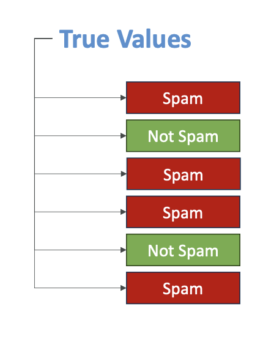
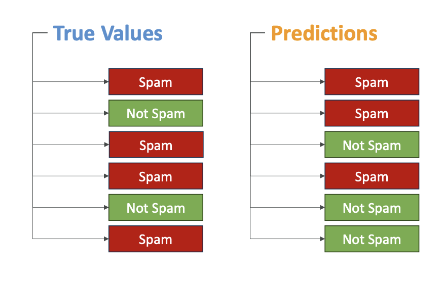
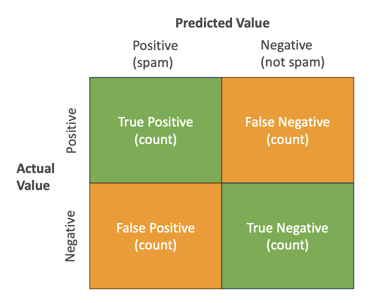

# Machine Learning Model Evaluation Metrics

Now let's talk about some of the metrics we can look at to <u>evaluate our models</u>. We'll start with binary classification and then move to regression models.

## **Binary Classification Evaluation**

### **Confusion Matrix**

Let's take the example of binary classification with spam email detection.
 
We have the **true values** from our <u>labeled data</u> - whether an email is spam or not spam. Our model makes predictions, and we can compare these predictions to the actual labels. 
 
For example (Look into the image above):
- First email: correctly classified as spam ✓
- Second email: predicted spam, but actually wasn't spam ✗  
- Third email: wrong prediction ✗
- Fourth email: correct prediction ✓
- Fifth email: correct prediction ✓
- Sixth email: wrong prediction ✗

We can compare the <u>true values</u> with what our <u>model predicted</u> and create what's called a **confusion matrix**.

### **Confusion Matrix Structure**

A confusion matrix looks at the **predictive value** (positive for spam, negative for not spam) and <u>compares it</u> to the **actual value** from our **training dataset**: 
 
- **True Positives (top-left)**: Predicted positive and actual value was positive
- **False Negatives (top-right)**: Predicted not spam, but actually was spam  
- **False Positives (bottom-left)**: Predicted spam, but actually wasn't spam
- **True Negatives (bottom-right)**: Predicted not spam and actually was not spam

We want to maximize true positives and true negatives while minimizing false positives and false negatives.

To create this matrix, we look at our datasets (for example, 10,000 items we trained and predicted on) and count how many fall into each category.

### **Classification Metrics**

From the confusion matrix, we can compute several metrics:

**1. Precision**
- Formula: True Positives ÷ (True Positives + False Positives)
- Measures: "If we find positives, how precise are we? How many times are we right about positives versus wrong about positives?"

**2. Recall**  
- Formula: True Positives ÷ (True Positives + False Negatives)
- Measures: "How many times do we need to recall (walk back) our decision?"

**3. F1 Score**
- Formula: 2 × (Precision × Recall) ÷ (Precision + Recall)
- Widely used metric for confusion matrix evaluation

**4. Accuracy**
- Has a formula but is rarely used
- You don't need to remember the exact formula

### **When to Use Which Metric**

The choice of metric depends on what you're looking for:

- **Precision**: Best when false positives are costly
- **Recall**: Best when false negatives are costly  
- **F1 Score**: Gives balance between precision and recall, especially useful for imbalanced datasets
- **Accuracy**: Rarely used, only for balanced datasets

**Balanced vs Imbalanced Datasets:**
- Balanced dataset: Has balanced levels of classification for each category
- Spam vs not-spam is typically not a balanced dataset

### **AUC-ROC**

**AUC-ROC** stands for Area Under the Curve for the Receiver-Operator Curve. It's more complicated, but just remember the name for the exam.

- Value ranges from 0 to 1, with 1 being the perfect model
- Compares sensitivity (true positive rates) to 1 minus specificity (false positive rates)

**The ROC Curve has two axes:**
- Vertical axis: How often your model classifies actual spam as spam (sensitivity)
- Horizontal axis: How often your model classifies not-spam as spam

The curve shows multiple models, where a straight line represents a random model. The more accurate your model, the more the curve leans toward the top-left. AUC measures how much area is under the curve.

To draw this curve, you look at various thresholds in your model, vary the threshold with multiple confusion matrices, and plot this over time. AUC-ROC is very useful when comparing thresholds and choosing the right model for binary classification.

**Note:** The confusion matrix can also be multi-dimensional for multiple categories in classification.

## **Regression Evaluation**

Now let's look at how we evaluate regression models. Remember, this applies to cases like linear regression where we have data points and we're trying to find a line that represents these data points.

We measure accuracy by measuring the error - the sum of distances between predicted values and actual values.

### **Regression Metrics**

Just remember the names of these metrics, not necessarily how they work:

**1. MAE (Mean Absolute Error)**
- Computes the difference between predicted and actual values as a mean of absolute values
- Divide by the number of values you have

**2. MAPE (Mean Absolute Percentage Error)**  
- Instead of computing actual difference of values, computes how far off you are as a percentage
- Same idea as MAE, but computing the average of percentages

**3. RMSE (Root Mean Squared Error)**
- Formula is more complicated
- The idea is that you're trying to smooth out the error

**4. R Squared**
- Looks at the variance in your model
- If R squared is close to 1, your predictions are good

### **Understanding Regression Metrics with Examples**

Let's say you're trying to predict how well students did on a test based on how many hours they studied.

**Error Measurement Metrics (MAE, MAPE, RMSE):**
- These show how accurate the model is
- Example: If your RMSE is 5, that means on average, your model predictions will be about 5 points off from the actual student score
- Easy to quantify and measure

**R Squared:**
- Measures variance - a bit more difficult to understand
- Example: R squared of 0.8 means that 80% of changes in test scores can be explained by how much students studied (your input feature)
- The remaining 20% is due to other factors like natural ability or luck
- These other factors may not be captured by your model because they're not features in your model
- Very good R squared close to 1 means you can explain almost everything of the target variable's variance thanks to your input features

## **Key Takeaways**

**From an exam perspective:**

- **For Classification**: Use metrics from confusion matrix - accuracy, precision, recall, F1, and AUC-ROC
- **For Regression**: Use MAE, MAPE, RMSE, and R squared for models that predict continuous values

The purpose of a confusion matrix is to evaluate the performance of models that do classifications. For model optimization, we try to minimize these error metrics to ensure our model is accurate.

You should now understand which metrics are for classification and which are for regression, and have a high-level understanding of what these metrics do.