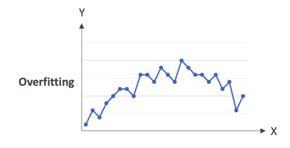
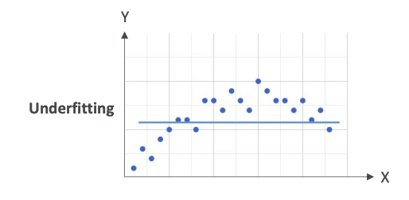
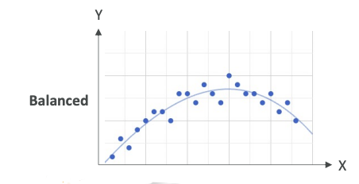
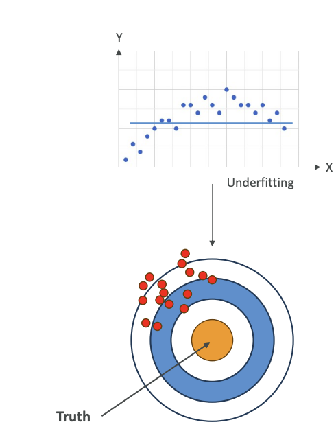
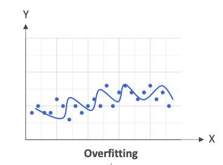
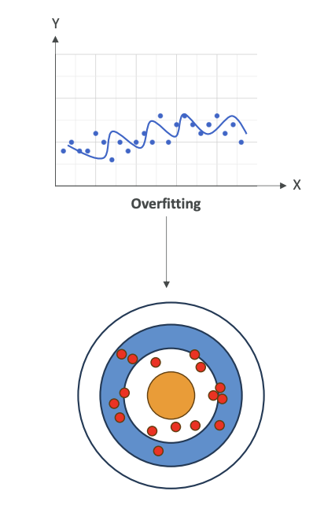
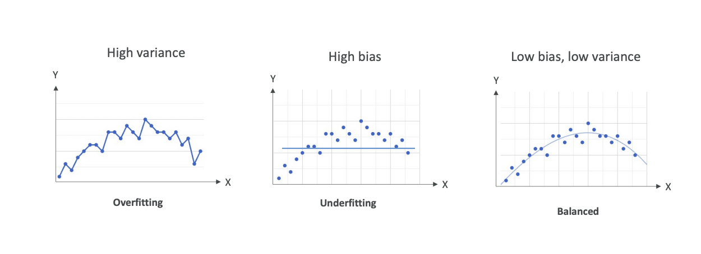
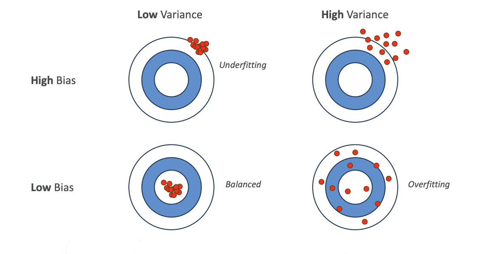

# Model Fits, Bias and Variance

Now let's talk about model fits and bias and variance. In case your model has **poor performance**, it could be for various reasons, so you need to look at what's called its **fit**.

## **Types of Model Fits**

### **Overfitting**
This is when your model is **performing very well on the training data, but it doesn't perform well on the evaluation data**. 

Here's an example of overfitting,

 
where we have a lot of points and we just have a line that links all these points. Of course, this is going to work great on the training data because we are always predicting the point itself. But when we look at new data, which is not part of the training dataset, it is 100% sure that it will fall outside of this line. Therefore, we are overfitting - we're trying too hard to reduce the error on the training data.

**In Summary**:
- Performs well on the training data
- Does not perform well on evaluation data

### **Underfitting**
On the opposite end, you have underfitting. Underfitting is when the model is **performing very poorly on the training data**. 

For example, on these data points,
 
we have a horizontal line. This is a very bad model. It doesn't look at all like what the data is shaped like. This could be a problem of having a **model that's too simple** or you have **very poor data features**.

**In Summary**:
- Model performs poorly on training data
- Could be a problem of having a model too simple or poor data feature

### **Balanced**
What you're striving for is balanced. **Balanced is neither overfitting nor underfitting**.

 This is a very balanced model. Of course, you have **some error based on training data**, but it looks like you are **following closely the trend of your data**.

> Remember: overfitting, underfitting, and balanced for the exam.

## **Bias and Variance**

### **What is Bias?**
Bias is the difference or the error between the **predicted value and the actual value**. 

Bias occurs normally because we can make, for example, the wrong choice in the machine learning process, but you always have some bias.

Here, for example, let's take our datasets,  
and we have a horizontal line to predict the data points. Obviously, it's a very **bad choice**, and so we are going to have a **very high bias** (error or difference) because the <mark>model doesn't closely match the training data</mark>. 

This can happen, for example, when you have a **linear regression**, but <mark>your dataset is non-linear</mark> - meaning that it doesn't follow a straight line type of trend. This is considered as **underfitting** when you have a **very high bias**.

Some people like a visualization where you have like a circle,
 
and this is like, imagine a dart board, and you're good if you hit the truth. The truth is in the center. If you have **high bias**, basically, you're going to be <mark>far from the truth every time</mark>, and so your **data points** are going to be <u>away from the center</u>. This is **high bias**.

**How do we reduce the bias?**
- Improve the model - maybe use a **more complex model** that will fit better our datasets
- **Increase the number of features** in case our <u>data is not prepared well enough</u>, and therefore, we need new features to predict and have a good machine learning model.

### **What is Variance?**
Variance represents how much the **performance of a model** will **change** if it's trained on a different dataset which has a **similar distribution**.

**So let me explain**: 
If we take a dataset and we have something that is **overfitting**,

 

we are going to try to **match every single point**, then as soon as we **change the training data**, our **model is going to change a lot**. It's going to be very sensitive to changes. When you're **overfitting**, you're performing **well on training data**, but **poorly on unseen test data**, and therefore, you have **very, very high variance**.

When you have high variance, that means that your data is all over the place (See the image below).
 
It could be **centered**, like on average, **things converge to the center**, could be a **low bias** (low error), but you have **a lot of variance** because if you change your model, then things will change.

**How do you reduce the variance?**
- Consider fewer features - only consider the more important features
- Split the data into multiple sets into training and test data multiple times

## **Summary of Relationships**

### **Overfitting**
- High variance
- If we change the input dataset, our model is going to change completely

### **Underfitting** 
- High bias
- Our model is not good - we have a lot of error on prediction of every one of these data points

### **Balanced**
- Low bias, low variance
- Of course, you're going to have some variance because if you change your training dataset, your model is going to change, but hopefully, only slightly
- You're going to have low bias and some bias because your model is never perfect - you can't predict everything 100% of the time
- We want to have a balance between bias and variance

## **Bias-Variance Matrix Visualization**

There's another type of visualization you can have to understand those. This is a matrix of low variance, high variance, as well as high bias and low bias:

1. **Low Bias + Low Variance** = **Balanced** (what we want)
   - All your data points are going to be in the center with low variance
   - All of them are going to be very well-centered

2. **High Bias + Low Variance** = **Underfitting**
   - Your data is wrong on average, but your model doesn't really change if you change your training datasets

3. **Low Bias + High Variance** = **Overfitting**
   - If you change your training dataset, your model is going to change tremendously

4. **High Bias + High Variance** = **Poor Model**
   - You just don't have a good model and you don't want to use it anyway

Understanding what is bias and what is variance, as well as underfitting, overfitting, and balanced is going to be very important from an exam perspective.