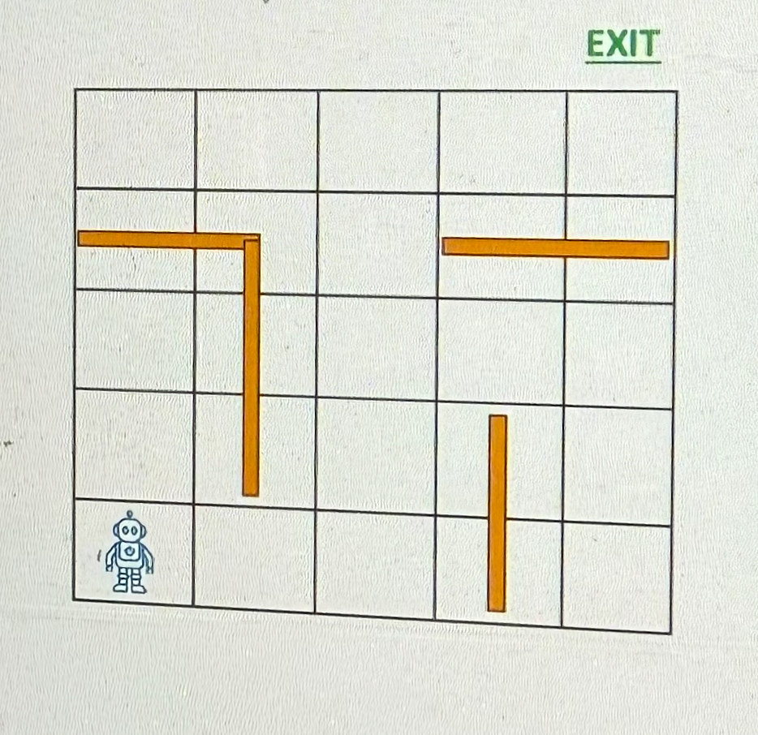
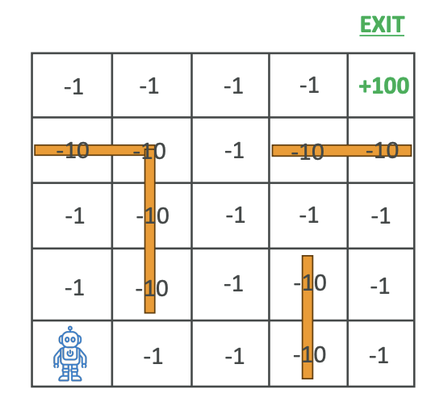
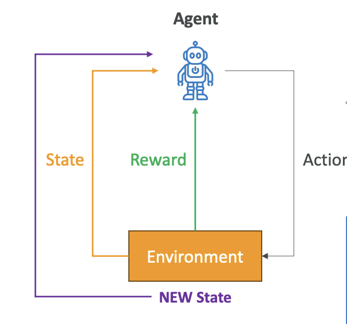
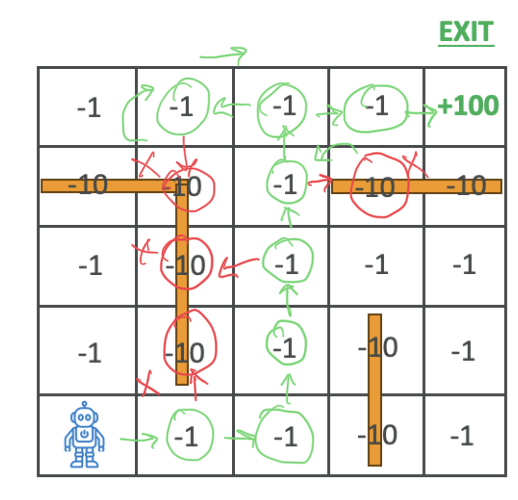

# Reinforcement Learning

Now let's talk about reinforcement learning. The idea, for example, here we have a maze and we're trying to train an AI to find the exit of a maze.

**Reinforcement learning** is a type of <mark>machine learning where an agent is going to learn and make decisions by performing actions in an environment</mark> and <mark>maximize what's called cumulative reward</mark>.

> Note that we have to define what is reward.

## **Key Concepts**

- **Agent**: The little robot - that's the learner or decision maker
- **Environment**: The <mark>maze</mark> - that's the external system that the agent is interacting with
- **Action**: The choices made by the agent. In the setting of a maze, for example, is to go up, to go left, to go right, to go down
- **Reward**: The type of feedback that the <mark>environment</mark> is going to provide <mark>based on the agent's action</mark> (See below **Reward System Example**)
- **State**: The <mark>current situation of the environment</mark>, what it looks like and what is available
- **Policy**: A strategy used by the agent to <mark>determine what action to take based on the state</mark>

## **Reward System Example**

For this maze, we're going to assign numbers:

- **-1**: Whenever the robot walks somewhere and there is no wall, it's just a normal place to walk to, so it's good
- **-10**: If the robot is walking into a wall
- **+100**: If the robot is able to find the exit

Of course, because the robot wants to maximize rewards and it needs to find the shortest path to the exit. The longer it takes to find the path, the more points it will lose. And of course, if it walks into a wall, it's going to lose points even faster, so we're going to teach the robot not to walk into walls.

## **Learning Process**

The idea is that the robot is going to do many, many, many simulations and over time it's going to get better because it's going to learn from its mistakes by **maximizing the reward function**.

Here is the learning process:

1. The agent is going to have a look at the environment and the current state
2. It's going to select an action based on the strategy, the policy (for example, go up, go down, go left, go right, and so on)
3. The transition is going to transition the environment
4. The environment is going to transition into a new state and provide a reward to the agent (so it could be -1, -10, +100 in our previous example)
5. Then the environment will be in a new state, and then the agent is going to update its policy once it has figured out the exit to improve future decisions

And so we go again in this learning process over and over and over again until the agent will run maybe a thousand or a million simulations, and then the agent will have learned how to properly navigate the maze.

Here the **Goal** of the agent is to **maximize** the cumulative reward over time

## **Maze Navigation Example**

So here, how it looks for example for our little maze.

We have to train the robot over time to navigate this maze. The steps are:

1. **First**, the robot is going to observe its position - that's the **state**
2. **Then** it's going to choose a direction to move in - that's the **action**
3. **Then** it's going to receive **reward** - it's going to be **-1** to take a step, **-10** to hit a wall, and **+100** if going to the exit
4. **Then** it's going to update it's **policy** based on the Reward and new position

Over time, of course, the robot is going to first move randomly, but at some point it will find the exit. And then once it's found the exit, it's going to update its **policy** based on what it has learned from its movement and then try again. And over time the robot will learn to navigate the maze more efficiently.

## **Visual Learning Example**

There is a cool YouTube channel that I would recommend for you to watch called AI Warehouse. The idea is that this person trains AI based on reinforcement learning based on different factors, and you actually see the AI visually getting better at doing some kind of actions.

<iframe width="560" height="315" src="https://www.youtube.com/embed/2tamH76Tjvw?si=QkqIriT7malDPjao" title="YouTube video player" frameborder="0" allow="accelerometer; autoplay; clipboard-write; encrypted-media; gyroscope; picture-in-picture; web-share" referrerpolicy="strict-origin-when-cross-origin" allowfullscreen></iframe>

In this video, we have the AI moving randomly and learning how to navigate the environment. It's going to gain points if it hits the green little things on the floor. Over time, it's going to get better to learn how to jump, to learn how to go to the green thing.

You can see, there are many, many different iterations being done in this video, and over time it's going to learn how to move. It's quite interesting because after many, many iterations, as you can see, it's able to find the exits and move on to the next puzzle. And over time, of course, things are getting more complicated for the AI, which is going to keep on learning what it can and cannot do.

It's a very interesting video because you can really visually see how the AI is getting better after so many iterations, and that is the whole process of reinforcement learning explained in a visual way.

## **Applications of Reinforcement Learning**

Reinforcement learning is used for:

- **Gaming**: To teach an AI to play very complex games, such as Chess and Go
- **Robotics**: To teach robots how to **navigate** and **manipulate objects** in a **dynamic environment**
- **Finance**: For **portfolio management** and **trading strategies**
- **Healthcare**: To optimize treatment plans
- **Autonomous vehicles**: For **path planning** and **decision-making**

That's it for reinforcement learning. I hope now you understand what it means.