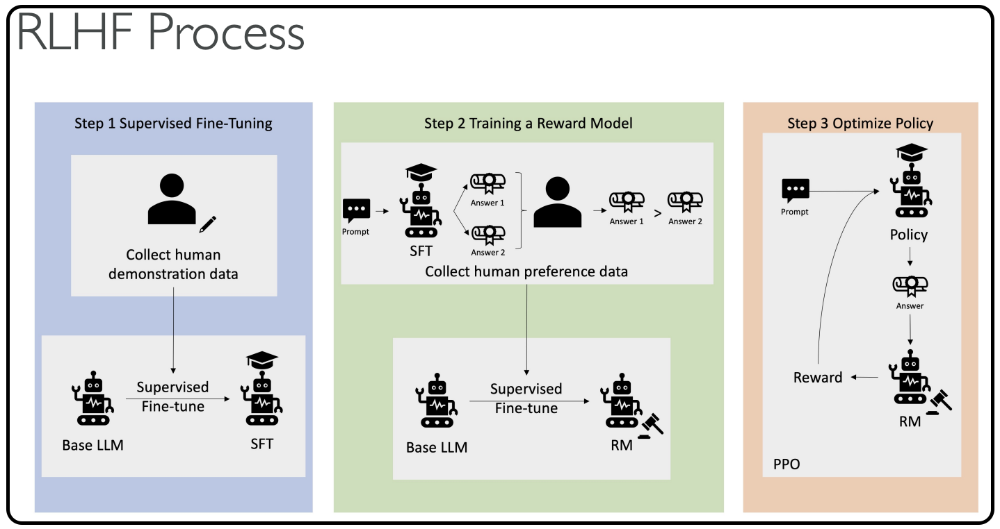

# Reinforcement Learning from Human Feedback (RLHF)

Now that we have seen reinforcement learning, let's look at **reinforcement learning from human feedback**. The idea is that you want to <mark>use human feedback to help machine learning models self-learn more efficiently</mark>.

We know that in reinforcement learning there is a reward function, but now we want to actually <mark>incorporate human feedback directly in the reward function to be more aligned with human goals, wants, and needs</mark>. 
- The model responses are going to be compared to the human responses, and 
- the human is going to assess the quality of the model's responses.

**RLHF is used extensively in GenAI applications, including LLM models, because it significantly enhances model performance.** For example, you are grading text translations from just technically correct - yes, the translation does make sense, but it doesn't sound very human. This is where human feedback is very important.

## **Building an Internal Company Knowledge Chatbot with RLHF**

Say you want to build an internal company knowledge chatbot, but you want to align it with RLHF. Here's how the process works:

### **Step 1: Data Collection**
- Get a set of human-generated prompts and ideal responses
- Example: "Where is the location of the HR department in Boston?" (human prompt with human response)

### **Step 2: Supervised Fine-Tuning**
- Take a language model and do supervised fine-tuning to allow it to get our internal company data
- Fine-tune an existing model with internal knowledge
- The model will create responses for the same human prompts we had before
- We can compare responses mathematically between the human-generated answer and the model-generated answer using available metrics

### **Step 3: Building a Separate Reward Model**
- We will Build an AI model specifically for the reward function
**How are they going to do it?**
- Humans will get two different responses from a model for the same prompt
- They will indicate which one they prefer
- Over time, the model will learn how to fit human preferences
- The reward model will know how to automatically choose as a human would

### **Step 4: Optimizing the Language Model**
- Use the reward model as a reward function for reinforcement learning
- Optimize the initial language model using the reward-based model
- This part can be fully automated because human feedback has been incorporated into creating the reward model

> Below is the diagram with the explanation (diagram is provided from AWS)

## **The Complete RLHF Process (AWS Diagram)**

1. **Supervised Fine-Tuning**: Collect data and fine-tune the base LLM into a fine-tuned LLM

2. **Train a Separate Reward Model**: Present different answers to humans who say "I prefer answer one to answer two" - this automatically trains the model

3. **Another Layer of Supervised Fine-Tuning**: Use the base language model again, but now using the new rewards model

4. **Combine Everything**: The policy and answer generated from step three for the reinforcement learning strategy will be judged automatically by the rewards model

The training becomes fully automated, yet aligned with human preferences.

## **Key Takeaways**

Remember these four essential steps:
1. **Data collection**
2. **Supervised fine-tuning** 
3. **Building a separate reward model**
4. **Optimizing the language model with a reward-based model**

Understanding the basic idea behind RLHF will help you answer exam questions on this topic effectively.