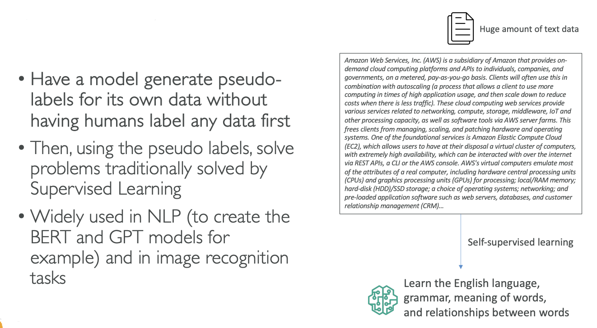
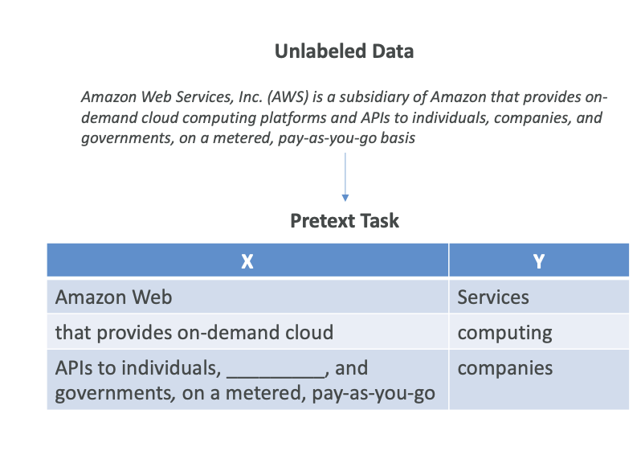

# Self-Supervised Learning

Now let's talk about Self-Supervised Learning. This is a bit of an odd concept, but the idea is that we have a model and we have a lot of unlabeled data, for example, text data. We want the model to generate its own **pseudo-labels** on its own, <mark>without having humans label</mark> any data first, because <mark>labeling data as humans can be very expensive</mark>.

Here, we are not doing unsupervised learning because we're actually getting labels out of it, and then we're going to solve supervised learning tasks. However, we don't label any of the data first - we expect the data to label itself. The implementations can be quite complicated, but the core concept is straightforward.

## **How It Works with Text Data**

Let's imagine we have a huge amount of text data that makes sense to us because it has the right structure, the right grammar, and so on. Using self-supervised learning techniques, we're going to have a model that will learn on its own: 

• The English language 
• The grammar  
• The meaning of words 
• The relationship between words 

This happens without us telling and writing out "What is the meaning of word, what is the grammar?" and so on, which is quite amazing.

## **Applications and Impact**

Once we have this model, then we can solve other problems that we can traditionally solve with supervised learning. For example, once we have this model, we can create a summarization task.

This technique of self-supervised learning is what actually allowed a lot of the new models in AI to come out, such as: 
• GPT models 
• Image recognition tasks  

Let me try to explain intuitively how that works:
## **Pre-text Tasks**

The idea is that in self-supervised learning, you have what's called "pre-text tasks." We're going to give the model simple tasks to solve and to learn patterns in data sets.

### **Example with Text Data**

If we take an extract of our unlabeled data sets, for example, this sentence: "Amazon Web Services, AWS is a subsidiary of Amazon and so on," we're going to create a pre-text task in which we're saying:

In this we will predict what the next word is going to be..

**For example: Next Word Prediction:** 
• "Amazon Web," and the next word is going to be "Services" 
• "that provides on-demand cloud," and then the next word is "computing"  

Or predict what's going to be **missing word**...

**Fill in the Blanks:** 
• "API to individuals," [blank], "and governments. on a metered pay-as-you-go basis." 
• The word to fill is "companies" 

## **The Training Process**

As you can see from a lot of unlabeled data, we can create a ton of pre-task tasks, and we're going to train our model on those.

Of course, <mark>predicting the next word may not be very useful by itself</mark>, but actually, by having these <mark>very simple tasks</mark> that the model can solve without us creating labels in the first place (like human-generated labels), because all these labels in X and Y are generated by computers, we can train on predicting:  

• The parts of any input from any other parts 
• The future from the past 
• The masked from the visible 
• Any occluded part from all available parts 

## **Internal Representation and Downstream Tasks**

Once we solve these pre-text tasks, and there can be many of those, then the model internally will have created its own internal representation of the data and will have created its own pseudo-labels.

Therefore, once we have done a lot of the pre-text tasks, our model now knows how to understand texts, grammar, and meaning of words. Then we can ask it more useful tasks, and they're called **downstream tasks** - and that's the idea behind self-supervised learning.

## **Summary**

The core concept is that you have the model generate its own pseudo-labels by using pre-text tasks. It's a complex topic that can be quite technical at some points, but this approach allows models to learn meaningful representations from unlabeled data without human supervision.