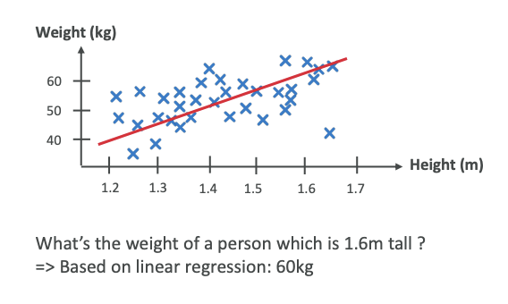
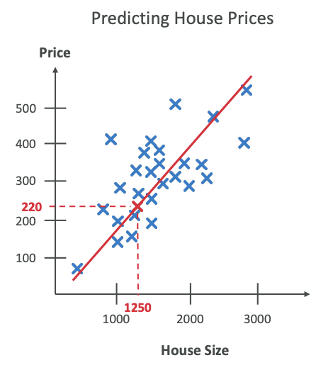
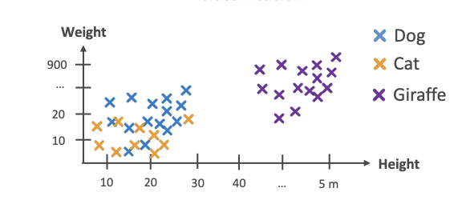
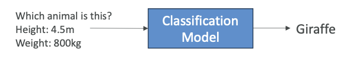
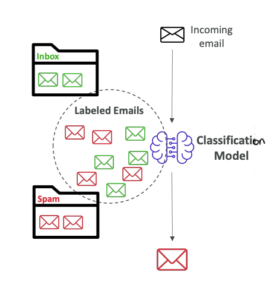
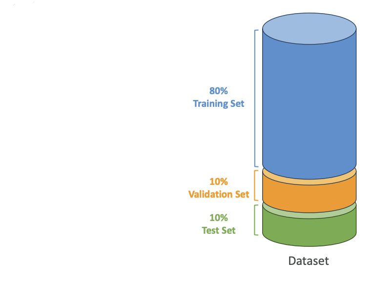
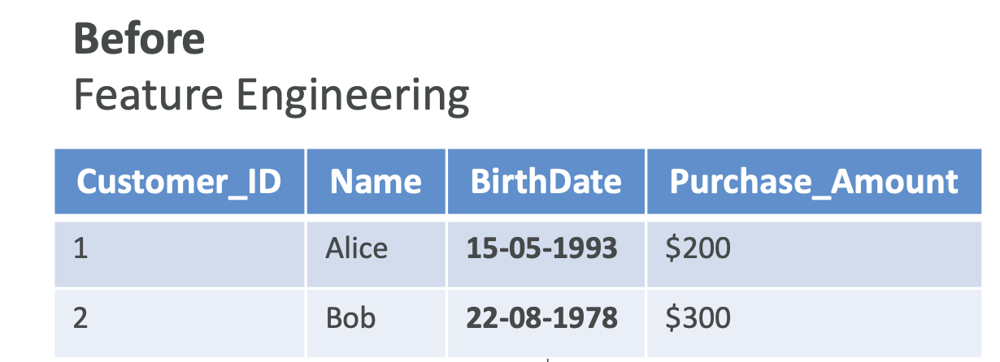
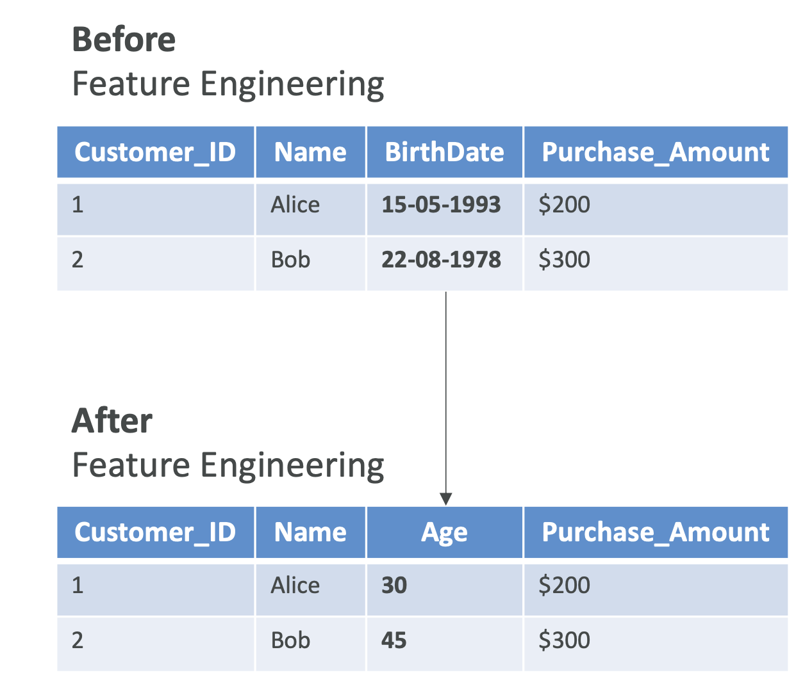

# Supervised Learning - Course Notes

Now that we have learned about data, let's talk about supervised learning. In this context of supervised learning, we're trying to figure out a mapping function for our model that can predict the output for new unseen input data.

## **What is Supervised Learning?**

To do supervised learning, you need labeled data. This means it's going to be very powerful, but as mentioned, it's going to be very difficult to have labeled data for millions of data points.

## **Regression**

### **Linear Regression Example**
For example, say we are doing a regression on humans. Humans have a height and also have a weight. We can have little crosses for every human and put weight and height on a diagram. Then we can do a regression in which we try to find a straight line. This is called a linear regression.

We try to find a straight line that sort of covers the trend of these data points. Of course, it's not perfect, but it's one way of doing it. We know that some humans can be very tall and very light, and others can be very tiny and very heavy. But still, it's one algorithm that we can apply to these datasets.

### **Making Predictions**
Once we have this red line that crosses our datasets, then we can ask the algorithm, "Hey, what is the weight of a person that is 1.6 meters tall?" Based on this regression, we're going to look at the 1.6 value, go all the way to the red line and read the value, and it's going to be 60 kilograms.

For a height of 1.6 meters, we predict that the weight is going to be 60 kilograms.

### **Regression Summary**
A regression is to predict a numeric value based on input data. The output variable that you're trying to predict is continuous. That means it can take any value within a range. This is when we try to predict a quantity or a real value.

Another example to consider:
- We have house sizes and price and again, we do a linear regression,then we put the house size, and then we get the price from this linear regression.

**Examples of regression:**
- Predicting house prices
- Predicting stock prices
- Weather forecasting

> Here we're showing a two-dimensional regression, but in practice, regressions can be a lot more complicated. They can be other things than linear, and they can be in more dimensions than two dimensions.

## **Classification**

For classification, we have a different kind of algorithm. Say for example, we are again using heights and weights. This time we put animals there. We're going to have dogs, cats, and giraffes. As you can see in the diagram below, it's a very diverse dataset. It's very possible that dogs and cats will have the same height and different weights, so it can be all over the place.

We can see clearly that giraffes are going to be very tall and very heavy, so they're going to be heavily differentiated from dogs and cats. Once we've classified things, and we ask the algorithm, "What animal is this?" and we give it a height of 4.5 meters and a weight of 800 kilograms, the classification model is going to say, "Well, based on the data you gave me, this looks like a giraffe."

Note: Here we did not do regression, we did classification because output is **not a value** but it is a **category**.

### **Classification Summary**
Classification is to predict the categorical label of your input data. Meaning that the output variable is **discrete**, meaning that it has very **distinct values**, and each value is a specific category or class. This is where you're trying to predict what it could be between different categories.

**Use cases for classification:**
- Fraud detection
- Image classification
- Customer retention
- Diagnostics

### **Types of Classification**

**1. Binary Classification** 
For example, when your emails are coming to your mailbox, they can be classified as spam or not spam.  
***How does it work?*** 
We train a classification model using labeled emails in our inbox - some emails that we know are not spam, and some emails that we know are spam. All these labeled emails go into our classification model, which learns what makes or doesn't make an email spam. 

After being trained, whenever the classification model sees a new incoming email, it will classify it as spam or not spam. This is how spam filters work nowadays.

**2. Multi-class Classification**
You have different kinds of categories, not just two categories, but a lot more. For example, classify animals in a zoo as "mammal," "bird," "reptile."

**3. Multi-label Classification**
This is where you don't want to have one label attached to an output, but multiple ones like for example a movie can be both an "action" and also a "comedy".

### **Key Classification Algorithm**
K-nearest neighbors (k-NN) model used for classification.

## **Data Splitting for Supervised Learning**

In supervised learning, we have training versus validation versus test sets. Here's how we split our datasets:

### **Training Set (60-80%)**
Usually 80% is going to be used to train the model. For example, if you have 1,000 images, get 800 labeled images, and you're going to train your algorithm on these 800 labeled images.

***How do we know that our Model is working correctly??*** ==> We use Validation dataset.

### **Validation Set (10-20%)**
This is to **tune what's called the model parameters and validate the performance**. This is how to tune the algorithm so that it performs best. For example, if you have 1,000 images, then 100 labeled images could be used to tune the algorithm and make it more efficient. (also can be called as used the dataset for Hyparameter tuning)

### **Test Set (10-20%)**
This is where we actually **test and evaluate the final model performance**. We're going to use the remaining images that haven't been used for training or for validation. We're going to test the model's accuracy. For example, if I give an image of a cat, and if I get labeled cat as an outcome, then this is a good test, and I know that my model is working as it should.

This is how we prepare data for our ML Algorithms.

## **Feature Engineering**

![Image Placeholder 5 - Feature Engineering Overview]

Feature engineering is the process of using domain knowledge to select and transform raw data into meaningful features. This helps enhance the performance of machine learning models.

### **Example**
Here is a dataset in which we have structured data with labels. 

But actually one column, the birth date column, is not very nice and easily usable from a machine learning perspective because it's sparse data. Instead, maybe something that can be more relevant after doing feature engineering is to convert this birth date column into an age column, which is easier to use from a machine learning perspective and to extract valuable information out of.

This whole transformation of the data is called **Feature Engineering**.

### **Techniques**
The techniques that we can employ could be:
a. **Feature Extraction**
For example, to derive the age from the date of birth. In this we extract useful information from raw data.

b. **Feature Selection**
For example, to select a **subset of relevant features**, to choose only the important features in our datasets.

c. **Feature Transformation**
To transform data and to change the values to have better model performance.

> Feature engineering is very helpful when you are doing supervised learning.

### **Feature Engineering on Structured Data**

We can do feature engineering on structured data, 
Let's say we want to predict house prices based on size, location, and number of rooms:
#### Feature Engineering Tasks
So the task we can do:
- **Creating new features:** Create a new column named price per square foot then,
- **Feature selection:** Identifying and retaining only important features such as location or number of bedrooms then,
- **Feature transformation:** Make sure that all the features are on a same range, which helps some algorithms (like gradient descent) converge faster

*This is how you do Feature Engineering on structured data, which is sufficient from Exam Perspective*

### **Feature Engineering on Unstructured Data**
You can also do Feature Engineering on Unstructured Data,
For example, **long form text** or **images**:

- **Text data:** You can do sentiment analysis of customer reviews to extract the sentiments from long text. We can also use advanced techniques such as TF-IDF or word embeddings to convert text into numerical features.
- **Image data:** We can extract features such as the edges or textures using techniques like convolutional neural networks (CNNs) to create nice features for image data and feed that into other algorithms.

Feature engineering is used to create new input labels so that we can have our machine learning algorithms perform better.