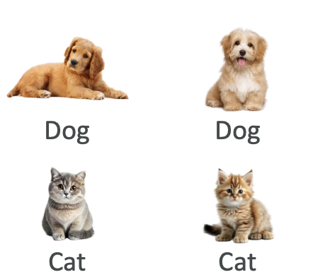
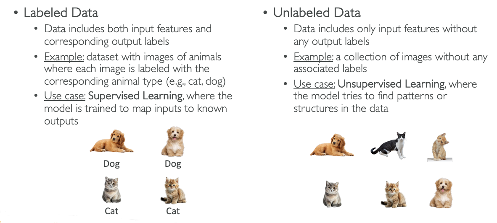

# Training Data

Now let's talk about training data in the context of machine learning. 

In machine learning, we need data to train our models, and on top of having data, we need **good data**. Good has to be defined, of course, but as a general effect, if you put bad data (called garbage) into your model, you're going to get garbage out of your model - meaning your model won't be good. 

Training data, cleaning the data, and making sure that it is good for your use case is one of, if not the most critical stage to build a good model.

There are several options to model data, and this will impact the type of algorithms you can use to train your models. We'll cover two main categorizations: 
1. labeled versus unlabeled data, and 
2. structured versus unstructured data.

## **Labeled vs Unlabeled Data**

### **Labeled Data**
Labeled data is data that has both input features and output labels.

**Example:** Here we have some images of animals, and each image is going to be labeled with the corresponding animal type. In the image we have dogs, and cats

In this, image is itself **input feature** and the **output label** corresponds to what the image is (i.e. **Cats** or **Dogs**)

**Key characteristics:**
- When we have labeled data, it enables **supervised learning**.
- The algorithm learns to map inputs to known outputs like:
  - We teach the algorithm that "this image should have a predicted value of dog, and we know it's a dog because we've labeled it"

### **Unlabeled Data**
Unlabeled data only includes input features without any output labels.

**Example:** A collection of images without any associated labels:
- We have images (say, four cats and two dogs)
- We don't tell the algorithm "this is a dog" or "this is a cat"
- The algorithm must figure out that there is such thing as a cat and such thing as a dog.

**Key characteristics:**
- Enables **unsupervised learning** when there are no labels
- It is more complicated than supervised learning
- The algorithm finds patterns between things or structures in the data and groups them together
- It is used when you have so much data that it's very costly or simply impossible to label everything. (It is when you have too much unlabelled data)

> This is why in the field of machine learning, we have algorithm for both of the use case of labeled and unlabeled data.

## **Structured vs Unstructured Data**

### **Structured Data**
Structured data is organized in a structured format, usually in rows and columns, just like in Microsoft Excel (called tabular data).

**Example 1: Customer Database**
- Columns: Customer_ID, Name, Age, Purchase_Amount
- Clear structure with rows and columns

**Example 2: Time Series Data**
- Data points collected or recorded at successive points in time
- Example: Stock price of a company over time
- Can be in tabular format or simply two columns (Date and Stock Price)

**Key characteristics:**
- Very easy to read and structure
- Multiple formats available beyond just tabular and time series

### **Unstructured Data**
Unstructured data doesn't follow a specific structure and is usually text-heavy or multimedia content.

**Example 1: Text Data**
- Articles online
- Social media posts  
- Customer reviews
- Example: "The instructor was excellent, the facility was well maintained..." - just a long text with no structure except being text

**Example 2: Image Data**
- Just pixels with no organized structure beyond the pixel data itself

**Key characteristics:**
- No specific organizational structure
- Still considered good data
- Requires specific types of algorithms to handle unstructured data

## **Summary**

Now we've learned about labeled and unlabeled data, the necessity of having good data for ML algorithms, and discussed structured and unstructured data. These concepts form the foundation for understanding how different types of data require different algorithmic approaches in machine learning.