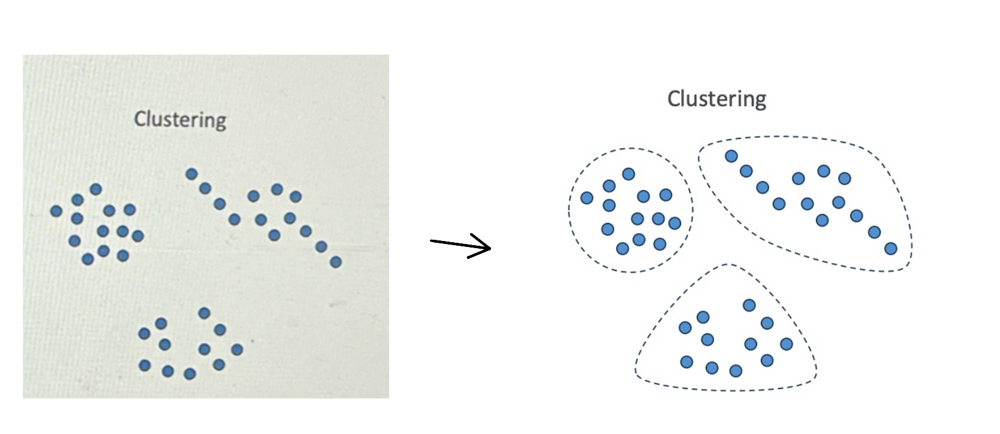
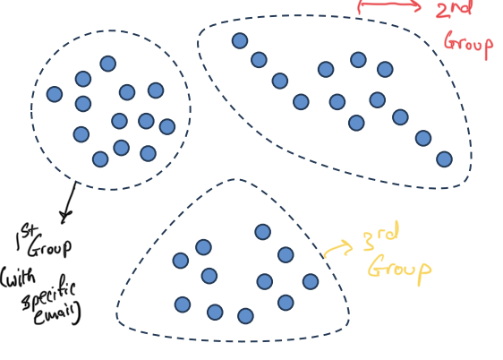
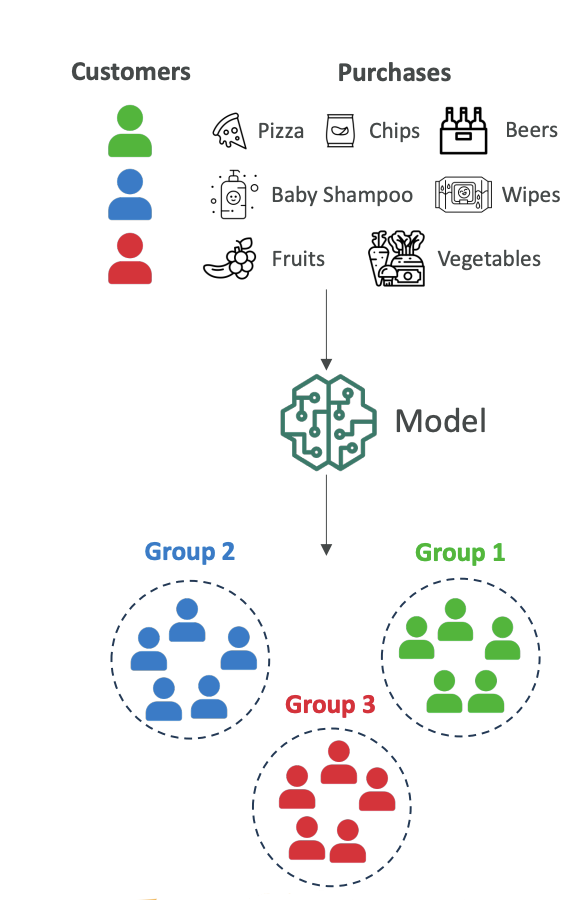
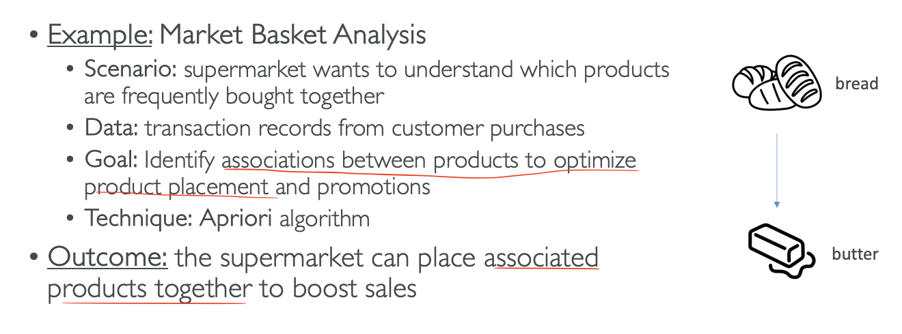
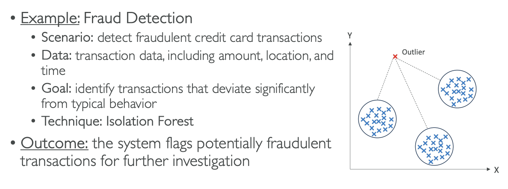
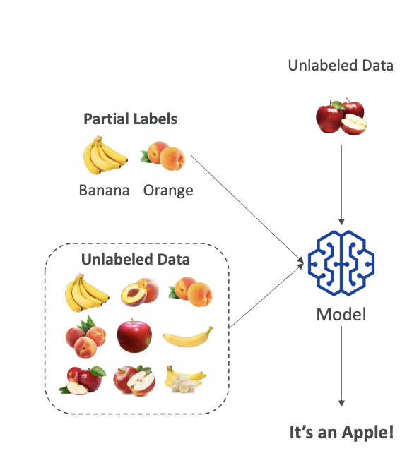

# Unsupervised Learning

Now let's talk about unsupervised learning. This is machine learning algorithms made on data that is **unlabeled**. Here data is unlabeled, but we're trying to discover **inherent patterns**, **structures**, or **relationships** within the input data. The machine learning algorithm will create the groups itself, and us as humans have to interpret what these groups may mean.

## **Techniques for Unsupervised Learning**

There are several techniques for unsupervised learning such as:
- **Clustering**
- **Association rule learning** 
- **Anomaly detection**

*Note: You don't need to know these from an exam perspective - this is just to give you knowledge and help you understand what unsupervised learning means.*

### **Clustering**

Clustering is about grouping data points because they look similar. 

For example, say we have data points and we plot them on two axes, and it looks like they can be grouped into three categories.

- Cluseting use cases are:
  - Customer Segmentation
  - Targeted Marketing
  - Recommender Systems

**Customer Segmentation Example:**
- Imagine every dot is a customer
- It looks like we have three distinct groups of customers
- We can create groups and we can do targeted marketing - send specific emails to each group. 

- We can determine what to recommend to each group

**Purchasing Behavior Scenario:**
*Give Scenario*: The scenario is that you have all your customers and you want to understand the different purchasing behaviors.

*Solution* 
At a high level, the model will look at all customer purchase history and identify groups based on purchasing behavior:

1. **Group 1:** Customers who buy pizza, chips, and beer (possibly students)
2. **Group 2:** Customers who buy baby shampoo and baby wipes (possibly new parents)  
3. **Group 3:** Customers who buy fruits and vegetables (possibly vegetarians)

The model plots all these customers and figures out there are three groups (1, 2, and 3). It's up to us to name what each group may be.

**Why do we do this?**
Now that we have three groups, we can send them different marketing campaigns and use different marketing strategies based on what they're likely to purchase next.

### **Association Rule Learning (Market Basket Analysis)**

Here we want to understand which products are frequently bought together in a supermarket (**Given Scenarios**). 

We look at all the purchases and try to identify if there are associations between some products in order to place them better in our supermarkets or to run promotions together. 

This is also known as **Market Basket Analysis** and for this, we will use the technique called **Apriori Algorithm**

**The Apriori Algorithm:**
For example, we can figure out that when someone buys bread, they most likely also want to buy butter. So maybe it's a great idea to put bread and butter together in the supermarkets.

**Outcome:** The supermarket knows which products can be sold together and can place them next to each other in order to boost sales.

### **Anomaly Detection (Fraud Detection)**

We can use unsupervised learning to detect fraudulent credit card transactions. We have transaction data including amount, location, and time, and we want to see which transactions are very different from typical behavior. 

The technique over here we will use is **Isolation Forest**

**The Isolation Forest Technique:**
Here we have three groups of very normal transactions, but then there is something that looks very different from everything else we've seen - it's called an outlier. With this technique, we can flag the system to review this transaction to see if it's potentially fraudulent, and then do further investigation.

**Outcome:** If it is fraud, we can label it as fraud, which will help our algorithm later on to identify fraud in a much easier way.

**In Summary**:

## **Feature Engineering**

Unsupervised learning is great on unlabeled data, but feature engineering can still help because we can have more features in our input datasets and therefore get better quality algorithms.

---

# Semi-Supervised Learning

We've seen unsupervised, we've seen supervised, and there is something in between called semi-supervised learning.

**The Concept:**
- We have a small amount of labeled data
- We have a large amount of unlabeled data
- This is very realistic because labeling data can be expensive

## **The Process:**

1. **Train on labeled data:** We train our model on the labels we have
2. **Pseudo-labeling:** We use the model to label the unlabeled data and this is called **Pseudo Labeling**
3. **Retrain:** Once everything is labeled, we retrain the entire model on the whole dataset
4. **Result:** Now everything is labeled, so next time when we run our algorithm and unlabeled data comes in, the model can reply "It's an Apple!"

Semi-supervised learning is mixing **labels** to <mark>create labels</mark> on **unlabeled data** and then <mark>retraining the model</mark> to have a full supervised learning model.