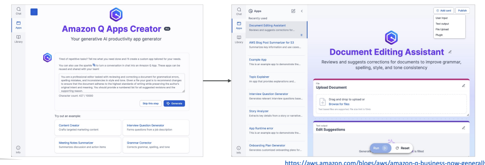

# Amazon Q Apps

Now let's talk about Amazon Q Apps. 
Q Apps are <u>part of Q Business</u>, and the idea is that you can create **Gen AI-powered apps** <u>without coding</u> by only using natural language.

## **Amazon Q Apps Creator**

We have a web UI called **Amazon Q Apps Creator**. 

In this interface, you can specify a <u>prompt to describe the type of app you want</u> to have. Again, this app is going to be based on your **company data**.

## **How It Works**

You're going to say, `"Hey, I want to do this kind of app,"` and automatically, Amazon Q App is going to generate for you a web application where we can:

- Upload a document
- Upload prompts  
- Enable users to interact with the app

## **Key Benefits**

This really makes it super easy for anyone in your company to create an app based on:

1. Your **company's internal data**
2. Leveraging **plugins**

The core concept is that anyone can create a very quick app **without using developers**, and that's the idea behind Amazon Q Apps.