# Amazon Q Business - Hands On

This guide walks through the process of creating a generative AI application using Amazon Q Business. We will build an application that uses an **internal knowledge base**, connecting it to a <u>data source in an S3 bucket</u>. You will learn 

1. how to create the application, 

2. configure an index, sync data, and 

3. test the AI chat experience to get answers based solely on your provided documents.

**WARNING: Pricing and Anonymous Access**

The instructor provides a critical warning about the cost associated with the "anonymous access" method used in this demonstration.

- **High Cost:** Using anonymous access for Amazon Q Business has a consumption pricing of **$200 per month**, and you are charged right away.
  
  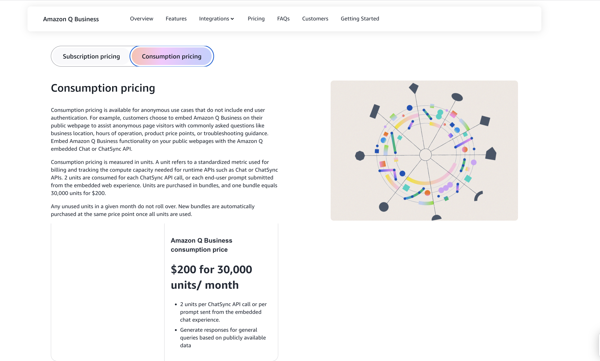

- **Instructor's Recommendation:** The instructor strongly advises **NOT to follow along with the hands-on steps** unless you are prepared to pay this fee. Watching the video is sufficient to understand the capabilities of Amazon Q Business without incurring the cost.

- **Alternative (Not Covered):** To be charged less, you would need to use <u>Amazon Q Business Light</u> or <u>Q Business Pro</u>, which involves a more complex user access setup not covered in this simple demonstration.

- **Why Anonymous Access is Used Here:** The "anonymous access" method is chosen for this tutorial to keep the setup simple and focus on the core functionality, but it is not recommended for production or for learners trying to avoid costs.

### **1. Create the Amazon Q Business Application**

First, we will navigate to the Amazon Q Business service and create our application.

1. In the AWS Console, click on "Amazon Q Business" and then "Get started."
   
   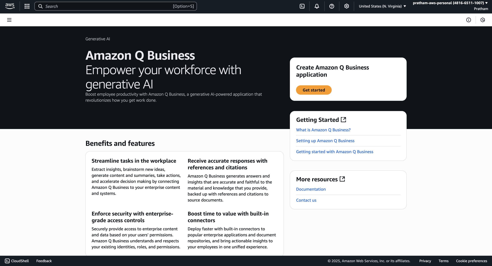

2. You may see a warning about your selected region. You need to choose a supported region. For example, Frankfurt may not work, so you might need to choose a different one, like Ireland (eu-west-1).
   
   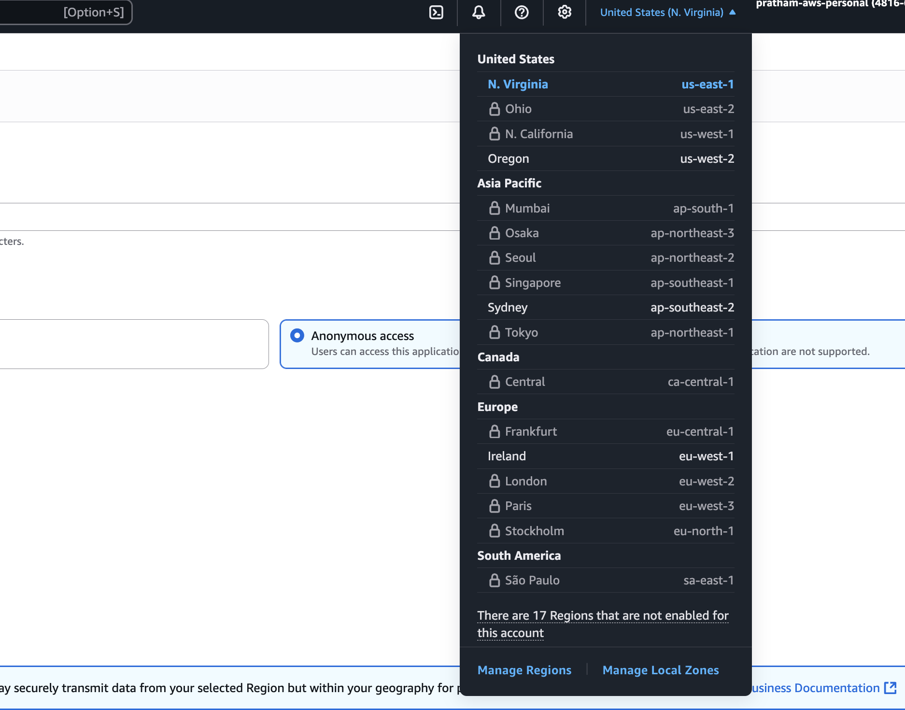

3. Now, let's create the application. Click the button to create an application.
   
   - **Application Name:** `Q Business Demo`
   
   - User Access: Select "anonymous access." The instructor explains: Obviously, this is not good for production access, but for a demo, this is perfect. It removes a lot of the setup around users.
     
     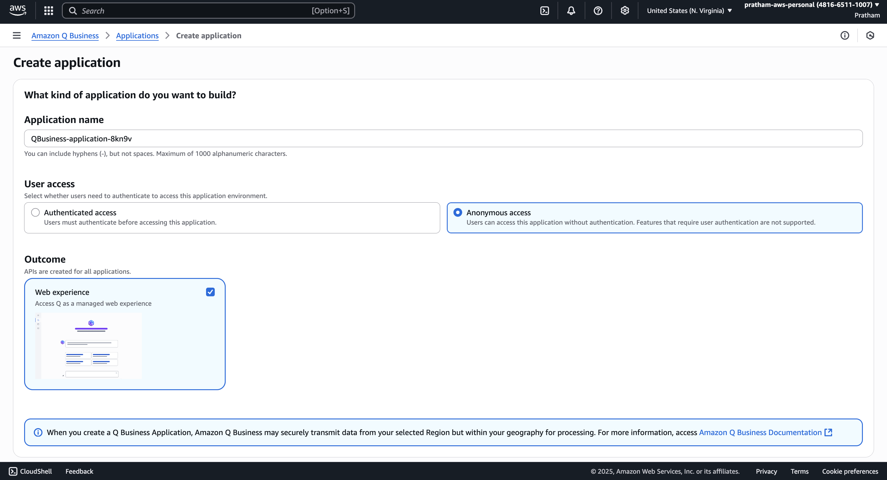

4. Click "Create application." Your application will now be created.
   
   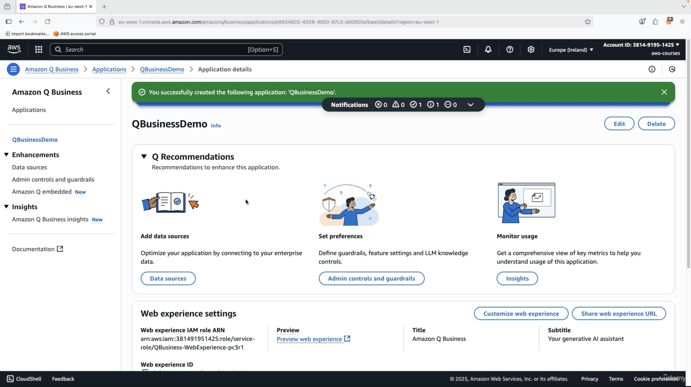

### **2. Preview the Web Experience (Initial Test)**

With the application created, we can preview the chat interface. It won't work yet, which is expected.

1. Once the application is ready, click on `"Preview the web experience."` This will open the Q Business chat interface.
   
   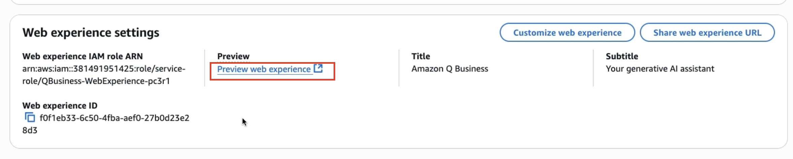

2. You will see a chat interface in "guest mode." Let's ask it a question to see what happens. In the chat box, type: `What is the World Wide Web?`

3. The application will respond with a message indicating it cannot answer. As the instructor notes, it will say something like, "Well, please ask your IT admin to add data sources." This is because we haven't connected any knowledge base yet.
   
   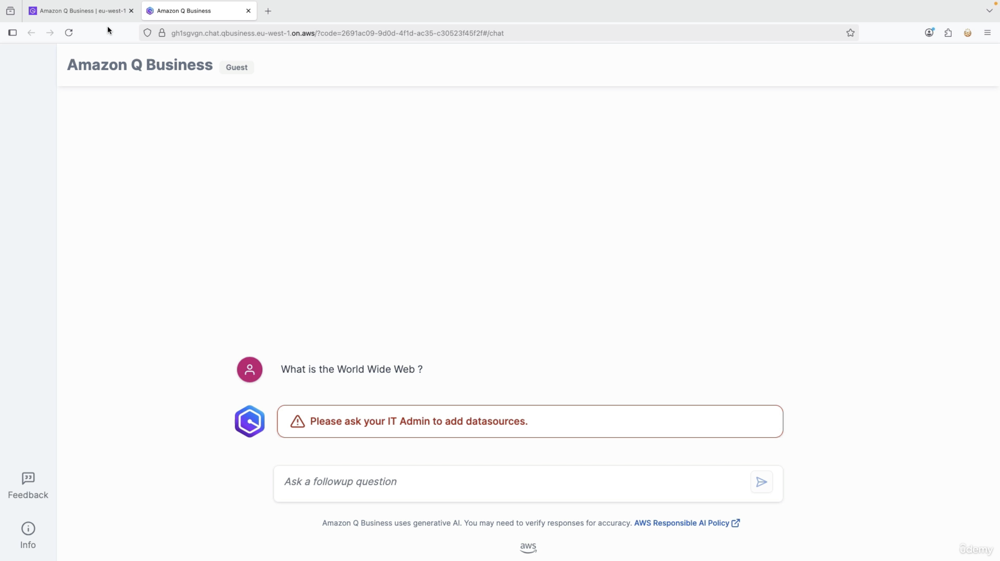

### **3. Add an Index and Data Source**

Amazon Q needs an index to store and search through your data. We'll create a small index and then connect our data source to it.

1. In the application's left-hand navigation pane, click on "Data sources." You will see a message stating, "No index has been added to this application."
   
   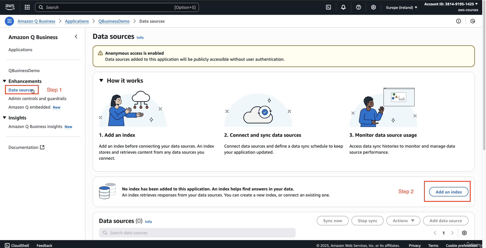

2. Click "Add an index."
   
   - **Index Type:** We'll use the "starter" type of index, which the instructor explains is *good for proof of concept, development, and testing.*
   
   - Number of Units: This setting determines how many documents can be stored. We will choose `1`, which is the lowest amount. The instructor clarifies this means 20,000 documents or 200 megabytes, whichever comes first, which is enough.
     
     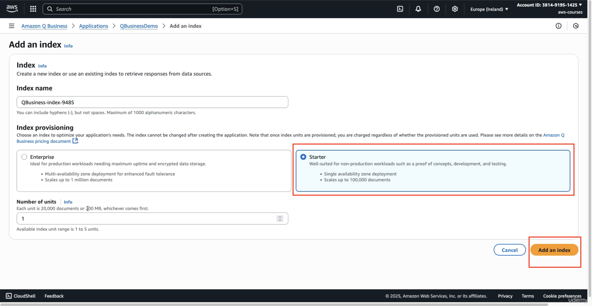

3. Click "Create index."
   
   - **Note:** The instructor mentions that creating the index can take approximately 20 minutes to complete.

### **4. Configure the S3 Data Source**

Now that the index is being created, we can configure our **data source**. We will use an **Amazon S3 bucket** to hold our knowledge base document.

1. On the Data sources page, click "Add data source."
   
   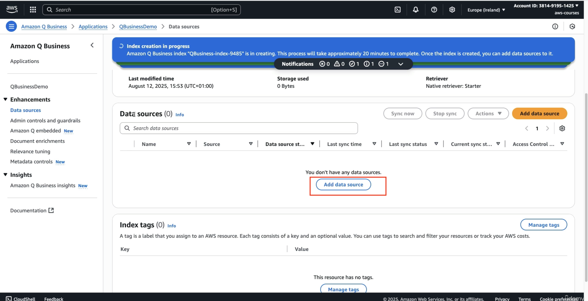

2. You will see a list of different connectors. This is where Amazon Q Business can get its knowledge from. The instructor points out many options like Asana, Box, GitHub, SharePoint, and Google Drive, explaining that *a lot of where the information lives in your enterprise can be used actually to be a source of information for Amazon Q Business.*

3. We will keep it simple and use "Amazon S3." Click on the Amazon S3 connector.
   
   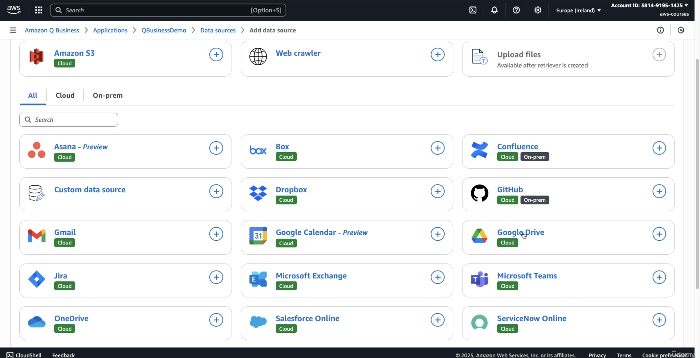
   
   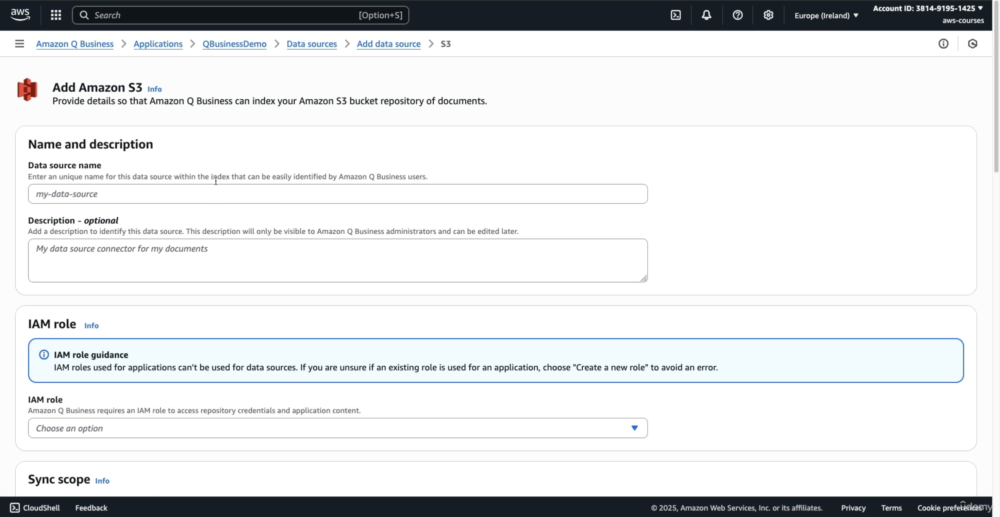

4. **Create and Prepare the S3 Bucket:**
   
   - We need an S3 bucket to store our file. Navigate to the Amazon S3 service in a new tab.
   
   - Click "Create bucket." Name it something unique, ensuring it's in the **same region** as your Q Business application (e.g., `q-business-demo-bucket-eu-west-1`).
   
   - Create the bucket with the default settings.
   
   - Next, upload your knowledge base file to the bucket. For this demo, the instructor uses a PDF file named Evolution of the Internet Detailed.pdf. Download this file and then upload it to your newly created S3 bucket.
     
     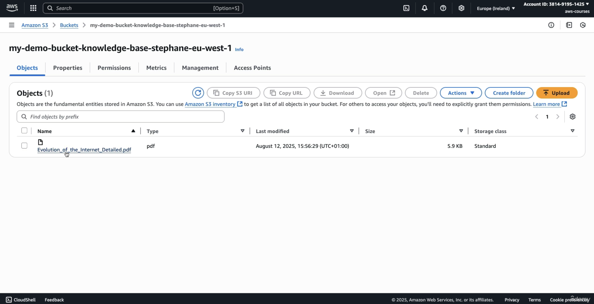

5. **Configure the Data Source in Amazon Q:**
   
   - Return to the Amazon Q "Add data source" page.
   
   - **Data source name:** `My S3 Knowledge Base`
   
   - **IAM role:** Select "Create a new service role (recommended)." It will be automatically configured.
   
   - **Sync scope:** Click "Browse S3" and select the bucket you just created.
     
     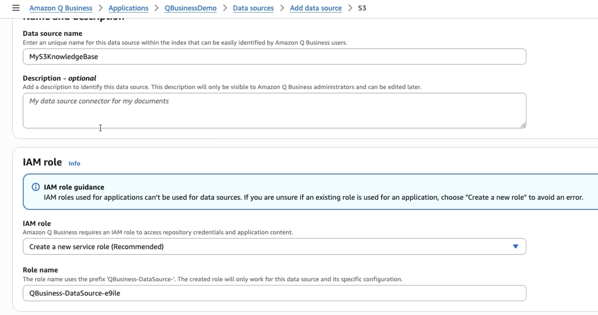
     
     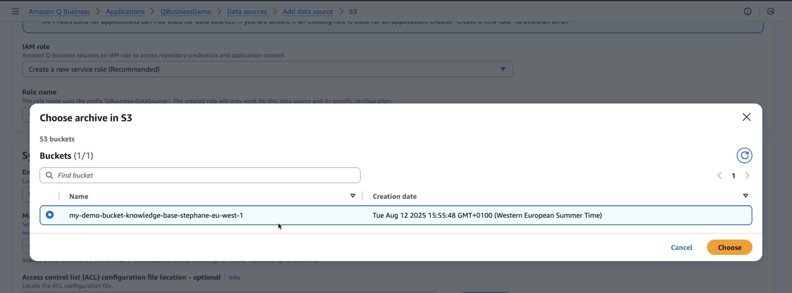
     
     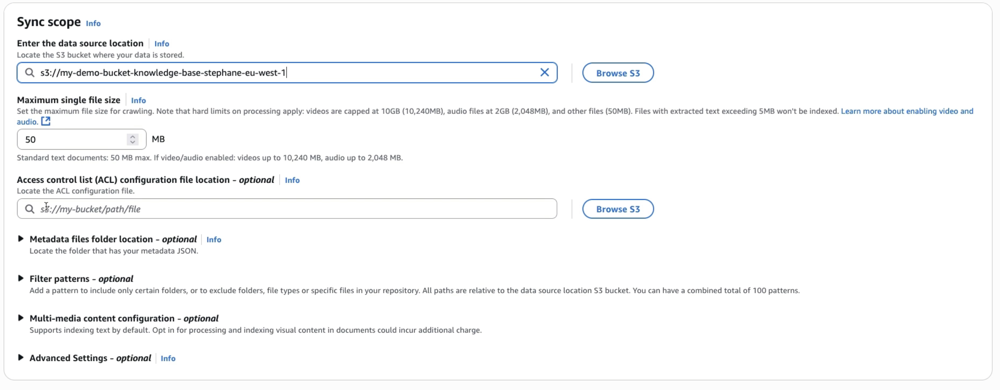
   
   - **Sync mode:** Select "Full sync."
   
   - Schedule: For the demo, select "On demand." The instructor explains: This is just so we can have a sync now button and get started. But obviously, in production, you may want to have only a sync for new, modified, or deleted content, and you may want to have it, for example, run on an hourly basis.
     
     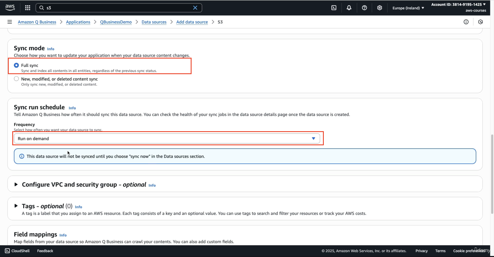

6. Click "Add data source."
   
   - **Note:** A popup will appear warning that because anonymous access is enabled, the S3 data will be publicly accessible. This is acceptable for the demo but is not a secure production setup.
     
     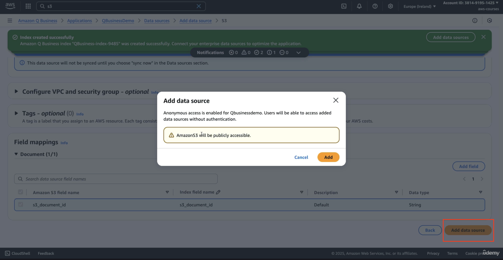

### **5. Sync and Test the Application**

With the data source connected, we need to sync the data from the S3 bucket into our index.

1. After the data source is created, you will see it listed. Click the "Sync now" button to start the process.
   
   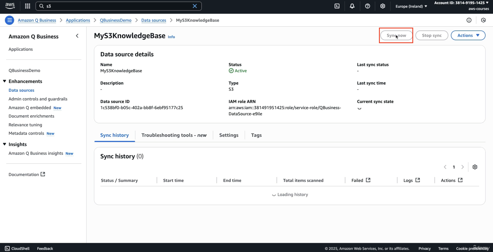

2. The instructor notes that the sync process can take a few minutes to a few hours, but should be fast since we only have one document. Wait for the sync status to show as "Succeeded." You should see that 1 item was scanned and indexed.
   
   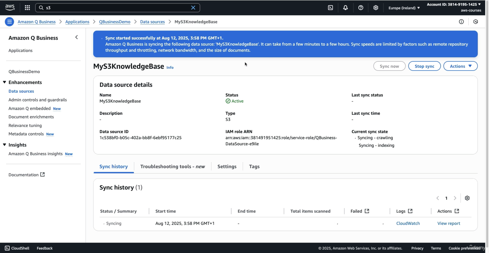
   
   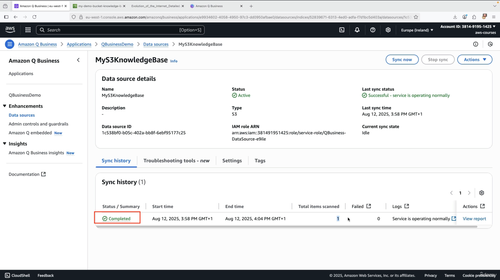

3. Key Takeaway: Test the Knowledge Base
   
   Now we can test if Amazon Q can use our document to answer questions.
   
   - Go back to the "Preview the web experience" tab.
   
   - Ask the same question as before: `What is the World Wide Web?`

4. This time, you should get a detailed answer based on the content of the PDF. The instructor highlights the key features of the response:
   
   - The answer is accurate according to the document (e.g., invented by Tim Berners-Lee in 1989).
   
   - **Sources:** The response includes a "Sources" section that links directly to the PDF document in your S3 bucket, and even to the specific passage where the information was found. This is a very powerful feature.
   
   - Events: There is also an "Events" tab that shows what happened during the query.
     
     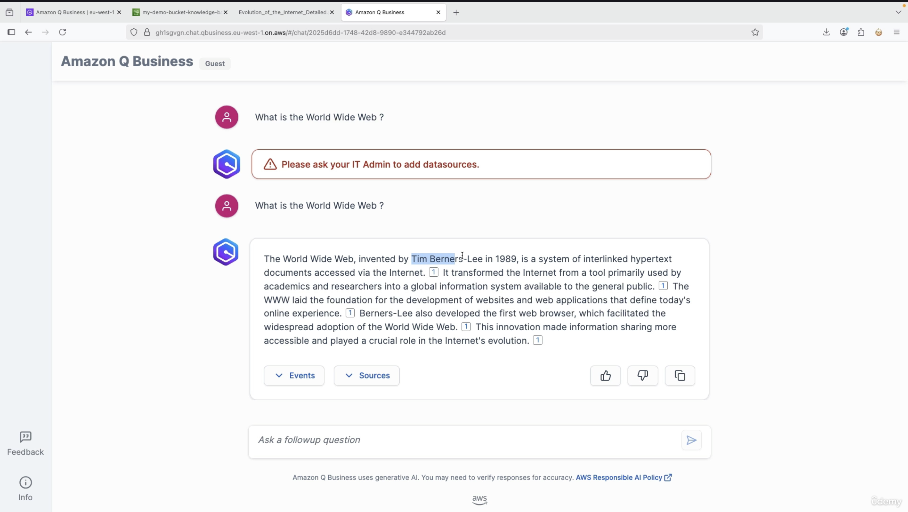
     
     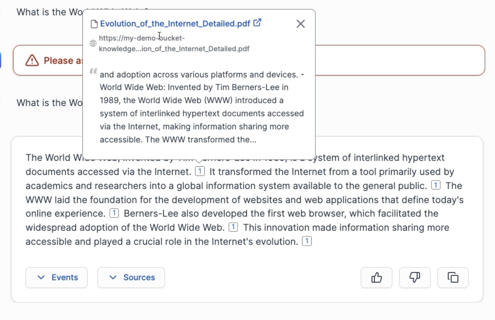
     
     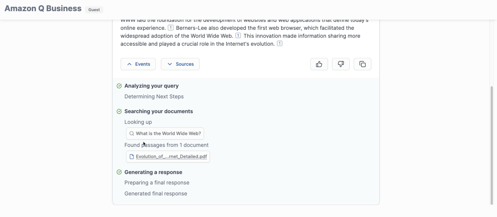

5. Test the Guardrails:
   
   To confirm that Q is only using your knowledge base, ask an unrelated question like, Give me a recipe for chili?
   
   - The expected response is, *"I have found no answer based on your knowledge base."* This demonstrates that the system is correctly restricting itself to the provided data sources.
   
   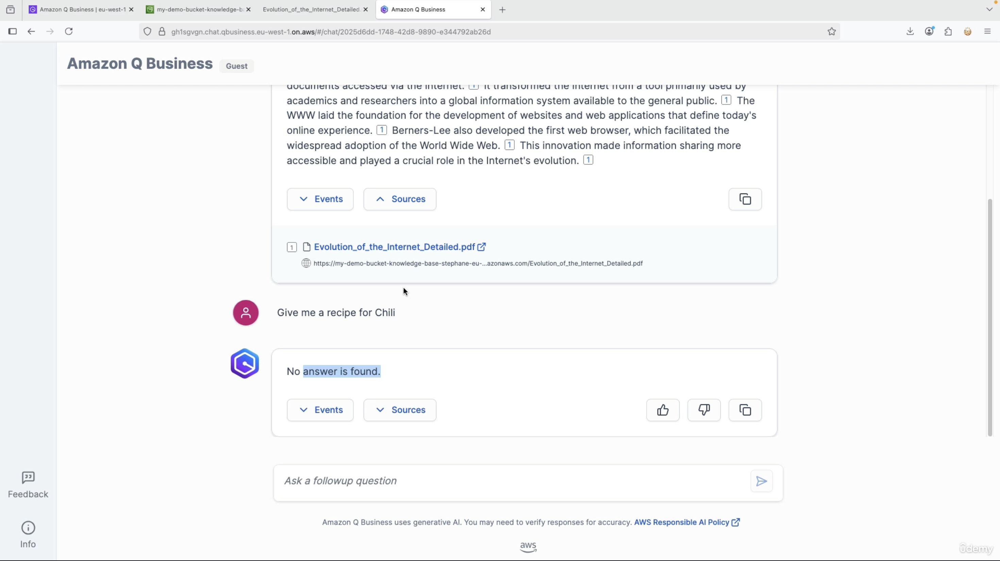

### **6. Admin Controls and Final Cleanup**

The instructor briefly mentions that you can change the behavior to allow the model to use its general knowledge if no answer is found in your documents.

- **Admin Controls and Guardrails:** In this section, there is an option to `"fall back to LLM knowledge."` If this were **turned on**, Q could answer the chili recipe question. However, for internal knowledge bases, you often want this turned off to ensure answers are only based on your **company's data**.

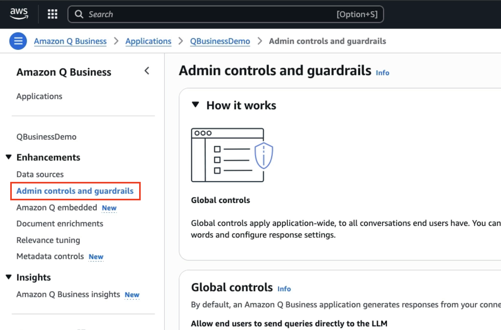

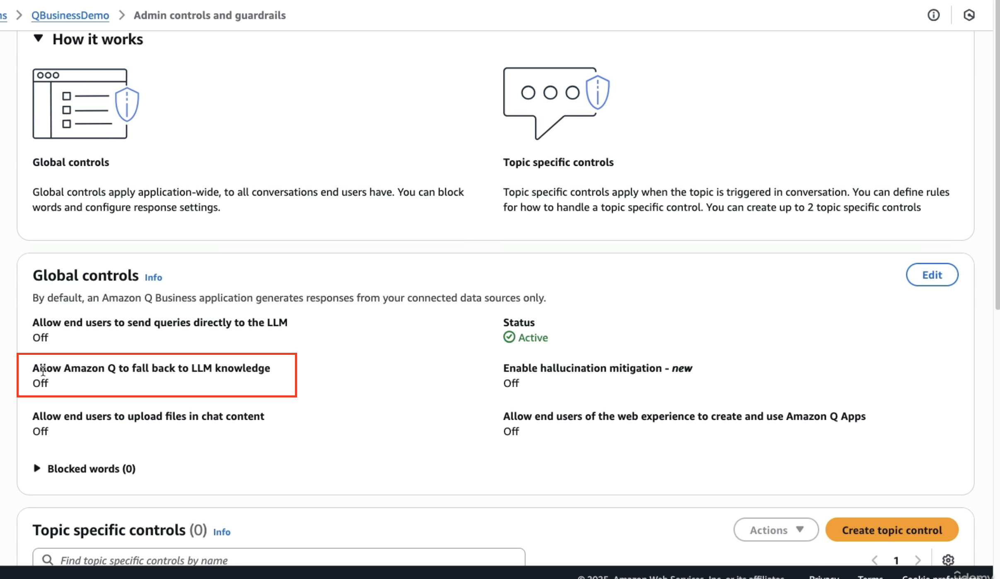

**IMPORTANT: Delete Your Application**

To avoid ongoing charges, you must delete the resources you created.

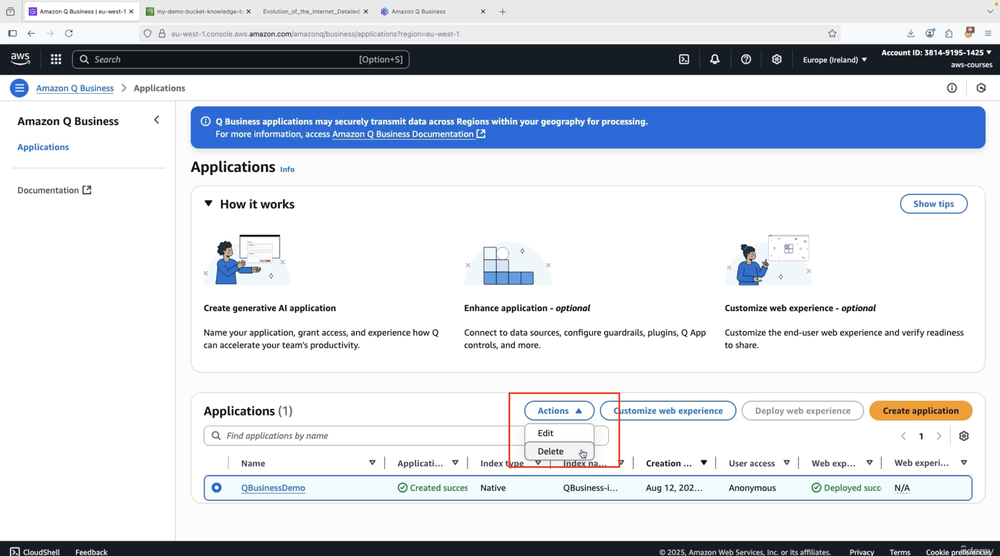

- The instructor's final advice is: **"Don't forget actually to delete your application because there is an ongoing cost to having an index."**

- Navigate back to your Amazon Q Business application dashboard, select the application, and delete it to stop all associated costs.
