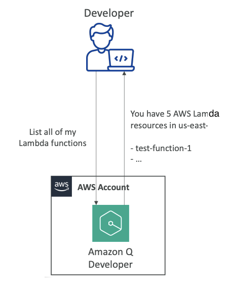
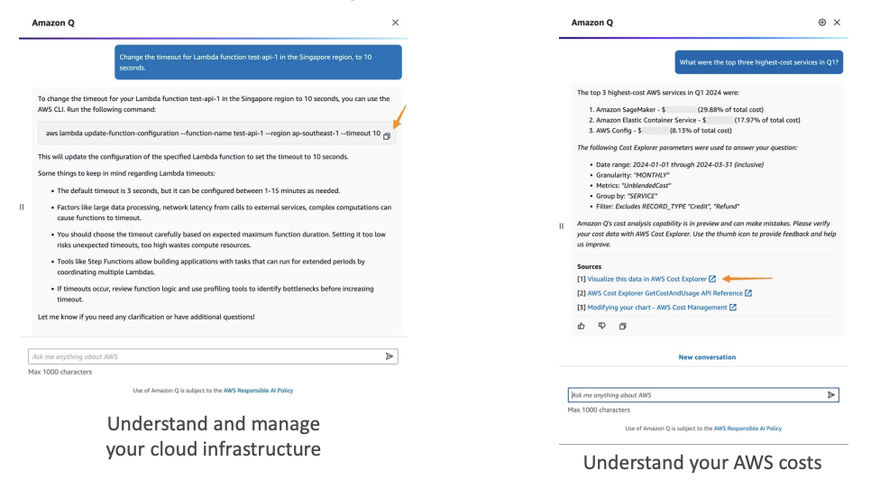
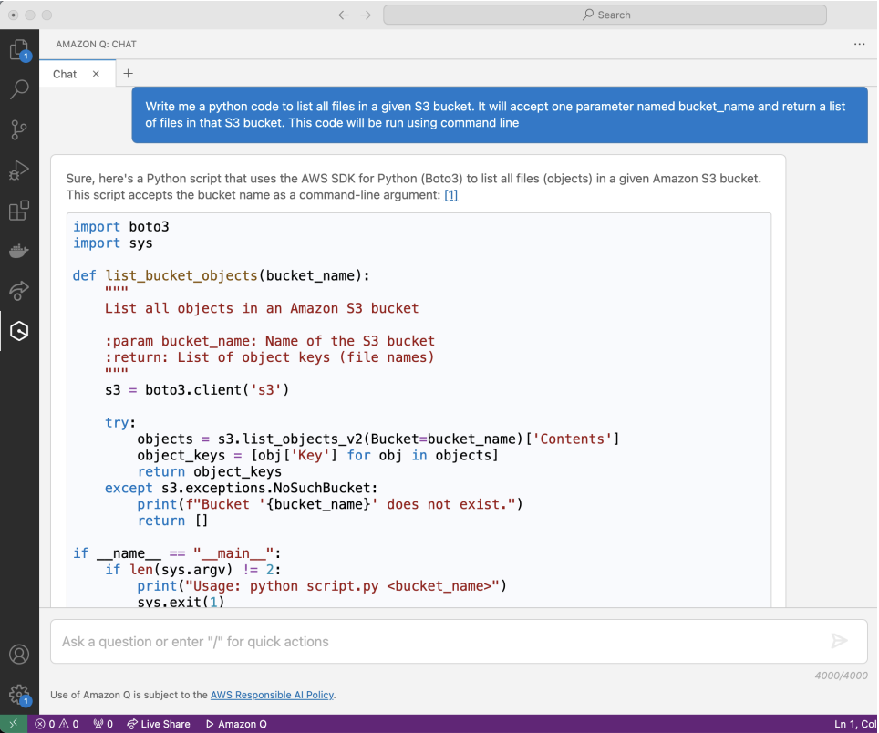

<h1>
  Amazon Q Developer
  
</h1>

Now, let's talk about Amazon Q Developer. 

**Amazon Q Developer** is a service that has two sides, offering different capabilities for AWS developers and users.
1. Answering questions about AWS Documentation
2. Co-pilot (**AI Code Companion** like Github Copilot)

## 1. **AWS Account Management and Documentation**

- The first side is about **answering questions about AWS documentation** and helping you <u>select the right AWS service</u>. 

- It can also answer questions about the **resources in your AWS accounts**.

  

    <ul>
    <li><strong>For example</strong>, as developers we can say, `"Hey, list all of my Lambda functions."` </li>
    <li><strong>Lambda</strong> is a service in AWS, and we may have created many Lambda functions, but we don't know what they are or where they are.</li>
    <li><strong>Amazon Q Developer</strong> will respond, `"Yes, you have five AWS Lambda resources in the region us-east-1 and here are the names of them."`</li>
    </ul>
  

  

This is pretty cool because now we can talk to our **AWS accounts** using <u>natural language</u>.

### Key Capabilities:
- **CLI Command Suggestions**: It can <u>suggest</u> **Command Line Interface commands** to run and make changes to your accounts
- **AWS Bill Analysis**: It can analyze your AWS bill
- **Error Resolution**: It can resolve errors and do troubleshooting
- **Continuous Improvement**: It's going to become more and more powerful over time

### Examples in Action:

**Example 1 - Lambda Function Management:**
- When we ask Amazon Q: `"Change the timeout of a Lambda function Test API1 in the Singapore region to 10 seconds."`

- Right now Amazon Q cannot do this for us directly, but what it can do is **set up a command for us**. 
- It will <u>create the command</u>, and then we can run this command to actually change the timeout. 
- This is pretty cool because this is a step that we don't have to figure out - the command is going to be perfectly executed when we run it.

**Example 2 - Cost Analysis:**
- We can ask Amazon Q: `"What were the top three highest cost services in Q1 from my accounts?"`
 (look at the image above!)

- It will automatically respond with something like: `"Well, you had Amazon SageMaker, you had Amazon Elastic Container Service and AWS Config"` and give us a **cost analysis**. 
- This is pretty cool because this **type of data analysis** would maybe <u>take us a little bit of time</u>, but Amazon Q is doing it for us by **using the data from our own AWS accounts**.

## 2. **AI Code Companion**

The other side of Amazon Q Developer is an **AI code companion** - very different from the first side. 

- The idea is that you can code **new applications similarly to GitHub Copilot**, and it's specialized of course for <u>AWS-based development</u>. (V.V Imp)

### Code Generation Example:
We can say: `"Write me Python code to list all the files in a given Amazon S3 bucket. It will accept one parameter named bucket_name and return a list of files in that S3 bucket."`

Amazon Q Developer will then generate **Python code** that fits this purpose.

### Language Support:
Amazon Q Developer supports many languages:
- Java
- JavaScript  
- Python
- TypeScript
- C#

It's going to add more languages over time in terms of support.

### Additional Features:
On top of it, it can give you:
- **Real-time Code Suggestions**: Provides suggestions while you code in your code editor
- **Security Scanning**: Scans your code for security vulnerabilities
- **Software Agent**: There's even a software agent from Amazon Q that can:
  - Implement features
  - Generate documentation in your code
  - Bootstrap new projects (creating the base files for new projects to get started)

### IDE Integration:
The AI Code Assistant works with several IDEs (Integrated Development Environments - software used to create code):
- **Visual Studio Code**
- **Visual Studio**
- **JetBrains**

### Development Capabilities:
With the help of **IDE Integration**, the AI Code Assistant can:
- Answer questions about AWS development
- Code completion and code generation
- Scan code for security vulnerabilities
- Debugging optimizations and improvements
(**SAME THING IS WRITTEN AS IN ADDITIONAL FEATURES** look above--> Code suggestions, security scanning, software agent)

The idea is that using Amazon Q Developer, you can really <u>enhance the way you write code</u>. This is a very popular thing right now in the AI space - getting a code companion. You have **GitHub Copilot**, which is the most popular one, but we also have **Amazon Q Developer**, which is very helpful when you want to do specialized things on AWS.