# Amazon Q Developer - Hands On

This guide walks through using Amazon Q, the generative AI assistant integrated into the AWS Management Console. We will explore 

1. how to interact with Amazon Q to query information about our AWS resources, 

2. Generate AWS CLI commands to manage those resources, and 

3. Execute those commands using AWS CloudShell. 

This demonstrates how Amazon Q can serve as an assistant that is customized and aware of the resources within your AWS account.

### Prerequisites

- An AWS account with at least one S3 bucket already created.

- IAM Identity Center is connected to Amazon Q.

### Understanding Amazon Q Offerings

Before diving in, it's important to distinguish between the different Amazon Q services.

- **Amazon Q Developer**: This is the AI coding assistant designed to help build applications faster and solve software development problems. It has a free tier and a pro tier (around $20 per user per month) which offers advanced features and higher limits. For exam purposes, it's important to know this is the coding assistant.
  
  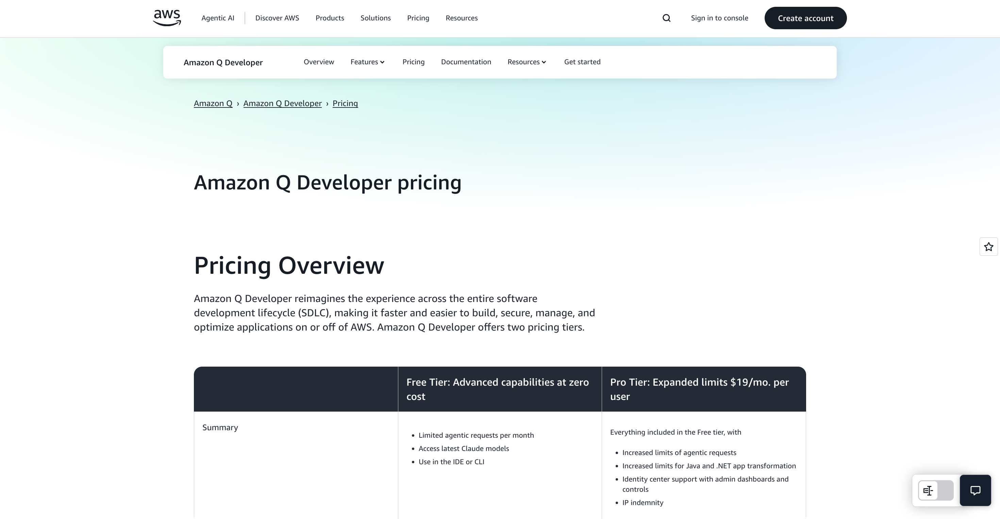

- **Amazon Q for AWS (in the console)**: This is the **generative AI assistant** integrated directly into the <u>AWS console</u> that helps you manage your infrastructure. It can be accessed <u>via a button</u> in the console and is aware of the resources in your account. This is the version we will be using.
  
  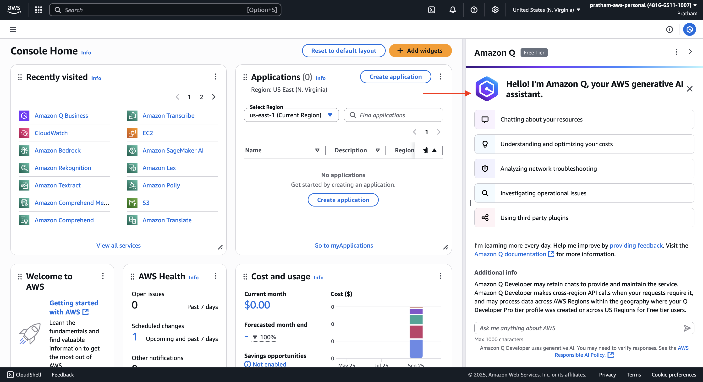

### **Part 1: Interacting with Amazon Q in the AWS Console**

Here, we will open the Amazon Q assistant and use it to get information about existing resources in our account.

1. Launch the Amazon Q Assistant
   
   In the AWS Management Console, locate and click the "Amazon Q" button, typically found on the right-hand side of the screen.
   
   - **Instructor's Explanation**: The first time you open it, Amazon Q will present a welcome message stating, `"Hello, I'm Amazon Q, and I'm your AWS generative assistant."` It will also ask for permission to access cross-region data, which is quite important for it to function effectively across your entire account.

2. Grant Permissions and Start a Conversation
   
   Click "Yes, please continue" to allow cross-region data access. The Amazon Q chat pane will open, ready for conversation. It provides some suggested prompts to get started.

3. Click on the suggested prompt, `"list my S3 buckets."` Amazon Q will process the request by looking into your account for S3 resources.
   
   - **Instructor's Explanation**: It's very nice because now we are starting to have a gen AI assistant that is customized and knows what is going on in your AWS accounts. Over time it's going to be more and more developed and more and more featured.

Amazon Q will return a list of your S3 buckets. In this case, it finds the one pre-existing bucket. You can click on the bucket name in the chat response to navigate directly to it in the S3 console.

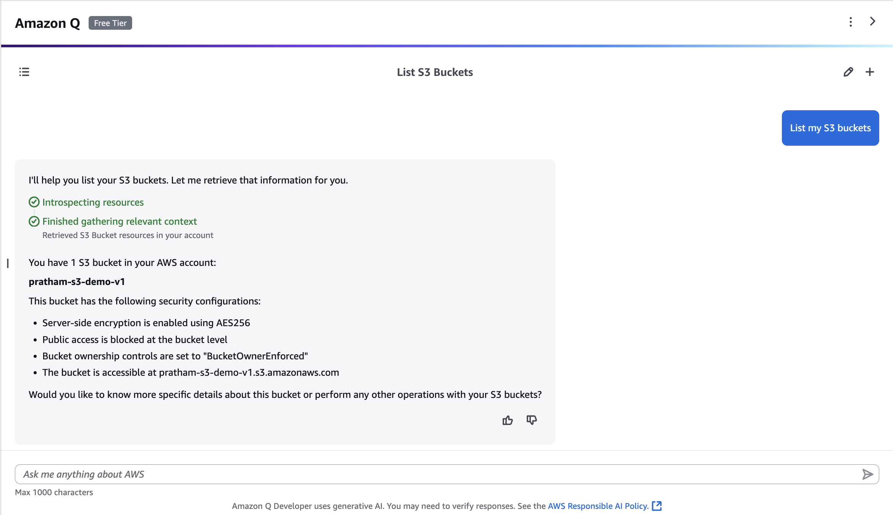

### **Part 2: Generating and Executing CLI Commands**

Next, we will ask Amazon Q to generate a command line interface (CLI) command to create a new S3 bucket and then execute it using AWS CloudShell.

1. Ask Amazon Q to Generate a CLI Command
   
   In the Amazon Q chat prompt, type the following request:
   
   `Please send me the CLI code to create an S3 bucket in the us-east-1 region with the name pratham-demo-amazon-q`.
   
   - **Instructor's Explanation**: Before, we saw how to create an S3 bucket by going into the "Buckets" section and clicking "Create bucket." Now, I want to show you another way using the CLI, or command line interface.

  Amazon Q will generate the appropriate AWS CLI command to perform this action.

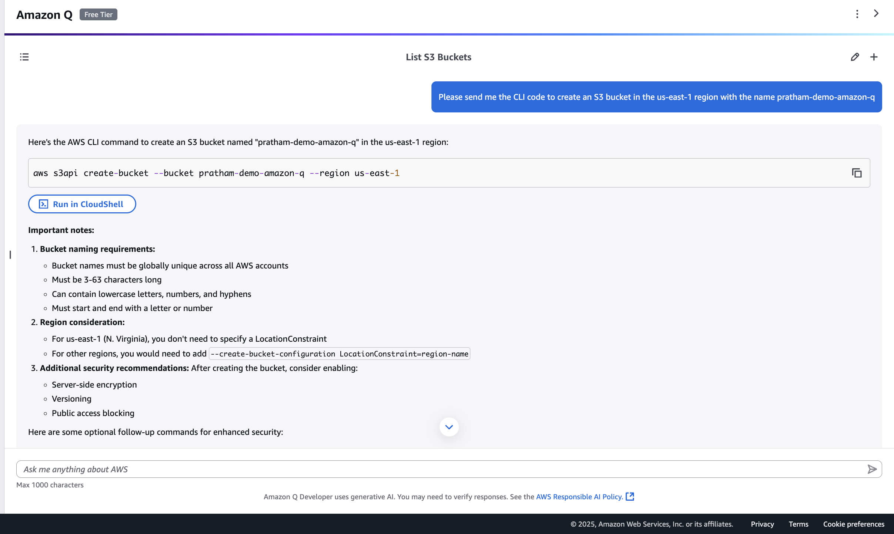

```bash
aws s3api create-bucket --bucket pratham-demo-amazon-q --region us-east-1
```

2. Open AWS CloudShell
   
   In the top navigation bar of the AWS console, click the "CloudShell" icon.
   
   - Note: The first time you open CloudShell, it can take a little bit of time to create the environment and get ready.
     
     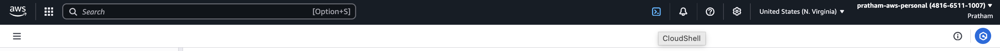
     
     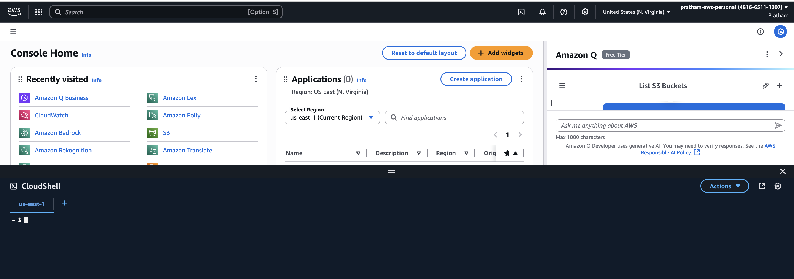

3. Execute the CLI Command
   
   Once the CloudShell terminal is ready, copy the command generated by Amazon Q, paste it into the CloudShell prompt, and press Enter.
   
   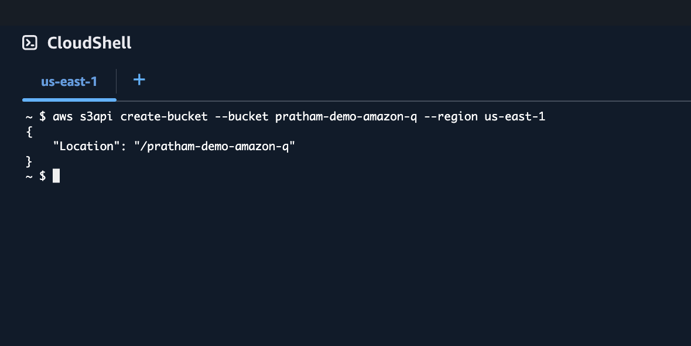
   
   If successful, the command will execute and the new S3 bucket will be created.

### **Part 3: Verification and Resource Cleanup**

Finally, we will verify that our new bucket was created and then ask Amazon Q to help us clean it up.

1. Verify the Bucket Creation
   
   We have two ways to verify the bucket was created:
   
   - **Option A** (Using Amazon Q): Go back to the Amazon Q chat pane and ask it again: list my S3 bucket again. It should now find and list two S3 buckets.
     
     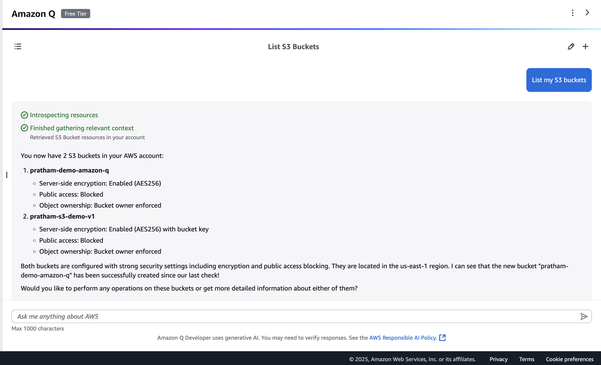
   
   - **Option B (Using the S3 Console)**: Navigate to the Amazon S3 service in the console. You will see that the `stefane-demo-amazon-q` bucket has been created.
     
     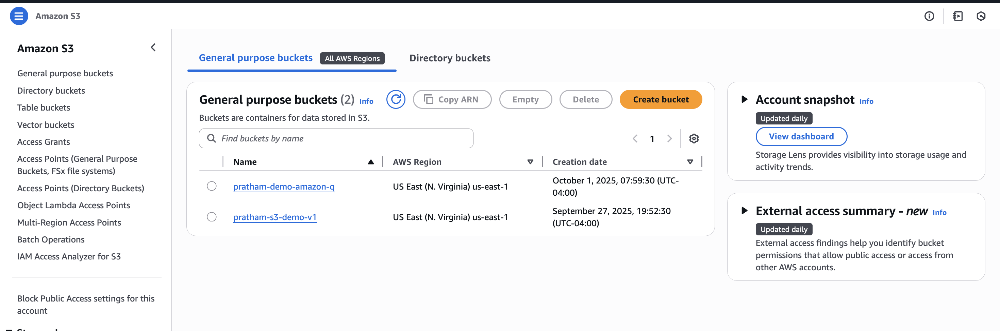
   
   - **Key Learning**: This demonstrates the real-time awareness of Amazon Q. Using its gen AI capabilities, it found that we now have two buckets in our account immediately after the CLI command was run.

2. Generate a Command to Delete the S3 Bucket
   
   Let's ask Amazon Q to generate the command to delete the bucket we just created.
   
   - **First Attempt**: Let's try asking: `suggest a command to delete the S3 bucket.`  And then we give the name again right here.

Amazon Q should successfully generate the delete command.

```shell
aws s3api delete-bucket --bucket pratham-demo-amazon-q
```

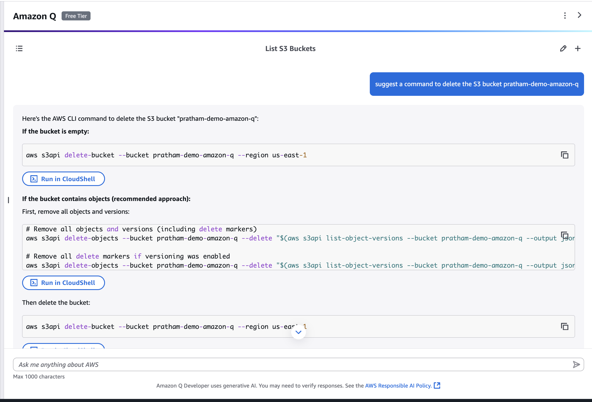

- **Key Takeaway**: Amazon Q currently has the capability to list things and generate commands. Its capabilities, including potentially performing actions like creating or deleting directly, will likely improve over time.
3. Execute the Delete Command
   
   Copy the delete-bucket command, paste it into your open CloudShell session, and press Enter. The bucket will be removed.
   
   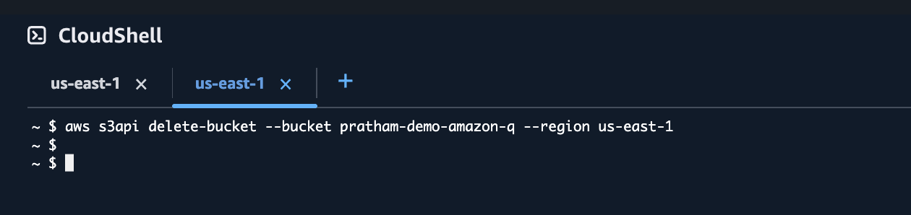

4. Verify the Deletion
   
   Go to the Amazon S3 console page and refresh your browser. You will now see only the original single bucket remains.
   
   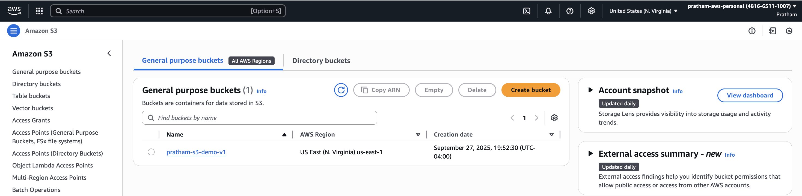

### Exploring Other Amazon Q Capabilities

You can also use Amazon Q to ask about other aspects of your account, such as your bill.

- **Example Query**: `Can you explain to me my current AWS charges?`

- **Expected Result**: On a new account, there won't be any cost data to analyze. Amazon Q will respond that it cannot find any data. However, after a month or so, if you start incurring costs, this would be a good place to ask for an explanation of your charges.
  
  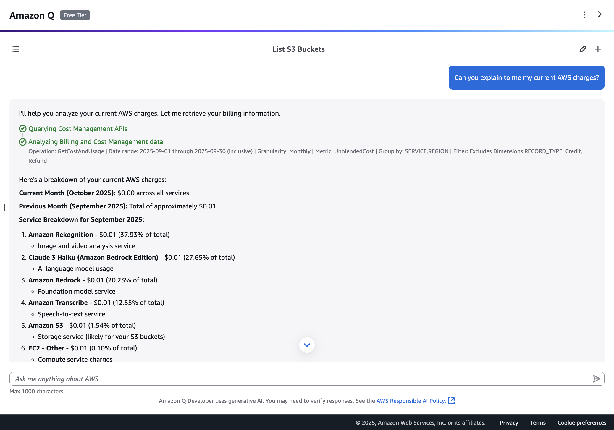

That's it! You have successfully used Amazon Q as a generative AI assistant to interact with, manage, and understand resources within your AWS account.
