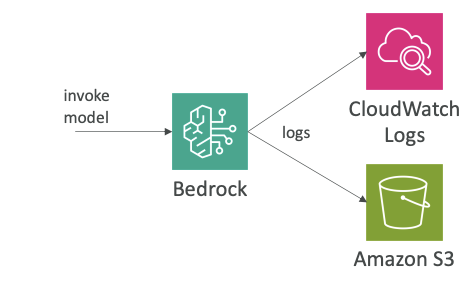
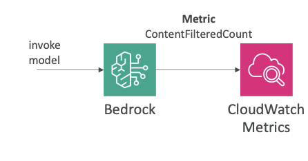

# Amazon Bedrock & CloudWatch Integration

Now let's talk about the integration of Amazon Bedrock and a service called CloudWatch. CloudWatch is a way for you to do cloud monitoring. CloudWatch has many services, but you can have metrics, alarms, logs and so on in CloudWatch and view them all. Many services and areas have integration with CloudWatch.

## **Model Invocation Logging**

For Amazon Bedrock, what you can do is model invocation logging, and that's something that can come up at the exam. The idea is that you want to send all the invocations - so all the inputs and the outputs of model invocations - into either CloudWatch Logs or Amazon S3.

Key features of model invocation logging:
• **Send logs of all invocations** to Amazon CloudWatch and S3
• **Can include text, images and embeddings**
• **Analyze further and build alerting** thanks to CloudWatch Logs Insights

This is very helpful because you get a history of everything that happened within Bedrock. On top of it, you can analyze the data further and build alerting on top of it, thanks to CloudWatch Logs Insights, which is a service that allows you to analyze the logs in real time from CloudWatch Logs.

The idea here is that we get full tracing and monitoring of Bedrock, thanks to CloudWatch Logs.

## **CloudWatch Metrics**

The other integration is CloudWatch Metrics. The idea is that Amazon Bedrock is going to publish a lot of different metrics to CloudWatch, and then they can appear in CloudWatch Metrics.

### **Published Metrics from Bedrock to CloudWatch**

• **Including ContentFilteredCount** - which helps to see if Guardrails are functioning
• **Can build CloudWatch Alarms on top of Metrics**

Some of them may be for general usage of Bedrock, but some of them may also be related to guardrails. So there is one called ContentFilteredCount, which helps you understand if some content was filtered from a guardrail.

What we can do with it is that once you have these kinds of metrics in CloudWatch Metrics, you can build CloudWatch alarms on top of them to get alerted, for example, when something is caught by a guardrail or when Amazon Bedrock is exceeding a specific threshold for a specific metric.

---

**Important for Exam:** Model invocation logging and CloudWatch metrics are very important in Amazon Bedrock and they are topics that can appear in the exam.