# Amazon Bedrock - Cloudwatch Integration

This guide provides a step-by-step walkthrough of the integration between <u>Amazon Bedrock and CloudWatch Logs</u>. 

We will enable **model invocation logging in Bedrock** to send detailed logs to CloudWatch. This will allow us to collect all 

1. metadata, 

2. requests, and 

3. responses

for all model invocations in the account. 

We will then examine these logs to understand the information they contain and explore the metrics that Bedrock automatically sends to CloudWatch for <u>**monitoring** purposes like latency</u>.

### **Part 1: Enabling Model Invocation Logging**

This section covers the initial setup for logging in the Amazon Bedrock console.

1. We're going to start by navigating to the Amazon Bedrock console. Go to "Settings" on the bottom left.
   
   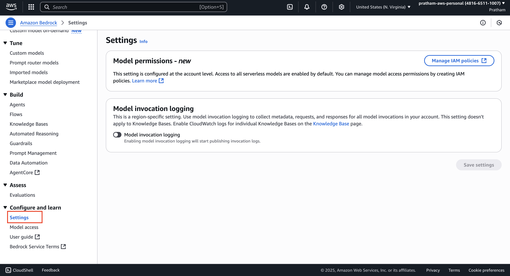

2. Here, you will find the "Model invocation logging" section. We can definitely enable it. Enabling this feature will collect all `metadata`, `requests`, and `responses` for all **model invocations** in your account.
   
   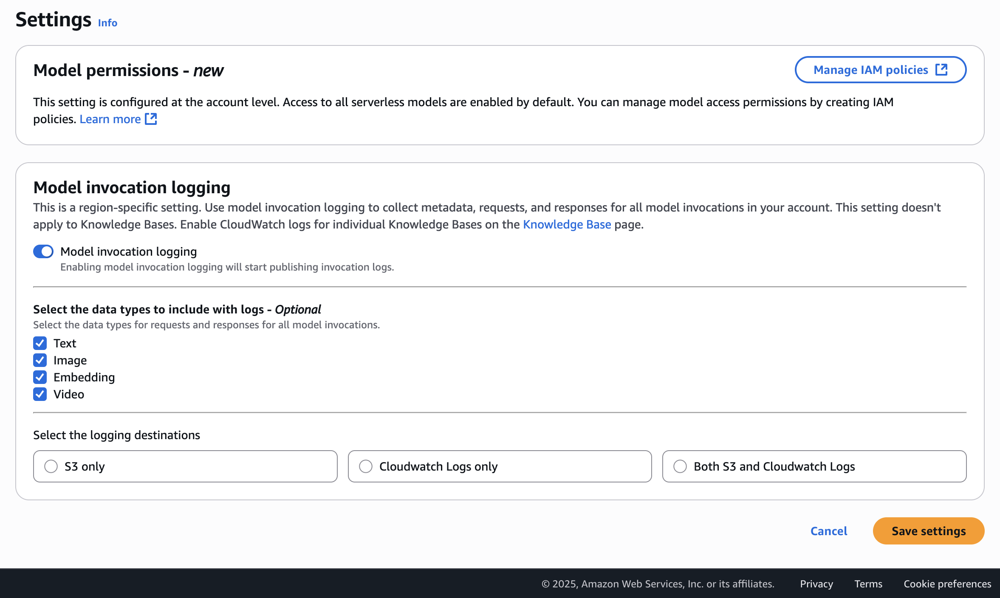

3. Next, select the <u>type of data</u> you want to include with the logs. The options are `"text,"` `"images,"`, `video` and `"embeddings."` For this demonstration, you can select any or all of them.

4. Now, choose the destination for the logs. This could be an "Amazon S3 bucket," "CloudWatch only," or "both." I'm just going to use "CloudWatch only."

5. You need to specify a log group name. I'll call this one `Bedrock Invocation Logging`.

6. Next, I will `create a new user role`. This is the role that Amazon Bedrock will need to send data to CloudWatch Logs. I'll call this one Bedrock Invocation Logging Role.
   
   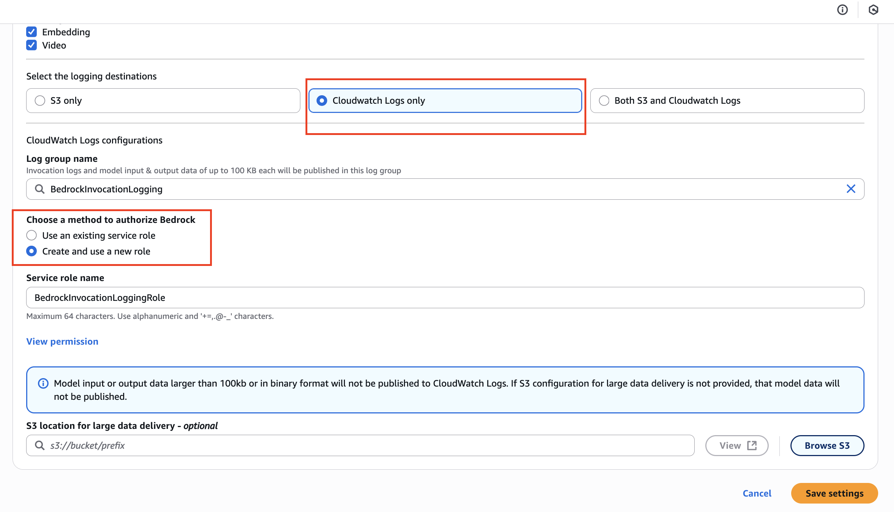

7. There is also an option for an "external location for larger delivery." In case a log is over 100 kilobytes, it can be published to **Amazon S3**. We don't need this right now, so we're going to just try to save these settings.

### **Part 2: Troubleshooting and Creating the CloudWatch Log Group**

Sometimes, the AWS console requires a resource to exist before it can be configured. We will address an error that may occur during this process.

> In my case, it already exists, so I got this error!

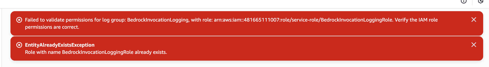

**Note:** We get an error saying, `"The specified log group doesn't exist."` This means we have to create it **manually in CloudWatch** in this instance. Maybe this will be fixed by the time you use this.

1. Let's go into CloudWatch logs. Navigate to "Log groups."
   
   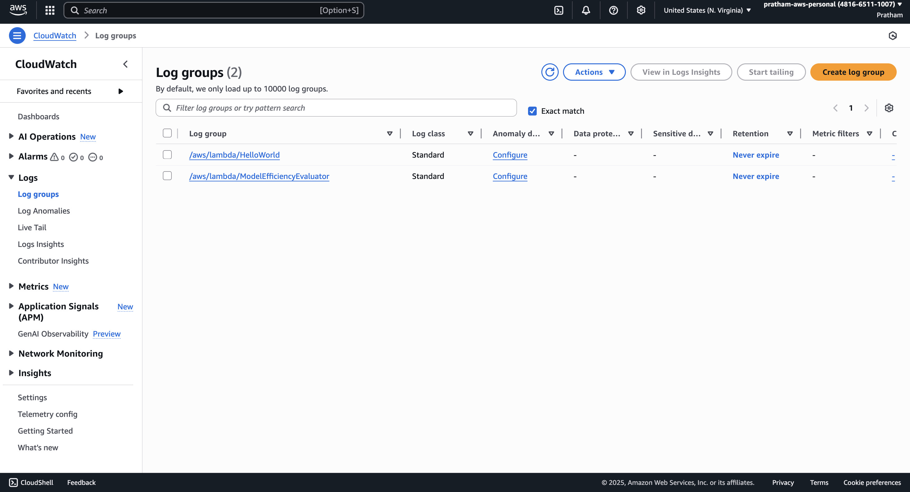

2. You're going to create a new log group. The name is going to be the one I'm going to copy and paste from our Bedrock configuration: `BedrockInvocationLogging`.
   
   > Note the name should be same as you created on Bedrock (**name**, and not the **service role name**)

3. We can set up some settings, like if you want the log to expire or not, but we're just going to click on "Create" and get going.
   
   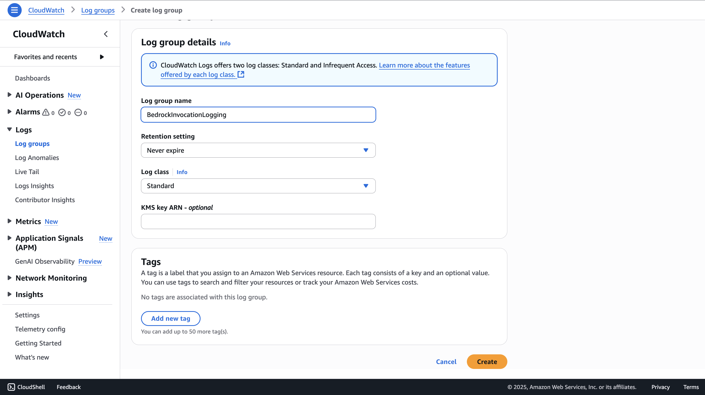

4. Okay, so now my log group is created. It is here.
   
   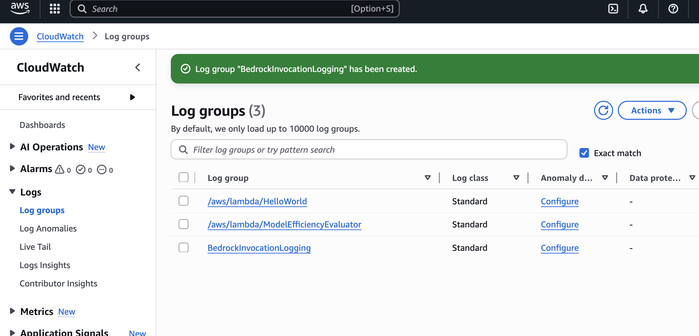

### **Part 3: Finalizing Bedrock Configuration**

With the log group now created, we can return to Bedrock and complete the setup.

1. Let's go ahead back into Amazon Bedrock. We're going to save these settings one more time.

2. We now need to say that we want to "use an existing service role."
   
   > **Note:** This is sometimes a bit annoying when you have issues on the console, but AWS may fix this at some point. Let me refresh this.

3. Now we select the existing role that was created in the previous step, Bedrock Invocation Logging Role, and save the settings. We should be good to go.
   
   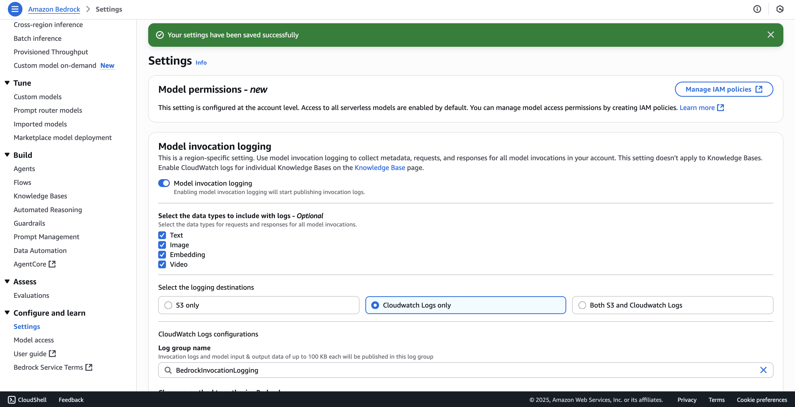

4. Okay, so the settings have been saved successfully.

### **Part 4: Generating and Reviewing Logs in CloudWatch**

Now that logging is configured, we'll generate a log by using a model and then inspect the output in CloudWatch.

1. What I can do now is I can go into "Chat" in the Bedrock console. I will select a model, and I will just click on "Run" after sending an input. Then we're going to get an output, and we're good to go.
   
   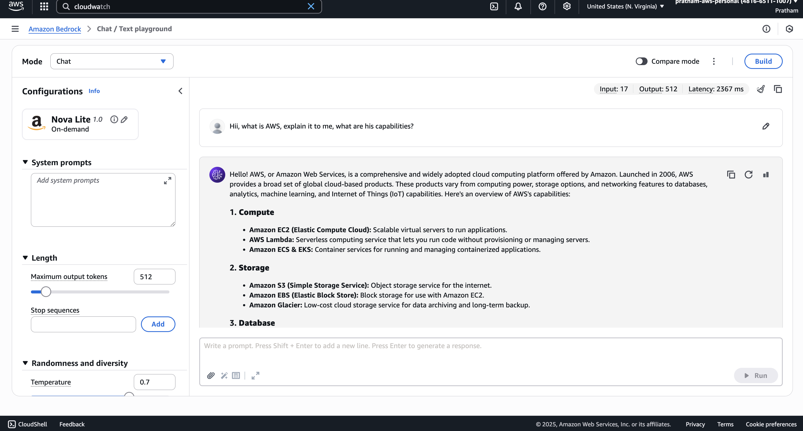

2. Now let's wait a little bit and then go into CloudWatch logs to see if this appears. I'm going into CloudWatch logs and we'll refresh this page. We have one log stream here. It is titled "Bedrock Model Invocations."

3. Inside the log stream, we have the information that the permissions are set correctly for Amazon Bedrock logs. Then we get some information about a model invocation.
   
   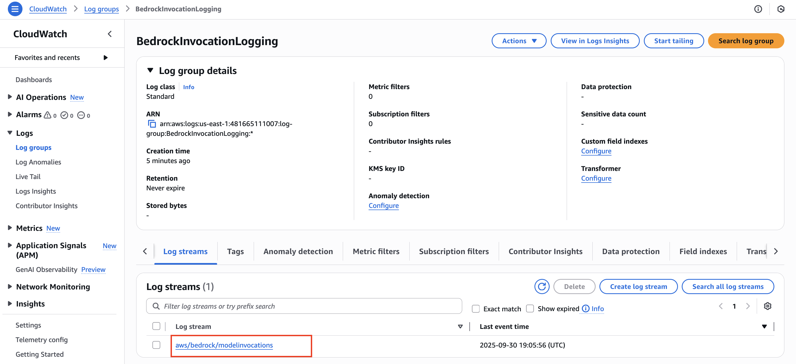

4. We get a lot of information around it, but we know that, for example, the `modelId` is `amazon.titan-text-express-v1`. This is a way for us to identify the models that we're using.

5. We get information about the `region`, and then we get the `messages`. We have a `user`, that's us, and we sent this `input`. Then we have some information around the configuration for this invocation.

6. We can see how many tokens it was: `271`. And the `output` is this message. The `assistant` role means that it's the **model itself**, and the <u>content</u> is the **response**.

7. Again, we get the information that the `latency` was `4,038` milliseconds. We get information around the `outputTokenCount`, the `totalTokenCount`, and so on.

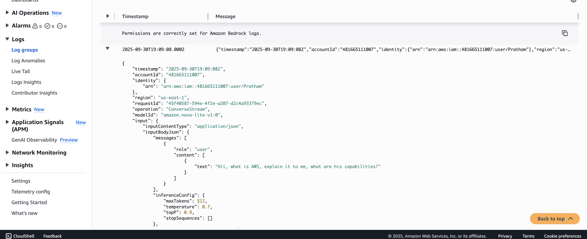

This is very helpful because, as you can see, a lot of information is included here, and we can use this information later on to debug everything. For example, we could run <u>an alarm to look at if the latency is always beneath a specific number</u>. 

If one day the latency reaches a high number, then we may want to send an alert saying, `"Hey, your latency requirements are a little too high now, and the user experience may be degraded."` That's the way of doing it. Hopefully, you get the idea of integrating Amazon Bedrock with CloudWatch Logs.

### **Part 5: Exploring Bedrock Metrics in CloudWatch**

In addition to logs, Bedrock also sends **<u>performance metrics</u>** directly to CloudWatch.

1. The other thing we can do is go into CloudWatch and go into "All metrics," and then click on "Bedrock."
   
   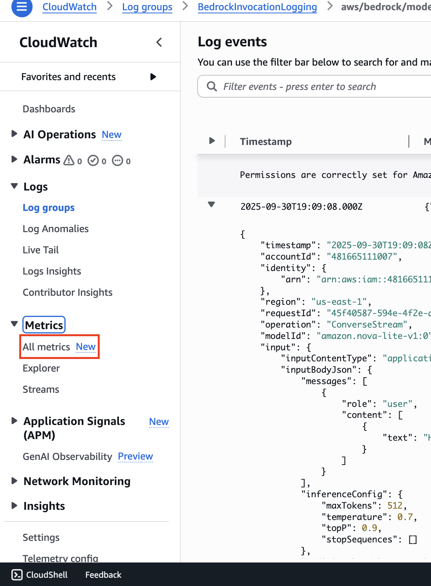
   
   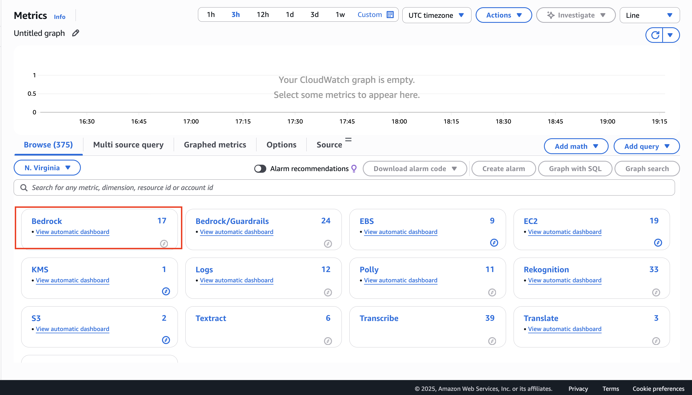

2. You may have more metrics than me, but we have here metrics "By Model ID" or "Across all model IDs." You can look at it either way.
   
   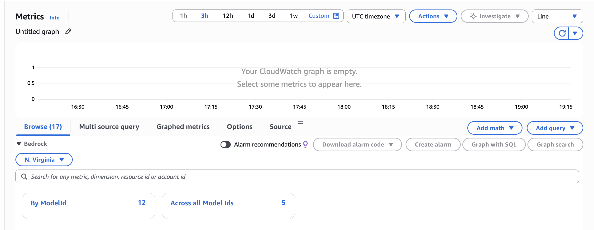
   
   > I selected **By ModelID**

3. For example, we can have a look at the number of "Invocations" or, for example, the `"InvocationLatency."` We can see here that the latency is being plotted on this graph.
   
   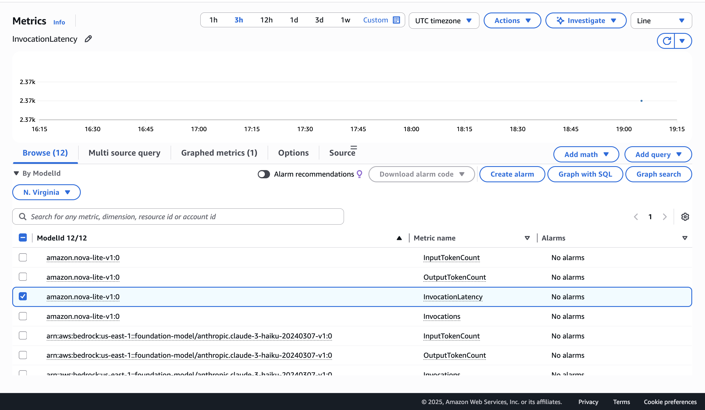
   
   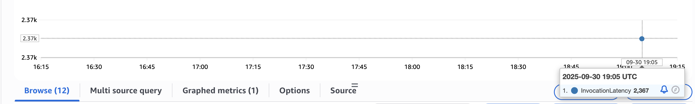

4. Now, of course, if you have a sustained usage of Amazon Bedrock, then you will see a curve here with multiple data points.

A lot of metrics are being sent by **Bedrock** into **CloudWatch metrics**. You can then build **metrics, graphs, dashboards**, and **alarms** on top of it as well, in case, for example, the <u>invocation latency gets too high</u>.
