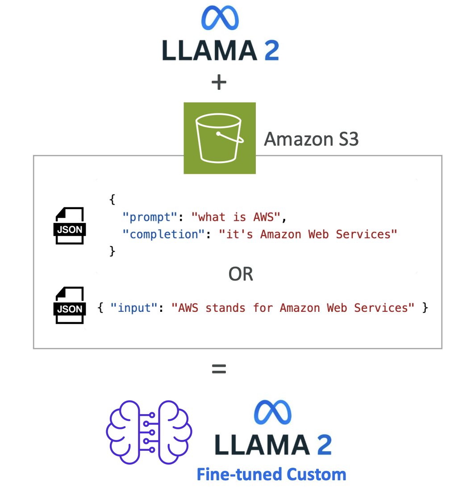
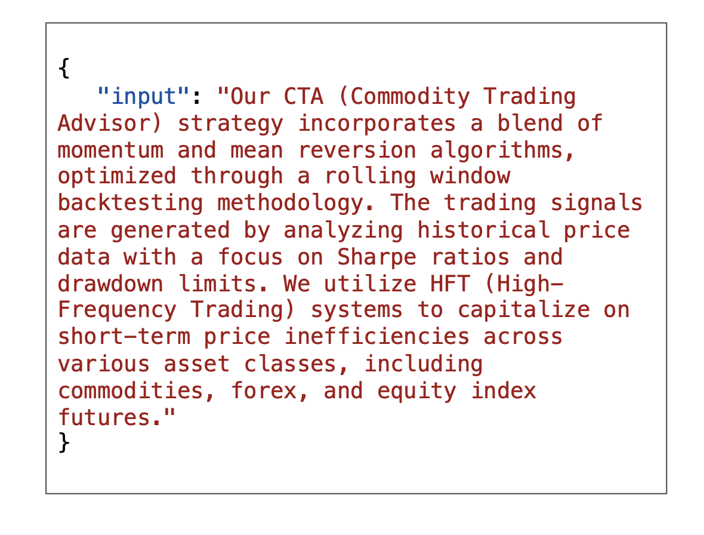
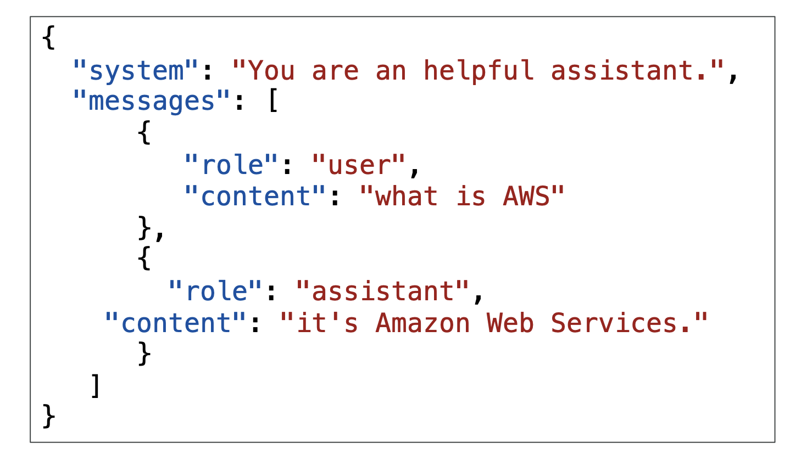
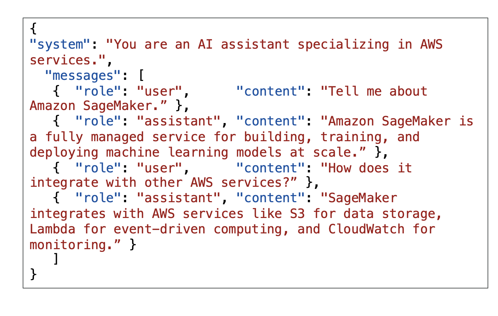
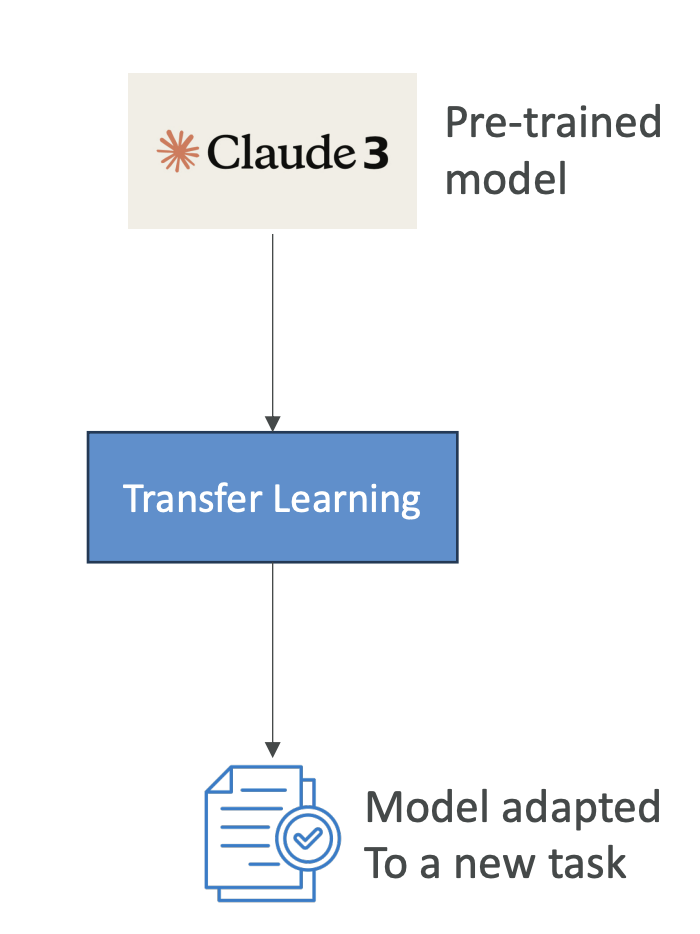

# Amazon Bedrock - Fine Tuning a Model

Now let's talk about fine-tuning on Amazon Bedrock. Fine-tuning is going to be a big part of your exam, so understanding these concepts is crucial for success.

## **What is Fine-Tuning?**

Fine-tuning allows you to adapt a copy of a foundation model by adding your own data. When you fine-tune a model, it actually changes the underlying weights of the base foundation model. You need to provide training data that adheres to a specific format and must be stored in Amazon S3.

For example, you have the LLAMA 2 model and you're going to add data from Amazon S3. Bedrock will process this data (we will look further in this lecture, stay tuned). Bedrock will do his thing and you'll get a **fine-tuned version of LLAMA 2** that incorporates your own data as well. (see the image below for the understanding)

**Important Requirements:**
- In order to use a fine-tuned custom model, you must use **provisioned throughput** (different pricing model than on-demand)
- Not all models can be fine-tuned, but few can and they're usually open source

## **Types of Fine-Tuning**

### **1. Instruction-Based Fine-Tuning**

This approach improves the performance of the pre-trained foundation model on domain-specific tasks. Domain-specific tasks means the model will be further trained on a particular field or area of knowledge.

**Key Characteristics:** (Tricks for the exam)
- Uses **labeled examples** in the form of prompt-response pairs (**This will identify the scenario for the exam**)
- For labeled data only
- Example format:
  - **Prompt:** "Who is Stephane Maarek?"
  - **Response:** "Stephane Maarek is an AWS instructor who dedicates his time to make the best AWS courses so that his students can pass all certifications with flying colors!"

This type of fine-tuning shows the model not just information, but also how you want it to answer certain questions. The model might already have similar information, but with a different tone.

### **2. Continued Pre-Training**

Here you continue the training of the foundation model using unlabeled data. Since foundation models have been trained using unlabeled data, you need to provide unlabeled data for continued pre-training as well.

**Key Characteristics:**
- Also called **domain-adaptation fine-tuning**, it makes a model an expert in a specific domain
- Uses unlabeled data only

**For Example**: 
- I am going to feed the entire AWS documentation to a model and the model is going to be an expert on AWS. 
- So here we are just giving all the documentation, which is unlabelled data (so this is continued pre-training)
- Now the model has become domain expert
- Here is how the input looks like:

**Observation from the Input Format (from the image):**
Here you will notice that, there are:
- No **prompt-output** pairs
- Just **input** containing large amounts of information
- Excellent for teaching acronyms or industry-specific terminology
- Can **continue training** as more data becomes available

### **3. Single-Turn and Multi-Turn Messaging**

You may also encounter single-turn messaging and multi-turn messaging, which are subsets of instruction-based fine-tuning. 

**Single-Turn Messaging**: Here we give a hint to a user and an assistant about what the user is asking and what the assistant (the bot) should be replying.

**Format includes**: 
Here we have:
- **System**: This is optional context for the conversation
- **Messages**: Contains various messages, each with a role (**user** or **assistant**) and content (the text content of the message)

This fine-tunes how a chatbot should be replying.

**Multi-Turn Messaging**: 
- This follows the same idea, but this time we have a conversation with **multiple turns**. 
- We alternate between **user** and **assistant** roles and have a full conversation. 

- This helps the model understand how to handle conversations with bigger context.

## **Cost Considerations**

Fine-tuning a foundational model requires a higher budget because you need to spend computation resources on it.

**Instruction-Based Fine-Tuning:**
- Usually cheaper
- Less intense computations
- Usually requires less data
- Just fine-tunes how the model replies based on specific instructions

**Continued Pre-Training:**
- Usually more expensive
- Requires much more data
- Needs an experienced machine learning engineer
- Must prepare data, perform fine-tuning, and evaluate the model
- More expensive to run because you must use provisioned throughput

## **Transfer Learning**

Transfer learning is a bit broader than fine-tuning. It is the concept of using a pre-trained model to adapt it to a new related task. For example, we have Claude 3 and then we're going to do transfer learning to adapt it to a new task.

You might say this is very similar to fine-tuning, and it is, but here are some examples:

**For Image Classification:** We may want to use a pre-trained model that knows how to recognize edges and images, but we may want to do transfer learning to apply it to recognize specifically a kind of image.

**For Language Processing:** Models like BERT or GPT already know how to process language. Now that we have the language figured out, let's just fine-tune them or use transfer learning to adapt them to newer tasks.

>**Important Note for Exam:**  Transfer learning appears in this lecture because it can appear in the exam as a general machine learning concept. If you don't see fine-tuning specifically, just know that the general answer is to use transfer learning because fine-tuning is a specific kind of transfer learning.

## **Use Cases for Fine-Tuning**

The use cases of fine-tuning include:

- **Custom Chatbots:** Have chatbots designed with a particular persona or tone, or geared towards a specific purpose such as existing customer service or crafting advertisements
- **Updated Training:** Train with more up-to-date data than what the model previously accessed
- **Exclusive Data:** Train with exclusive data that you have only, such as historical emails, messages, or records for customer service interactions (base foundation models do not have access to this because this is your data)
- **Targeted Use Cases:** Applications such as categorization or assessing accuracy

## **Exam Focus**

When you're fine-tuning, the exam will ask you about:

- When fine-tuning is a good idea
- The kind of fine-tuning you will need based on the type of data you get (labeled or unlabeled data)
- Pricing questions related to fine-tuning approaches