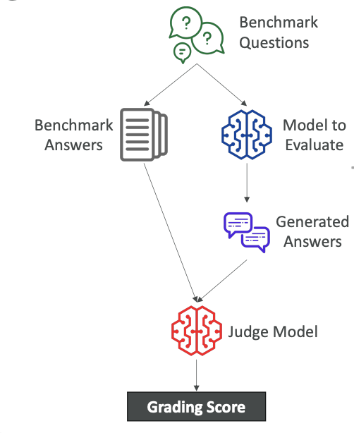
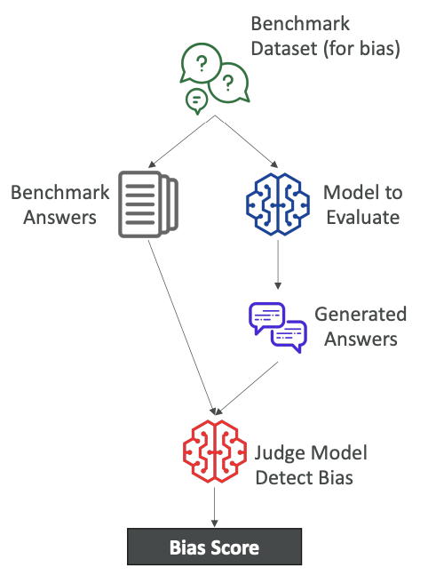
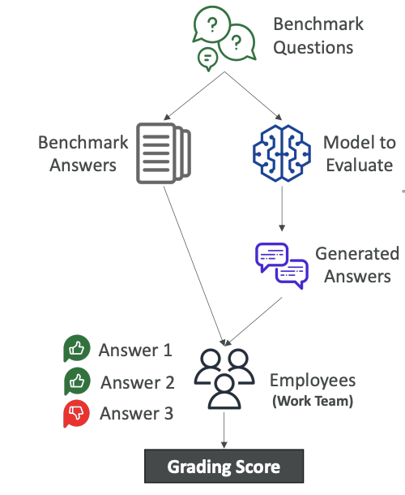
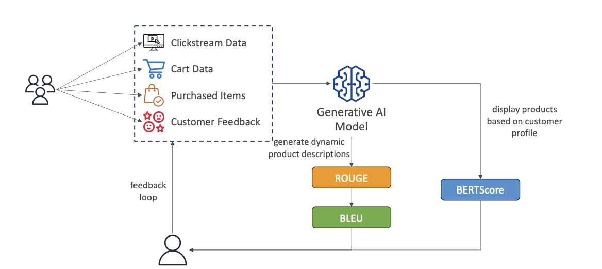

# Foundational Model Evaluation

To choose a model, you may want to evaluate it with some level of rigor. On Amazon Bedrock, you can perform what's called an **<u>Automatic Evaluation</u>**. This is used to evaluate a model for <u>quality control</u> by giving it specific tasks.

### **Built-in Task Types**

You can choose from several <u>built-in task types</u> for evaluation:

- Text summarization

- Question and answer

- Text classification

- Open-ended text generation

After choosing a task type, you need to add a prompt dataset or use one of the built-in, curated prompt datasets from AWS on Amazon Bedrock. Thanks to all this, scores will be calculated automatically.

### **Automatic Evaluation Process**

> So let me explain what I mean as said above

Here is a breakdown of what happens during an automatic evaluation:

1. **Benchmark Questions and Answers:** The process starts with benchmark questions. You can bring your own or use the ones from AWS. Because you have created a benchmark, you need to have both **benchmark questions** and **benchmark answers**. The <u>benchmark answers</u> are what you would consider an <u>ideal answer</u> to your benchmark question.

2. **Model to evaluate:** Then you have model to be evaluated meaning that you will submit all the <u>benchmark questions</u> into the model that must be evaluated which is going to (of course) generate some answers **(look at the diagram below)**

3. **Comparison:** The **benchmark answers** are then compared to the answers generated by the <u>GenAI model</u>.

4. **Judging and Scoring:** In an automatic evaluation, another GenAI model, called a `judge model`, looks at the benchmark answer and the generated answer. It is asked something along the lines of, "Can you tell if these answers are similar or not?" It then provides a grading score, which can be calculated in different ways (e.g., BERTScore, F1).

### **Benchmark Datasets**

A benchmark dataset is <u>a curated collection of data designed specifically to evaluate the performance of a language model</u>. It can cover many different topics, complexities, and linguistic phenomena.

You use benchmark datasets because they are helpful for measuring:

- **Accuracy:** The correctness of the model's responses.

- **Speed and Efficiency:** How quickly and efficiently the model performs.

- **Scalability:** How the model handles a large number of requests at the same time.

- **Bias Detection:** Some benchmark datasets are designed to help you quickly detect <u>any kind of bias</u> and <u>potential discrimination</u>. Using a benchmark dataset gives you a quick, low-administrative-effort way to evaluate your models for potential bias.

It is also possible for you to create your own benchmark datasets that are specific to your business needs and criteria.

### **Human Evaluations**

This is the exact same idea as **<u>automatic evaluation</u>**, but with a <u><mark>human component</mark></u>. We have <u>benchmark questions</u> and <u>benchmark answers</u>, but then humans—such as employees from the 

1. work team, 

2. subject matter experts (SMEs), or others—will look at the benchmark answers and the generated answers to determine if they are correct.

Humans can evaluate using different types of metrics, such as:

- Thumbs up or thumbs down

- Ranking

- And so on.

This process also results in a **<u>grading score</u>**. Because humans are evaluating, you can again choose from the **built-in task types** or **create a custom task**, allowing for more freedom.

### **Evaluation Metrics** 

There are a few metrics you can use to evaluate the output of a Foundation Model from a generic perspective. There are:

1. ROUGE

2. BLEU

3. BERTScore

4. Perplexity

#### **1. ROUGE (Recall-Oriented Understudy for Gisting Evaluation)**

The purpose of ROUGE is to evaluate **automatic summarization** and **machine translation systems**.

- **ROUGE-N:** Measures the **number of matching n-grams** (sequences of N words) <u>between the reference and generated text</u>. For example, a 1-gram is a single word, while a 2-gram is a combination of two words. A higher N-gram means you are matching a longer sequence of words in the exact same order.

- **ROUGE-L:** Computes the longest common subsequence of words that is shared between the two texts.

- Example to understand the [concept]([https://docs.google.com/document/d/1uIe2fU6wHmjwDIx_jO6sDme7ZMaqdbtkZ3thByagyuo/edit?usp=sharing)

#### **2. BLEU (Bilingual Evaluation Understudy)**

This is used to evaluate the **<u>quality of generated text</u>**, especially for <u>translation</u>. It considers both <u>precision</u> and **<u>penalizes the text for being too short</u>**. It's a slightly more advanced metric that is very <u>helpful for translations</u>.

It also looks at a combination of n-grams (1,2,3,4).

#### **3. BERTScore**

Unlike ROUGE and BLEU, which just look at words and combinations of words, BERTScore looks for the **<u>semantic similarity between generated text</u>**. This means you compare the actual meaning of the text to see if the meanings are very similar.

- It works by having a model compare the embeddings (a set of numbers representing the text) of both texts and compute the cosine similarity between them. If the numbers are very close, the texts are semantically similar.

- With BERTScore, we are not looking at individual words but at the context and nuance between the texts.

#### **4. Perplexity**

This measures **<u>how well the model will predict the next token</u>**. For perplexity, <u>lower is better</u>. If a model is very confident about the next token, it will be less perplexed and therefore more accurate.

### **Evaluation Feedback Loop**

These metrics can be incorporated back into a feedback loop. For example, imagine a generative AI model trained on 

1. clickstream data, 

2. cart data, 

3. purchase items, and 

4. customer feedback to generate dynamic product descriptions. 

From this, we can use the reference description versus the generated one to compute **ROUGE** or **BLEU** metrics, as well as look at similarity in <u>terms of nuance</u> with a **BERTScore**. These scores can be fed back to retrain the model and get better outputs.

### **Business Metrics**

On top of these grading types, you may have business metrics to evaluate a model on. These are a little bit more difficult to evaluate but are important.

- **User Satisfaction:** Gather user feedback to assess satisfaction with the model's response.

- **Average Revenue Per User:** If the GenAI app is successful, you hope this metric will go up.

- **Cross-Domain Performance:** The model's ability to perform across varied tasks and different domains.

- **Conversion Rates:** Monitor whether you are achieving higher conversion rates.

- **Efficiency:** The efficiency of the model in terms of cost, computation, resource utilization, and so on.
