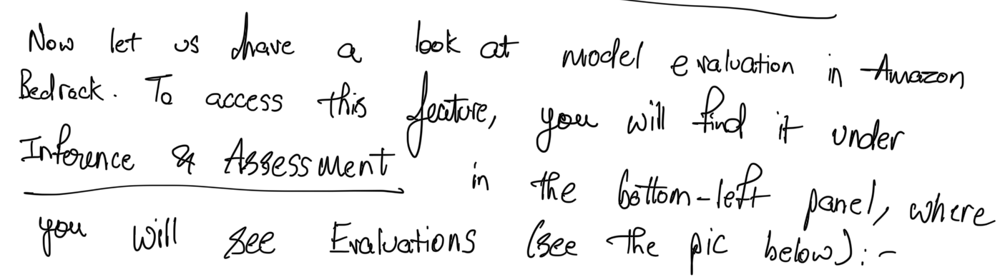
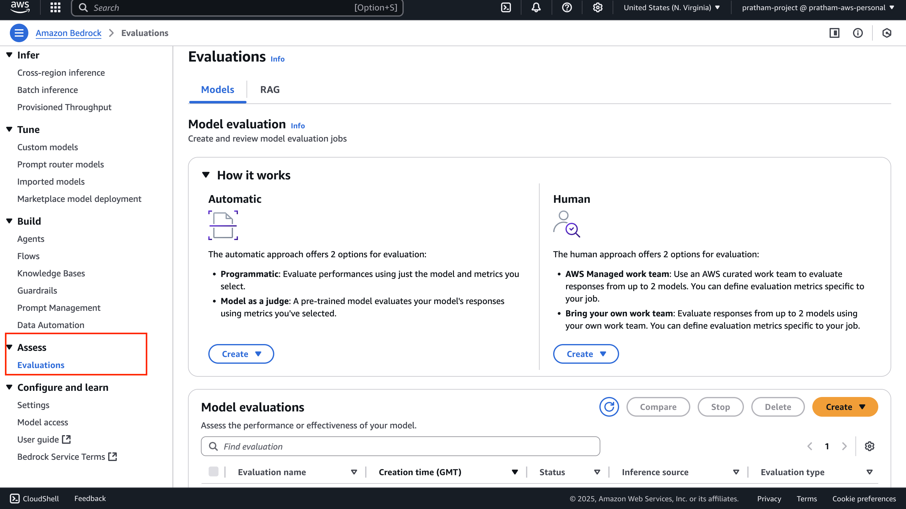
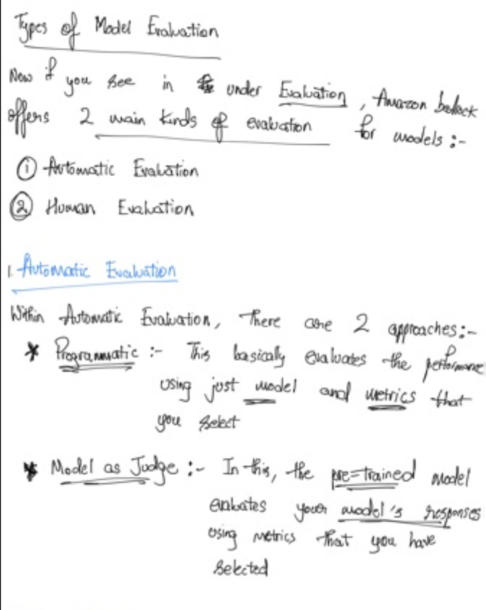
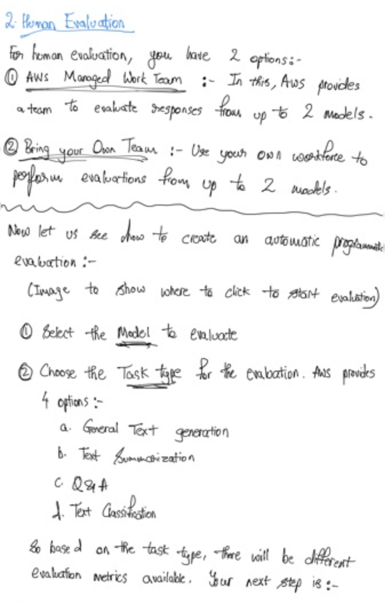
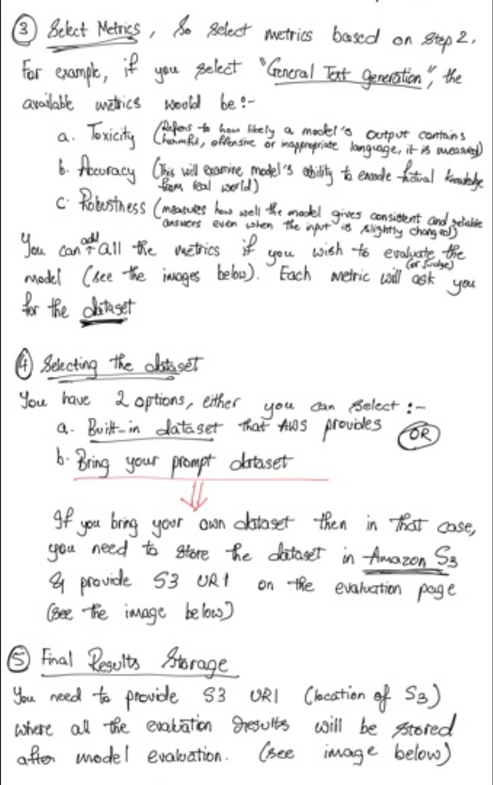
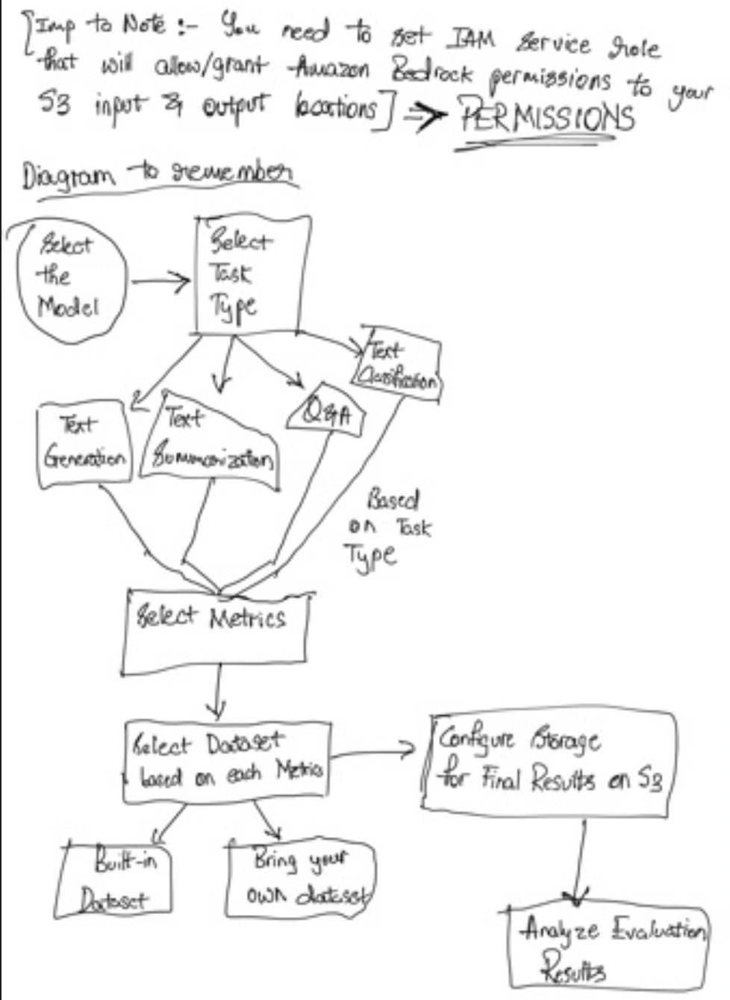
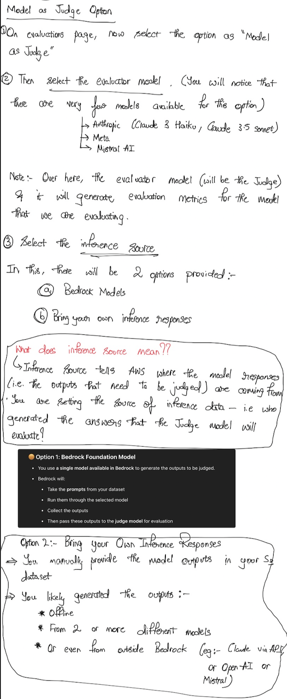
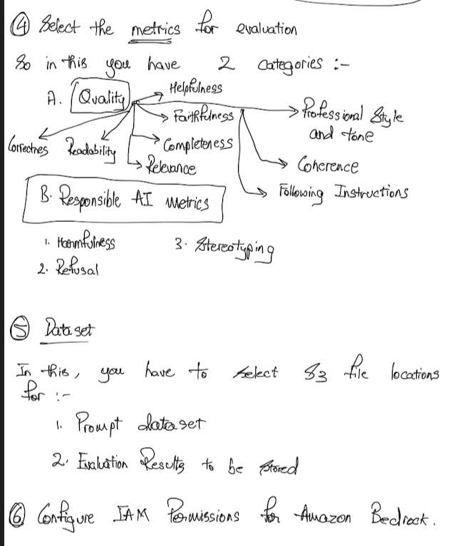

# Amazon Bedrock - FM Evaluation Hands On

## Human Evaluation Setup

Human evaluation brings the human factor into model assessment:

### AWS Managed Team
- Requires providing substantial information
- AWS handles the evaluation workforce

### Bring Your Own Workforce
1. **Select up to two models** for comparison
   - Example: Compare Nova Pro with Claude 3.5 Sonnet

2. **Choose task type**:
   - General
   - Text summarization
   - Custom tasks

3. **Select metrics** to evaluate (same options as automatic evaluation)

4. **Human judges** (either your team or AWS team) will:
   - Compare model performances
   - Rate each model's performance
   - Determine which model performs better

This human evaluation process provides insights that only human judgment can offer, complementing the automatic evaluation methods available in Amazon Bedrock.

---
