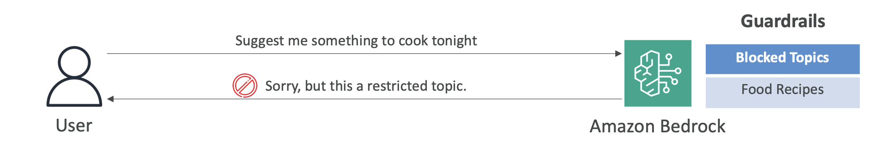

# Amazon Bedrock Guardrails

Now let's talk about Guardrails in Amazon Bedrock. Guardrails allow you to control the interaction between your users and your Foundation Models.

## **What Guardrails Can Do**

You can set up Guardrails to filter undesirable and harmful content. For example, say we have Amazon Bedrock and we set up a Guardrail to block any kind of food recipes, and the user is using your model and saying, "Hey, suggest me something to cook tonight." Then Amazon Bedrock will respond, "Sorry, this is a restricted topic." This is because we have set up a Guardrail to block this topic.

Of course, maybe you don't want to block food recipes, but something a bit more relevant to your business.

## **Key Features**

You can also use Guardrails to:

- **Remove personally identifiable information (PII)** to make sure that your users are safe
- **Enhance privacy**
- **Reduce hallucinations** (we'll see what hallucinations are later on this course)

The idea is that you want to make sure that the answers are safe and sound and that they're not just invented off the block. Guardrails can help you with that.

## **Advanced Capabilities**

You can also:

- **Create multiple Guardrails** and multiple levels of Guardrails
- **Monitor and analyze all the user inputs** that will violate the Guardrails to make sure that you have set the Guardrails up properly

That's it, just a short intro to the Guardrails. I hope you liked it and I will see you in the next lecture for Hands On.