# Amazon Guardrail - Hands On

This tutorial will walk through how to use guardrails to filter content based on your requirements for a more responsible AI. 

1. We will create a new guardrail, 

2. Configure several types of filters, and 

3. then test its functionality to see how it blocks denied topics and masks sensitive, personally identifiable information (PII) in prompts and responses.

### **Creating a New Guardrail**

Guardrails are a way for you to filter things based on your requirements to have a more responsible AI. Let's create a guardrail and see the options we have.

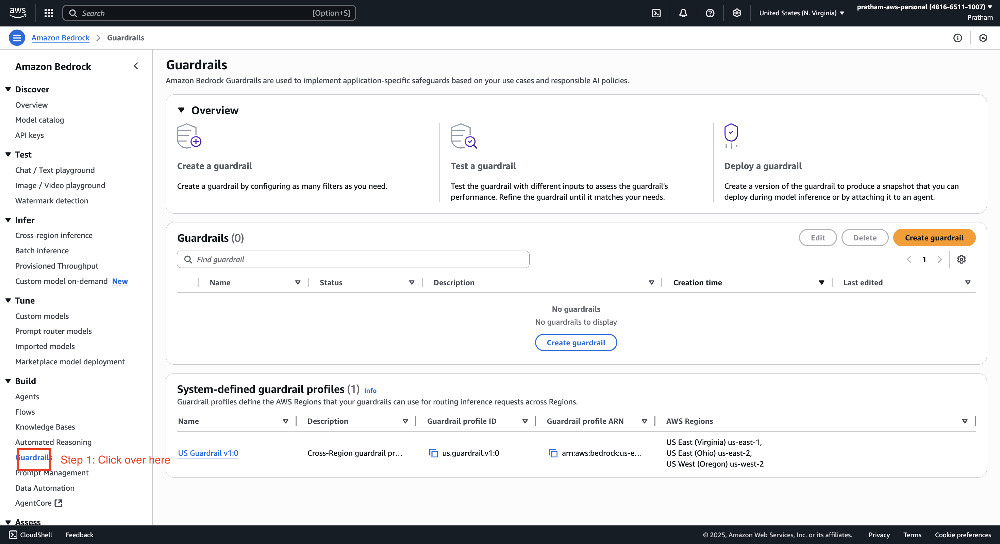

1. **Initiate Guardrail Creation**
   
   - Start by creating a new guardrail. We'll name this one `"demo guardrail"`.
     
     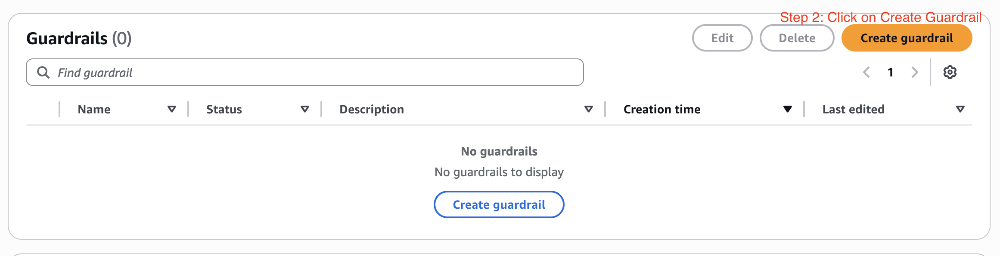
     
     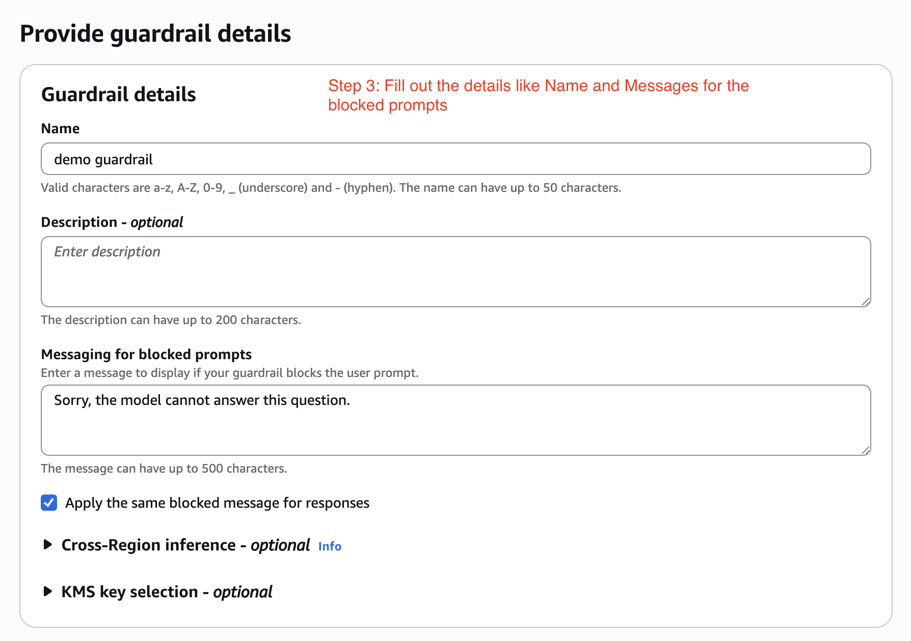
   
   - The first setting is the message for a blocked prompt. In case the prompt is blocked, this is the message you want to return to your user. Here, it's going to be, `"sorry, the model cannot answer this question."`
   
   - This same message can be applied to blocked responses, or you can customize it. For this demo, we'll use the same message for both.
   
   - Click "next".

2. **Configure Content Filters and Denied Topics**
   
   - Now we have options to configure a lot of things. We could configure:
     
     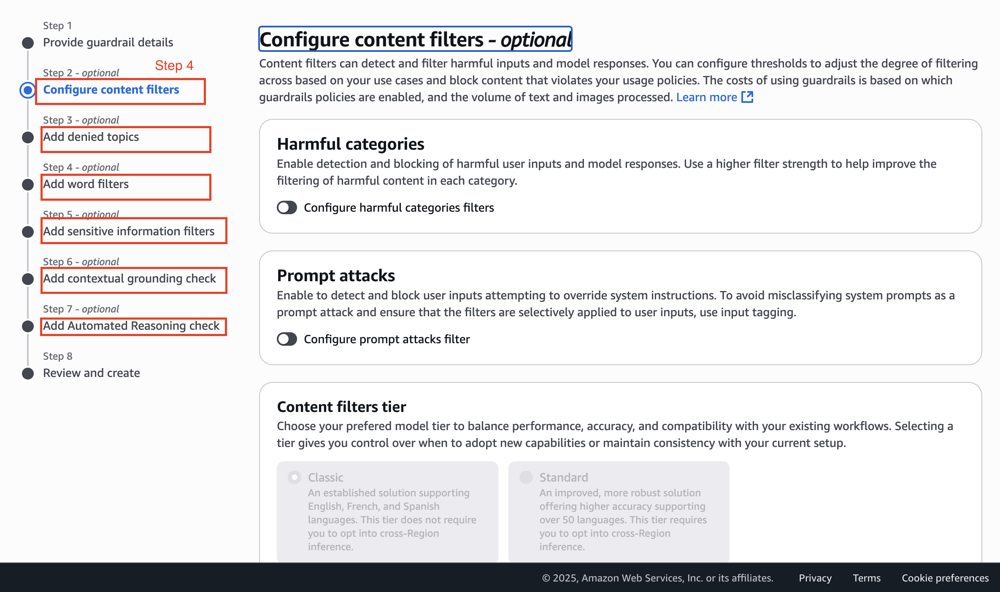
     
     1. content filters, 
        2. denied topics, 
        3. word filters, 
        4. sensitive information filters, and 
        5. add contextual ground checking. 
     
     Let's configure one of them just so we understand how it works and then look at the other categories.
   
   - **Content Filters**: First, let's filter <mark>**harmful categories**</mark>. Here, we have a <u>filter strength to increase the likelihood of filtering harmful content in a given category</u>. We will set the filter strength to `None` for `"hate"`, `"insults"`, `"sexual"`, `"violence"`, and `misconduct`. Click "next".
     
     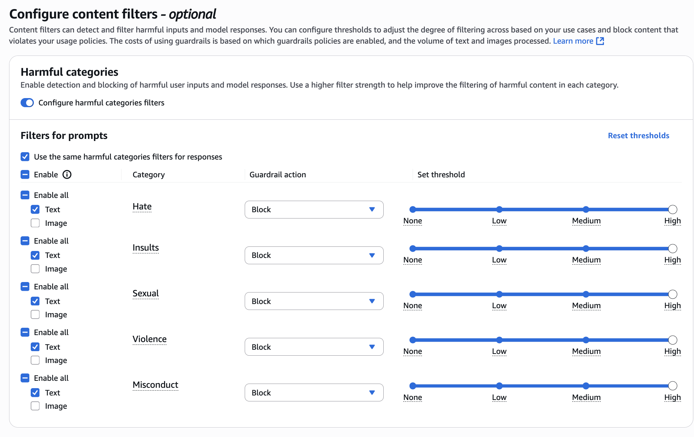
   
   - **Denied Topics**: Next, let's define what topics we want to deny. I'm going to call this topic "Recipes". 
     
     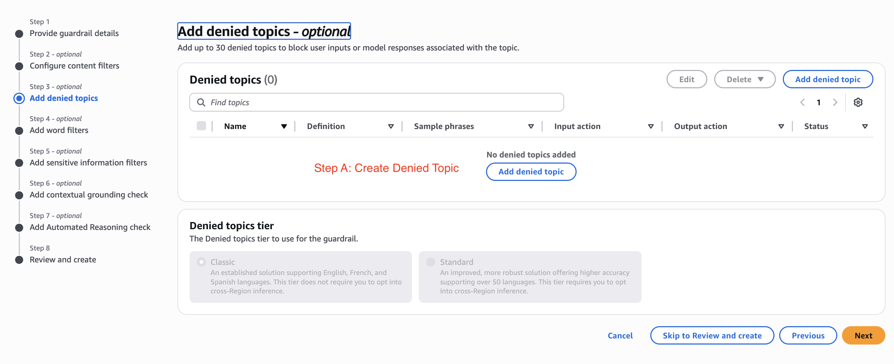
     
     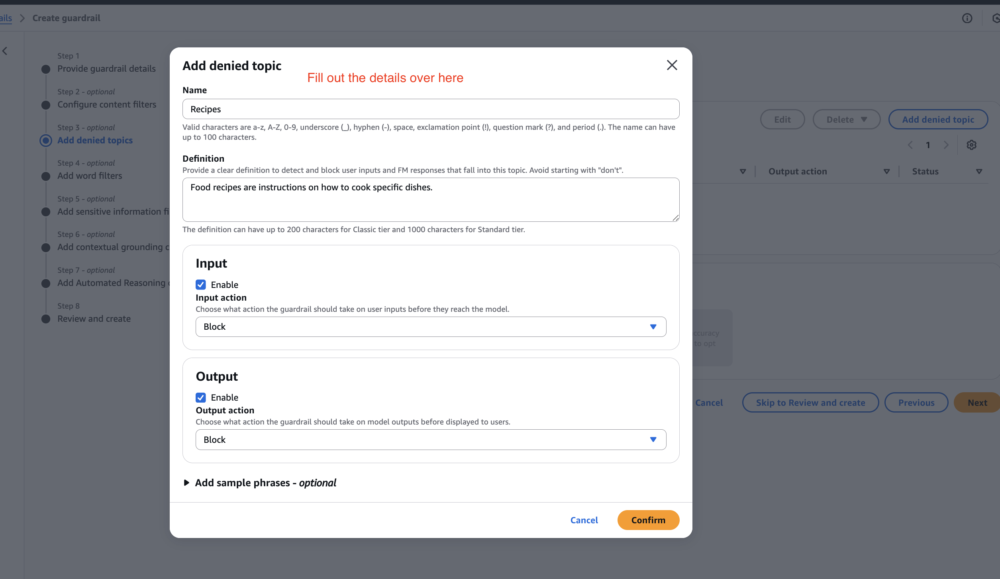
     
     The definition of a topic is what you want the foundation model to understand what the topic is. So, let's say the topic is `"Food recipes are instructions on how to cook specific dishes."`
   
   - We can also add sample **<u>phrases</u>** if we really <u>wanted to allow the AI to understand the type of prompts we're trying to block</u>, but there's no need for it in this case. Let's confirm this.
   
   - Now we have our "recipes" topic. Click "next".

3. **Configure Word and Sensitive Information Filters**
   
   - **Word Filters**: Do we want to have a profanity filter? For example, if someone is using <u>profane words</u>. You can also add <u>custom words and phrases to be blocked by uploading them directly</u>. We will skip this for now.

4. **Sensitive Information Filters (PII)**: Do you want to remove any type of personally identifiable information (PII)? We can say, "yes, I wanna add a new PII". For this example, we'll configure it to remove any type of email. We'll set the behavior to "mask".
   
   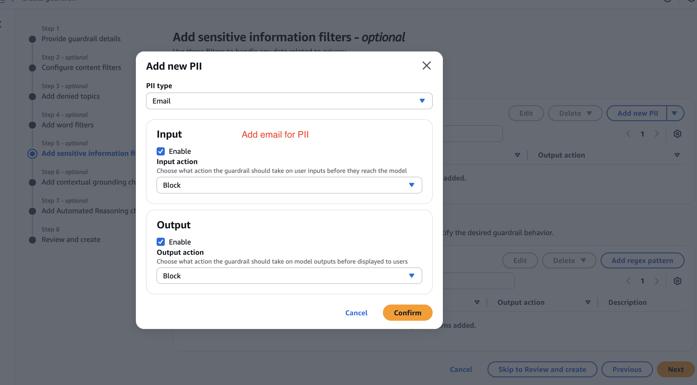
   
   - **Regex Pattern**: You can also add a Regex pattern, so any type of information that follows a specific pattern should be removed as well.
     
     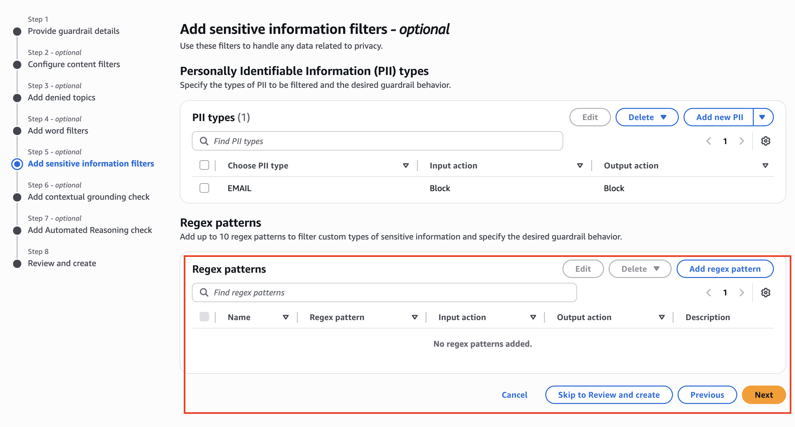

5.  **Configure Contextual Grounding**
- Finally, we have contextual grounding. This is to make sure that <u>you reduce hallucination</u>—*when the model thinks that it's saying something it thinks is true, but it's actually not true*. It's called <u>**grounding and relevance**</u>. We won't go into the settings here.
  
  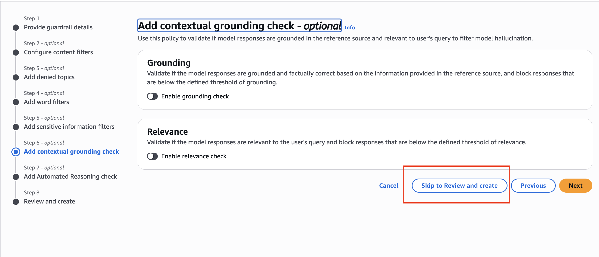
  
  Let's create it. Click "Create this guardrail".

### **Testing the Guardrail**

Now that the guardrail is created, we can test it.

1. **Test 1: Denied Topic**
   
   - First, select a model. Let's choose Anthropic and "Sonnet".
     
     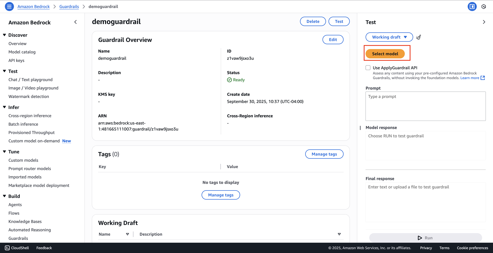
   
   - Now, let's enter a prompt that should be blocked by our denied topic filter: `"please suggest me something to cook tonight. I love Indian food."`
   
   - Click "run".
   
   - **Result**: As you can see, the topic is blocked because we said no food recipes. The answer we get is, "sorry, the model cannot answer this question," which is the custom message we configured.
     
     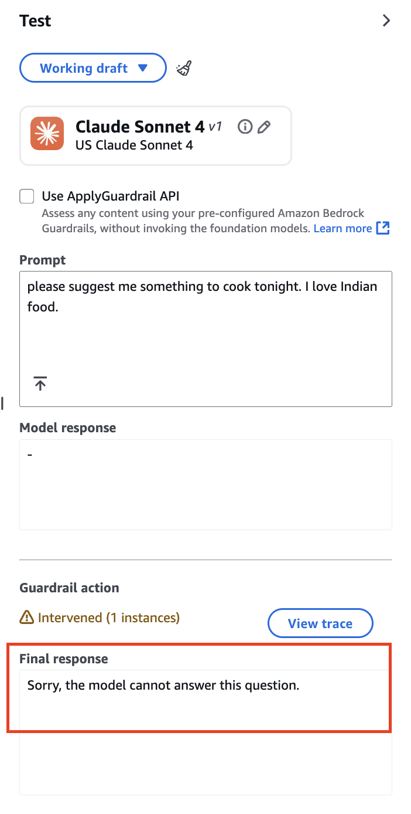

2. **Test 2: PII Masking**
   
   - Now, let's test the PII filter. Use the following prompt: `"Please draft an email for me, include my email pratham@example.com and also include the other person's email john@example.com. Make sure we discuss important topics for our next business meeting."`
   
   - Let's click "run". Now we are prompting the model to draft us an actual email. This is great, but what I expect is for my emails to be masked because this is actual information.
   
   - **Model Response vs. Final Response**: The model response included "to pratham@example.com and cc john@example.com" with the relevant email content. This is great, but the final response has been passed through the guardrail.
   
   - **Result**: As you can see in the final response, the email addresses have been masked because this was personally identifiable information, but the rest of the email content is here. This is great. We've seen how this guardrail works, and this was a good demo.
     
     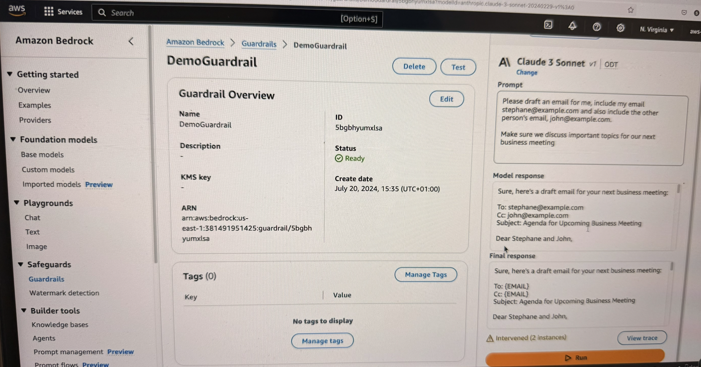

### **Alternative Method for Applying Guardrails**

I just want to show you another way to test the guardrail.

1. Navigate to the "Text" playground.

2. Choose a model. Again, we're going to choose Anthropic, "Sonnet", and apply it.

3. On the bottom of the interface, you can choose a guardrail and apply the "demo guardrail" we just created.
   
   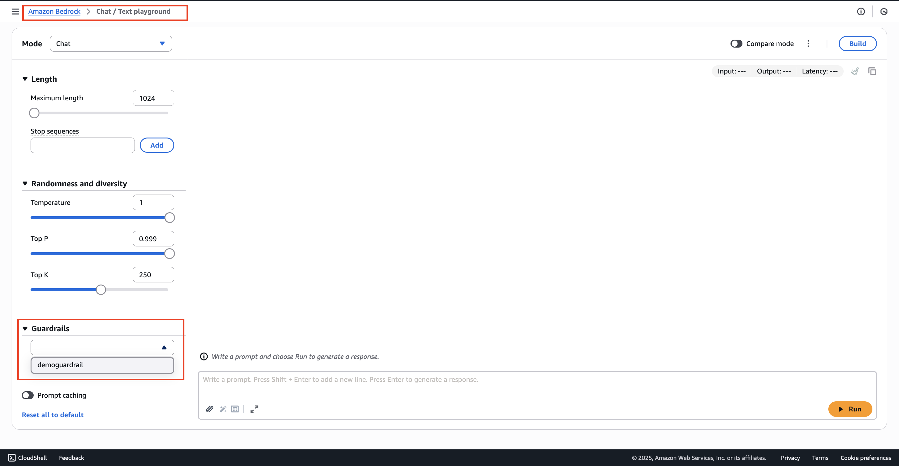

> **Note**: You can actually apply many guardrails at a time if you wanted to stack them up.

That's it for this lecture. You can leave this guardrail on; it's not going to cost you any money.
