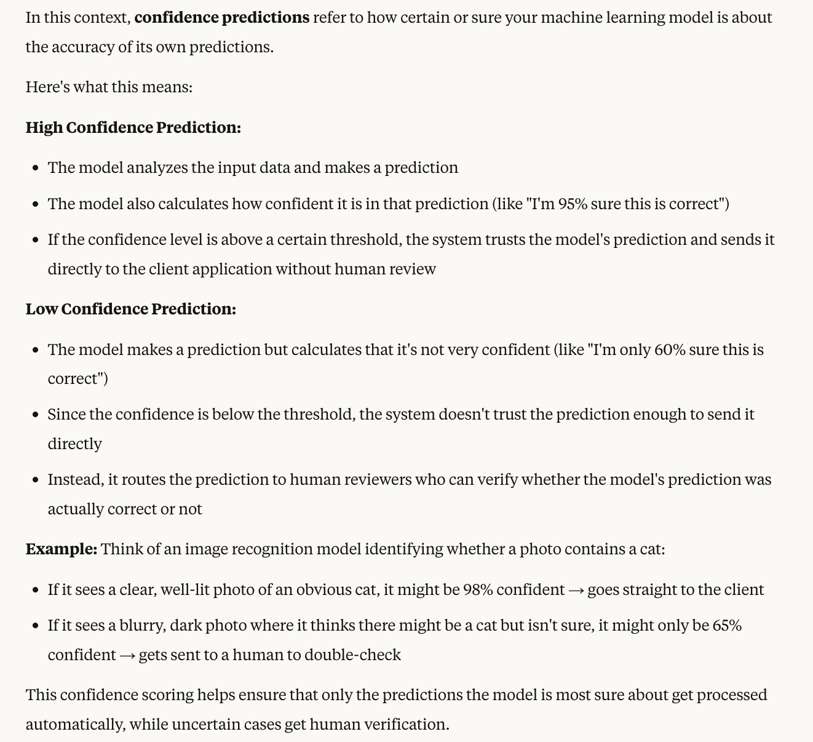
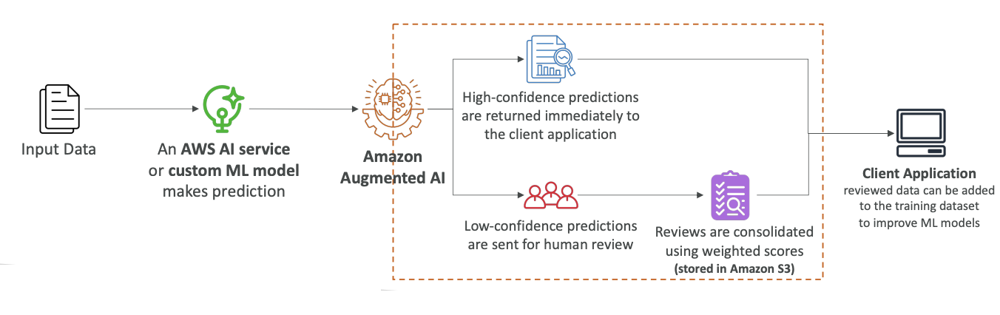

# Amazon Augmented AI (A2I)

Now let's talk about Amazon Augmented AI or A2I. The idea is that your machine learning models are making predictions in production, but you want to have human oversight to make sure that your models are working as they should.

## **How A2I Works**

The process follows this flow:

- You have your **input data** (see the diagram below)
- An **AWS AI service** or your own **custom machine learning model** makes a prediction (see the diagram below)
- **Amazon Augmented AI** determines what happens next based on confidence levels (see the diagram below)

## **Prediction Processing**

A2I handles predictions in two ways:

- **High confidence predictions** - These return immediately to the client application because your model can grade how confident it is about the outputs (see the diagram below)
- **Low confidence predictions** - These are sent to human review (see the diagram below)

> What does confidence mean??
> 

## **Human Review Process** (see the diagram below)

When predictions require human review:

- Actual humans consolidate all these predictions
- They create **risk-weighted scores**
- These scores are stored in **Amazon History**
- The client application can then get the prediction
- These reviewed predictions are fed back into your machine learning model to improve its quality

## **Who Reviews the Predictions**

You have several options for human reviewers:

- **Your own employees**
- **Over 500,000 contractors from AWS**
- **Anyone working on AWS Mechanical Turk**
- **Pre-screened vendors** for confidentiality requirements

This gives you access to a wide array of contractors that can work for you with maximum confidentiality.

## **Model Integration**

Your model can be based on AWS in several ways:

- **AWS AI services** (such as Rekognition)
- you can **built yourself on Amazon Sagemaker**
- **Hosted elsewhere** with integration to Amazon A2I

All of these options will have integration with Amazon A2I.