# Amazon Transcribe - Hands On

In this hands-on look at Amazon Transcribe, 

1. We will create a transcript and see how audio is directly transcribed into text. 

2. We will explore settings to automatically identify and remove Personally Identifiable Information (PII) like **names and phone numbers**. 

3. Finally, we will see how to stream in multiple languages and have the service automatically identify and transcribe each one.

### **Part 1: Basic Real-Time Transcription**

This first part demonstrates the basic functionality of **transcribing streaming audio into text**.

1. Let's have a look at Amazon Transcribe. We can create a transcript and see that the specific language right now is set to "English US".
   
   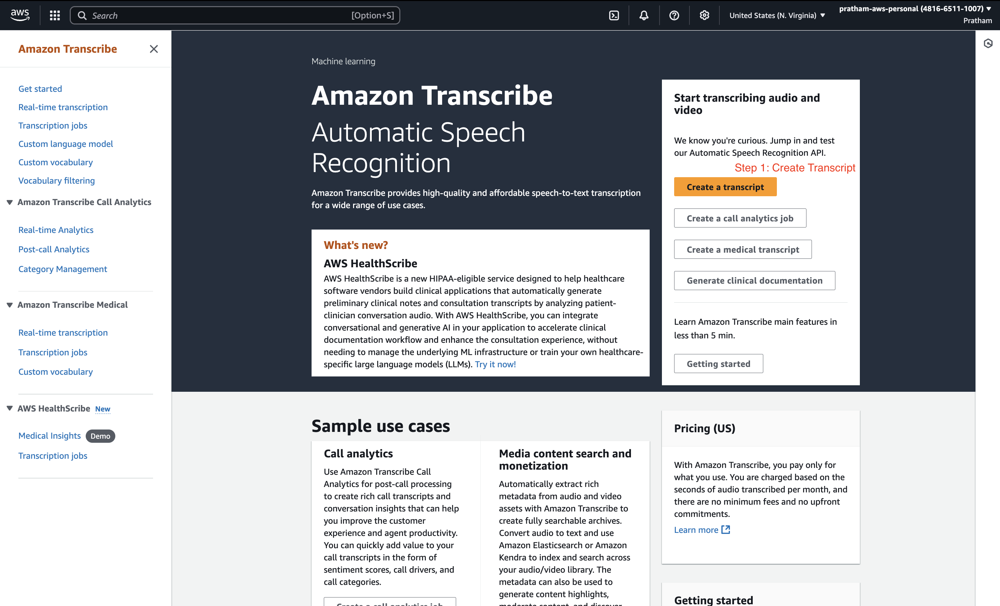
   
   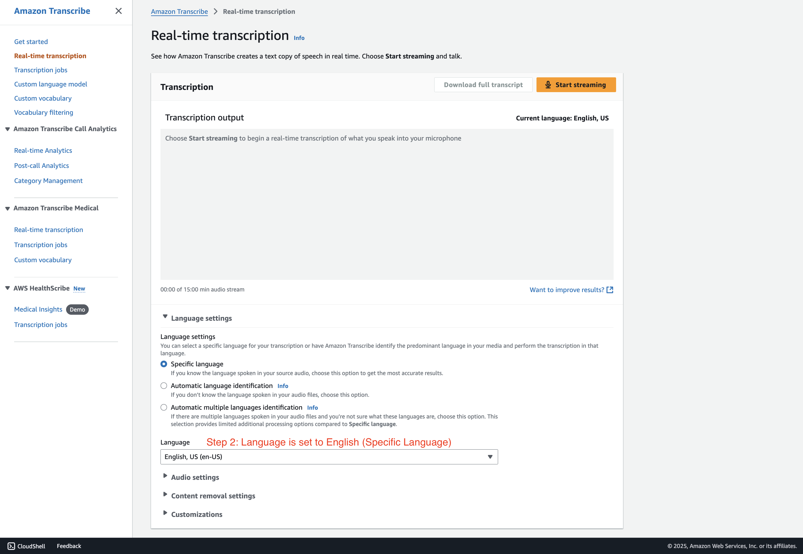

2. Now, if I click on "Start streaming," we can test the service.
   
   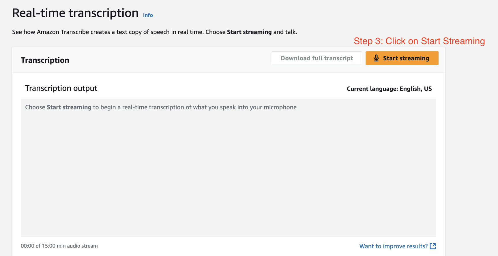

3. Let's provide some audio: `"Hey, I really like this course."`(you have to speak)

4. As you can see, the outcome of the audio gets directly transcribed into some text. So that's pretty cool, right?
   
   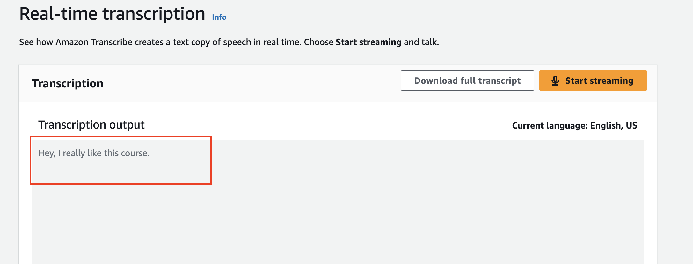

### **Part 2: PII Identification and Redaction**

Here, we will explore how to configure the service to automatically remove sensitive personal information from the transcript.

1. You can also use the setting to remove some content, and you can remove PII (Personally Identifiable Information). I can tell it to "identify and redact it" to remove it. These are the kinds of things that can be removed.
   
   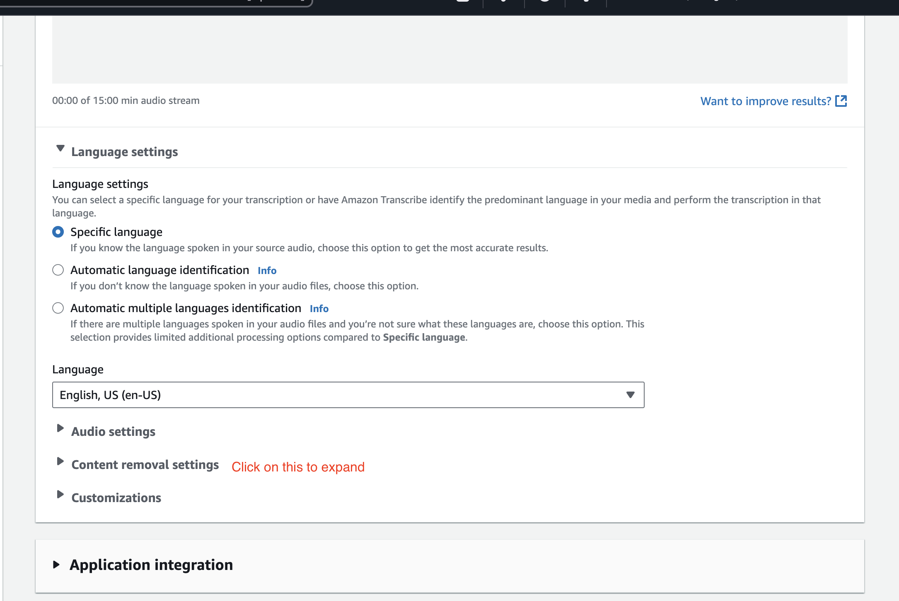
   
   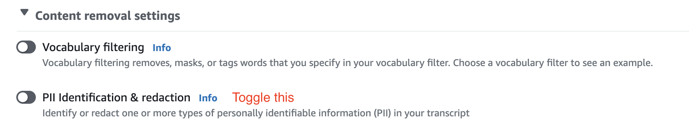

2. Let's have an example and try it out. I'll select the **redaction option**.
   
   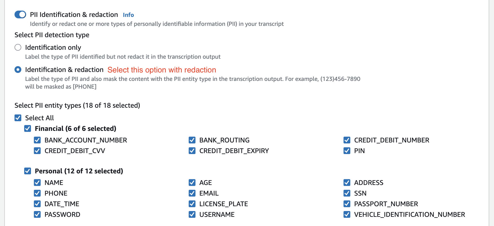

3. Let's start streaming and provide a test sentence containing PII: `"Hello, my name is Pratham. I am 25 years old, and my phone number is 929-425-9336."`
   
   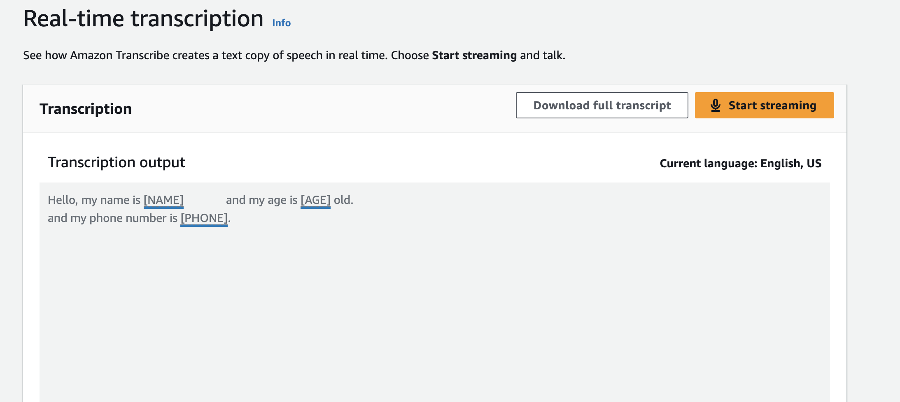

4. And as you can see now, the <u>things got hidden</u>. So my <u>name is hidden</u> and my <u>phone is hidden</u>.
   
   - **Note:** Obviously, this was not my real phone number. You cannot try it.

### **Part 3: Automatic Multi-Language Identification**

The last thing I want to show you is that you can actually stream in multiple languages using automatic language identification.

1. I'll choose two languages for the identification: "English" and "French".
   
   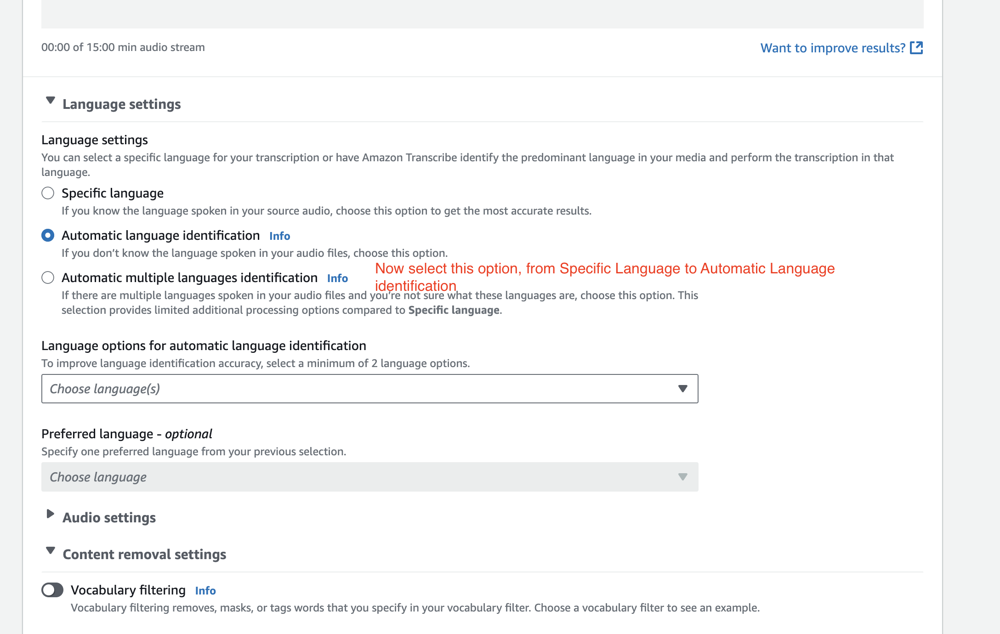
   
   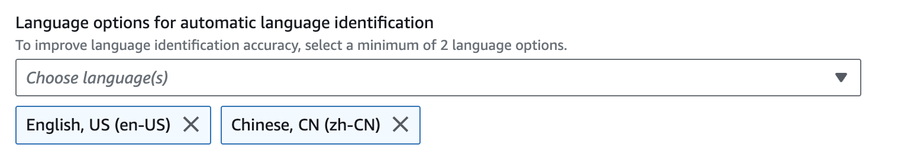

2. Then let's start again by clicking on `Start Streaming`

3. I will speak in both languages to test the recognition: "Hello, this is some recognition happening in English. (speaking in Chinese)"

4. You can see the output identifies and transcribes both languages correctly. Pretty awesome, right?
   
   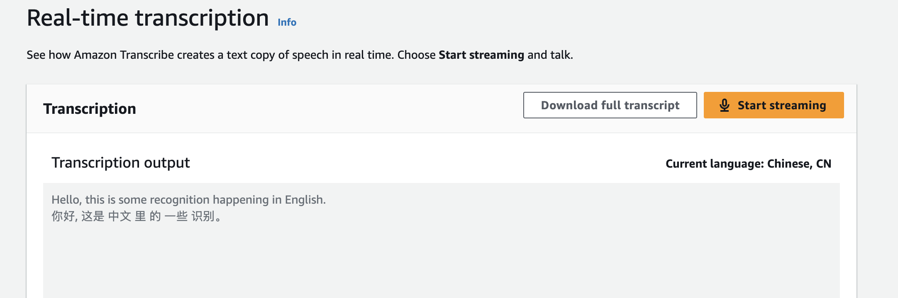

### **Conclusion**

Well, that's it for this overview of Amazon Transcribe. If you want to play some more, you can have a look at all the options in the bottom of the console. But that's it for this lecture. I hope you liked it, and I will see you in the next lecture.
