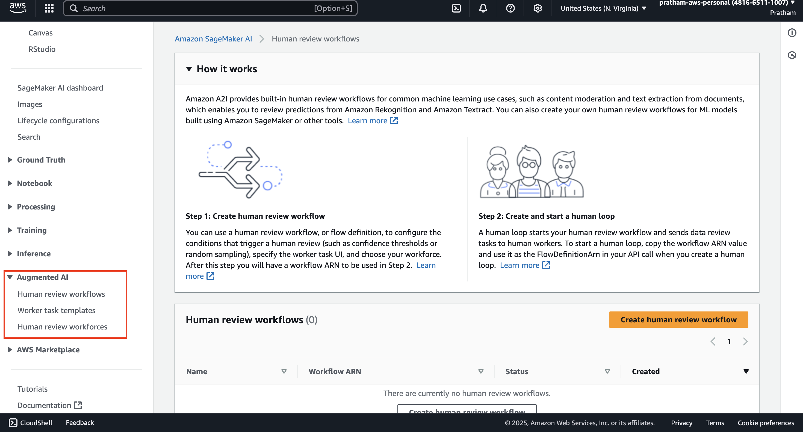
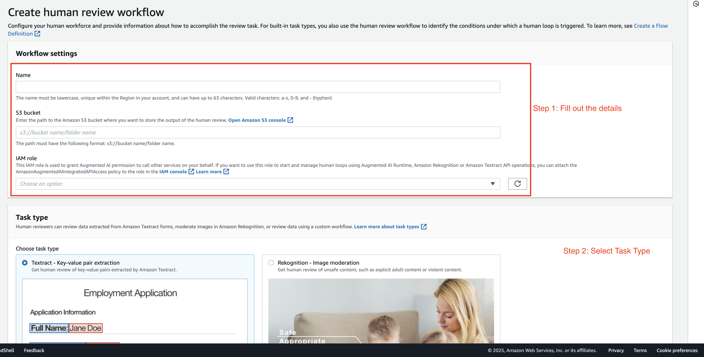
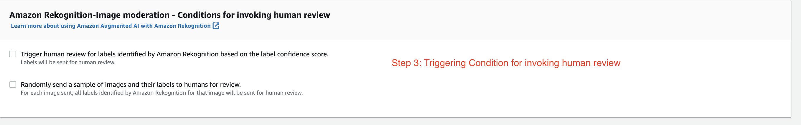
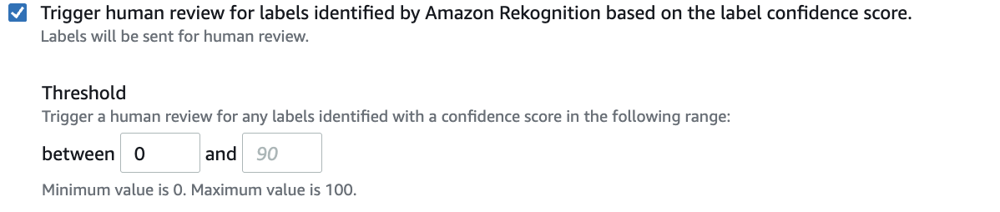
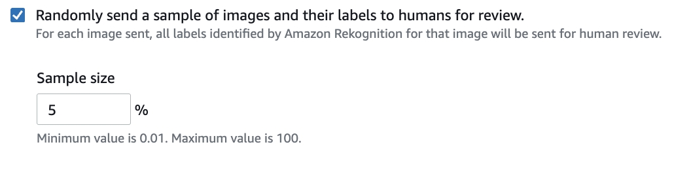
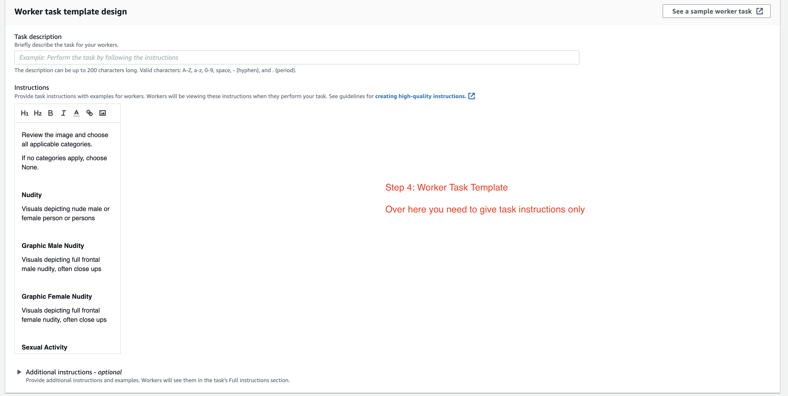
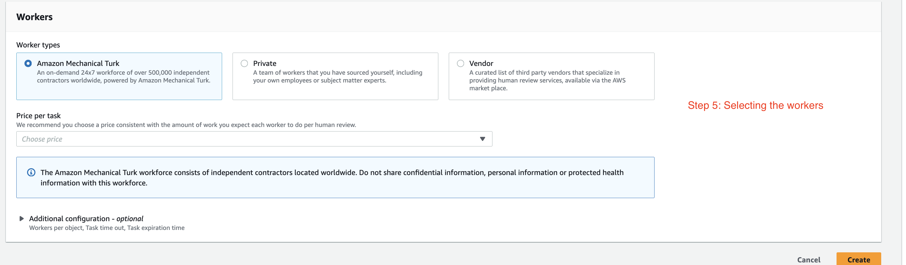

### **Introduction to Amazon Augmented AI**

In this guide, we will explore Amazon Augmented AI (A2I). You will learn 

1. How to navigate to the service, which is part of Amazon SageMaker, and 

2. Create a human review workflow. 

We'll focus on a 

1. common machine learning use case, 
2. content moderation, 

to understand how A2I can be used to review predictions from services like Amazon Rekognition and Amazon Textract, or even from your own custom models.

### **Getting Started with Amazon Augmented AI**

1. Let's have a look at Amazon Augmented AI. In the AWS Management Console, type "augmented AI" in the search bar.
   
   

2. Click on the "Amazon Augmented AI" service in the search results. You will be taken into the SageMaker console, as A2I is now part of Amazon SageMaker.
   
   > **Instructor's Note:** From here, we can set up a human review workflow for very common machine learning use cases, such as **content moderation** or **text extraction** from documents. This allows us to review predictions made by <u>Amazon Rekognition</u>, <u>Amazon Textract</u>, or even your own models using a custom task.

### **Creating a Human Review Workflow**

1. Let's create a `"human review workflow."` I want to show you the different task types available.

2. **Select a Task Type**. We have different ones to choose from:
   
   - **Textract**: To review key-value pair extraction from documents.
   
   - **Rekognition**: To perform image moderation.
   
   - **Custom**: To have your own custom workflow for your own models.
     
     
     
     
   
   **Instructor's Explanation:** For this example, we'll focus on **image moderation** with Rekognition. The purpose of this is to review any unsafe content, such as very explicit adult content or violent content. We want humans to review these images to make sure that the predictions made by Amazon Rekognition are correct.

### **Configuring Conditions for Human Review**

1. Next, we need to define the conditions to invoke a human review on Amazon Rekognition through Amazon Augmented AI.
   
   
   
   **Instructor's Explanation:** We have a couple of options here for triggering a review.
   
   - **Trigger based on confidence scores**: We can tell the system, "Hey, if the label has a low confidence score, for example, between 0% and 50%, then send it to Amazon Augmented AI."
     
     
   
   - **Trigger based on random sampling**: Alternatively, you can also randomly send a sample of all images and their labels for humans to review. For example, we could decide that 5% of our images are going to be sent to Amazon Augmented AI for review, no matter what the confidence score is.
     
     

### **Designing the Worker Task Template**

1. Now you have the worker task template creation and design. This is where you are going to explain what you want the workers to do.
   
   
   
   **Instructor's Explanation:** For example, we might provide the instruction: `"Please review the images and all applicable categories."` The workers will then have to check if they see specific types of content.
   
   The categories they would check for include:
   
   - Nudity
   
   - Sexual activity
   
   - Stuff that could be considered offensive or violent
   
   **Note:** The full description of what goes in here can be quite detailed and is a lot to read.

### **Selecting the Workforce**

1. Finally, we need to decide on the workers. Who will review this kind of work? You have several options for your workforce.
   
   
   
   **Instructor's Explanation of Worker Types:**
   
   - **Amazon Mechanical Turk:** You have access to over half a million independent contractors that will be doing this work for you. You set a price for each task. For example, you could offer 1.20 cents, 2.40 cents, or whatever you want, all the way up to $1 per task. You set the price you want to pay.
   
   - **Private Team:** This is a team of your own employees that can do this kind of review.
   
   - **Vendors:** You can go through the AWS Marketplace to find third-party vendors that will provide you with humans specializing in these kinds of services.

### **Key Takeaways**

And that's it! You have now seen the fundamental steps and concepts for using Amazon Augmented AI to create a human review workflow. The service provides a powerful way to integrate human oversight into your machine learning pipelines, ensuring higher accuracy and reliability for tasks like content moderation and data extraction.
