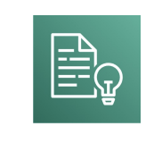
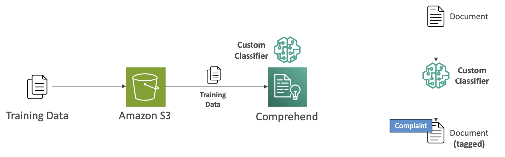
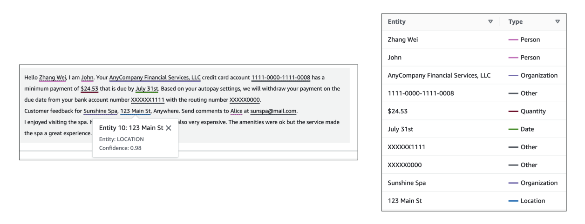
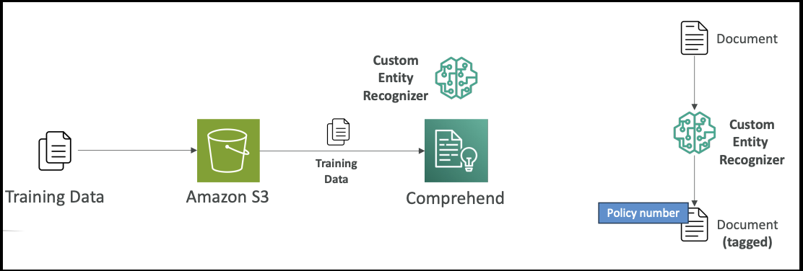

<h1>
  Amazon Comprehend - Natural Language Processing
  
</h1>

Now let's talk about Amazon Comprehend. Amazon Comprehend is used for natural language processing (NLP), and it's a fully managed and serverless service. It's going to use machine learning to find insights and relationships in your text.

> Note that: 
> **Fully managed** means AWS handles all the underlying infrastructure and maintenance for you. You don't need to:
> 
> - Set up or configure servers
> - Install or update software
> - Monitor system health
> - Handle scaling decisions
> - Manage security patches or updates
> 
> You simply use the service through API calls or the AWS console, and AWS takes care of everything behind the scenes.
>
> **Serverless** means you don't have to provision, manage, or think about servers at all.

## **Core Capabilities**

Amazon Comprehend will:
- Understand the language of the text
- Extract key phrases, places, people, brands, or events
- Determine how positive or negative the text is (sentiment analysis)
- Analyze text using tokenization and part of speech analysis if needed
- Organize a collection of text files by topics

## **Use Cases**

Some use cases you have around Comprehend include:
- Analyzing customer interactions such as emails to find what leads to a positive or negative experience
- Creating groups of articles by topics that Comprehend will uncover itself

In Amazon Comprehend, we have an option for advanced settings such as:
- Custom Classification
- Named Entity Recognition (NER)
- Custom Entity Recognition
 
## **Custom Classification**

Here we define how we want Comprehend to categorize the documents for ourselves, so we define them.

For example, we have a bunch of customer emails and we provide several kinds of categories based on the type of customer request, such as:
- Support requests
- Billing requests  
- Complaints

**How it works:**
1. It supports many different types of documents such as text, PDF, Word, and images
2. We create training data and put it in Amazon S3 (look into 1st diagram below)
3. Feed it into Amazon Comprehend, which builds and trains internally a custom classifier
4. When a document arrives (email or whatever you want), the custom classifier will say "this looks like a complaint document" based on how you've defined what complaints look like (look into 2nd diagram below)

You can use custom classification with:
- Real-time analysis (synchronous analysis)
- Multiple documents in batch mode
- Asynchronous analysis for large documents

> Note that: 
> - **Real-time Analysis (Synchronous Analysis)** means You send a document to Comprehend and wait for the response before continuing. You get results immediately (within seconds)
> - **Batch Mode (Multiple Documents)** means You submit many documents at once for processing. All documents are processed together, but you still wait for all results before proceeding.
> - **Asynchronous Analysis (Large Documents)** means You submit documents for processing and don't wait around - Comprehend processes them in the background and notifies you when done.

## **Named Entity Recognition (NER)**

One of Comprehend's main out-of-the-box capabilities is to do **named entity recognition or NER**. This extracts **predefined general-purpose entities** like people, places, organizations, dates, and other standard categories from text.

**Example:**
In a sample text (look the image below), named entity recognition can recognize that:

- <u>Zhang Wei</u> is a **person**
- <u>John</u> is a **person** 
- <u>AnyCompany Financial Services, LLC</u> is an **organization**
- <u>July 31st</u> is a **date**

All these capabilities are available out of the box from Comprehend through named entity recognition.

## **Custom Entity Recognition**

We also have the option to make Comprehend recognize **custom entities**. 

Here we want to analyze the **text for specific terms** and **noun-based phrases**.

For example, you have a document and you want to be able to consistently extract:
- Policy numbers
- Phrases that imply a customer escalation
- Anything related to your business

**How it works:**
1. Train the model with a **list of the entities** you're looking for and documents that contain them (by giving examples) to **Comprehend**
2. A custom entity recognizer gets trained
3. Use it to look for policy numbers within your documents

This can be used for **real-time** or **asynchronous analysis**. (see the above explanation provided for `real-time` and `asynchronous analysis`)

## **Summary**

That's it for Comprehend. Just understand that it is used for **natural language processing and understanding**, and you have the option to have **custom classifications** and **custom entity recognition** if you train the model on top of Comprehend.