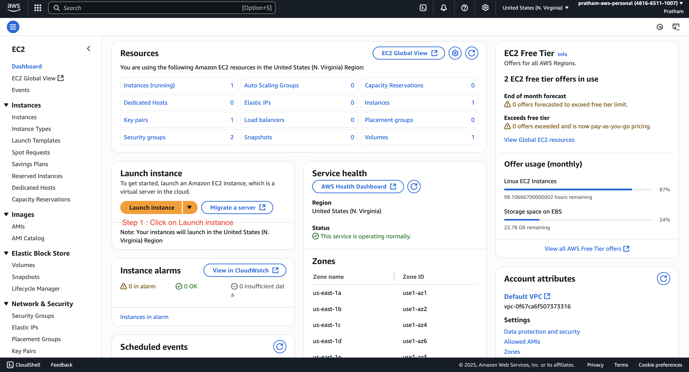
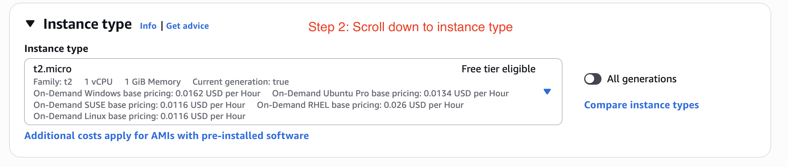
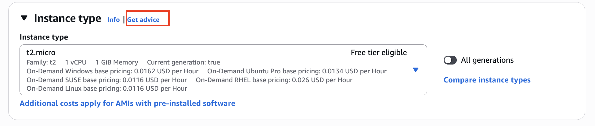
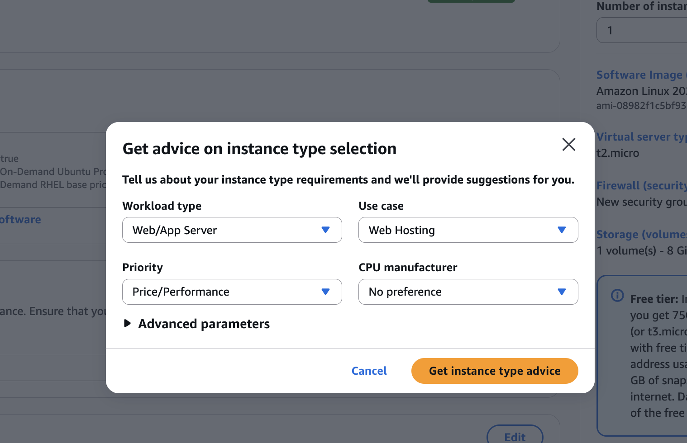
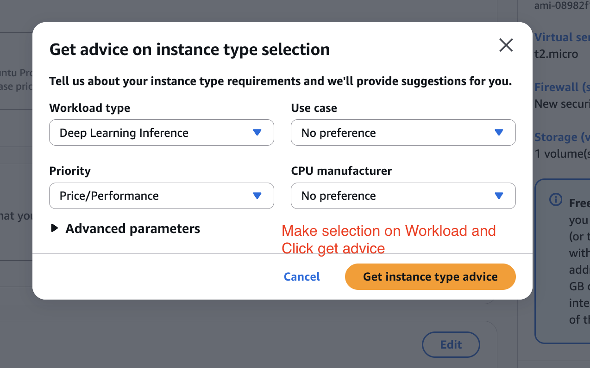
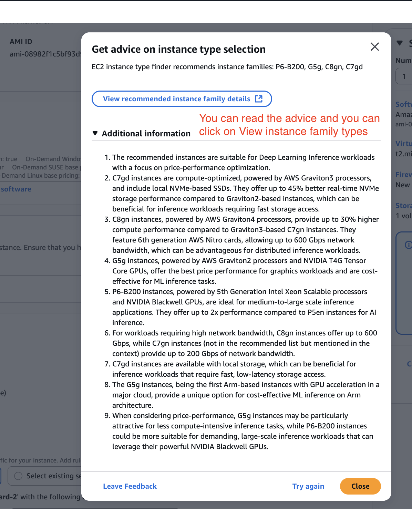
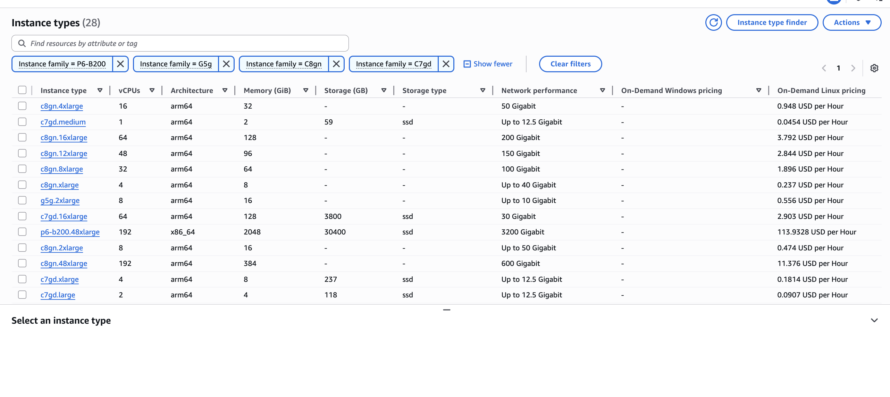
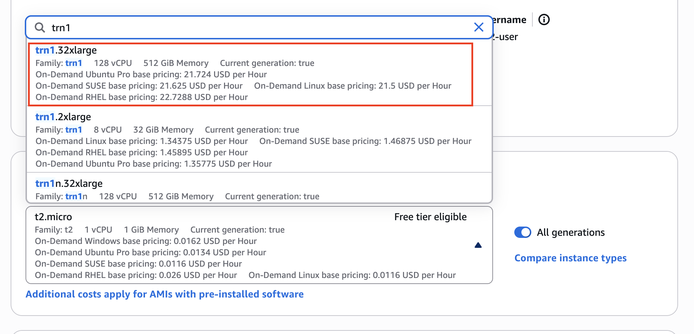
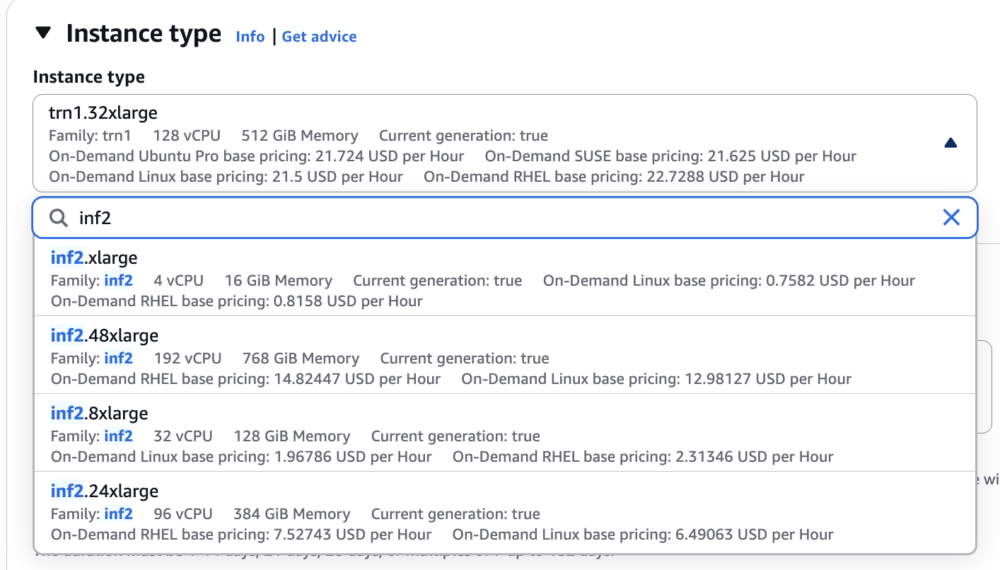

# Amazon Hardware for AI - Hands On

This guide will walk you through how to look at Amazon EC2 to see the instance types that could be good for machine learning purposes. We will explore the **AWS console interface for launching a virtual server in the cloud** and focus specifically on **how to select an appropriate instance type for either training or inference workloads**.

### **Finding an Instance Type with the "Get advice" Tool**

This is how you would launch a virtual server in the cloud. We will start by using the built-in AWS tool to get recommendations.

1. From the EC2 dashboard, begin the process to `Launch an instance`.
   
   

2. Scroll down the page to the section labeled "Instance type". What we're interested in is the instance type itself.
   
   
   
   

3. We can actually get advice right here. Click on "get advice". A new window will pop up.
   
   

4. In the "Get advice on instance types" window, we can specify the kind of workload we have to get advice on the instance type. For this example, select "deep learning inference" as the workload.

5. Click "get advice" to see the recommendations.
   
   

6. Review the recommendations provided by the tool.
   
   - In this case, we get some recommendations around G5g and C7gn.
   
   - The tool also provides information into why these instance types can or cannot be selected.
   
   - You can click on the instance family names to get more details, such as the number of vCPUs they have and so on.
   
   
   
   
   
   > **Note:** It doesn't really say anything about GPUs here, which can be disappointing for now. However, you will find on the documentation itself of AWS that some recommended instances do have GPUs. For example, some instances have an **NVIDIA T4G Tensor Core GPU**, but it's not put here in this table.

7. You can close this window now.

### **Manually Searching for Machine Learning Instance Types**

You can also look for your own instance type directly if you know what you are looking for.

1. In the "Instance type" search box, you can type the name of the instance family you want to find. We will look at examples for both training and inference.

2. **To find an instance for training:**
   
   - Type `trn1` into the search box. We know these instances are going to be great for training your use cases.
     
     
   
   - Click on a result, such as `trn1.32xlarge`, to see its details. As you can see, we have some information around the pricing.

> **Warning:** These instances are very powerful and they cost you $21 to use per hour. Don't ever launch an instance with this right now. This will cost you a lot of money.

3. **To find an instance for inference:** (Inferiatia)
   
   - For inference, we have `inf2` or `inf1`.
   
   - Search for `inf2`. For example, we have `inf2.48xlarge`.
   
   - This instance costs you $14 per hour as well and is very good for inference.
   
   

### **Key Takeaway**

This is where in the UI we set up the settings for selecting the instance type we want to be able to perform machine learning—either training or inference—or more general use cases.

