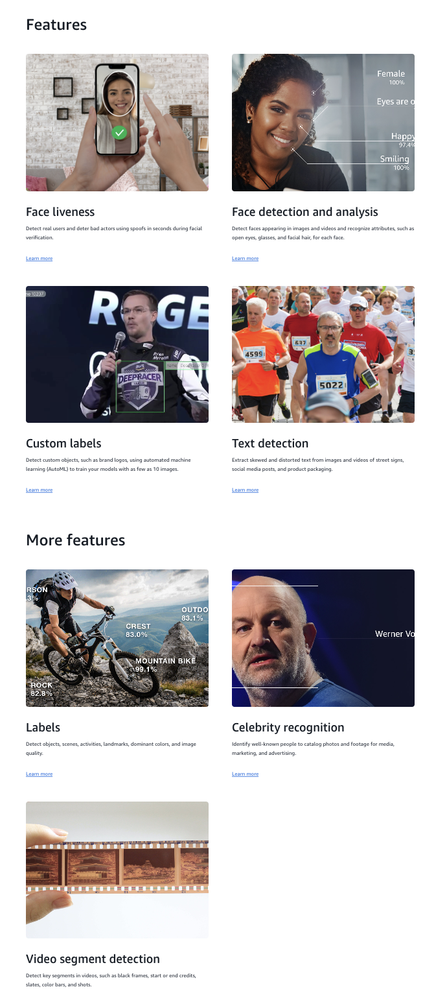
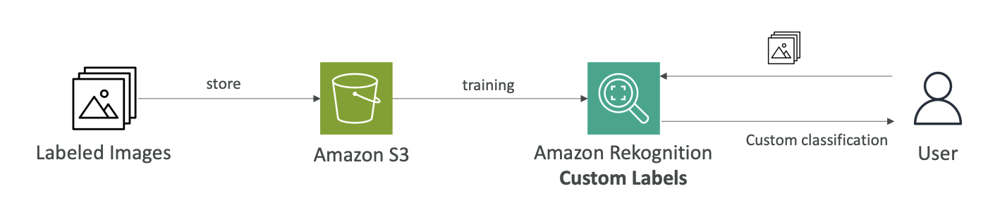
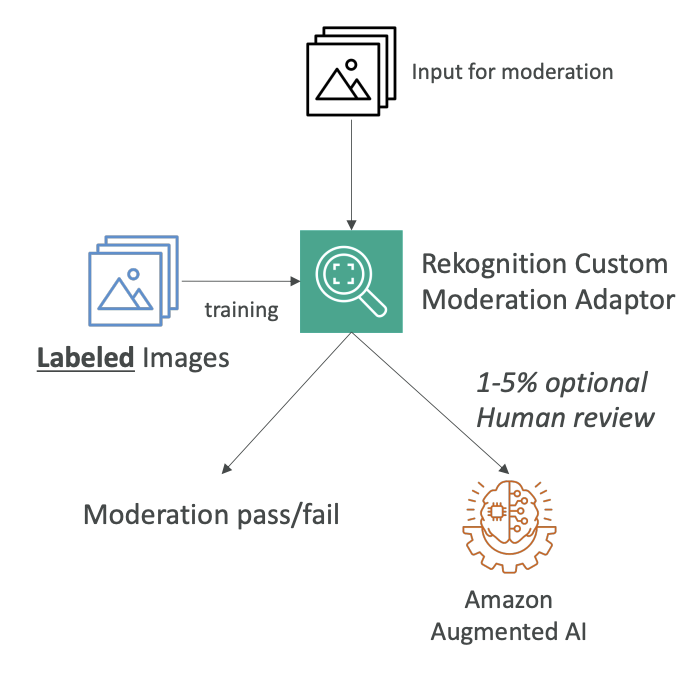
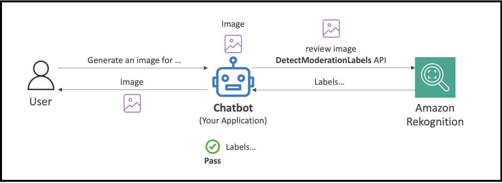

<h1>
  Amazon Rekognition
  
</h1>

Now, let's talk about Amazon Rekognition. It's a service that allows you to find objects, people, texts, or scenes directly in images or videos, and it's using machine learning. You can do facial analysis or facial search if you want to do user verification or counting people in a photo. You can create a database of familiar faces or compare any face you find against celebrities.

## **Use Cases for Amazon Rekognition**
- Labeling
- Content moderation
- Text detection
- Face detection and analysis (understanding gender, age range, emotions)
- Face search and verification
- Celebrity recognition
- Pathing (for example, when doing sports game analysis to understand the path that a ball or player took)

 

  <h2><strong>Key Features and Capabilities</strong></h2>
   <ul>
    <li><strong>Face liveness</strong> - to detect real users and detect bad actors using spoofs in seconds during facial verification</li>
    <li><strong>Face Compare and Search</strong> - Determine the similarity of a Face against another picture or from your private image repository</li>
    <li><strong>Face detection and analysis</strong> - Detect faces appearing in images and videos and recognize attributes, such as open eyes, glasses, and facial hair, for each face.</li>
    <li><strong>Content moderation</strong> - to ensure content is safe for children to watch</li>
    <li><strong>Label detection in pictures</strong> - Detect custom objects such as brand logos etc.</li>
    <li><strong>Text detection</strong> - extract skew and distorted text from images and videos of street signs, social media posts, etc.</li>
    <li><strong>Object labeling</strong> - identifying person, rock, crest, outdoors, mountain bike, etc.</li>
    <li><strong>Celebrity detection</strong> - for example, identifying Werner Vogels in pictures</li>
   </ul>
 

 

Amazon Rekognition is a very broad and useful service that allows you to analyze videos and images and figure out many attributes thanks to AI and machine learning.

## **Custom Labels for Amazon Rekognition**

<u>A feature that may appear in the exam is called **Custom Labels**</u> for Amazon Rekognition. 

The idea is that you want to identify your own products or find your own logo in social media posts. For example, the NFL uses this service to find their own logos in pictures.

### **How Custom Labels Work:**
1. Label training images
2. Upload them to Amazon Rekognition (you need only a few hundred images or less)
3. Amazon Rekognition creates a custom model based on your images
4. The model becomes able to recognize what your logo or products look like
5. New images analyzed by Custom Labels will be checked for whatever you're looking for

### **The Process:**

1. Label images and store them in Amazon S3 (a bunch of images with your logo or products)
2. Train Amazon Rekognition to create Custom Labels
3. When users post on social media, you can analyze pictures and quickly determine if your logo appears in that picture, which could be beneficial for your brand

## **Content Moderation**

The idea here is that you want to <u>automatically detect inappropriate, unwanted, or offensive content</u>. This could be very handy for your own social media page to filter out harmful media images or figure out if advertising is wrong.

### **Content Moderation Benefits:**
- Brings down the number of human reviews to about 1-5% of content volume
  - Because you don't want to review everything that's been flagged

- For human review needs, there's **Amazon Augmented AI (Amazon A2I)**

> **Amazon Augmented AI (Amazon A2I)** is a separate AWS service that handles human review when AI isn't confident enough to make a decision on its own.

### **Custom Moderation Adapter**
Beyond basic, out-of-the-box content moderation, it's possible to create a **custom moderation adapter**. 

- You extend Rekognition's capability by providing <u>your own labeled set of images and defining what you want to moderate in or out</u>. 
- This can either <u>enhance the accuracy of content moderation</u> or address specific use cases.

  

    <h3><strong>How Custom Moderation Works:</strong></h3>
    <ol>
      <li>Label your images</li>
      <li>Train a Rekognition Custom Moderation Adapter</li>
      <li>When images arrive for moderation, they either pass or fail</li>
      <li>If Rekognition has doubt, 1-5% can be sent for human review</li>
      <li>Use Amazon Augmented AI to make final decisions on these images</li>
      <li>The assessment results can be fed back into Rekognition training</li>
    </ol>
  

  

## **Content Moderation API Example**

Here's an example of how you can use the Rekognition Content Moderation API:

**Scenario:** You've developed a chatbot application that can generate images.

**Process:**
1. User says: "Hey, please generate an image for this"
2. The chatbot generates the image
3. You don't know if the image is safe to return to the user yet
4. Use Amazon Rekognition and send the image with the `DetectModerationLabels` API
5. Amazon Rekognition examines the image and creates labels
6. If the labels are clear of any unsafe or harmful content, the chatbot says "Okay, it's safe to return this to the user"
7. The user receives the image

This is a very simple way to use the Content Moderation API from Rekognition to implement safety in your applications.