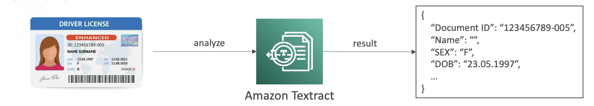

<h1>
  Amazon Textract
  
</h1>

Now that we understand the basics, let's talk about Amazon Textract. Amazon Textract is used to extract text, hence the name. You can extract text, handwriting, or data from any scanned document, and behind the scenes, it uses AI and machine learning.

## **How It Works**

For example, you have a driver's license and upload it into Amazon Textract. It will automatically be analyzed, and the results will be given to you as a data file. You'll be able to extract specific information such as:

- Date of birth
- Document ID
- Any other relevant data

## **Capabilities**

Amazon Textract can extract data from various sources:

- Forms and tables
- PDFs
- Images
- Any scanned documents

## **Use Cases**

The use cases for extracting text are multiple and span across different industries:

### **Financial Services**
- Process invoices
- Analyze financial reports

### **Healthcare**
- Extract data from medical records
- Process insurance claims

### **Public Sector**
- Handle tax forms
- Process ID documents
- Manage passport information

Amazon Textract provides a comprehensive solution for automated document processing across various industries and document types.