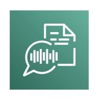
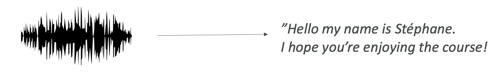
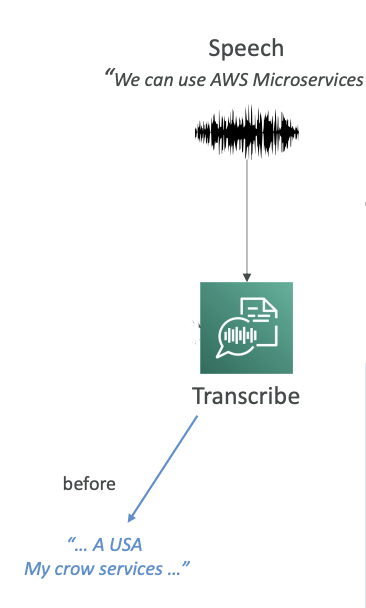
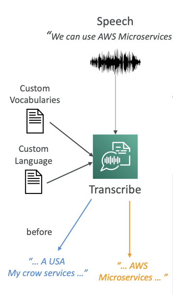
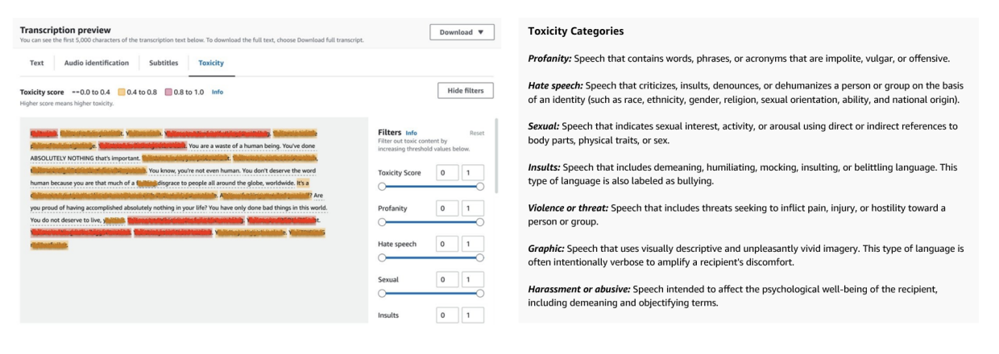

<h1>
  Amazon Transcribe
  
</h1>

Now let's talk about Amazon Transcribe. As the name indicates, it allows you to automatically **convert speech into text**. So you pass in some audio and automatically it's going to be transcribed into text. For example, you could say "Hey, hello, my name is Stephane and I hope you're enjoying the course!" and it would convert that speech to text.

## **How Amazon Transcribe Works**

Amazon Transcribe uses a deep learning process called **ASR (Automatic Speech Recognition)** to convert speech to text very quickly and accurately.

## **Key Features**
Some of the features that you need to know about Amazon Transcribe:
- **Automatic PII Removal**: You can automatically remove any personally identifiable information using redaction. For example, if you have someone's age, name, or social security number, this can be automatically removed.

- **Automatic Language Identification**: You have access to automatic language identification for multilingual audio. If you have some French and some English and some Spanish, Transcribe is smart enough to recognize all of those languages.

## **Use Cases for Amazon Transcribe**

1. Transcribe customer service calls
2. Automate closed captioning and subtitling  
3. Generate metadata for media assets to create a fully searchable archive

## **Improving Transcribe Accuracy**

There's a way for you to improve the accuracy of Amazon Transcribe. We can allow Transcribe to capture **domain-specific** or **non-standard terms** such as <u>technical words</u>, <u>acronyms</u>, and <u>jargon</u>.

**Example Problem**: Say we use speech and we say "AWS Microservices" but Transcribe is giving us "USA my crow services," which sounds a little bit like AWS microservices, but not exactly.

    

So how can we improve this?
### **1. Custom Vocabularies (for words)**

We can have custom vocabularies for **words**. 
- Here we can add **specific words, phrases, or domain-specific terms**. 
- It's very good if you have a **brand name or acronyms** that you're using all the time. 
- You can **increase the recognition of a new word by providing hints** such as how to pronounce it.

Once we have this custom vocabulary, we can recognize very specific terms such as AWS.

### **2. Custom Language Models (for context)**

Custom language models are for **context**. 
- Here we're going to train the Transcribe model on our own <u>domain-specific text data</u>. 
- This means that if you have a large volume of domain-specific speech, you are going to give Transcribe the chance to learn the **context associated with a given word**.

**Example**: If you are dealing with <u>crows or birds</u>, you may have the option to say you have a "crow service" or "my crow service." But if you are doing a lot of <u>IT work</u>, then "microservice" for you is <u>one word</u>. By providing **custom language models**, you're not teaching new words to Amazon Transcribe, but you're <u>giving the context of what you're trying to do</u>, and therefore Transcribe will know what word to use.

**Best Practice**: Use both custom vocabularies and custom language models for highest transcription accuracy.

**Result**: In our example, now that we have enabled a custom vocabulary and a custom language model, Transcribe knows how to convert our speech to "AWS Microservices."

    

## **Toxicity Detection Feature**

Transcribe also has a toxicity detection feature. This is machine learning powered, of course, and you can directly use a voice sample to detect toxicity.

### **How Toxicity Detection Works**

There are two types of data being leveraged for toxicity detection:

1. **Speech Cues**: The actual tone and pitch of the audio is going to be looked at. If someone seems angry in their voice tone, it's going to be flagged.

2. **Text-Based Cues**: If someone is saying profanities or hate speech, then of course it's going to be detected.

The beauty here is that it's the combination of both the audio and the text that is going to be helpful to detect toxicity in a sample.

### **Toxicity Categories**

You have a lot of categories that your toxicity can be classified into:

- Sexual harassment
- Hate speech  
- Threats
- Abuse
- Profanity
- Insult
- Graphic

**Note**: This feature is something that can come up at the exam, so keep it in mind.