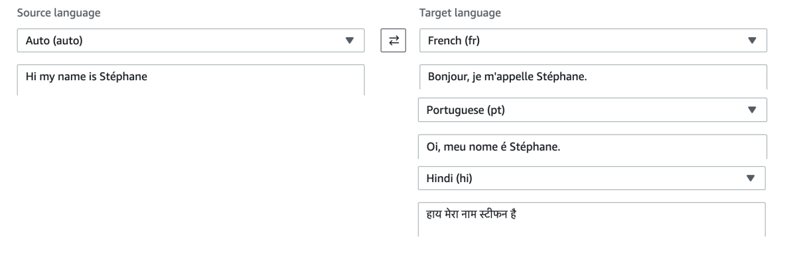

<h1>
  Amazon Translate
  
</h1>

Now let's talk about Amazon Translate. As the name indicates, Translate is a natural and accurate language translation service. 

**Key Features and Benefits:**
- Allows you to **localize content** for **international users**
- Perfect for **translating websites** and applications
- Efficiently **translates large volumes of text**

**Translation Examples:**

Here are some practical examples of how Amazon Translate works:

**Summary:**

Amazon Translate is a super easy service that provides natural and **accurate language translation capabilities**, making it simple to reach **international audiences** through your applications and websites.