<h1>
  Amazon Comprehend - Hands On
  
</h1>

This guide provides a step-by-step walkthrough of Amazon Comprehend, based on the instructor's demonstration. We will explore how to use its built-in **natural language processing (NLP)** capabilities to <u>analyze text </u>and then learn <u>how to train a custom model to classify text</u> based on your own <u>specific categories</u>.

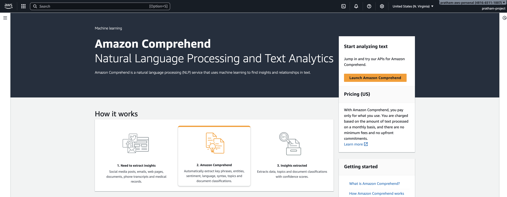

### **Part 1: Exploring Built-in Text Analysis in the AWS Console**

This first part of the tutorial demonstrates how to use the real-time analysis features directly within the AWS Comprehend console to process unstructured text and extract structured information.

1. Navigate to the Amazon Comprehend console. You will see an option to experiment with the service directly.
   
   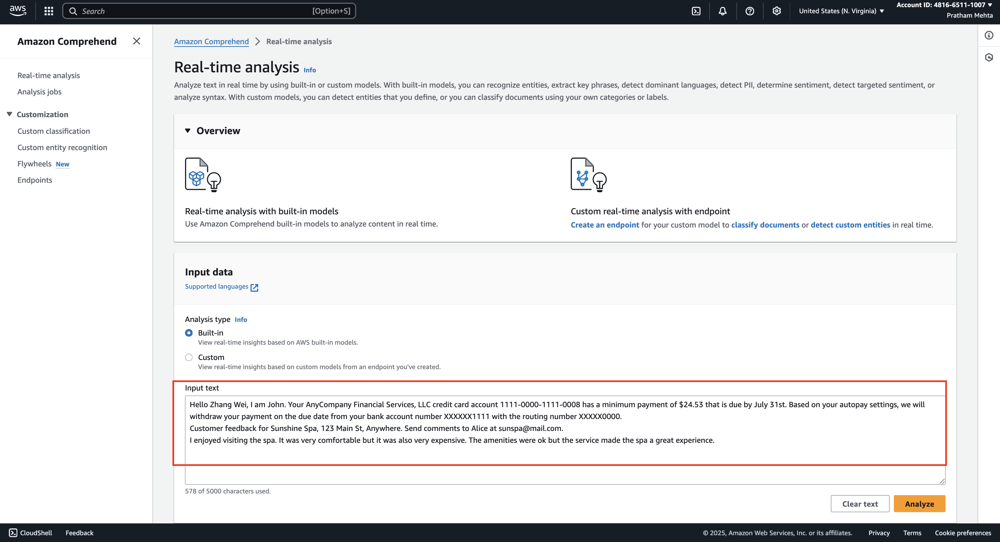

2. The console provides a default sample text about **a spa experience**. First, remove this text from the input box.(see the image above)

3. Next, we will use a new message from a financial company. Input the following text, which informs a person that they have a minimum payment due. (see the image below)
   
   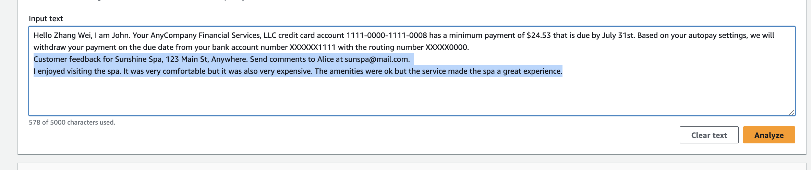
   
   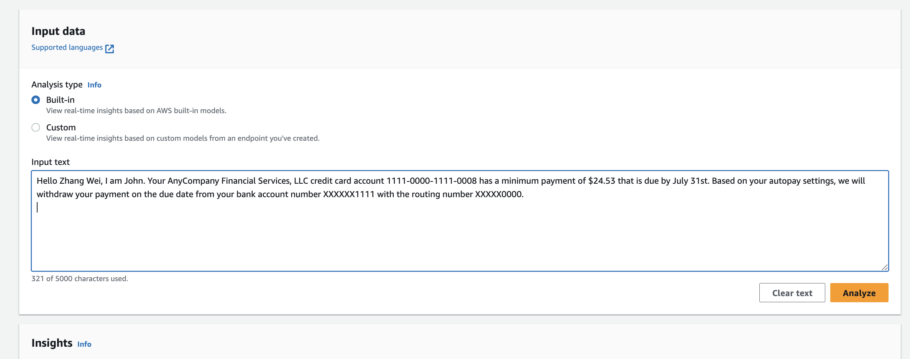

4. With the text entered, click the "Analyze" button to see the results. Comprehend will now process the text and display its findings in several tabs.
   
   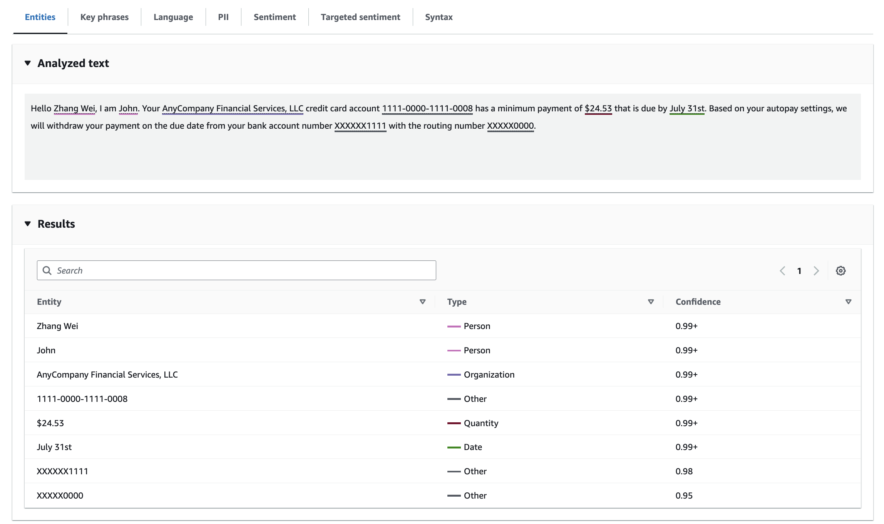

#### **Reviewing the Analysis Results**

Now, we will examine the different types of analysis Comprehend has performed on our text.

- <u><mark>Entities</mark></u>
  
  The first results you'll see are the entities extracted from your text. The key takeaway here is that Comprehend takes unstructured data and transforms it into a structured format.
  
  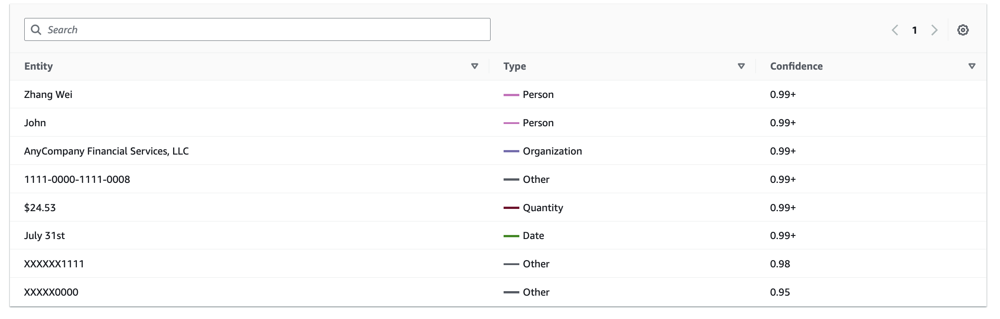
  
  The service identified the following entities:
  
  - **Person:** Zhang Wei, John
  
  - **Organization:** Any Company Financial Services
  
  - **Quantity:** A specific monetary amount was found.
  
  - **Date:** The due date was identified.
  
  - **Other:** Some items were classified as "Other" because the service doesn't know what they are just yet.

- <mark>Key Phrases</mark>
  
  This tab shows the most important phrases found within the text, giving you a quick summary of the main topics.
  
  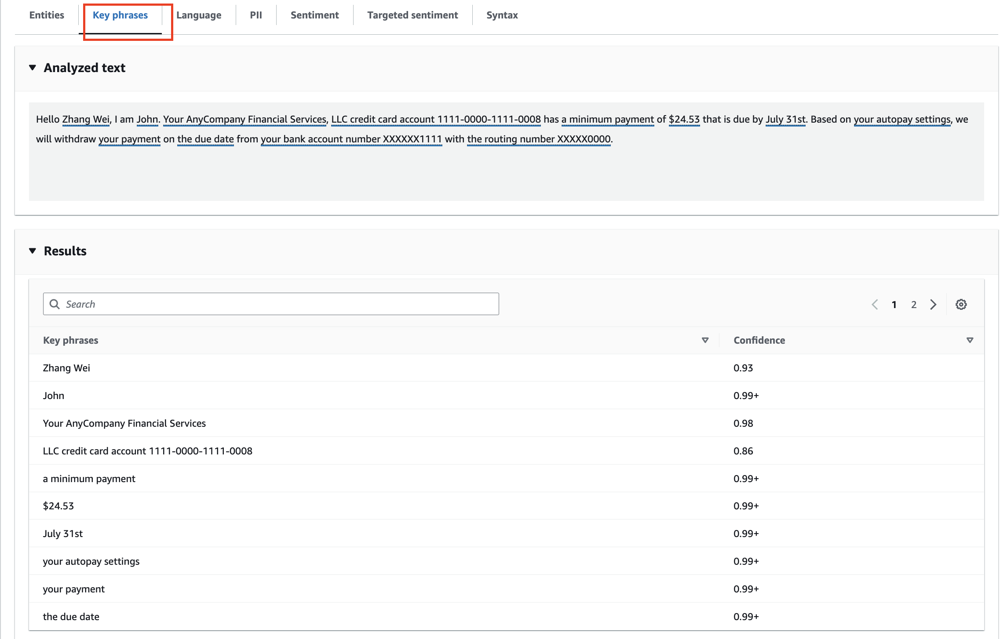

- <mark>Language</mark>
  
  Here, the service detects the language of the source text. In this case, it correctly identifies the text as <u>**English with 99% confidence**</u>.
  
  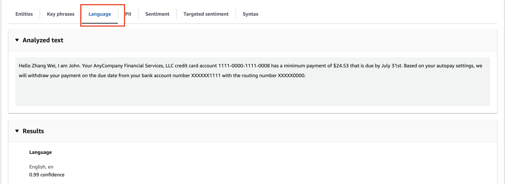

- <mark>PII (Personally Identifiable Information)</mark>
  
  This is the analysis mode for personally identifiable information. Comprehend automatically detected several pieces of sensitive data.
  
  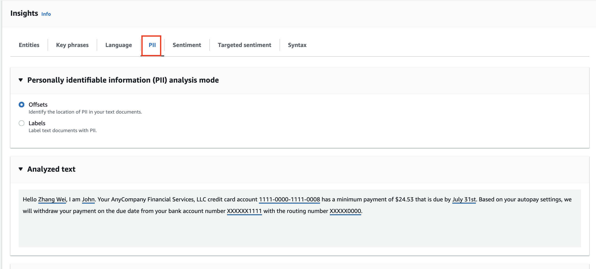
  
  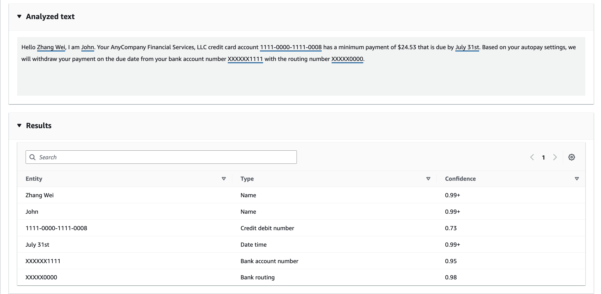
  
  So based on the image above, we can observe that:
  
  - Two person's names (i.e. `Zhang Wei` and `John`)
  
  - A credit card account number (i.e. `1111-0000-1111-0008`)
  
  - A due date (i.e. `July 31st`)
  
  - A bank account number (i.e. `XXXXX1111`)
  
  - A routing number (i.e. `XXXX0000`)
  
  **Note:** This feature is very handy if you are trying to process <u>data in **batch**</u> and need to identify and handle sensitive information automatically.

- <mark>Sentiment</mark>
  
  This analysis is about understanding the <u>tone of the text</u>. For our financial notice, the result is:
  
  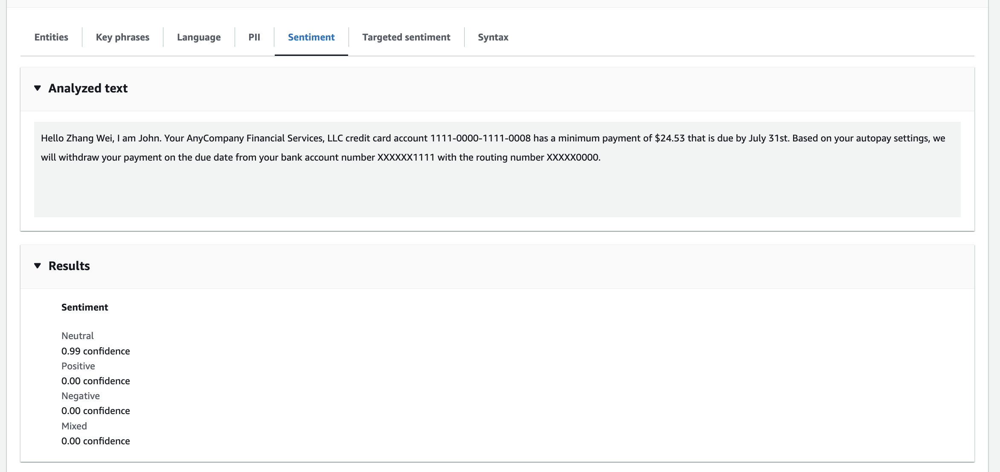
  
  - **Neutral:** 99% confidence
  
  The text is classified as neutral because it is an informational message, not expressing positive, negative, or mixed feelings.
  
  **Key Learning:** Sentiment analysis can be very handy in other scenarios. For example, if you are building a customer service app, you could use it to understand the quality of the interactions between your support agents and your customers by analyzing the tone of their conversations.

- <mark>Targeted Sentiment</mark>
  
  This feature is about understanding how the sentiment was built by associating it with specific entities.
  
  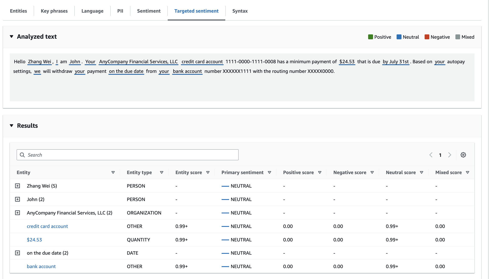

- <mark>Syntax</mark>
  
  This final tab is used to understand the <u>grammatical syntax of the sentences</u>. It breaks down the text and identifies <u>parts of speech</u>.
  
  - For example, it shows what is a noun, what is a proper noun, what is punctuation, and so on.
  
  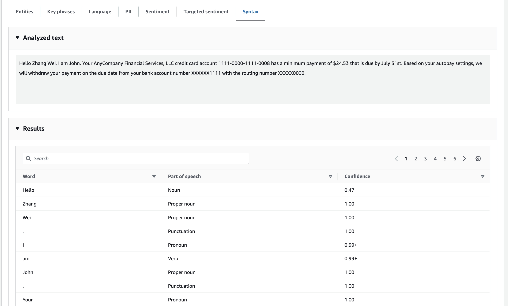

### **Part 2: Understanding Analysis Jobs and Custom Classification**

While the console is great for real-time analysis, Comprehend also offers more powerful features for handling large datasets and custom needs.

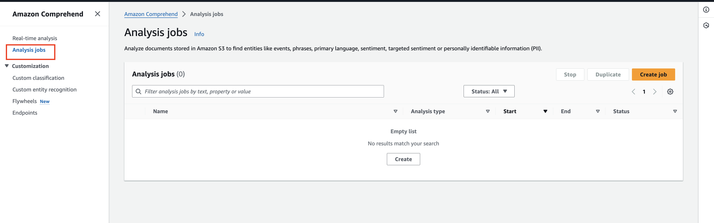

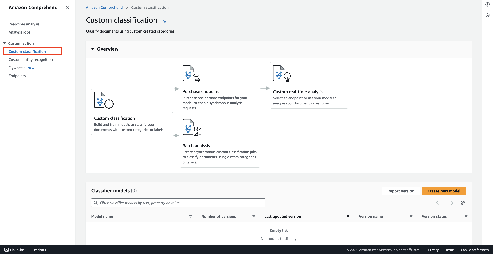

- <mark>Analysis Jobs</mark>
  
  This feature allows you to analyze **a lot of data at once**. You can point Comprehend to your data stored in **<u>Amazon S3,</u>** and it will process it in a <u>batch job</u>.

- <mark>Custom Classification</mark>
  
  Custom classification is about creating your own custom categories and then asking Comprehend to classify incoming text based on those categories.
  
  **Use Case Example:** Imagine you have a support service. You could use custom classification to automatically categorize incoming customer questions. For example:
  
  - Is the question about billing?
  
  - Is it about product support?
  
  - Is it a feature request?
  
  - Is it an account problem?
    
    You would create these categories, and Comprehend could categorize support tickets for you.

#### **Steps to Create a Custom Classifier**

1. To get started, you would select the option to **"Create a new model."**
   
   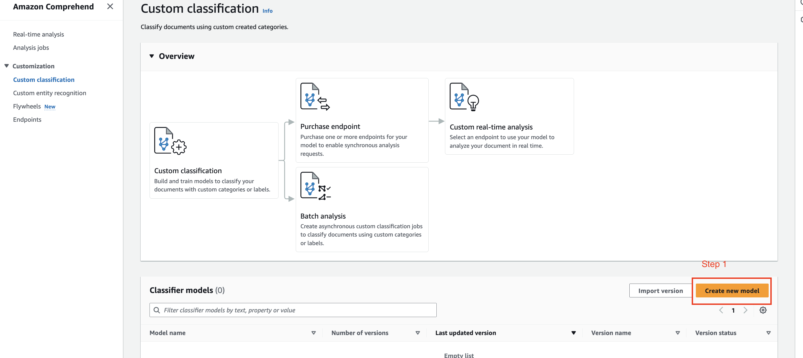

2. Next, you must provide **training data.** This is how you teach Comprehend to understand how you want your text to be classified.
   
   **Concept Explanation: Training Data**
   
   The training data consists of examples that show **Comprehend** the correct category for a given piece of text. 
   
   The console provides an example of classifying text as either "Comedy" or "Drama."
   
   - You provide a long text and label it "Comedy."
   
   - You provide another long text and label it "Comedy."
   
   - You provide a different text and label it "Drama."
   
   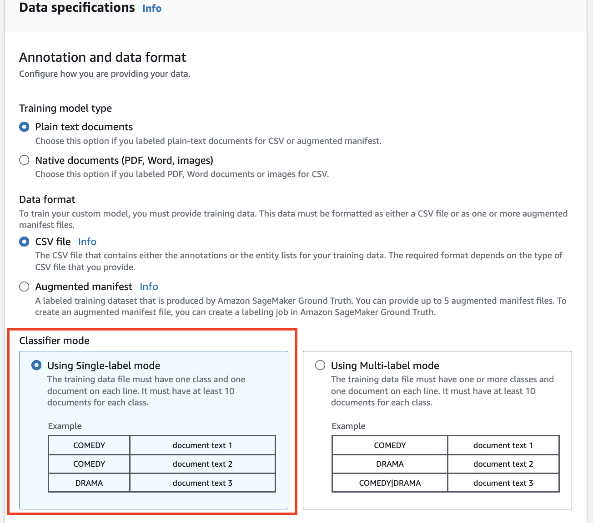
   
   For our business example, you might provide 10 emails from customers asking about billing issues (e.g., "my credit card is not working," "I want to understand my bill"). You would create a CSV file containing these examples.

> **Note:** You need to have **at least 10 documents** for each class (category) you want to classify. Of course, the more data you provide, the better the model's accuracy will be.

3. You then put your training data file onto **Amazon S3**.
   
   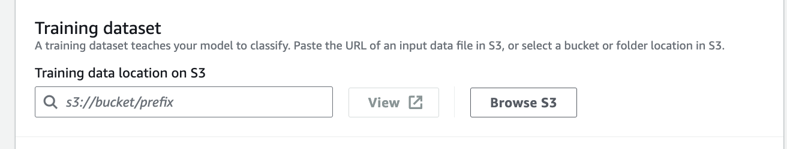

4. Finally, you **train the classifier** using the data you provided. Comprehend will build a custom model for you.

#### **Using Your Trained Custom Classifier**

1. Once you have built your classifier, you need to purchase a **"custom endpoint."**
   
   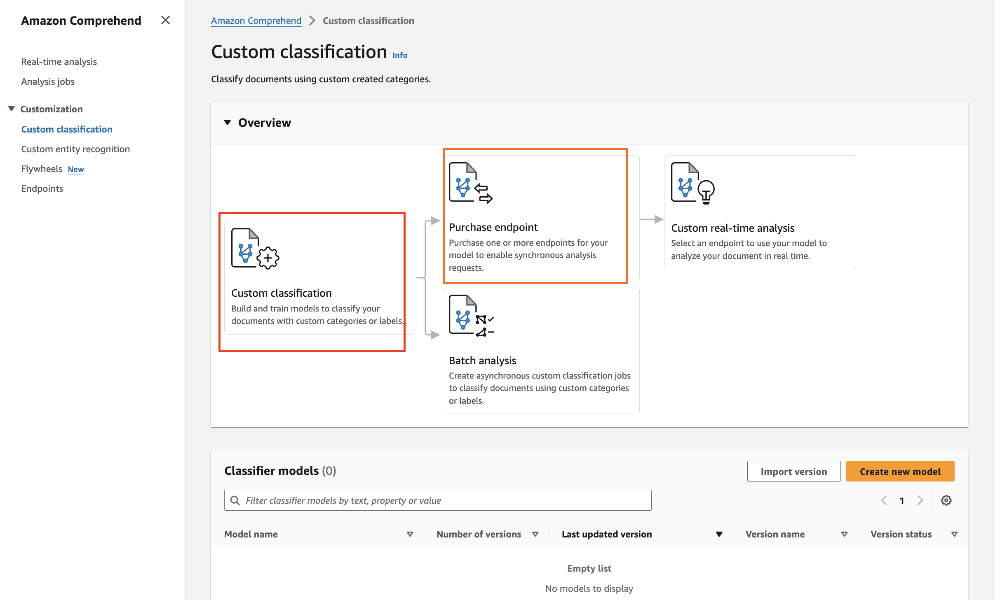

2. This **<u>endpoint</u>** allows you to perform requests to your custom model to conduct real-time analysis. You can send new, unseen documents to the endpoint, and it will classify them for you based on the training it received.
   
   > **Key Takeaway:** This capability is very handy for customer service purposes, but it's also useful anytime you need to **<u>classify text-based data according to your specific business rules</u>**.
