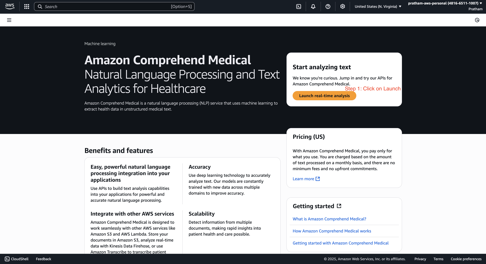
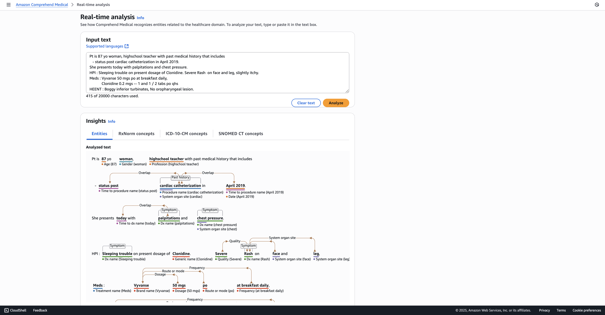
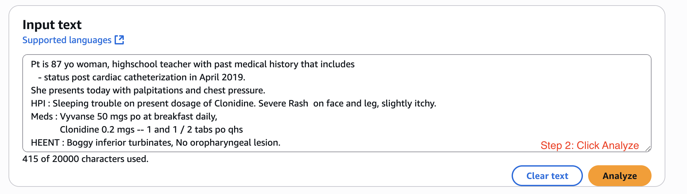
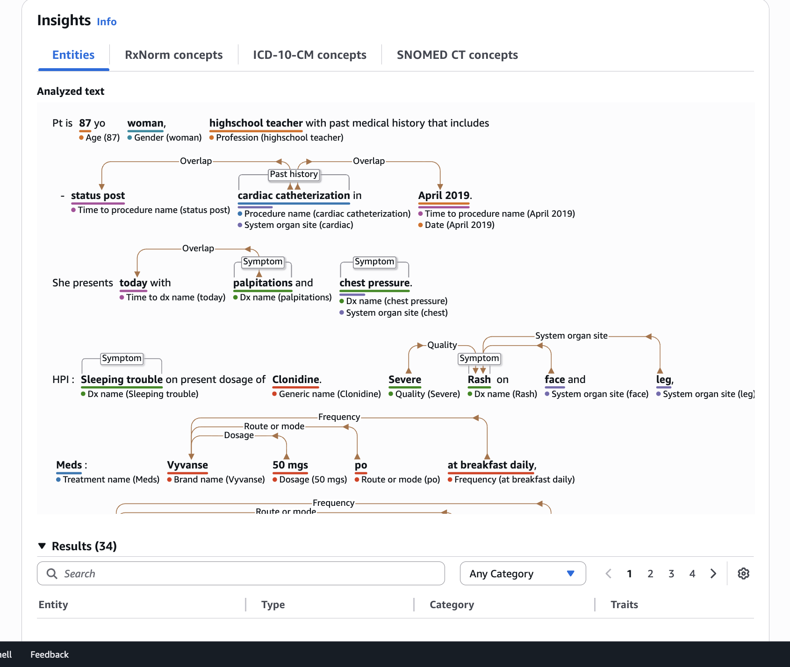
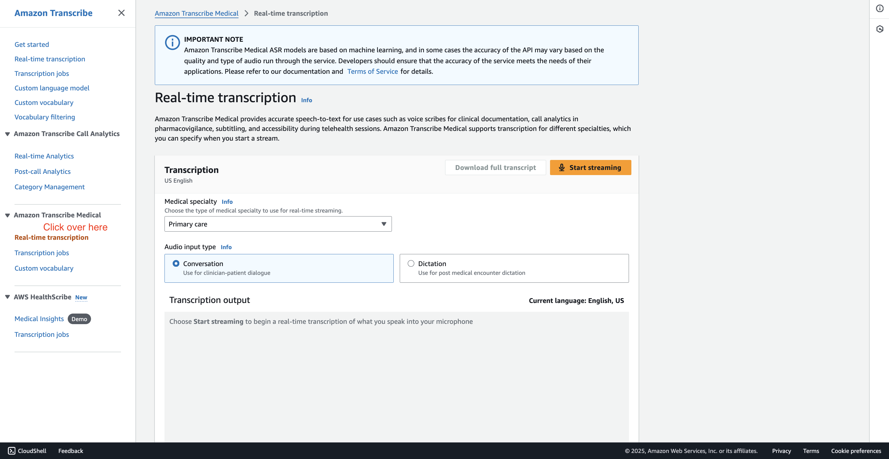
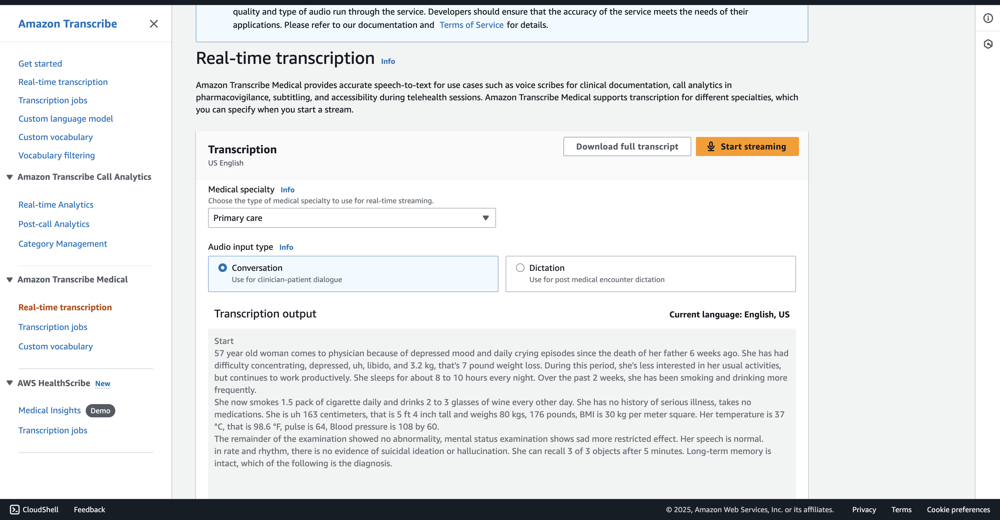

# Comprehend Medical & Transcribe Medical - Hands On

This lesson provides a quick, hands-on demonstration of the capabilities of two AWS services: 

1. Comprehend Medical and 

2. Transcribe Medical. 

We will not spend too much time on them, but will walk through the **real-time analysis features of each** to show you what is possible.

### **Demonstrating Comprehend Medical**

We'll start by using the Comprehend Medical service to analyze some sample text and see how it extracts <u>meaningful medical information</u>.

1. From the service console, click on **"launch realtime analysis."**
   
   
   
   - **Instructor's Explanation:** This brings you to an interface with an input text field, which is pre-populated with some sample doctor's notes for our use.
   
   

2. Before analyzing, take a moment to review the input text provided.
   
   - **Instructor's Explanation:** We have a patient who is an 87-year-old woman. Because these are doctor's notes, the text can be very compressed. For example, you'll see things like, `"PT is 87 YO."` This can be very complicated for a <u>typical program to understand and analyze</u>. Looking at the **medications**, we again have abbreviations like `"PO"` and `"PO QHS,"` which are <mark>specific, doctor-related notes</mark>.

3. Now, click the `"analyze"` button.
   
   
   
   - **Instructor's Explanation:** When you do this, Comprehend Medical is going to process that text to comprehend exactly what is happening and present you with the extracted entities.
   
   

4. Review the analysis results.
   
   - **Instructor's Explanation:** You can see it correctly identified "87" as the `AGE`, `"woman"` as a `GENDER`, and `"high school teacher"` as a `PROFESSION`, and so on.
   
   - **Key Concept: Understanding Relationships:** There are a lot of concepts that are linked together. For example, 
     
     1. the service understands that the symptom is "overlapping with today." It knows the relationships between all these things, which would allow you to build your own application down the road. 
     
     
     2. We know that, for example, a **specific dosage** is related to a specific brand name. And `"PO"` is the **route** or the **mode** that's again related to this **brand name**. This is very interesting, definitely just doctor-related stuff.
     
     > **Note:** All of this can be extracted based on different levels of insights. Honestly, I'm not going to go through all of this because this is way beyond the idea of this course.
   
   - **Key Takeaway:** You now understand that using Comprehend Medical, you can analyze medical texts.

### **Demonstrating Transcribe Medical**

Next, we will look at Transcribe Medical, which is actually found within the main Transcribe service UI.

1. Navigate to the Amazon Transcribe console. On the left-hand side, you will find and click on **"Amazon Transcribe Medical."**
   
   
   
   - **Instructor's Explanation:** This is a real-time transcription service specifically for medical discussions.

2. Start the real-time transcription and speak a medically-related phrase.
   
   - **Instructor's Explanation:** I'm not a doctor, I'm a teacher of AWS, so I'm not going to be able to say many interesting things, but for example, I will say, `"I have a cough and I think maybe it's COVID-19."`
   
   
- **Key Takeaway:** You get the idea behind Amazon Transcribe Medical and how it works for real-time medical dictation.
