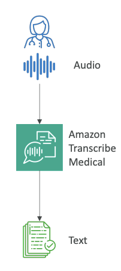
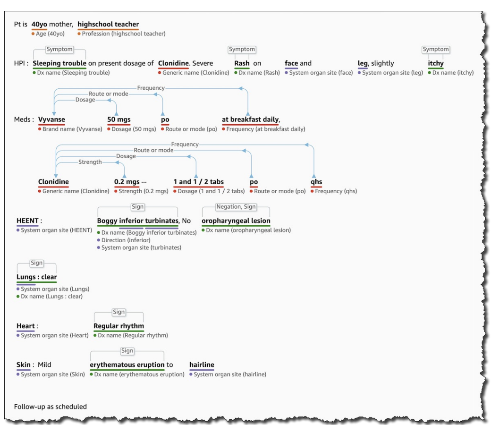

Now, let's talk about AI services for the medical space. We've seen Amazon Transcribe, but there is a version of it that is specifically geared for this field.

### **Amazon Transcribe Medical**

This service allows you to **automatically convert medical-related speech into text**. It is specialized for the **medical space because it is HIPAA compliant**, which means you can use it in <u>regulated environments</u>. When your audio goes through Amazon Transcribe Medical, you get text that specializes in medical terminologies.

- **It understands terms like:**
  
  - Medicine names
  
  - Procedures
  
  - Conditions and diseases

- It supports **Transcription Options** like:
  
  1. **Real-time:** Use a microphone to transcribe live speech.
  
  2. **Batch:** Upload audio files for transcription.

- **Use Cases:**
  
  - Create voice applications that enable physicians to dictate medical notes.
  
  - Transcribe phone calls that report on drug safety and side effects.

### **Amazon Comprehend Medical**

Once you have text from the audio, you can do even more with Amazon Comprehend Medical, which is a version of Amazon Comprehend for the medical space. This service <u>detects and returns useful information from your text by using **Natural Language Processing (NLP)**</u>.

- **It understands documents like:**
  
  - Physician's notes
  
  - Discharge summaries
  
  - Test results
  
  - Case notes

- **Key Features:**
  
  - It can detect Protected Health Information (PHI) to ensure you are not sharing information you shouldn't.
  
  - Data can be sourced from **Amazon S3**.
  
  - It offers a real-time analysis feature using **Kinesis Data Firehose**.
  
  - You can combine it with **<mark>Amazon Transcribe Medical</mark>** to create a complete flow from **<mark>audio to comprehension</mark>**.

#### **Example: From Unstructured to Structured Data**

If we pass audio that has been transcribed into Comprehend Medical, it is able to understand the full relationships between all the words.

 For example, from the text "40-year-old mother," it can understand the age and profession. For a medicine, it can identify the `name`, `dosage`, and `frequency`.

Thanks to Comprehend Medical, we can take text that is **very unstructured** and use it to create a **very structured pattern**.(see image below)

