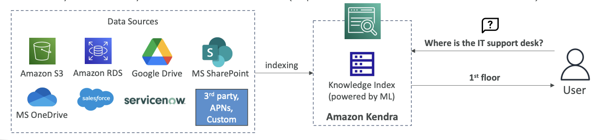

<h1>
  Amazon Kendra - Document Search Service
  
</h1>

Another machine learning service on AWS is called Amazon Kendra. This is a fully-managed document search service that is powered by machine learning and <u>allows you to extract answers from within a document</u>.

## **Supported Document Types**

Amazon Kendra can work with various document formats including:
- Text files
- PDF documents  
- HTML files
- PowerPoint presentations
- Microsoft Word documents
- FAQs
- And many other document types

(see the diagram below)

## **How Amazon Kendra Works**

You have a lot of data sources where these documents may be located. These documents are indexed by Amazon Kendra, which builds internally a knowledge index powered by machine learning.(see the diagram below)

## **End-User Benefits**

From an end-user perspective, Amazon Kendra provides **natural language search capabilities** just like you would use on Google.(see the diagram below)

**Example:**
- User asks: "Where is the IT support desk?"
- Kendra replies: "1st floor"

This works because Kendra knows from all the resources that it indexed that the IT support desk was on the 1st floor, which is quite awesome.

## **Additional Features**

### **Normal Search with Learning**
You can also perform normal searches, and Kendra will learn from user interaction and feedback to promote preferred search results. This is called **incremental learning**.

### **Fine-Tuning Search Results**
You can fine-tune the search results based on various factors such as:
- Importance of data
- Freshness of content
- Custom filters you define

## **Exam Tip**

From an exam perspective, whenever you see a document search service mentioned, think **Amazon Kendra**.

> # Amazon Kendra VS Amazon Q Business
> 
> ## **Core Purpose & User Experience**
> 
> **Amazon Kendra** is primarily a search service that uses semantic and contextual similarity to decide whether a text chunk or document is relevant to a retrieval query. Unlike traditional keyword-based search, Amazon Kendra uses semantic and contextual similarity—and ranking capabilities to return relevant documents or snippets.
> 
> **Amazon Q Business** is a generative AI–powered assistant that can answer questions, provide summaries, generate content, and securely complete tasks based on data and information in enterprise systems. It's designed as a conversational AI assistant that can have tailored conversations, solve problems, generate content, take actions, streamline tasks and more.
> 
> ## **Key Functional Differences**
> 
> ### **1. Response Style**
> - **Kendra**: Returns search results with relevant document snippets and links
> - **Amazon Q Business**: finds and synthesizes information from across your enterprise through a conversational experience and generates comprehensive, conversational responses
> 
> ### **2. Capabilities Beyond Search**
> - **Kendra**: Focused on intelligent search and document retrieval
> - **Amazon Q Business**: Users can take actions in third-party applications directly within Amazon Q Business and build lightweight AI apps to automate repetitive tasks. It can also perform tasks like summarization, Q&A, or data analysis on uploaded files
> 
> ### **3. Integration & Actions**
> - **Kendra**: Primarily a search backend service
> - **Amazon Q Business**: provides administrative controls and has a ready-to-use library of over 50 actions across popular business applications and platforms such as Jira, Salesforce, PagerDuty, and more
> 
> ## **How They Work Together**
> 
> Interestingly, Amazon Q Business can actually use Amazon Kendra as a retriever! If you're already an Amazon Kendra customer, you can connect your Amazon Kendra index with data sources attached to your Amazon Q Business application and use it as a retriever.
> 
> ## **When to Use Which?**
> 
> **Use Amazon Kendra when you need:**
> - Advanced enterprise search capabilities
> - Direct integration into existing applications via APIs
> - High-availability service suitable for production workloads with semantic search
> 
> **Use Amazon Q Business when you need:**
> - A conversational AI assistant for employees
> - Content generation and task automation
> - Integration with multiple business applications for taking actions
> - A complete workplace productivity solution
> 
> Think of it this way: Kendra is like having a super-smart search engine for your company data, while Amazon Q Business is like having an AI assistant that can search, understand, generate content, and take actions across your business systems.