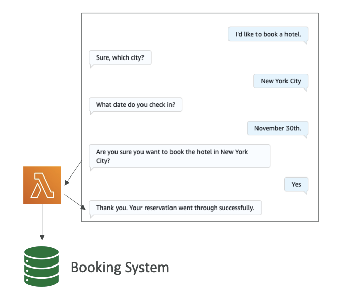

<h1>
  Amazon Lex
  
</h1>

Amazon Lex is a service that allows you to build chatbots quickly for your applications using either voice or text to interface with the chatbots. 

**For example**: You can create chatbots for various purposes, such as hotel bookings, ordering pizza, providing customer support, and many other use cases.

## **Key Features**

- **Conversational AI**: Amazon Lex builds conversational AI that supports <u>multiple languages</u>
- **AWS Integration**: Has deep integration with AWS Lambda, Amazon Connect, Comprehend, and Kendra
- **Intent Recognition**: The bot understands user intent and invokes the correct Lambda function behind the intent to fulfill it

## **How It Works**

The core concept is that the bot understands the user intent and then invokes the correct Lambda function behind the intent in order to fulfill the intent. Here's the process:

1. **Intent Recognition**: Amazon Lex recognizes what the user wants (for example, "book a hotel")
2. **Information Gathering**: If the Lambda function needs parameters, the bot asks for Slots
3. **Lambda Invocation**: When all required information is gathered, a Lambda function is invoked
4. **Action Execution**: The Lambda function performs the action (like making a booking in the booking system)
5. **Response**: Amazon Lex replies to the user with confirmation (e.g., "Thank you, your reservation went through successfully")

## **Slots System**

**Slots** are input parameters that the bot needs to collect from the user. For example, to book a hotel, you need:
- The city
- The check-in date
- Other relevant booking information

The bot is smart enough to automatically converse with the user and gather all the information it needs. Once it has all the required slots filled, it will invoke the Lambda function to perform the booking.

## **Benefits**

This approach allows <u>users to interact with your backend system</u> using only **text and voice**, which provides a very convenient and natural interface for users to access your services.

> Amazon Lex is a fully managed conversational AI service. You don't need to build NLP (Natural Language Processing) from scratch. It figures out what users want from their text/voice input. It connects conversational interfaces to your AWS backend services