# Amazon Lex - Hands On

This tutorial provides a hands-on look at Amazon Lex and how it works. We will walk through the process of creating a sample "BookTrip" bot using the traditional method. The goal is to understand the core configurations of a Lex bot, including intents, utterances, and slots, and to see how they come together to form a conversational flow.

### **Prerequisites**

- **Note:** To use the more advanced **Generative AI** bot creation method, you need to have Amazon Bedrock set up and configured to use a model like the Anthropic V2 model. For this tutorial, we will use the traditional method, which has no special prerequisites.

### **Creating a Bot with an Example**

We're going to use the traditional method and start with a pre-built example to explore the configuration.

1. **Choose a Creation Method**
   
   In the Amazon Lex console, when you create a bot, you have two methods: 
   
   - the traditional method or 
   
   - the generative AI method. 
   
   The **generative AI method** is *where you describe what you want the bot to do, and it is automatically generated.*
   
   The **traditional way** is *to create a blank bot, start with an example, or start with transcripts.* Honestly, they're **<u>pretty similar</u>**.
   
   - For this demonstration, select the **traditional method** and choose to `"Start with an example."`
   
   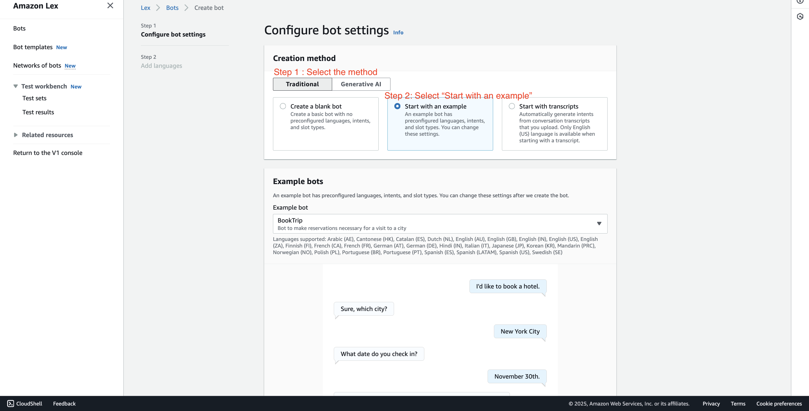

2. **Select the "BookTrip" Example**
   
   We can start with a "BookTrip" type of bot, which is going to allow us to book a hotel trip automatically. This is a sample conversation.
   
   - Select the **BookTrip** example from the list.
     
     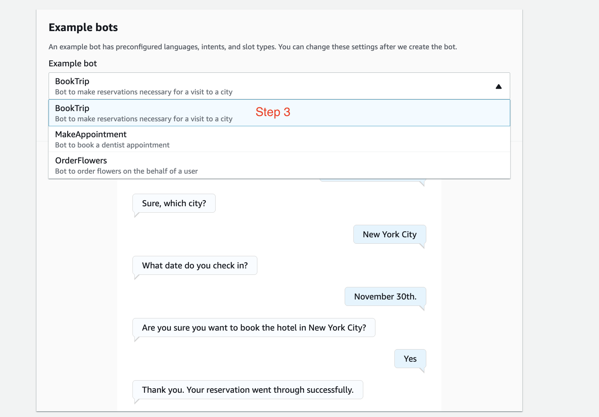

3. **Configure Bot Name and Permissions**
   
   - **Bot name:** Enter `DemoBookTrip`. We just want to see the configurations.
   
   - **Permissions:** We're going to **create a role with basic Amazon Lex permissions**. Select the option to create a new role.
   
   - **Children's Online Privacy Protection Act (COPPA):** When asked, "Is use of your bot subject to the Children's Act?", select **No**.
   
   - Click `"Next"`.
   
   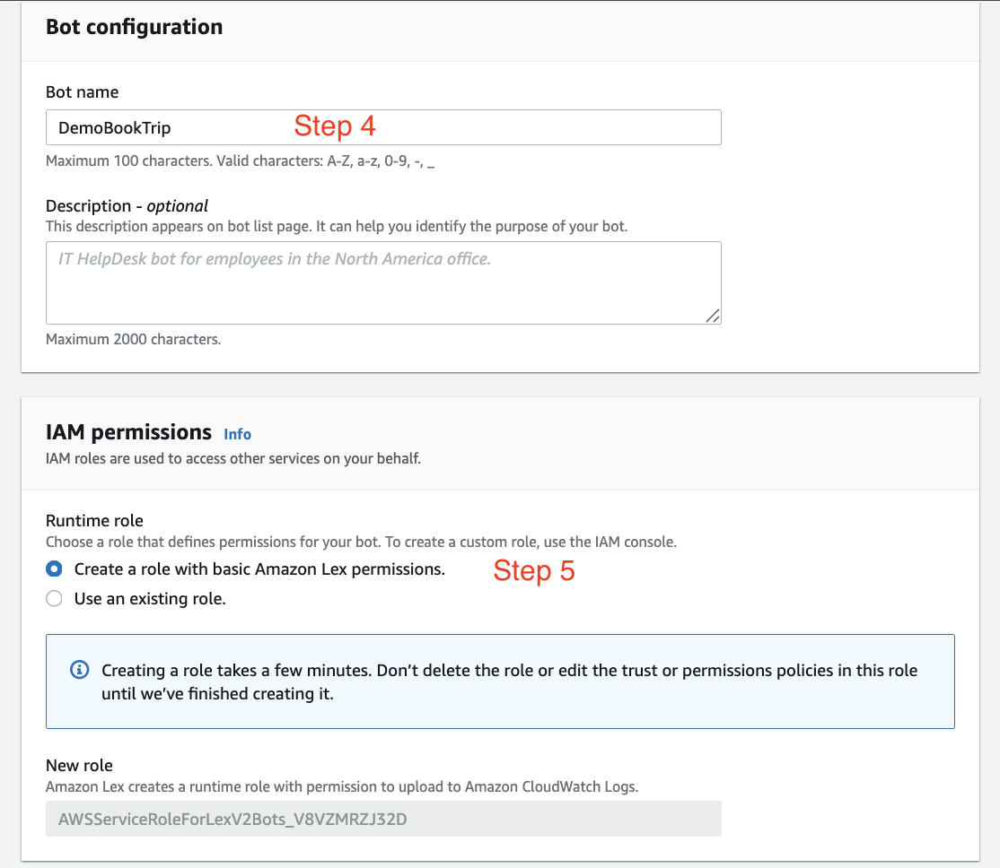
   
   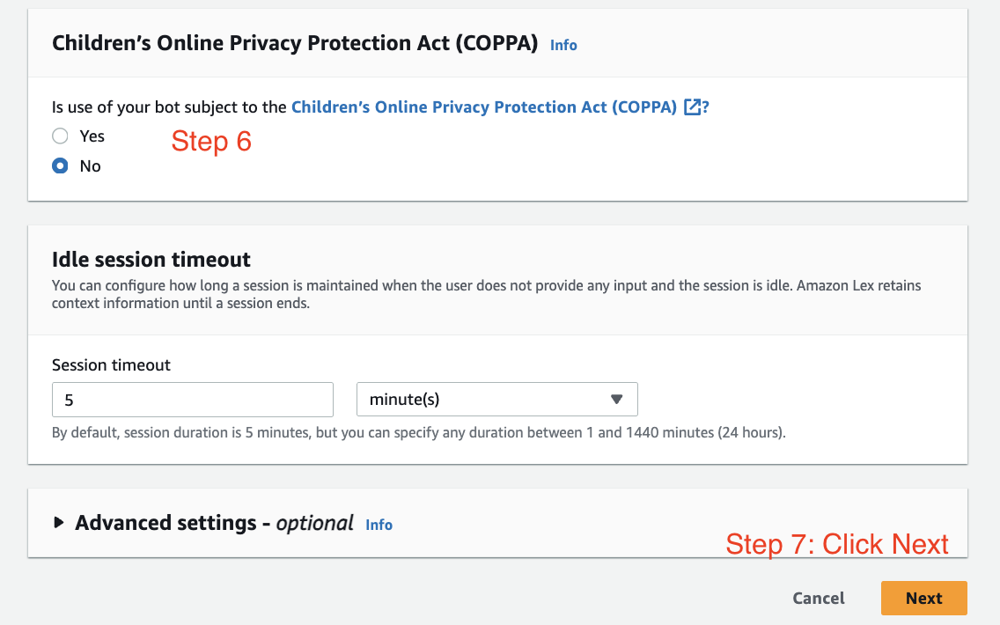

4. **Configure Language and Voice**
   
   Now, we're going to configure the bot and we need to add languages.
   
   - **Language:** We'll just have **English** right now.
   
   - **Voice:** For voice, we'll have **Danielle** talk to us.
   
   - Perfect, let's click on "Done".
   
   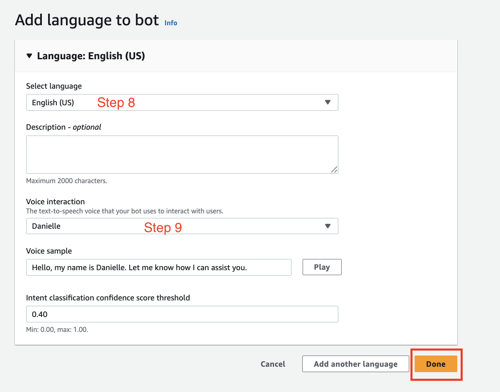

Your bot is now being configured.

### **Exploring the Amazon Lex Builder**

Here we are in the builder of Amazon Lex. Our bot has a lot of things you can see on the left-hand side. I'll try to keep it as easy as possible because we don't wanna go too deep.

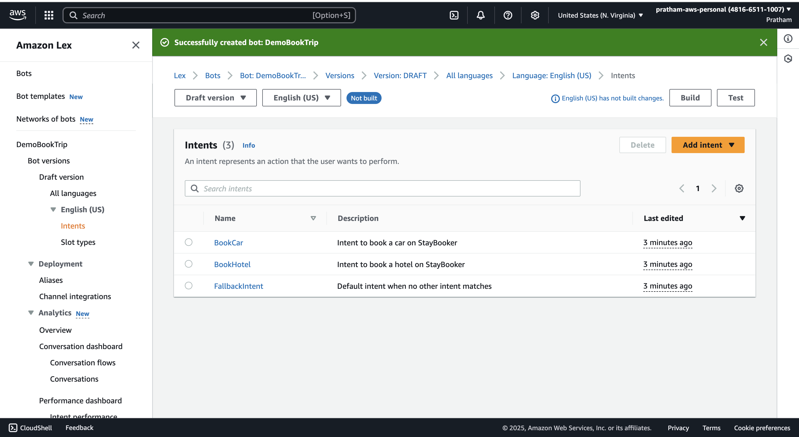

### **Understanding Intents**

We have what's called **three "intents."** The intent is what is the <u>**bot's intention**</u>; what can the user want to perform?

With this bot, we can do two things: **booking hotels** or **cars**.

- **BookHotel**: An intent for when the user wants to book a hotel.

- **BookCar**: An intent for when the user wants to book a car.

- **FallbackIntent**: If the user can't do any of these things, we'll have a default intent when no other intent matches, maybe to indicate to the user what the bot can and cannot do.

### **Deep Dive: The "BookHotel" Intent**

Let's click on **BookHotel** and have a look at the conversation flow. This is a simple conversation one can have with the bot.

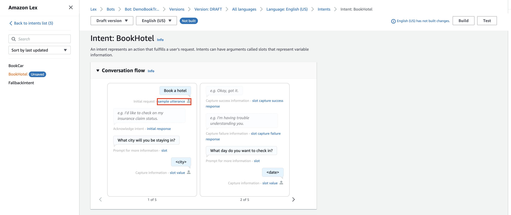

#### **Sample Utterances**

An **<u>"utterance"</u>** is a **way to say**, well, if we say "book a hotel," then most likely the bot is going to say that we want to book a hotel. So this is an utterance. We can add context and say, okay, what type of sample utterances could it be that will invoke this flow?

Examples include:

- "book a hotel" 

- "I want to make hotel reservations"

- "book {NumberOfNights} nights in {Location}"

You can see here the `{NumberOfNights}` and `{Location}` are **slots**; they're <u>parameters</u> for **our booking system**.

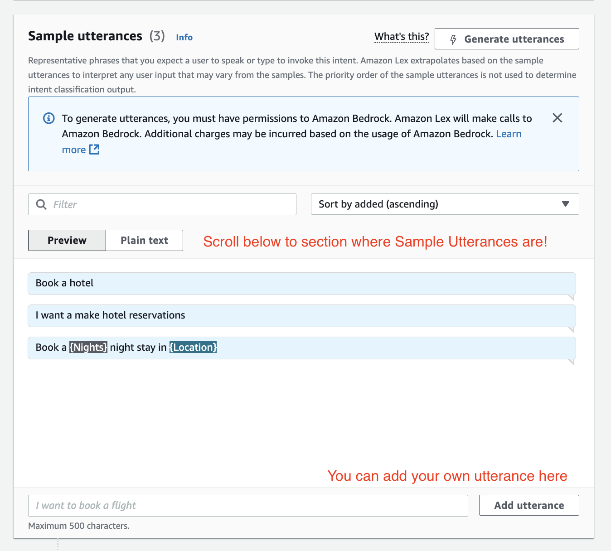

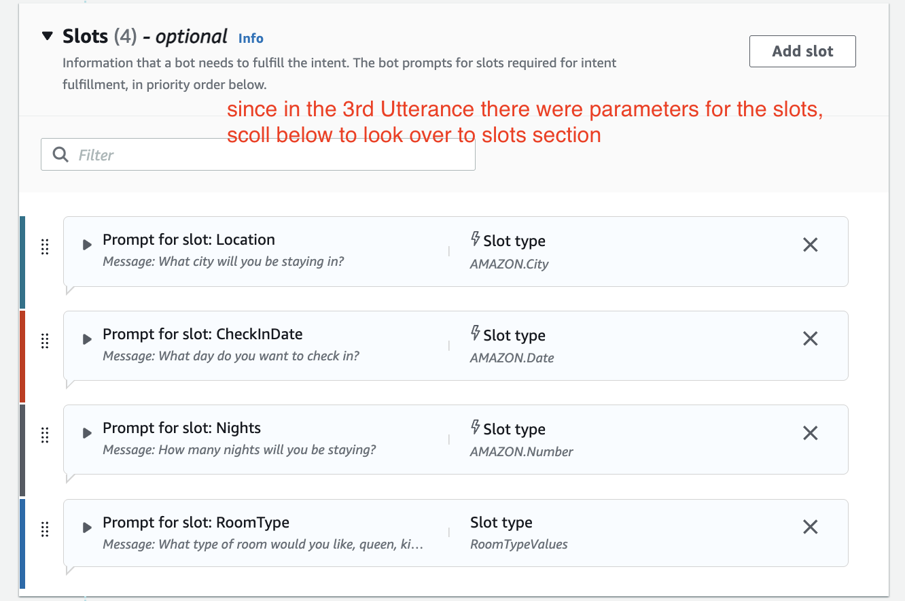

#### **Slots (The Bot's Questions)**

After an **utterance triggers** the intent, there is **acknowledgement**, and then we have **questions**. So we know we want to book a hotel, okay, but we need information. The **slots** right here, as you can see, we have four of them (see image above and compare it with the image where it talks about **conversation flow**). They're like the inputs so that the bot can actually book a hotel.

The bot will ask questions to get this information:

- *"What city will you be staying in?"* (To fill the `Location` slot)

- *"What day do you want to check in?"* (To fill the `CheckInDate` slot)

We can basically edit the bot to say, "Okay, I don't understand you," or, "Okay, I got you," and we can program how the bot reacts.

The four slots for this intent are:

1. **Location**

2. **CheckInDate**

3. **NumberOfNights**

4. **RoomType**

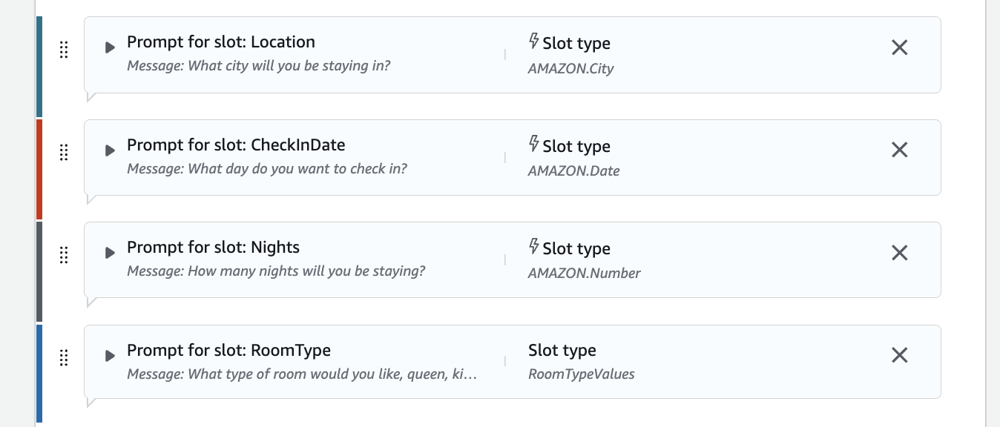

#### **Confirmation and Fulfillment**

When we're good and have all the slot information, we say, "Okay, we confirm the intent." And here we can fulfill it.

- **Fulfillment:** This section is not active because we don't have a Lambda function. But if we had a **Lambda function** to actually book this, then the bot would send all these slots—all these parameters—to the Lambda function. And then thanks to all these parameters, the Lambda function can then do a booking. So this is quite handy.

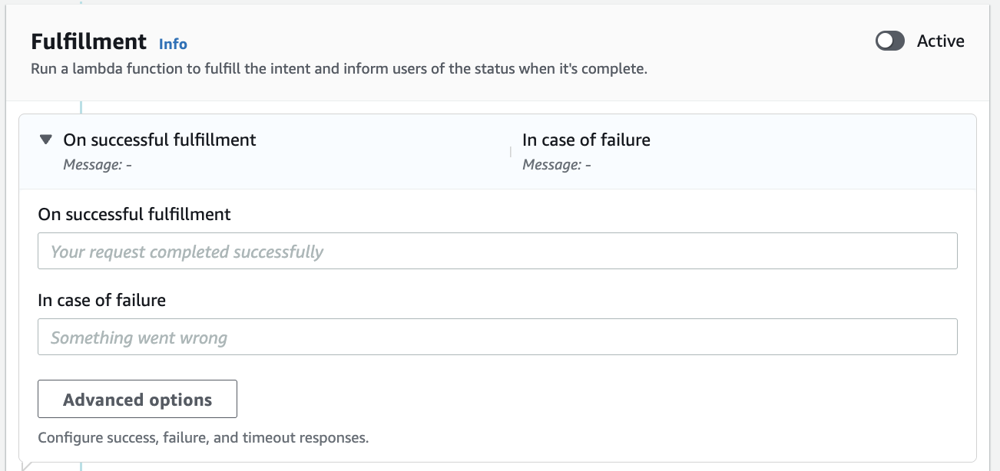

### **The Visual Builder**

You also have a visual builder, and it looks like this. 

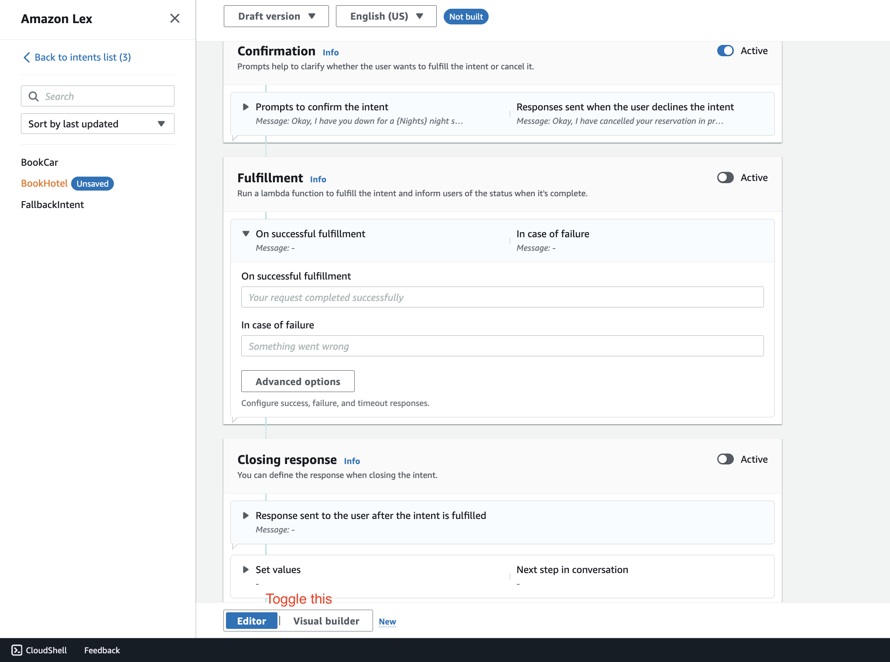

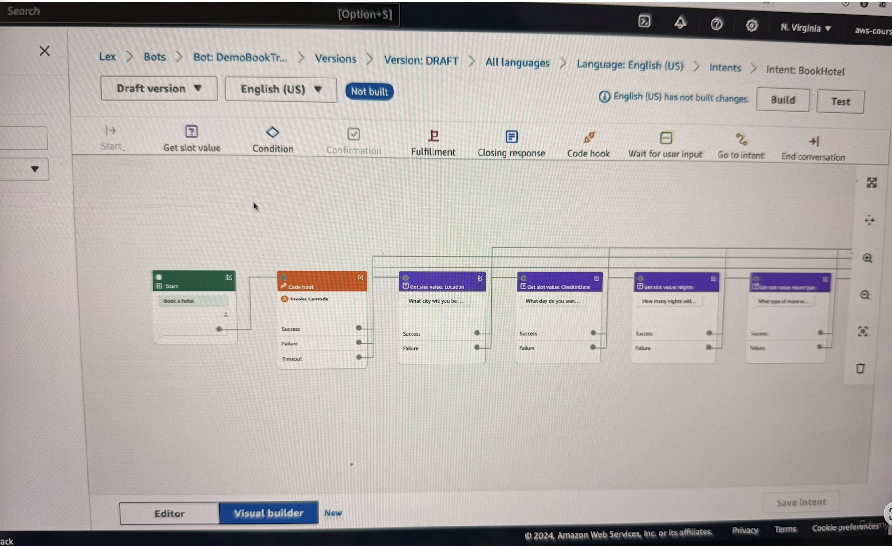

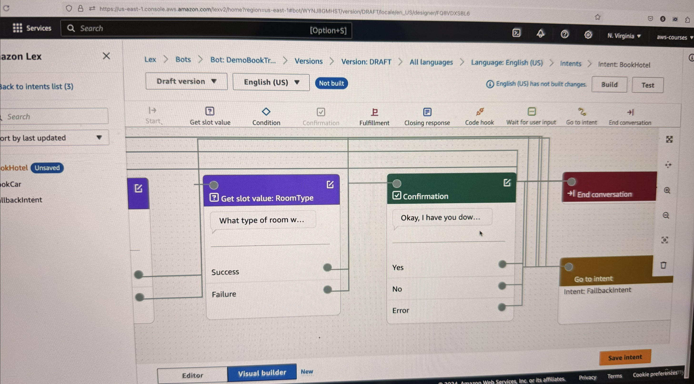

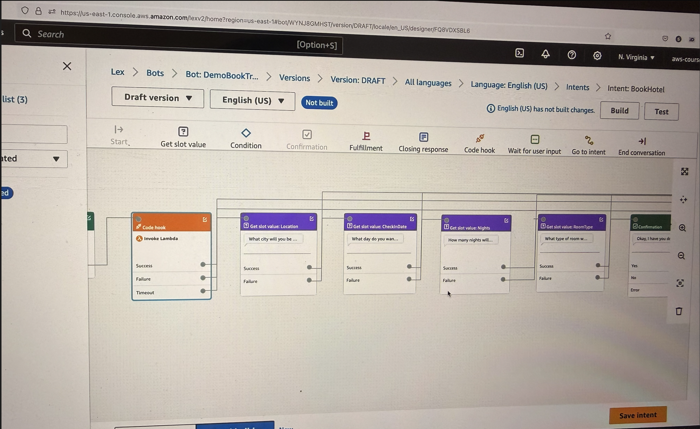

You can visually see the start and the end of your conversation, what gets invoked, what **Lambda function gets invoked**, and so on.

It shows:

- What is the **start**.

- Then the **code hook**.

- Then, it works to find the **slot values**, such as the `Location`, the `CheckInDate`, the `Nights`.

- And what happens on **success**, on **failure**, and so on.

- And finally, the **confirmation**.

This is another way of defining the same thing we had on the left-hand side, but this time more visually.

### **Key Learning Points**

As you can see, the builder is very powerful. You can have as many intents as you want, and then actions, and then utterances, and so on.

- **Key Takeaway:** From an exam perspective, Amazon Lex is going to be used to build chatbots and conversational AI, and to configure them all in a one-stop shop.
