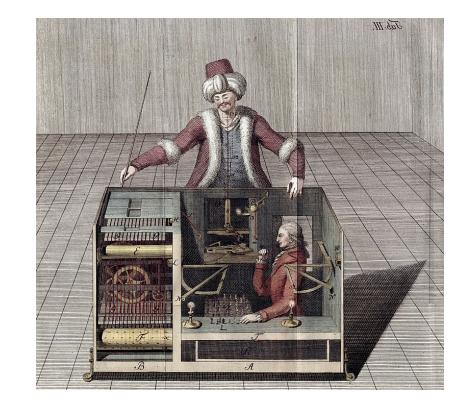
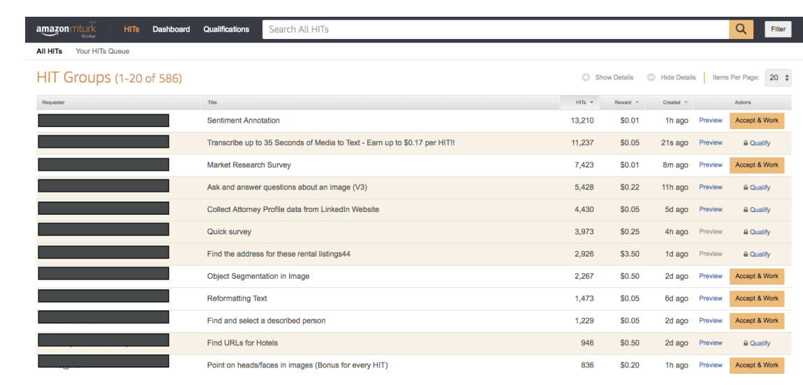

# Amazon Mechanical Turk

  

    <h2><strong>Historical Context</strong></h2>
    

     Now let's talk about Amazon Mechanical Turk. The service gets its name from the original Mechanical Turk from the 1770s, which was created by an inventor as what appeared to be a chess-playing robot. However, this was actually an illusion since there were no robots at that time. The "robot" was cleverly operated by someone hidden inside who was playing chess, and through some mapping mechanism, the robot would move. Thanks to this illusion, no one could see that there was an actual human operator inside.
    

  

  

## **What is Amazon Mechanical Turk?**

Amazon Mechanical Turk is a crowdsourcing marketplace designed to perform simple human tasks. The core idea is that you have access to a distributed virtual workforce. You give tasks to this workforce, and behind the scenes, humans are going to complete these tasks. These tasks can be very simple and very cheap to execute.

> **What "crowdsourcing marketplace" means:**
> 
> - **Crowdsourcing** = Instead of hiring one person or company to do a big job, you break it into small pieces and distribute those pieces to many different people (the "crowd")
> - **Marketplace** = Like eBay or Amazon, it's a platform where buyers (people who need work done) meet sellers (people willing to do work)

## **How It Works - Example**

Here's a practical example of how it works:

- Say you have a dataset of 10 million images that you want to label
- You create a task on Mechanical Turk for image labeling  
- Actual humans from all around the world will tag those images
- You can set a reward per image (for example, 10 cents per image)
- In this case, tagging all 10 million images would cost you $1 million
- The pricing is completely up to you to determine

The key advantage is that you have access to a very large workforce that is eager to work on these kinds of tasks.

## **Use Cases for Amazon Mechanical Turk**

The primary use cases include:

- **Image classification**
- **Data collection** 
- **Business processing**
- Any task that is simple and can easily be distributed to many people at once

## **AI Integration Benefits**

From an AI perspective, Amazon Mechanical Turk is valuable for several reasons:

- **Labeling images** for machine learning datasets
- **Reviewing recommendations** and outputs
- **Deep integration** with other Amazon AI services like Amazon A2I and SageMaker Ground Truth

## **Worker Experience**

Here is what it looks like when worker goes to Amazon Mechanical Turk:

When workers access Amazon Mechanical Turk, they see:

1. A variety of different jobs available to complete
2. The reward amount for each specific job (such as filling an Excel spreadsheet)
3. The ability to accept work and begin working on tasks immediately

The key to success is setting the right reward amount - if the job pays well enough and can be completed quickly, you will attract many people to work on your job very rapidly.

## **Summary**

Amazon Mechanical Turk is a service that allows you to access many humans at the same time to complete distributed work tasks efficiently and cost-effectively.