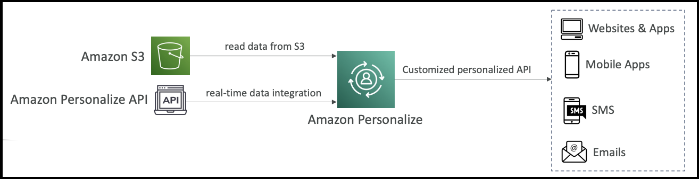

<h1>
  Amazon Personalize
  
</h1>

Amazon Personalize is a fully managed machine learning service that enables you to build applications with real-time personalized recommendations. This service uses the same technology that powers Amazon.com's recommendation engine, allowing you to provide personalized product recommendations, re-ranking, or customized direct marketing to your users.

## **How It Works**

When a user has bought a lot of gardening tools, for example, you can provide recommendations on the next tool to buy based on the personalization service. This mirrors how Amazon.com starts recommending products in the same category or completely different categories based on your search history, purchasing behavior, and user interests.

Amazon Personalize integrates with your existing infrastructure by:
- Reading input data from Amazon S3 (such as user interactions)
- Using the Amazon Personalize API for real-time data integration
- Exposing a customized personalized API for your websites, applications, and mobile apps
- Supporting SMS and email personalization

## **Key Benefits**

- Takes days, not months, to build recommendation models
- No need to build, train, and deploy ML solutions from scratch
- Fully bundled solution ready to use

## **Use Cases**

- Retail stores
- Media and entertainment
- Any application requiring personalized recommendations

**Exam tip:** Anytime you see a machine learning service for building recommendations and personalized recommendations, think Amazon Personalize.

## **Recipes in Amazon Personalize**

Recipes are <u>pre-implemented algorithms</u> in Personalize that are prepared for specific use cases. You still need to provide the **training configuration** on top of the recipe to match your specific use case.

### **Available Recipe Types:**

1. **USER_PERSONALIZATION recipes**
   - User-Personalization-v2: **Recommends items** for users

2. **Ranking recipes**
   - Personalized-Ranking-v2: **Ranks items** for a user

3. **Trending/Popular items**
   - Trending-Now: **Recommends trending** items
   - Popularity-Count: **Recommends popular** items

4. **RELATED_ITEMS recipes**
   - Recommends similar items

5. **Next best action**
   - Recommends the next best action for users

6. **User segmentation**
   - Item-Affinity: Extracts user segments

## **Important Note**

All these recipes focus on recommending something for your users based on user preferences - that's why the service is called "Personalize." Remember that recipes in Amazon Personalize are specifically for recommendations, not for forecasting or any other machine learning tasks - just personalized recommendations.