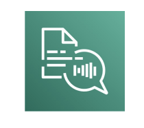
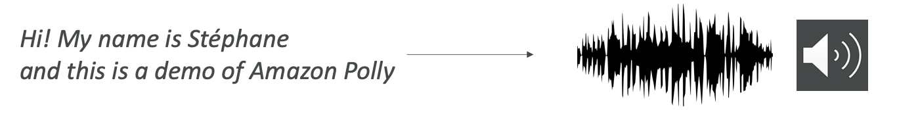
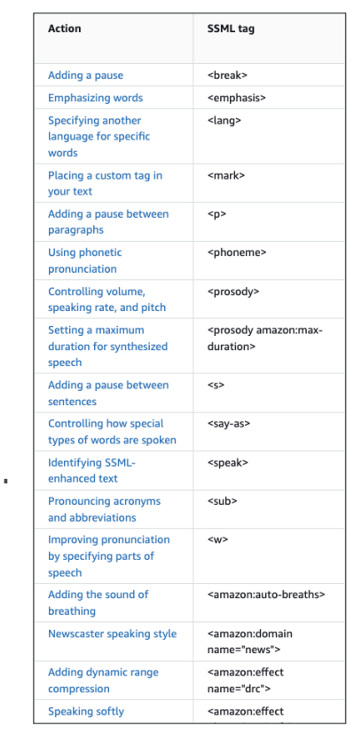

<h1>
  Amazon Polly
  
</h1>

- Amazon Polly is the <u>opposite</u> of **Amazon Transcribe**. 
- Definition:
  - This service allows you to <u>turn text into lifelike speech using deep learning</u> and enables you to create applications that will talk. 
- For example, if you write "Hi, my name is Stephane, and this is a demo of Amazon Polly," then the speech is going to be generated for you by Amazon Polly.

## **Advanced Features**

Polly has several advanced features that may appear in the exam:

### **Lexicons**
- you Define how to read certain pieces of text
- Example: you may Write "AWS" but want Polly to pronounce "Amazon Web Services"
- Example: you may Write "W3C" but want Polly to say "World Wide Web Consortium"

  

    <h3><strong>SSML (Speech Synthesis Markup Language)</strong></h3>
    <ul>
      <li>Markups that indicate how your text should be pronounced</li>
      <li>Example: "Hello" + break + "how are you?" will say "Hello," then have a long break, then "how are you?"</li>
      <li>It won't say "Hello, break, how are you?" – it understands the markup</li>
      <li>Capabilities include:
        <ul>
          <li>Whispering</li>
          <li>Pronunciation control</li>
          <li>Abbreviation handling</li>
          <li>Word emphasis</li>
        </ul>
      </li>
    </ul>
  

  

### **Voice Engines**
Multiple voice engines available, from most historical to newest:

1. **Neural**
2. **Standard** 
3. **Long-form**
4. **Generative**

The newest engines have very good human-like voices.

### **Speech Marks**
- Provides information about where audio elements occur
- Shows where a word or sentence starts or ends in the audio
- Polly gives you both the audio and the speech marks
- Very helpful for:
  - Lip-syncing
  - Highlighting words as they are spoken