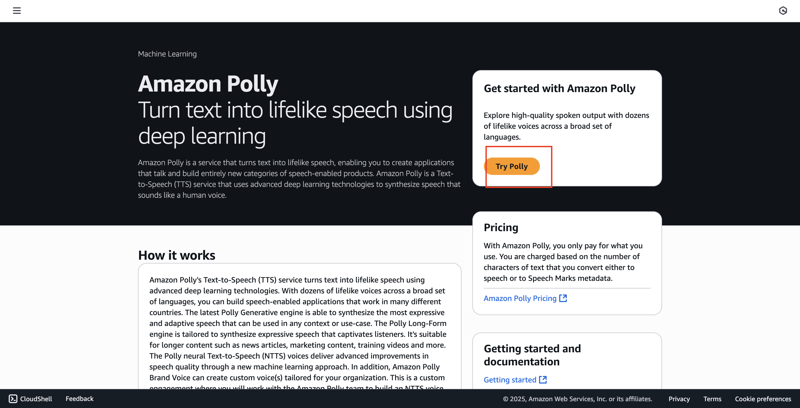
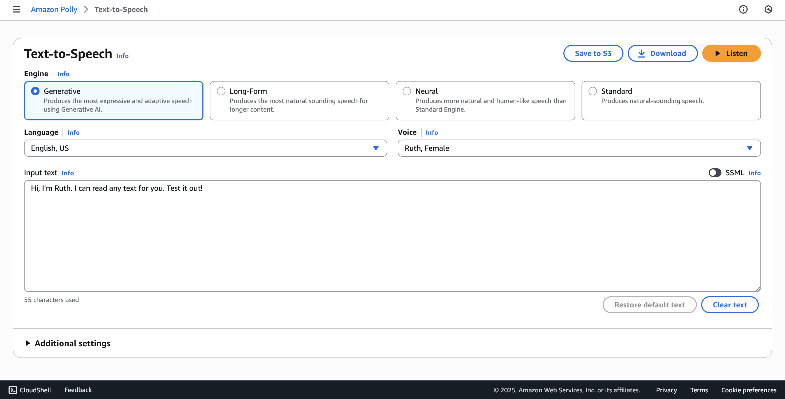
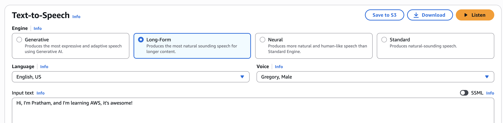
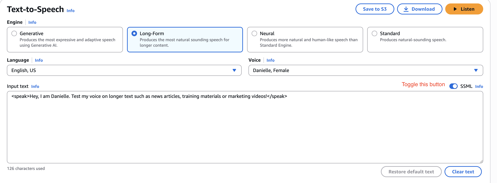
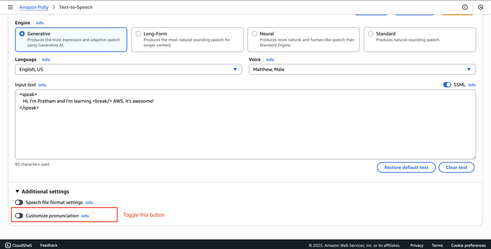
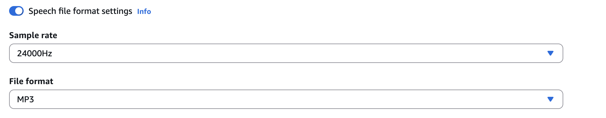

# Amazon Polly - Hands On

In this hands-on lab, we will explore the Amazon Polly service. We will start by navigating to the console and trying its <u>text-to-speech capabilities</u>. You will learn about

1.  the different speech engines available, 

2. how to customize the text and voice, and 

3. finally, how to use Speech Synthesis Markup Language (SSML) to add custom pauses and control the speech output.

**Prerequisites**

- There are no prerequisites mentioned in the lecture. You should be able to follow along directly in the AWS Management Console.

### **Getting Started with Amazon Polly**

This section covers the initial exploration of the Polly console and its main features.

1. First, navigate to the Amazon Polly service in the AWS console. Once there, click on "try Polly" to access the text-to-speech interface.
   
   

2. Teaching Explanation: Understanding Polly's Engines
   
   Before generating speech, it's important to understand the available engines. You can choose the one that best fits your needs.
   
   
   
   - **Generative:** Produces the <u>**most expressive and adaptive speech using generative AI**</u>.
   
   - **Long form:** Optimized for **longer content.**
   
   - **Neural:** More **<u>human-like and natural-sounding</u>** than the standard engine.
   
   - **Standard:** The original text-to-speech engine.

### **Performing a Basic Text-to-Speech Test**

Now, let's test the core functionality with both default and custom text.

1. In the text box, you will see some default example text: `Hi, I'm Ruth. I can read any text for you`. Test it out! The default voice is "Ruth."

2. Click the "Listen" button to hear the output.
   
   - **Key Takeaway:** As you can hear, the audio sounds pretty good and natural, even with the default settings.

3. Now, let's try something else. Replace the default text with the following sentence: `Hi, I'm Pratham, and I'm learning AWS, it's awesome!`

4. Change the engine to `"long form"` and select a male voice, such as `"Gregory."`
   
   

5. Click `"Listen" `again to hear the new output.
   
   - **Key Takeaway:** You can see that this works really well for custom text and different voice configurations.

### **Using SSML to Control Speech Output**

Next, let's use the **Speech Synthesis Markup Language (SSML)** to add more control over how the text is spoken. We will add a pause in the middle of our sentence.

1. Select the "SSML" tab above the text input box.
   
   

2. Paste the custom text into the SSML input box. To create a pause, we will add a `<break>` tag. The goal is to make a little pause after the word "learning."
   
   - **Note:** If you simply add the `<break>` tag, it won't work correctly. SSML requires the entire text to be enclosed within `<speak>` tags at the beginning and end. The break tag should also be self-closing (`<break/>`).

3. Modify the text to include the required SSML tags. Your final text should look like this:
   
   ```html
   <speak>
      Hi, I'm Pratham and I'm learning <break/> AWS, it's awesome!
   </speak>
   ```

4. With the corrected SSML, click "Listen."
   
   - **Key Learning:** You can now hear that there was a pause between "teaching" and "AWS." This demonstrates how you can use markup to provide specific instructions to the Polly service for more natural and controlled speech.

### **Additional Settings and Customization**

Finally, it's worth noting that there are more ways to fine-tune the speech output.

1. Look at the "Additional settings" section.
   
   

2. Teaching Explanation: Customization Options
   
   This section allows you to further customize the output. For example:
   
   - **Customize pronunciation:** If you wanted your name to be pronounced correctly, you could probably use this feature.
     
     
   
   - **Output format:** You can choose different output formats for your generated speech file.
     
     

**Conclusion**

Amazon Polly is a pretty natural and easy-to-use service for generating text-to-speech audio. You can experiment with different engines, voices, and SSML tags to get the exact output you need.
