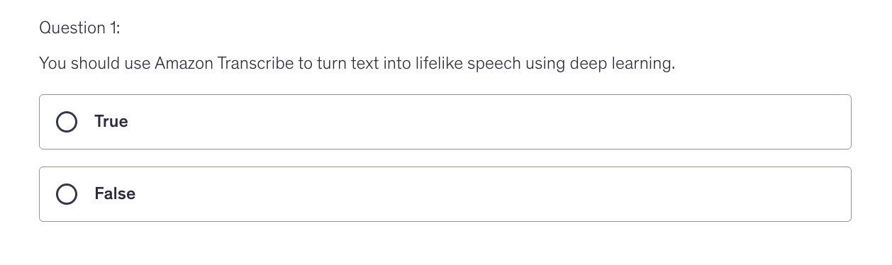
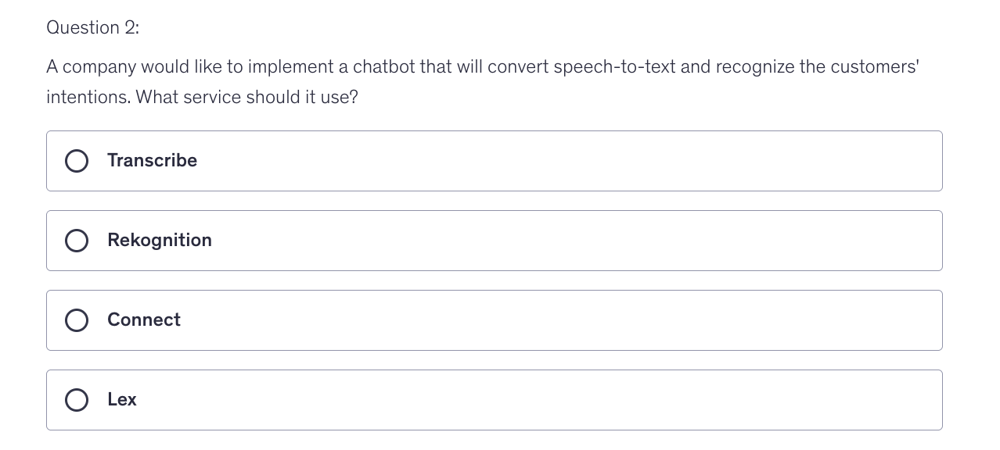
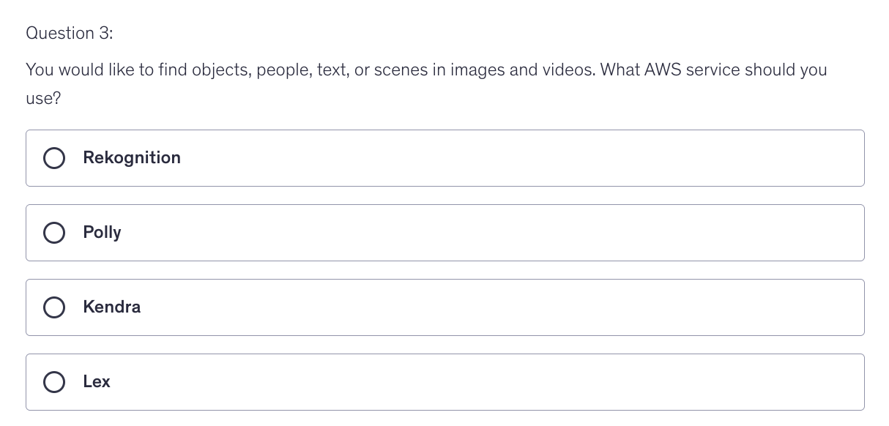
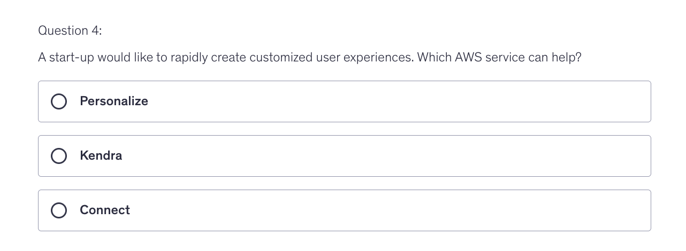
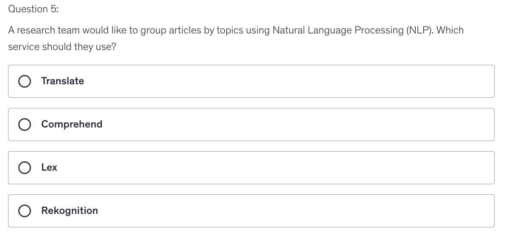
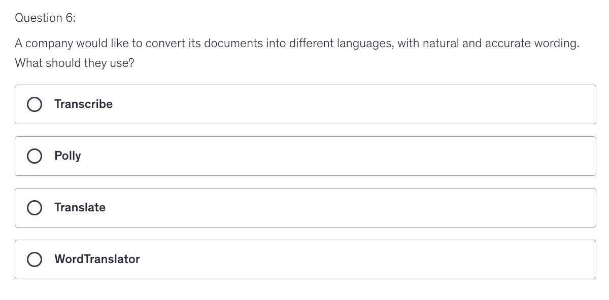
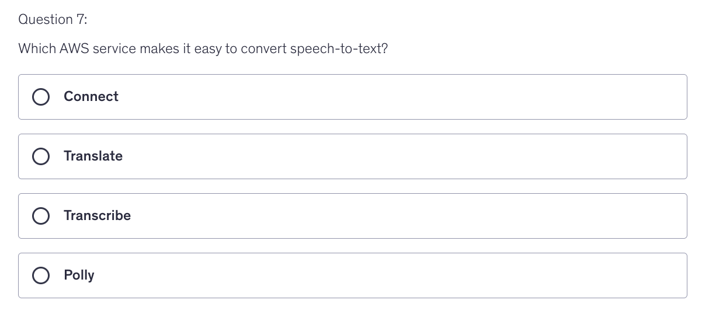
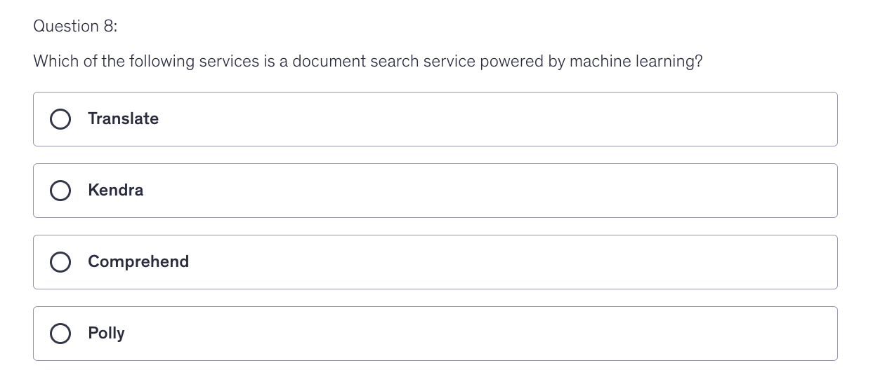
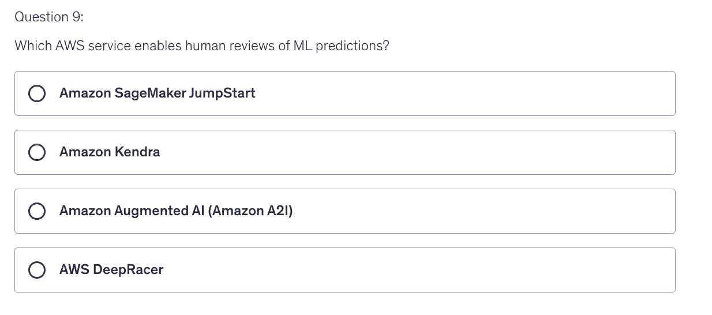

    
Answer

    False. Because it is used to convert Speech into Text

    
Answer

    4th Option : Lex

    
Answer

    1st Option : Rekognition

    
Answer

    1st Option : Personalize

    
Answer

    2nd Option : Comprehend

    
Answer

    3rd Option : Translate

    
Answer

    3rd Option : Transcribe

    
Answer

    2nd Option : Kendra

    
Answer

    3rd Option : Augmented AI

