# Amazon Rekognition - Hands On

This guide will walk through the various image analysis capabilities of Amazon Rekognition. We will explore several features, from <u>object and label detection</u> to <u>facial analysis</u> and <u>text extraction</u>, demonstrating <u>how the service analyzes images</u> and provides detailed results. We will also touch on how you can <u>customize the model to recognize objects and labels</u> specific to your own business needs.

### **1. Label Detection**

The first capability we will look at is **label detection**, which allows us to perform <u>object detection within an image.</u>

When we provide a picture, the service can detect multiple objects. 

For example,

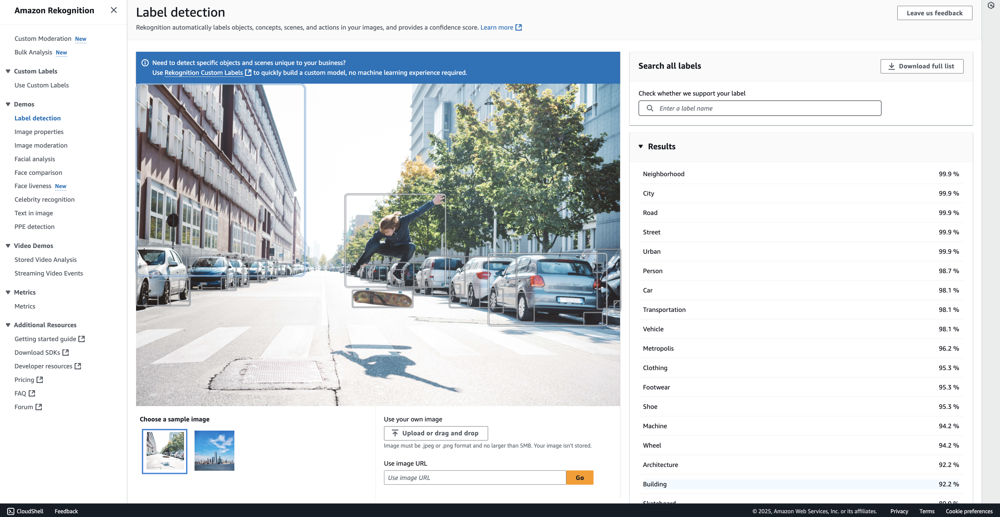

 in one sample image, Rekognition identifies a 

- `"building," `

- a `"person,"` 

- a `"skateboard,"` and 

- `"cars." `

It can even detect details within those objects, such as identifying the `"wheels"` on the cars. All of these detected items are listed in the results.

On top of the direct object detection, the service provides results with extra contextual information, such as (See on the right hand side of the image above) 

- "road," 

- "street," and 

- "transportation." 

To the right of each label, you will see a **confidence score**, which indicates *how certain the model is about its detection*. This is a very handy feature.

You can try this with other sample images as well. For instance, with another image, you can see that it detects a "tower."

> **Note: Custom Labels**
> 
> You can also create **custom labels** if you want to recognize specific objects unique to your own dataset.

### **2. Image Properties**

Next, we have image properties. This feature is ***used to find technical information about an image***. For a given image, we can get details on:

- The **dominant colors**

- The **image quality**

- **Foreground properties**

- **Background properties**

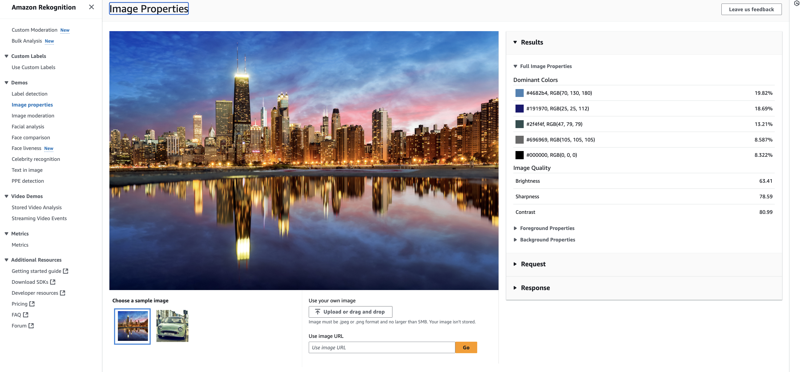

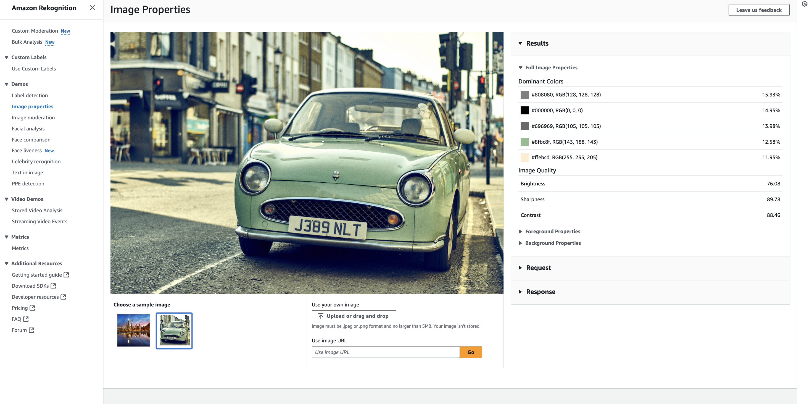

### **3. Image Moderation**

For image moderation, we can check whether certain images should be authorized or not. 

- Based on the moderation labels it detects, **an image could be blurred,** if the image not as per age content,etc... The sample images used here are fine, so no moderation labels are detected.
  
  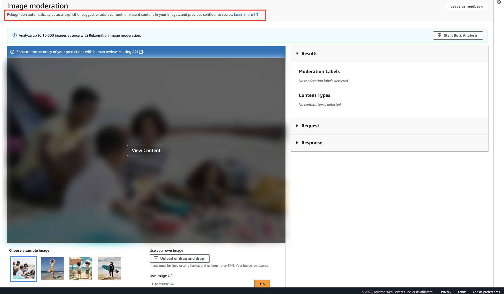
  
  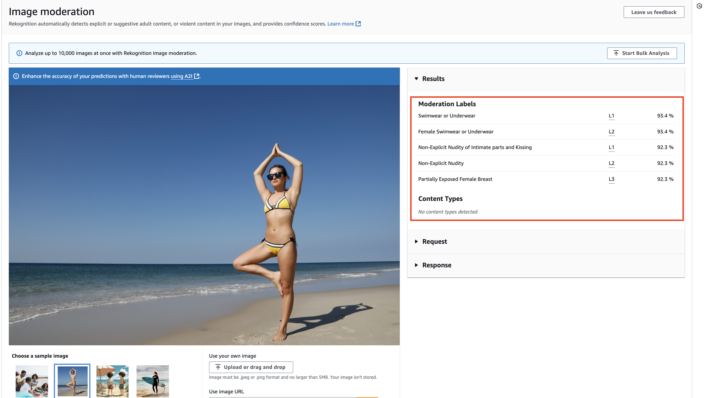

### **4. Facial Analysis**

With facial analysis, we can examine facial attributes in an image.

When an image is provided, the service detects that it `"looks like a face"` and provides attributes such as:

- Appears to be `"female"`

- An estimated `"age range"`

- Smiling attributes (e.g., `"appears to be happy"`)

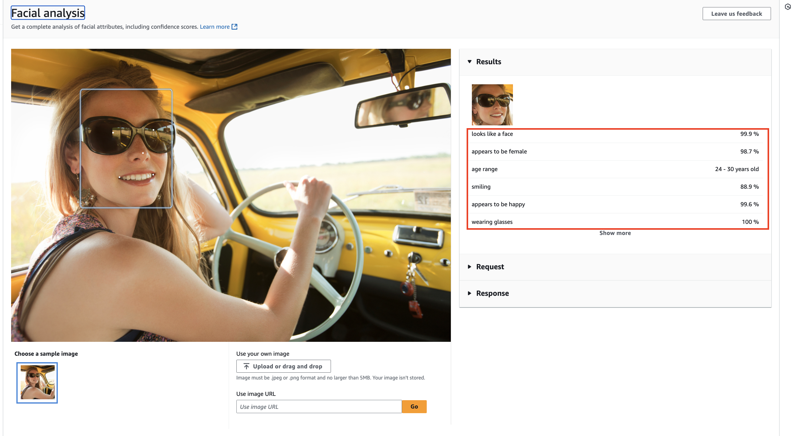

### **5. Facial Comparison**

This feature allows us to see if two faces in different images are very similar. In one example, two photos of the same person are compared and found to be very similar. However, if you compare a photo of Jeff Bezos with a photo of a different person, the results will show they are not similar.

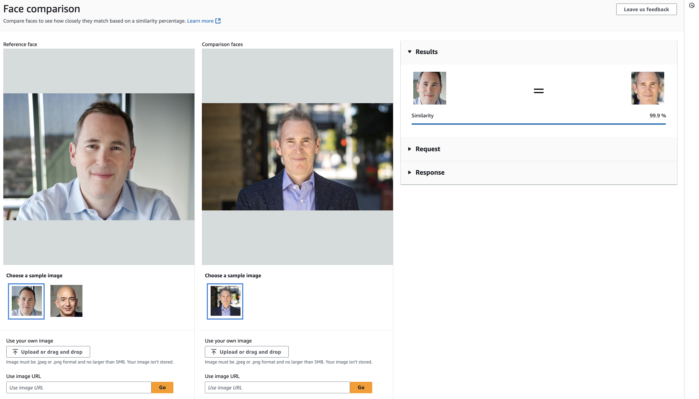

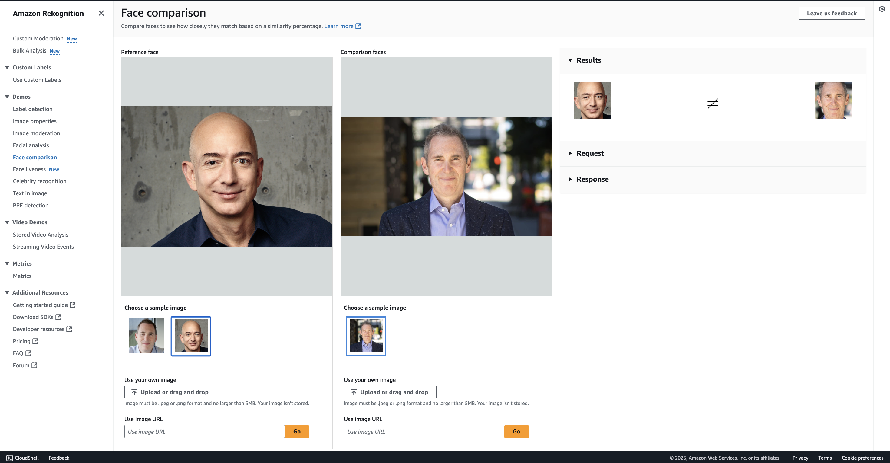

### **6. Face Liveness**

This feature is designed for use with your camera to determine if a face is live and not a spoof.

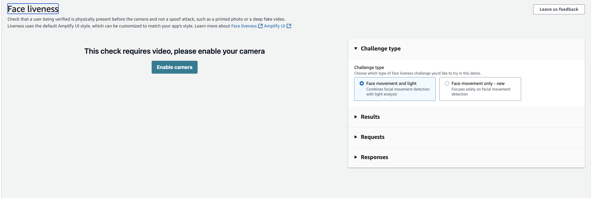

### **7. Celebrity Recognition**

Here, the service can identify well-known individuals in images. For example, it correctly recognizes "Jeff Bezos" and "Andy Jassy" in their respective photos.

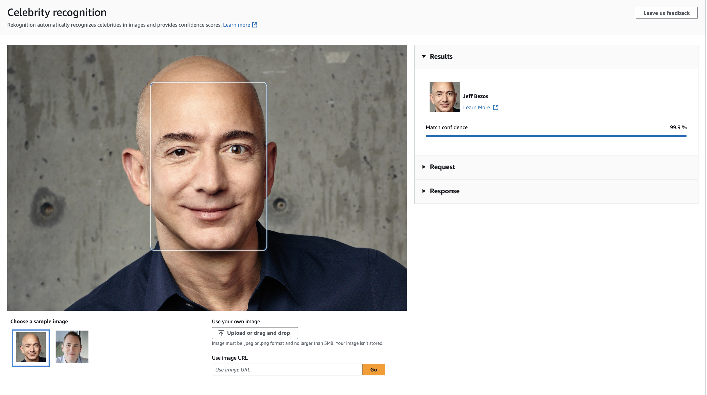

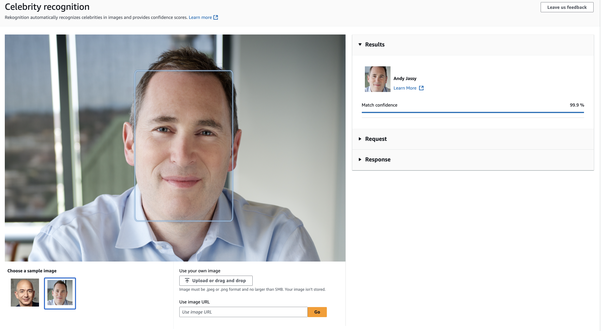

### **8. Text in Image**

This feature is used to recognize and extract text from images, which is helpful for capturing information. It has a use case **similar to Amazon Textract**, but it is a different methodology. For example, it can successfully read and extract the phrase, "It's Monday but keep smiling." from an image. Super good.

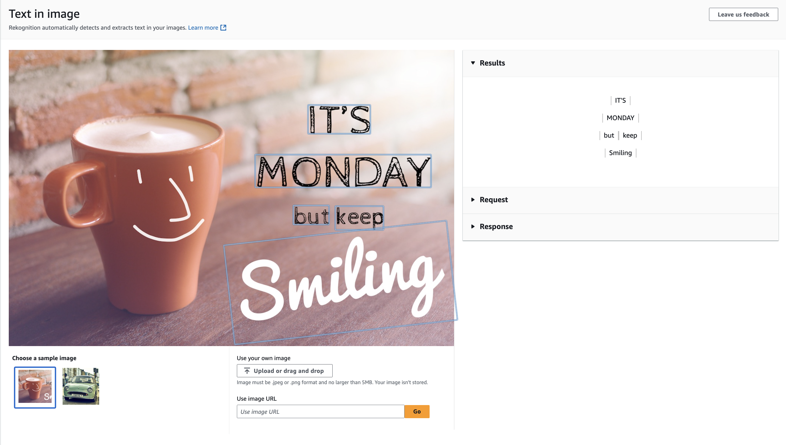

### **9. Personal Protective Equipment (PPE) Detection**

Finally, this is a very specific use case designed to see if 

- "face covers," 

- "head covers," and 

- "hand covers" are appearing in images.

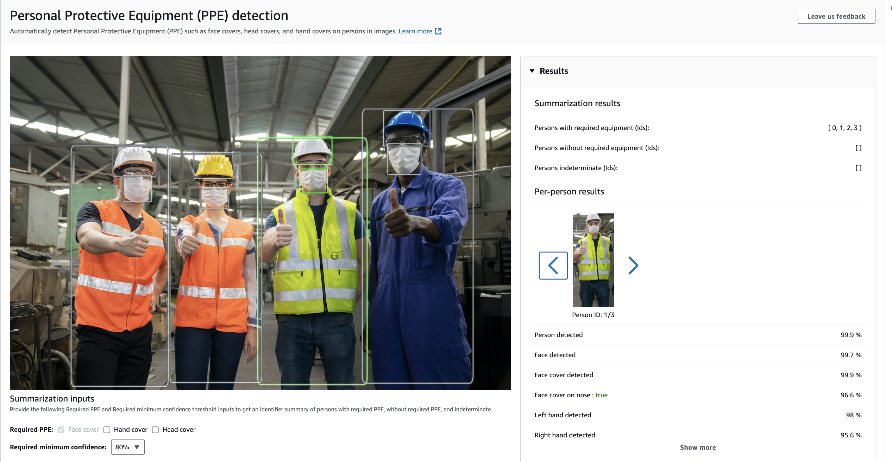

### **Key Takeaways & Customization**

Remember that Amazon Rekognition is centered around the analysis of images and has several powerful, built-in capabilities.

You can also extend its functionality to fit your specific business needs:

- **Custom Moderation:** You can build your own custom moderation detection if you need to identify specific use cases relevant to your business.

- **Custom Labels:** You can also create your own custom labels if you want to extend the labels to things that are more relevant to your business.

To do this, you can train the Rekognition model simply by adding your own sample datasets.
