# Amazon Textract

This guide provides a detailed walkthrough of the Amazon Textract service demo available in the AWS Management Console. We will use the provided sample documents to explore how Textract can analyze a complex scanned image of a paystub. 

The goal is to understand its capabilities for extracting not just raw text, but also document structure like **forms, tables, and layouts**, and even **how to ask questions about the document's content** using <u>natural language queries</u>.

### **Getting Started with the Amazon Textract Demo**

This procedure will guide you to the Textract service page and into the interactive demo environment.

1. From the main AWS Management Console, navigate to the top search bar.
   
   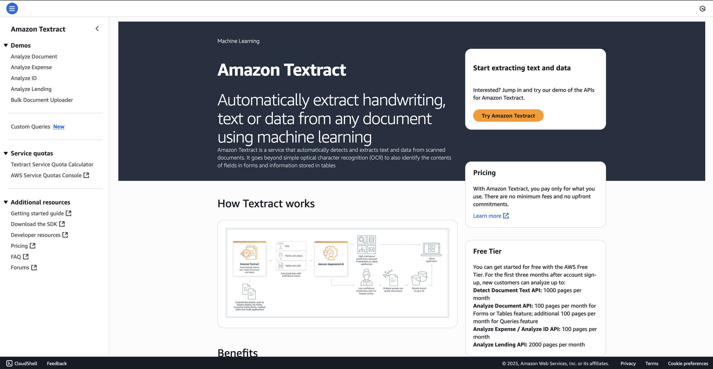

2. In the search bar, enter "Textract" to find the service.

3. From the Textract service page, locate and click the button to "Try Amazon Textract". This will launch the demo interface.

### **Analyzing a Sample Document**

Once in the demo environment, you will see a few sample analysis types on the left-hand side. 

In this service, you can analyze 

1. a document, 

2. an expense, 

3. an ID, and 

4. lending documents. 

You also have the option to **upload your own documents** if you want to.

For this walkthrough, we will focus on the default `"Analyze Document"` demo which uses a paystub as its sample.

> Important thing to note that, the sample document is a **scanned document**, it is not a pdf which has **actual text in it**. It is an **image with the paycheck**.

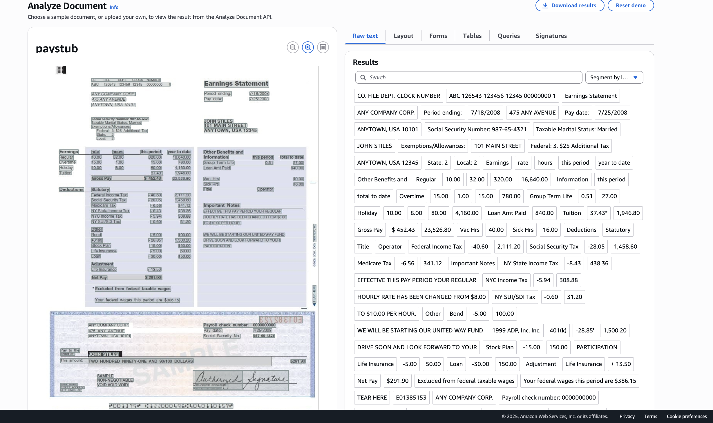

### **Exploring Textract's Analysis Capabilities**

Now we will go through the different types of data that Textract extracts from the sample paystub image.

#### **1. Raw Text Extraction**

The most basic function is extracting all the text it can find on the page. On LHS, you can see the **raw text extraction**

- Explanation: In this, Amazon Textract is able to extract all the raw text from the file. All the text visible in the document image has been successfully extracted. You can click on the "Raw Text" tab to have a look at the data itself.
  
  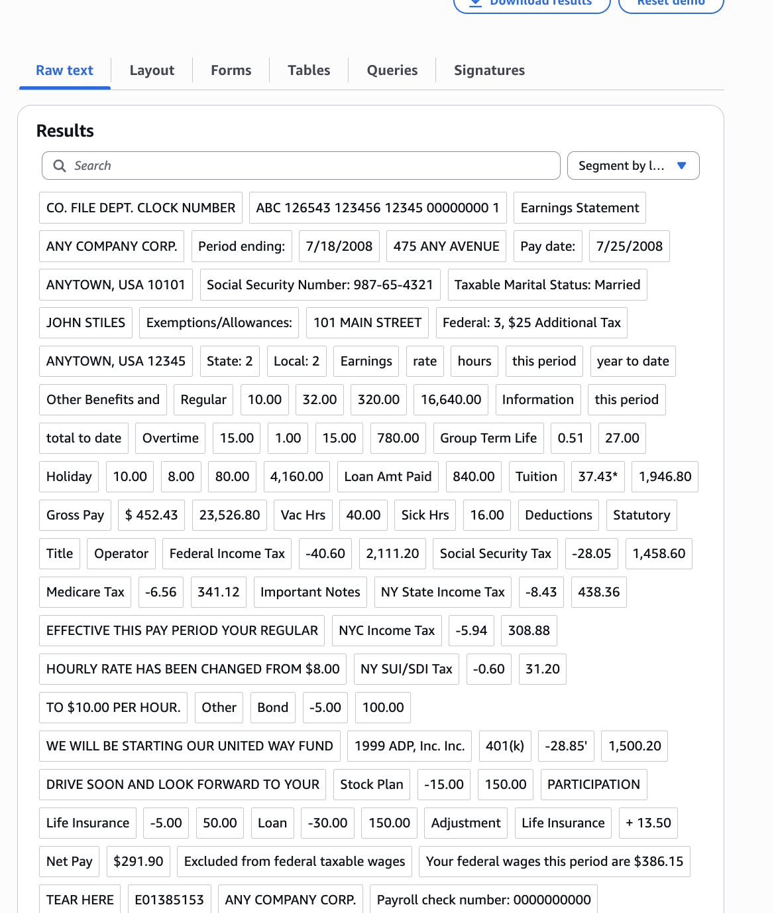

#### **2. Layout Detection**

Textract can do more than just read text; it understands the document's structure.

- **Explanation:**  Amazon Textract is able to also understand the layout of your page.(see image below)

- **Example (Title):** It correctly identifies what is a title. In the demo, it recognizes `"Earning Statements"` as a section header.

- **Example (Table)**: It can also identify tables within the document. 
  
  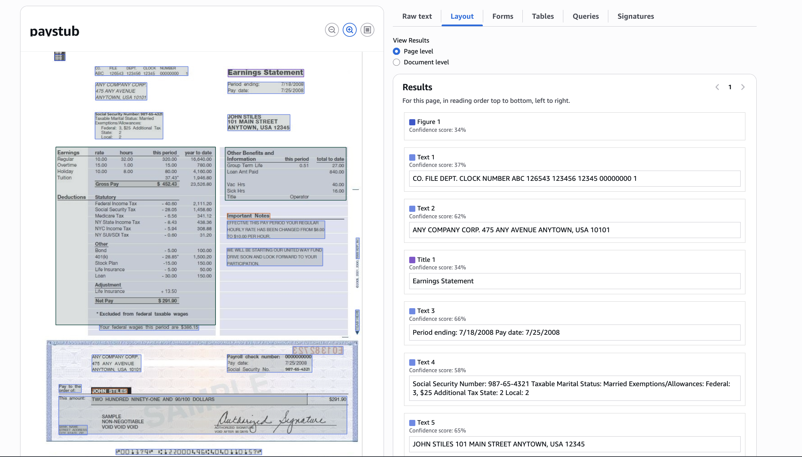

#### **3. Form Data Extraction (Key-Value Pairs)**

This feature demonstrates Textract's ability to understand form fields and their corresponding values.

- **Explanation:** When you look at the "Forms" tab, you can see what is a field and what is the value associated with it.

- **In the example:**
  
  1. If we look here, `'period ending'` right here in the statement. Let me just zoom in so you can see
     
     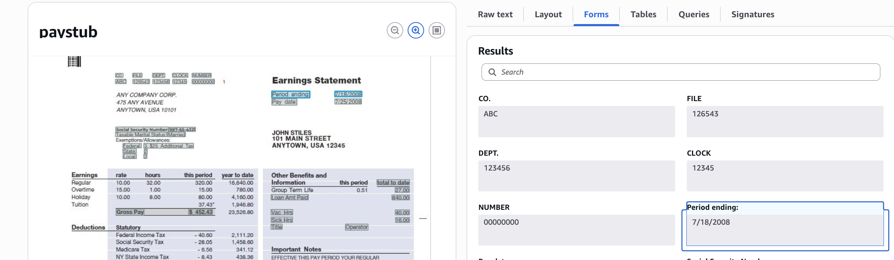
  
  2. `period ending` has the value `7/18/2008`. And this is exactly detected here. So it's a bunch of **key-value pairs** that have been extracted from the form.
  
  3. Other examples mentioned include the `pay date`, `social security number`, and the `gross pay` with its value.
     
     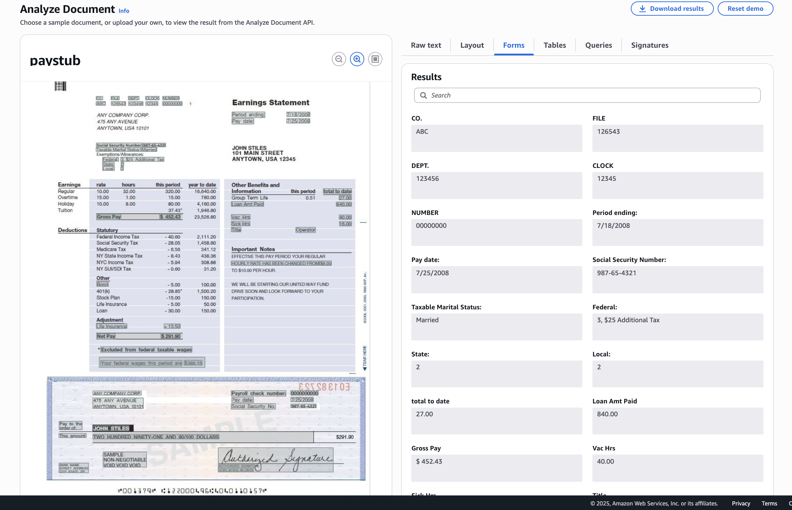

#### **4. Table Extraction**

Textract can intelligently extract data from tables, preserving the row and column structure.

- **Example 1 (Earnings Table):**
  
  1. Let's look at the first table. We have `earnings`, `rate`, `hours`, `period` and `year-to-date`, and we have all the lines of this table as well that have been detected, so it's extremely powerful.
     
     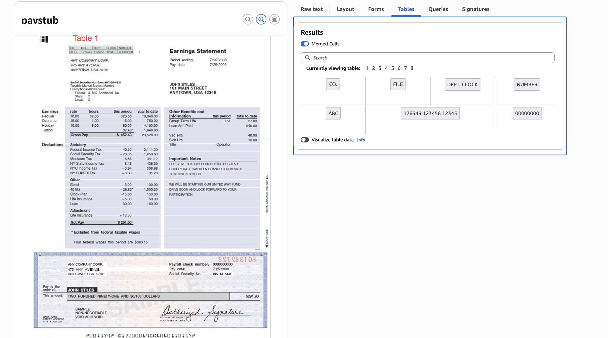
     
     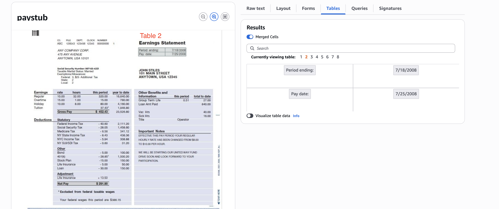
     
     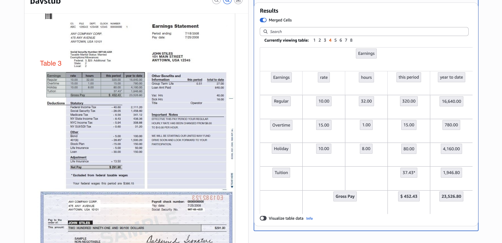

- **Example 2 (Deductions Table):**
  
  1. You can also view the deductions table. "Again, we have an idea of all the different line items within this table. So this is extremely, extremely helpful."
     
     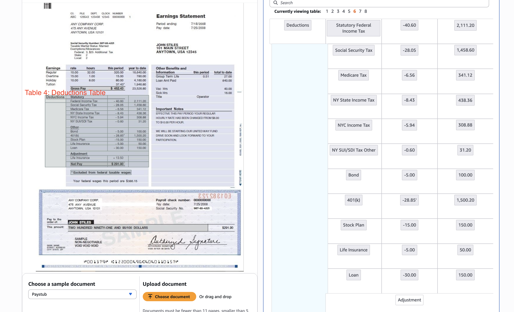

#### **5. Querying the Document**

This final feature shows how you can use natural language to ask specific questions about the document's content.

- **Explanation:** The demo includes a pre-filled query as an example: `"What is the year to date gross pay?"`, which correctly returns the value from the document.

- **Custom Query Walkthrough:** The instructor demonstrates how to run your own query.
  
  1. Enter a new question into the query input box. The instructor uses the example, "What is the regular hourly rates?"
  
  2. Click "Submit the query".
  
  3. Amazon Textract processes the question and finds the answer in the document. The result is "10", which corresponds to the value on the paystub.
     
     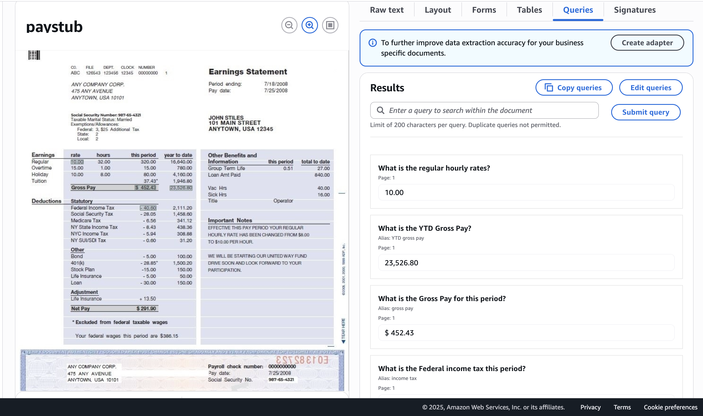

### **Brief Overview of Other Demos**

It is encouraged that you should explore the other demos on your own to see the full range of Textract's capabilities.

- **Expense Analysis:** This demo showcases a feature where Textract can analyze receipts to identify the vendor and each line item, including what was purchased and its price.
  
  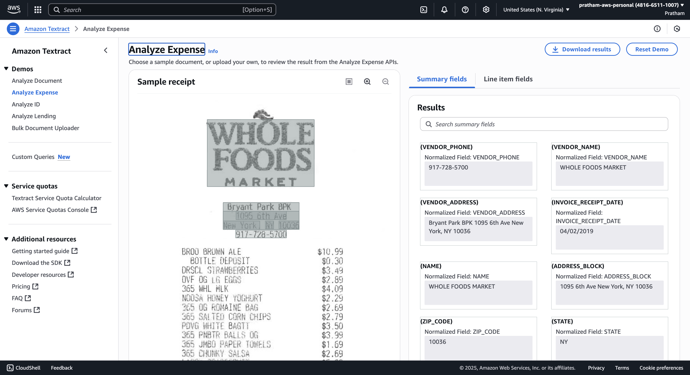

- **ID Analysis:** This demonstrates how Textract can extract standardized fields from identification documents, such as a driver's license. It can pull out the first name, last name, city, address, document number, and more.
  
  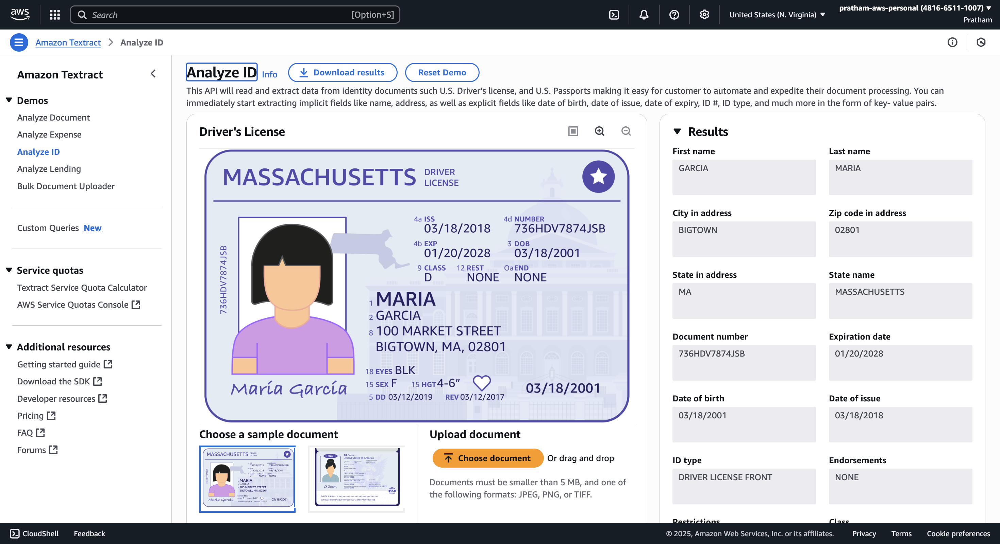

### **Conclusion and Key Takeaway**

Amazon Textract is a very powerful service that is important to be aware of, as it may **<u>come up in the exam</u>**. 

It goes far <u>beyond simple optical character recognition (OCR)</u> by intelligently understanding the structure, layout, and context of the information within a document.

